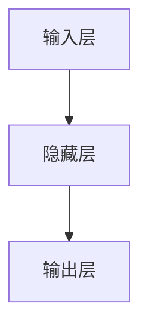
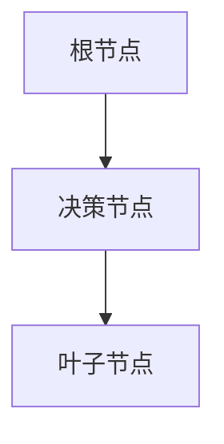
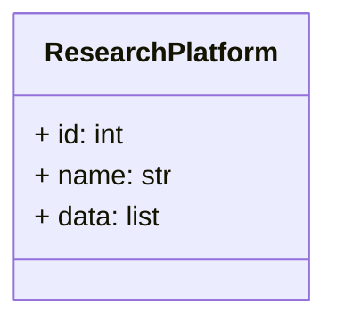

                 


```markdown
# 企业估值中的AI驱动的自动化学术研究平台评估

> 关键词：企业估值，AI驱动，学术研究平台，自动化评估，机器学习

> 摘要：本文系统地探讨了AI驱动的自动化学术研究平台在企业估值中的应用，从背景分析、核心概念、算法原理、系统架构到项目实战，全面解析了如何利用AI技术提升企业估值的效率和准确性。通过详细的技术分析和实例演示，本文为读者提供了从理论到实践的完整指南。

---

## 第1章 背景介绍

### 1.1 问题背景

#### 1.1.1 企业估值的传统方法与局限性
企业估值是企业在市场中的价值评估，传统方法包括DCF模型、市盈率法等。然而，这些方法依赖于人工分析，耗时且容易受到主观因素影响，且难以处理海量数据。

#### 1.1.2 学术研究平台的重要性
学术研究平台是企业估值的重要数据来源，包含论文、专利、技术报告等。这些数据反映了企业的技术实力和创新能力，是估值的关键依据。

#### 1.1.3 AI驱动的必要性
AI技术可以自动分析海量数据，提取关键特征，构建预测模型，显著提升评估效率和准确性。

### 1.2 问题描述

#### 1.2.1 企业估值的核心要素
企业估值涉及财务数据、市场表现、技术创新等多个维度。

#### 1.2.2 学术研究平台评估的关键指标
包括平台的活跃度、用户数量、内容丰富度等。

#### 1.2.3 AI的应用场景
AI可以用于数据清洗、特征提取、模型训练等关键步骤。

### 1.3 问题解决

#### 1.3.1 AI驱动的方法
通过机器学习模型自动评估学术研究平台的价值。

#### 1.3.2 自动化的优势
节省时间、提高准确性和可扩展性。

### 1.4 边界与外延

#### 1.4.1 企业估值的边界条件
数据质量和模型假设对结果的影响。

#### 1.4.2 平台评估的范围
仅关注学术相关数据，不涉及其他因素。

#### 1.4.3 AI的适用场景
适用于数据量大、特征复杂的情况。

---

## 第2章 核心概念与联系

### 2.1 学术研究平台的定义与属性

#### 2.1.1 定义
学术研究平台是提供学术资源和工具的在线平台。

#### 2.1.2 属性对比
| 属性 | 数据驱动 | 规则驱动 |
|------|----------|----------|
| 特征 | 基于数据 | 基于规则 |
| 优势 | 高准确性 | 易解释性 |
| 用途 | 复杂场景 | 简单场景 |

#### 2.1.3 ER图
```mermaid
er
    actor: 用户
    actor --> ResearchPlatform: 使用
    ResearchPlatform --> Data: 数据源
    ResearchPlatform --> Algorithm: 算法模块
    ResearchPlatform --> Result: 评估结果
```

### 2.2 AI驱动的核心原理

#### 2.2.1 数据驱动与模型驱动
数据驱动依赖海量数据，模型驱动依赖专家经验。

#### 2.2.2 数据与模型的结合
AI通过数据训练模型，模型输出评估结果。

---

## 第3章 算法原理讲解

### 3.1 机器学习与深度学习模型

#### 3.1.1 神经网络


#### 3.1.2 决策树


### 3.2 数学模型

#### 3.2.1 线性回归
$$ y = \beta_0 + \beta_1x + \epsilon $$

#### 3.2.2 随机森林
$$ y = \sum_{i=1}^{n} \text{Tree}_i(x) $$

### 3.3 代码实现

#### 3.3.1 数据预处理
```python
import pandas as pd
data = pd.read_csv('data.csv')
```

#### 3.3.2 模型训练
```python
from sklearn.ensemble import RandomForestRegressor
model = RandomForestRegressor()
model.fit(X_train, y_train)
```

---

## 第4章 数学模型

### 4.1 线性回归
$$ y = \beta_0 + \beta_1x + \epsilon $$

### 4.2 随机森林
$$ y = \sum_{i=1}^{n} \text{Tree}_i(x) $$

---

## 第5章 系统分析与架构设计

### 5.1 系统功能设计

#### 5.1.1 领域模型


### 5.2 系统架构设计

#### 5.2.1 系统架构


---

## 第6章 项目实战

### 6.1 环境安装
```bash
pip install scikit-learn
```

### 6.2 核心实现

#### 6.2.1 代码示例
```python
import numpy as np
from sklearn.model_selection import train_test_split
from sklearn.metrics import mean_squared_error

def evaluate_model(model, X, y):
    X_train, X_test, y_train, y_test = train_test_split(X, y, test_size=0.2)
    model.fit(X_train, y_train)
    y_pred = model.predict(X_test)
    mse = mean_squared_error(y_test, y_pred)
    return mse
```

---

## 第7章 小结

### 7.1 总结
AI驱动的学术研究平台评估显著提升了企业估值的效率和准确性。

### 7.2 注意事项
确保数据质量，选择合适模型。

### 7.3 拓展阅读
推荐学习深度学习和强化学习技术。

---

作者：AI天才研究院 & 禅与计算机程序设计艺术
```

