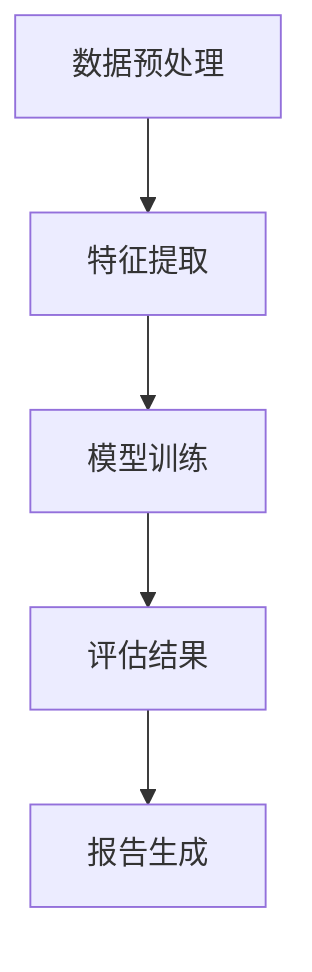
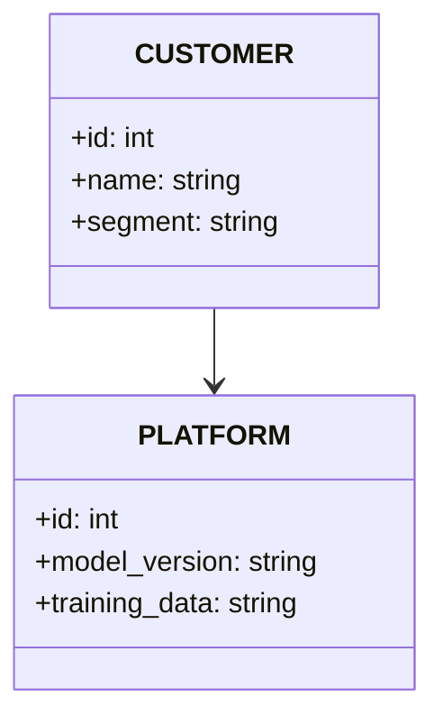
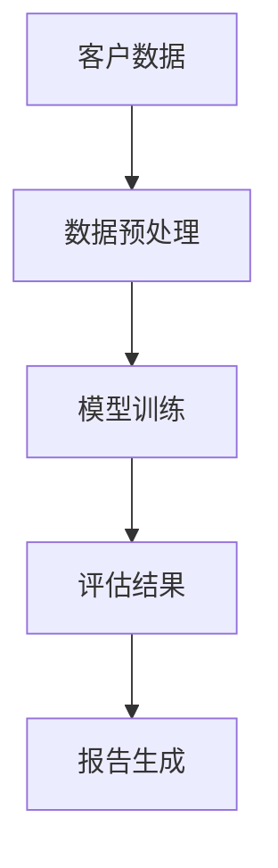
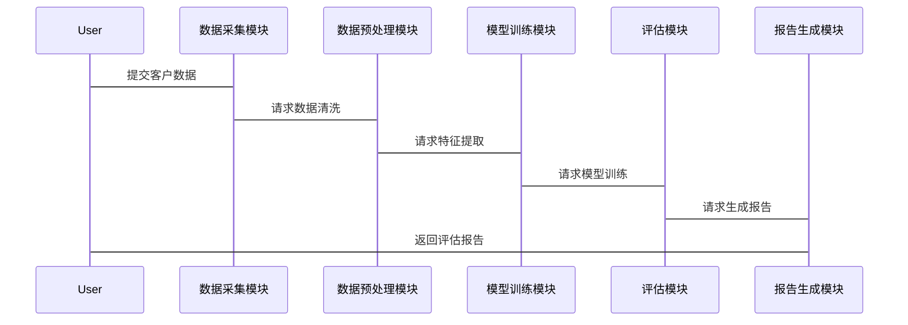

                 


# 《企业估值中的AI驱动的自动化客户洞察平台评估》

---

## 关键词：  
企业估值, AI驱动, 客户洞察平台, 自动化评估, 数据分析, 人工智能算法, 技术架构

---

## 摘要：  
随着企业估值的重要性日益增加，传统的客户洞察方法逐渐暴露出效率低、精度不足的问题。基于AI驱动的自动化客户洞察平台能够通过大数据分析和机器学习算法，帮助企业更准确、快速地评估客户价值和市场潜力，从而提升企业估值的准确性。本文从背景介绍、核心概念、算法原理、系统架构、项目实战到最佳实践，全面解析AI驱动的客户洞察平台在企业估值中的应用，为企业提供一种高效、智能的客户洞察解决方案。

---

# 第1章: 企业估值与AI驱动的客户洞察平台背景

## 1.1 问题背景与描述  
### 1.1.1 传统企业估值方法的局限性  
传统的企业估值方法依赖于财务数据和人工分析，存在以下问题：  
1. 数据采集效率低，难以覆盖海量客户。  
2. 分析结果主观性强，缺乏量化依据。  
3. 无法实时更新，难以应对快速变化的市场。  

### 1.1.2 客户洞察在企业估值中的重要性  
客户洞察是企业估值的核心之一，其作用包括：  
1. 揭示客户行为和偏好，优化市场策略。  
2. 提供数据支持，增强估值的准确性。  
3. 通过客户分层，识别高价值客户，提升估值效率。  

### 1.1.3 AI驱动的自动化客户洞察平台的提出  
AI驱动的自动化客户洞察平台通过整合大数据和机器学习技术，实现客户数据的自动采集、分析和评估，解决传统方法的痛点。  

## 1.2 问题解决与边界  
### 1.2.1 通过AI自动化客户洞察解决企业估值问题  
AI驱动的客户洞察平台能够：  
1. 快速处理海量客户数据，提高估值效率。  
2. 利用机器学习算法，提供精准的客户画像和市场洞察。  
3. 实现实时数据更新，适应市场变化。  

### 1.2.2 客户洞察平台的边界与外延  
客户洞察平台的边界包括：  
1. 数据来源：客户行为数据、市场数据、财务数据等。  
2. 服务对象：企业、投资机构、咨询公司等。  
3. 功能范围：数据采集、分析、评估、报告生成。  

### 1.2.3 核心概念与关键要素分析  
客户洞察平台的核心要素包括：  
1. 数据采集模块：负责收集客户相关信息。  
2. 数据分析模块：利用AI算法对数据进行处理和建模。  
3. 评估模块：生成客户价值评估报告。  
4. 反馈模块：根据评估结果优化数据采集和分析流程。  

## 1.3 核心概念对比与ER图  
### 1.3.1 核心概念对比分析表  
| 比较维度 | 传统客户洞察 | AI驱动客户洞察 |  
|----------|---------------|-----------------|  
| 数据来源 | 有限的结构化数据 | 海量多维数据 |  
| 分析效率 | 低效人工分析 | 高效自动化分析 |  
| 精度 | 主观性高 | 客观性高 |  
| 更新频率 | 低频 | 实时更新 |  

### 1.3.2 ER实体关系图  
```mermaid
erDiagram
    customer[CUSTOMER] {
        +id: int
        +name: string
        +segment: string
    }
    insight PLATFORM {
        +id: int
        +model_version: string
        +training_data: string
    }
    relationship "uses" {
        CUSTOMER --> PLATFORM
    }
```

---

# 第2章: AI驱动的客户洞察平台核心原理

## 2.1 AI驱动的自动化客户洞察原理  
### 2.1.1 数据采集与处理流程  
1. 数据采集：从CRM、社交媒体等多渠道获取客户数据。  
2. 数据清洗：去除冗余和噪声数据。  
3. 数据特征提取：提取关键特征，如客户行为、购买记录等。  

### 2.1.2 模型训练与特征工程  
1. 数据预处理：标准化、归一化等。  
2. 特征选择：利用特征重要性分析选择关键特征。  
3. 模型训练：使用机器学习算法（如随机森林、神经网络）训练客户价值评估模型。  

### 2.1.3 结果输出与反馈机制  
1. 生成客户价值评估报告。  
2. 根据反馈优化模型和数据采集策略。  

## 2.2 数据驱动的评估模型  
### 2.2.1 数据特征的选取与处理  
1. 客户属性：年龄、性别、职业等。  
2. 行为特征：购买频率、浏览时长等。  
3. 市场特征：行业趋势、竞争分析等。  

### 2.2.2 模型评估指标与优化  
1. 精准度（Precision）、召回率（Recall）、F1分数。  
2. 使用交叉验证优化模型参数。  

## 2.3 AI驱动的客户洞察平台架构  
### 2.3.1 平台功能模块划分  
1. 数据采集模块：负责数据的获取与预处理。  
2. 分析模块：包括特征提取、模型训练和评估。  
3. 报告生成模块：输出客户价值评估报告。  

### 2.3.2 模块间关系与数据流  
1. 数据采集模块向分析模块提供清洗后的数据。  
2. 分析模块将评估结果传递给报告生成模块。  

---

# 第3章: 算法原理与数学模型

## 3.1 算法概述  
### 3.1.1 算法选择与原理  
1. 算法选择：基于数据特征选择随机森林或神经网络模型。  
2. 算法原理：随机森林通过特征重要性判断客户价值，神经网络通过深度学习提取非线性特征。  

### 3.1.2 算法流程图  


### 3.1.3 算法实现代码  
```python
import pandas as pd
from sklearn.ensemble import RandomForestClassifier
from sklearn.metrics import accuracy_score

# 加载数据
data = pd.read_csv('customer_data.csv')

# 特征工程
X = data.drop('target', axis=1)
y = data['target']

# 模型训练
model = RandomForestClassifier()
model.fit(X, y)

# 模型评估
y_pred = model.predict(X)
print("精准度:", accuracy_score(y, y_pred))
```

---

## 3.2 数学模型与公式  
### 3.2.1 特征重要性计算公式  
$$ \text{特征重要性} = \frac{\text{增益}}{\text{总样本数}} $$  

### 3.2.2 模型评估公式  
$$ \text{F1分数} = \frac{2 \times \text{精准度} \times \text{召回率}}{\text{精准度} + \text{召回率}} $$  

---

# 第4章: 系统分析与架构设计方案

## 4.1 系统分析  
### 4.1.1 问题场景介绍  
客户洞察平台需要处理大量客户数据，实时更新并提供评估结果。  

### 4.1.2 系统功能设计  
1. 数据采集与预处理。  
2. 模型训练与评估。  
3. 报告生成与输出。  

## 4.2 系统架构设计  
### 4.2.1 领域模型  


### 4.2.2 系统架构图  


---

## 4.3 接口与交互设计  
### 4.3.1 接口设计  
1. 数据采集接口：接收客户数据。  
2. 模型评估接口：返回客户价值评估结果。  

### 4.3.2 交互流程  


---

# 第5章: 项目实战

## 5.1 环境安装  
1. 安装Python、Pandas、Scikit-learn等依赖包。  
2. 配置开发环境，如Jupyter Notebook。  

## 5.2 核心代码实现  
```python
import pandas as pd
from sklearn.ensemble import RandomForestClassifier
from sklearn.metrics import accuracy_score

# 加载数据
data = pd.read_csv('customer_data.csv')

# 特征工程
X = data.drop('target', axis=1)
y = data['target']

# 模型训练
model = RandomForestClassifier()
model.fit(X, y)

# 模型评估
y_pred = model.predict(X)
print("精准度:", accuracy_score(y, y_pred))
```

## 5.3 代码解读与分析  
1. 数据加载：从CSV文件读取客户数据。  
2. 特征工程：去除目标变量，提取特征。  
3. 模型训练：使用随机森林分类器训练模型。  
4. 模型评估：计算精准度并输出结果。  

## 5.4 案例分析  
以某电商公司为例，利用平台评估客户价值，优化市场策略，提升企业估值。  

---

# 第6章: 最佳实践与小结

## 6.1 最佳实践  
1. 数据质量是关键，确保数据的完整性和准确性。  
2. 选择合适的算法，根据数据特征和业务需求调整模型参数。  
3. 定期更新模型，适应市场变化。  

## 6.2 小结  
AI驱动的客户洞察平台通过自动化数据处理和机器学习算法，显著提升了企业估值的效率和精度，为企业提供了强有力的支持。  

## 6.3 注意事项  
1. 数据隐私和安全问题需高度重视。  
2. 模型的可解释性需要关注，确保结果的透明性。  

## 6.4 拓展阅读  
推荐阅读《机器学习实战》、《深入理解机器学习》等书籍，深入学习AI驱动的企业估值方法。

---

# 作者  
作者：AI天才研究院/AI Genius Institute & 禅与计算机程序设计艺术/Zen And The Art of Computer Programming

