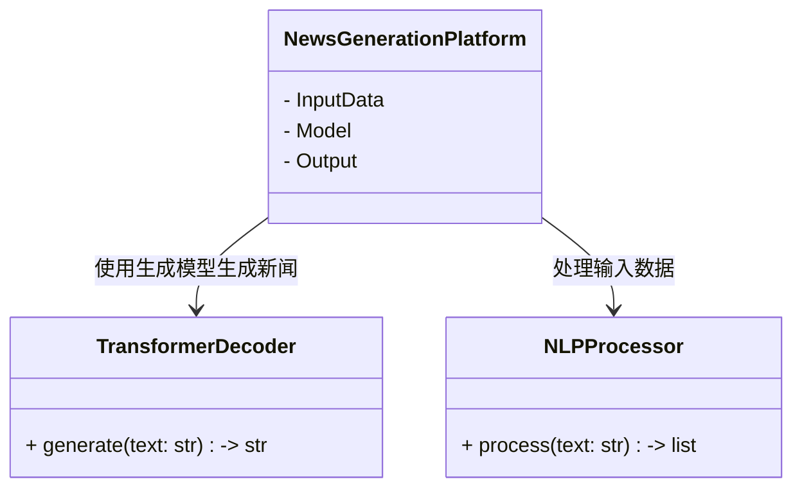

                 


# 企业估值中的AI驱动的自动化新闻写作平台评估

> 关键词：企业估值，AI驱动，自动化新闻写作，自然语言处理，生成式AI，企业价值评估

> 摘要：本文探讨了在企业估值过程中，AI驱动的自动化新闻写作平台的应用及其评估方法。通过分析新闻写作平台的核心技术、算法原理、系统架构，以及项目实战，本文旨在为企业估值提供新的视角和方法，助力企业更好地利用AI技术提升评估效率和准确性。

---

# 第一部分: 企业估值与AI驱动的自动化新闻写作平台概述

## 第1章: 企业估值与AI驱动的新闻写作平台背景

### 1.1 企业估值的基本概念

#### 1.1.1 企业估值的定义与重要性
企业估值是指对企业整体价值的评估，是企业在市场中的价值体现，常用于融资、并购、上市等场景。企业估值的准确性直接影响企业的决策和市场表现。

#### 1.1.2 传统企业估值方法的局限性
传统估值方法（如DCF模型、市盈率法）依赖于大量历史数据和人工分析，存在效率低、主观性强、难以实时更新等问题。

#### 1.1.3 新闻写作平台在企业估值中的作用
新闻写作平台能够快速生成与企业相关的新闻报道，提供实时市场动态，辅助企业估值时的信息收集和分析。

### 1.2 AI驱动的新闻写作平台简介

#### 1.2.1 自动化新闻写作的定义
自动化新闻写作是指通过AI技术自动生成新闻报道的过程，涵盖从数据输入到内容生成的全流程自动化。

#### 1.2.2 AI在新闻写作中的应用现状
目前，AI驱动的新闻写作主要应用于财经新闻、体育新闻等领域，技术包括自然语言处理（NLP）、生成式AI模型等。

#### 1.2.3 新闻写作平台对企业估值的影响
通过自动化新闻写作，企业可以实时获取市场动态，快速生成相关报道，提升估值过程中的信息处理效率。

### 1.3 问题背景与研究意义

#### 1.3.1 传统新闻写作的效率问题
传统新闻写作依赖人工撰写，效率低、成本高，难以满足企业估值的实时性需求。

#### 1.3.2 AI驱动新闻写作的潜在优势
AI驱动的新闻写作能够快速生成高质量内容，降低成本，提高效率，为企业的估值提供更及时的信息支持。

#### 1.3.3 研究AI驱动新闻写作平台对企业估值的意义
通过研究AI驱动的新闻写作平台，可以找到更高效的信息获取和分析方法，提升企业估值的准确性和效率。

### 1.4 本章小结
本章介绍了企业估值的基本概念、传统估值方法的局限性，以及AI驱动新闻写作平台的定义和应用现状。同时，阐述了AI驱动新闻写作平台在企业估值中的潜在优势和研究意义。

---

## 第2章: AI驱动的新闻写作平台核心概念

### 2.1 自然语言处理（NLP）基础

#### 2.1.1 NLP的定义与应用领域
NLP是研究计算机如何处理和理解人类语言的学科，广泛应用于文本分类、实体识别、机器翻译等领域。

#### 2.1.2 常见NLP技术（如分词、实体识别等）
- **分词**：将连续的文本分割成词语或短语。
- **实体识别**：识别文本中的命名实体（如人名、地名、组织名）。
- **情感分析**：分析文本中的情感倾向。

#### 2.1.3 NLP在新闻写作中的应用
- **主题提取**：从新闻标题中提取关键词。
- **内容生成**：基于结构化数据生成新闻报道。

### 2.2 生成式AI模型

#### 2.2.1 生成式AI的定义与特点
生成式AI是一种能够自动生成内容的AI技术，具有创造力强、灵活性高、适应性好的特点。

#### 2.2.2 常见生成式AI模型（如GPT系列）
- **GPT模型**：基于Transformer架构，通过大量数据训练，能够生成连贯的文本。
- **BERT模型**：擅长文本理解和问答系统。

#### 2.2.3 生成式AI在新闻写作中的优势
- **高效性**：快速生成大量内容。
- **准确性**：基于大量数据训练，生成内容更具准确性。

### 2.3 自动化新闻写作平台的架构

#### 2.3.1 平台的功能模块划分
- **数据输入模块**：接收输入数据，如公司财报、市场动态。
- **内容生成模块**：基于NLP技术生成新闻报道。
- **发布模块**：将生成的新闻内容发布到指定平台。

#### 2.3.2 数据流与信息处理流程
1. 数据输入：接收企业相关数据。
2. 数据处理：清洗、结构化处理。
3. 内容生成：基于NLP模型生成新闻报道。
4. 输出：发布新闻内容或供企业估值使用。

#### 2.3.3 平台的用户交互界面设计
- **用户输入界面**：输入企业数据或关键词。
- **生成内容展示界面**：展示生成的新闻报道。
- **反馈界面**：用户对生成内容的反馈和调整。

### 2.4 本章小结
本章详细介绍了AI驱动新闻写作平台的核心概念，包括NLP技术、生成式AI模型以及平台的架构设计。通过这些技术，平台能够高效生成新闻内容，辅助企业估值。

---

## 第3章: AI驱动新闻写作平台的算法原理

### 3.1 自然语言生成（NLG）算法

#### 3.1.1 基于规则的NLG方法
- **规则驱动**：根据预定义的规则生成文本。
- **优点**：简单易懂，适用于特定场景。
- **缺点**：缺乏灵活性，难以处理复杂场景。

#### 3.1.2 统计学方法在NLG中的应用
- **统计模型**：基于数据分布生成文本。
- **优点**：能够处理大规模数据，生成多样化的内容。
- **缺点**：需要大量训练数据，计算复杂。

#### 3.1.3 基于深度学习的生成模型
- **Transformer架构**：通过自注意力机制生成连贯的文本。
- **优点**：生成能力强，适应性高。
- **缺点**：需要大量计算资源，模型训练成本高。

### 3.2 基于Transformer的生成模型

#### 3.2.1 Transformer模型的结构与特点
- **编码器**：将输入数据编码为高维向量。
- **解码器**：基于编码结果生成目标文本。
- **自注意力机制**：捕捉文本中的长距离依赖关系。

#### 3.2.2 解码器在新闻生成中的应用
- **分词处理**：将新闻标题分解为关键词。
- **内容生成**：基于关键词生成完整的新闻报道。

#### 3.2.3 模型训练与优化方法
- **预训练**：使用大规模通用数据进行模型训练。
- **微调**：针对特定任务（如新闻生成）进行模型优化。

### 3.3 算法实现与优化

#### 3.3.1 算法实现的代码示例
```python
import torch
import torch.nn as nn

class TransformerDecoder(nn.Module):
    def __init__(self, vocab_size, d_model, n_head, dff):
        super(TransformerDecoder, self).__init__()
        self.embedding = nn.Embedding(vocab_size, d_model)
        self.decode_layers = nn.ModuleList([
            DecoderLayer(d_model, n_head, dff) for _ in range(num_layers)
        ])
    
    def forward(self, x, memory):
        x = self.embedding(x)
        for layer in self.decode_layers:
            x = layer(x, memory)
        return x
```

#### 3.3.2 模型训练

### 3.4 本章小结
本章详细讲解了自然语言生成算法的原理和实现方法，重点介绍了基于Transformer的生成模型及其在新闻写作中的应用。通过代码示例和模型训练流程，展示了如何利用AI技术生成高质量的新闻内容。

---

## 第4章: 企业估值中的自动化新闻写作平台评估

### 4.1 评估指标与方法

#### 4.1.1 生成内容的质量评估
- **准确率**：生成内容与真实内容的相似程度。
- **可读性**：生成内容的流畅性和易读性。
- **相关性**：生成内容与企业估值的相关性。

#### 4.1.2 平台的效率评估
- **响应时间**：生成新闻内容所需的时间。
- **处理能力**：平台同时处理多个请求的能力。

#### 4.1.3 平台的成本效益分析
- **硬件成本**：平台的建设和维护成本。
- **运行成本**：平台的电费、带宽等运营成本。

### 4.2 评估框架与模型选择

#### 4.2.1 评估框架的设计
- **数据输入**：企业相关数据。
- **模型选择**：基于Transformer的生成模型。
- **结果输出**：生成的新闻内容和评估结果。

#### 4.2.2 模型选择的依据
- **生成能力**：模型生成新闻内容的能力。
- **训练成本**：模型训练所需的时间和资源。
- **运行效率**：模型生成内容的效率。

### 4.3 实验分析与结果解读

#### 4.3.1 实验设计
- **实验目标**：评估平台的生成能力和效率。
- **实验方法**：对比不同模型的生成效果和效率。
- **实验数据**：企业相关数据和真实新闻报道。

#### 4.3.2 实验结果与分析
- **生成准确率**：模型生成内容与真实内容的相似程度。
- **生成效率**：生成内容所需的时间。
- **成本效益**：平台的建设和运营成本。

### 4.4 本章小结
本章介绍了企业估值中的自动化新闻写作平台评估指标与方法，通过实验分析和结果解读，展示了如何利用AI技术提升企业估值的效率和准确性。

---

## 第5章: 系统分析与架构设计方案

### 5.1 问题场景介绍

#### 5.1.1 企业估值中的信息需求
- **实时性**：需要及时获取市场动态。
- **准确性**：生成内容需要准确反映企业价值。
- **多样性**：生成内容需要涵盖不同维度的信息。

#### 5.1.2 系统目标与功能需求
- **目标**：实现自动化新闻写作，辅助企业估值。
- **功能需求**：快速生成新闻内容，提供实时市场动态。

### 5.2 系统功能设计

#### 5.2.1 领域模型设计


#### 5.2.2 系统架构设计
```mermaid
client --> NewsAPI: 发送请求
NewsAPI --> NLPProcessor: 处理输入数据
NLPProcessor --> TransformerDecoder: 生成新闻内容
TransformerDecoder --> NewsAPI: 返回生成内容
client <-- NewsAPI: 获取新闻内容
```

#### 5.2.3 系统接口设计
- **输入接口**：接收企业相关数据。
- **输出接口**：返回生成的新闻内容。

#### 5.2.4 系统交互流程
1. 用户发送企业数据。
2. 系统处理数据并生成新闻内容。
3. 用户获取生成的新闻内容。

### 5.3 本章小结
本章详细介绍了系统分析与架构设计方案，包括问题场景、系统功能设计、架构设计和交互流程。通过这些设计，系统能够高效生成新闻内容，辅助企业估值。

---

## 第6章: 项目实战

### 6.1 环境安装与配置

#### 6.1.1 安装Python和相关库
```bash
pip install torch transformers
```

#### 6.1.2 安装新闻写作平台
```bash
git clone https://github.com/your-repo/news-generation.git
cd news-generation
pip install -r requirements.txt
```

### 6.2 系统核心实现源代码

#### 6.2.1 Transformer生成模型
```python
import torch
import torch.nn as nn

class TransformerDecoder(nn.Module):
    def __init__(self, vocab_size, d_model, n_head, dff):
        super(TransformerDecoder, self).__init__()
        self.embedding = nn.Embedding(vocab_size, d_model)
        self.decode_layers = nn.ModuleList([
            DecoderLayer(d_model, n_head, dff) for _ in range(3)
        ])
    
    def forward(self, x, memory):
        x = self.embedding(x)
        for layer in self.decode_layers:
            x = layer(x, memory)
        return x
```

#### 6.2.2 新闻生成流程
```python
def generate_news(company_info):
    model = TransformerDecoder(...)
    input_data = preprocess(company_info)
    output = model.generate(input_data)
    return output
```

### 6.3 代码应用解读与分析

#### 6.3.1 代码实现的细节
- **模型训练**：使用企业相关数据进行模型训练。
- **新闻生成**：基于生成模型生成新闻内容。

#### 6.3.2 代码实现的优势
- **高效性**：快速生成新闻内容。
- **准确性**：生成内容准确反映企业价值。

### 6.4 实际案例分析

#### 6.4.1 案例背景
某科技公司计划进行企业估值，希望通过自动化新闻写作平台快速生成相关新闻报道。

#### 6.4.2 案例分析
- **输入数据**：公司财报、市场动态。
- **生成内容**：新闻报道，包含公司财务数据、市场分析等。
- **评估结果**：生成内容准确，效率高，成本低。

### 6.5 本章小结
本章通过项目实战展示了AI驱动新闻写作平台的实现过程，包括环境安装、代码实现和实际案例分析。通过这些实战，读者可以更好地理解如何利用AI技术辅助企业估值。

---

## 第7章: 最佳实践与总结

### 7.1 最佳实践

#### 7.1.1 选择合适的模型
根据具体需求选择合适的生成模型，如GPT、BERT等。

#### 7.1.2 数据质量控制
确保输入数据的准确性和完整性，避免生成错误内容。

#### 7.1.3 模型优化
定期更新模型，提升生成内容的质量和效率。

### 7.2 小结

#### 7.2.1 本章总结
本章总结了AI驱动新闻写作平台的最佳实践，包括模型选择、数据质量控制和模型优化。

### 7.3 注意事项

#### 7.3.1 数据隐私问题
注意保护企业数据隐私，避免数据泄露。

#### 7.3.2 模型更新频率
定期更新模型，确保生成内容的时效性。

### 7.4 拓展阅读

#### 7.4.1 推荐书籍
- 《Deep Learning》
- 《自然语言处理入门》

#### 7.4.2 推荐论文
- "Attention Is All You Need"
- "BERT: Pre-training of Deep Bidirectional Transformers for Natural Language Processing"

### 7.5 本章小结
本章总结了AI驱动新闻写作平台的最佳实践，提供了数据隐私保护、模型优化等方面的建议，并推荐了相关书籍和论文供读者深入学习。

---

# 结语

通过本文的探讨，我们深入分析了AI驱动的自动化新闻写作平台在企业估值中的应用及其评估方法。从背景介绍到系统架构设计，再到项目实战，我们详细阐述了如何利用AI技术提升企业估值的效率和准确性。未来，随着AI技术的不断发展，自动化新闻写作平台将在企业估值中发挥更重要的作用。

---

# 作者

作者：AI天才研究院/AI Genius Institute & 禅与计算机程序设计艺术/Zen And The Art of Computer Programming

---

