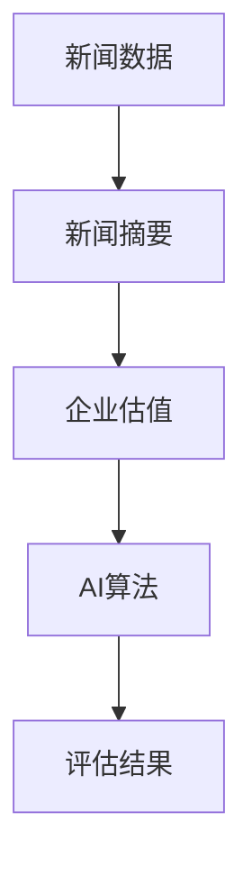
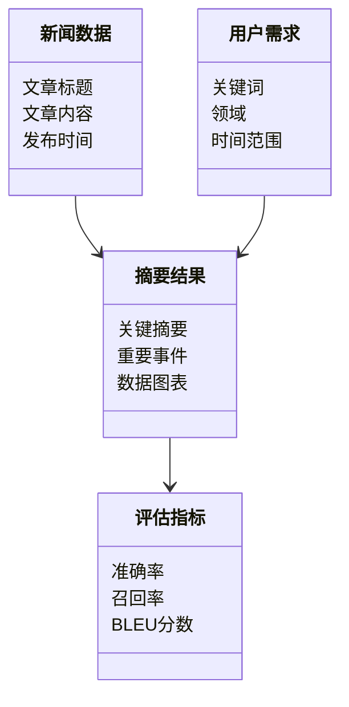
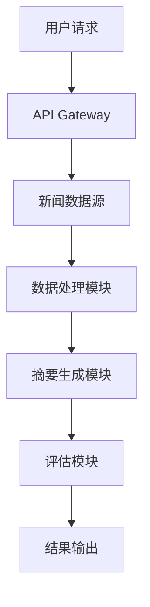

                 


# 企业估值中的AI驱动的自动化新闻摘要平台评估

> 关键词：企业估值，AI驱动，新闻摘要，自动化平台，技术博客

> 摘要：本文探讨了在企业估值过程中，如何利用AI驱动的自动化新闻摘要平台来提高效率和准确性。通过分析新闻摘要算法、系统架构设计和实际案例，展示了如何构建一个高效的新闻摘要平台，并评估其对企业估值的影响。

---

# 第一部分: 企业估值与AI驱动的新闻摘要平台概述

# 第1章: 企业估值中的新闻摘要平台概述

## 1.1 问题背景与挑战

### 1.1.1 传统企业估值方法的局限性
企业估值是企业管理和金融领域中的核心问题，传统方法依赖于财务报表分析、市场研究和专家判断。然而，这种方法存在效率低下、信息滞后和主观性强的问题。

### 1.1.2 新闻摘要在企业估值中的重要性
新闻摘要能够快速提取关键信息，帮助投资者和分析师了解市场动态、企业事件和行业趋势。及时准确的新闻摘要能够显著提升企业估值的效率和准确性。

### 1.1.3 AI驱动的新闻摘要平台的优势
AI技术的发展使得新闻摘要可以自动化、实时化和智能化。AI驱动的新闻摘要平台能够处理海量信息，提取关键数据，并生成结构化的摘要，为企业估值提供有力支持。

## 1.2 问题描述与目标

### 1.2.1 新闻摘要平台的功能需求
新闻摘要平台需要具备信息采集、自然语言处理、摘要生成和结果输出的功能。平台需要支持多种语言、多种格式的输入，并能够生成结构化和非结构化的输出。

### 1.2.2 AI驱动的自动化新闻摘要的关键问题
AI驱动的新闻摘要需要解决数据清洗、文本理解、摘要生成和结果评估等问题。同时，如何提高摘要的准确性和可读性是关键挑战。

### 1.2.3 企业估值中的新闻摘要平台的目标
通过AI驱动的新闻摘要平台，企业能够快速获取关键信息，辅助财务分析、市场研究和决策制定，从而提高估值的效率和准确性。

## 1.3 问题解决与边界

### 1.3.1 AI驱动的新闻摘要平台的解决方案
采用自然语言处理（NLP）技术，结合深度学习算法，构建自动化新闻摘要系统。通过数据预处理、模型训练和结果优化，实现高效的信息提取和摘要生成。

### 1.3.2 问题的边界与外延
新闻摘要平台的边界包括信息输入、处理过程和结果输出。外延则涉及数据源的多样性、摘要的可定制性和系统的可扩展性。

### 1.3.3 核心概念与核心要素
核心概念包括自然语言处理、深度学习、文本摘要和企业估值。核心要素包括数据输入、模型训练、结果输出和系统优化。

## 1.4 本章小结

---

# 第二部分: AI驱动的新闻摘要平台核心概念

# 第2章: AI驱动的新闻摘要平台核心概念

## 2.1 核心概念原理

### 2.1.1 自动化新闻摘要的基本原理
自动化新闻摘要基于自然语言处理技术，通过文本理解、信息提取和摘要生成，将长文本压缩为关键信息。核心步骤包括分词、句法分析、语义理解、信息提取和摘要生成。

### 2.1.2 AI驱动的新闻摘要算法
采用基于Transformer的编码器-解码器架构，通过自注意力机制捕获文本中的关键信息，并生成摘要。算法的关键在于编码器的输入表示和解码器的生成策略。

### 2.1.3 平台的评估机制
评估机制包括摘要的准确率、召回率、BLEU分数和ROUGE分数。通过多维度评估，确保摘要的质量和可读性。

## 2.2 核心概念属性对比

### 2.2.1 不同新闻摘要算法的对比分析
对比基于规则的摘要算法和基于深度学习的摘要算法，分析其优缺点和适用场景。

### 2.2.2 平台评估指标的对比
比较不同评估指标的计算方法和适用性，选择最适合企业估值需求的评估指标。

### 2.2.3 AI驱动与传统新闻摘要的差异
AI驱动的新闻摘要具有自动化、智能化和高效性，而传统摘要依赖人工操作，效率较低且成本较高。

## 2.3 ER实体关系图



## 2.4 本章小结

---

# 第三部分: AI驱动的新闻摘要算法原理

# 第3章: 基于Transformer的新闻摘要算法

## 3.1 算法原理概述

### 3.1.1 Transformer模型的基本结构
Transformer模型由编码器和解码器组成，编码器负责将输入文本转换为嵌入表示，解码器负责生成目标摘要。模型通过自注意力机制捕捉文本中的长距离依赖关系。

### 3.1.2 基于Transformer的新闻摘要算法
基于Transformer的算法通过多头自注意力机制，捕捉文本中的关键信息，并生成摘要。算法的关键在于编码器的输入表示和解码器的生成策略。

### 3.1.3 算法的输入输出流程
输入：原始新闻文本；输出：结构化摘要。整个流程包括数据预处理、模型训练、摘要生成和结果评估。

## 3.2 算法实现流程

### 3.2.1 数据预处理
- 分词：将新闻文本分割成词语或短语。
- 去除停用词：移除对文本理解无贡献的词汇。
- 词干提取：将词汇还原为其基本形式。

### 3.2.2 模型训练
- 编码器：将输入文本转换为嵌入表示。
- 解码器：生成目标摘要，通过自注意力机制和前馈网络进行预测。

### 3.2.3 摘要生成
- 输入新闻文本，经过编码器和解码器处理，生成结构化摘要。

## 3.3 算法数学模型

### 3.3.1 编码器部分
编码器由多头自注意力机制和前馈网络组成：

$$
\text{多头自注意力} = \text{scaled\_dot\_product\_attention}(Q, K, V)
$$

其中，$Q$、$K$、$V$分别为查询、键和值向量。

### 3.3.2 解码器部分
解码器由自注意力机制和交叉注意力机制组成：

$$
\text{交叉注意力} = \text{scaled\_dot\_product\_attention}(Q, K, V)
$$

### 3.3.3 损失函数
使用交叉熵损失函数进行模型训练：

$$
\text{损失函数} = -\sum_{i=1}^{n} \text{log}(p(y_i|x_i))
$$

## 3.4 本章小结

---

# 第四部分: 系统分析与架构设计

# 第4章: 系统分析与架构设计

## 4.1 系统问题场景介绍

### 4.1.1 企业估值中的信息需求
企业估值需要关注财务数据、市场动态、行业趋势和竞争对手信息。

### 4.1.2 新闻摘要平台的功能需求
平台需要支持多语言输入、实时摘要生成和结构化输出。

## 4.2 系统功能设计

### 4.2.1 领域模型设计
领域模型包括新闻数据、用户需求、摘要结果和评估指标。



### 4.2.2 系统架构设计



## 4.3 系统接口设计

### 4.3.1 API接口定义
- 输入接口：接收新闻文本和用户需求。
- 输出接口：返回结构化摘要和评估指标。

### 4.3.2 接口交互流程
用户请求 --> API网关 --> 数据处理 --> 摘要生成 --> 评估模块 --> 结果输出。

## 4.4 本章小结

---

# 第五部分: 项目实战

# 第5章: 项目实战

## 5.1 项目环境安装

### 5.1.1 安装Python和相关库
安装Python 3.8以上版本，安装库：`transformers`, `numpy`, `scikit-learn`.

```bash
pip install transformers numpy scikit-learn
```

### 5.1.2 下载模型
使用Hugging Face的预训练模型：

```bash
python
from transformers import AutoTokenizer, AutoModelForSummarization
tokenizer = AutoTokenizer.from_pretrained('facebook/bart-large-cnn')
model = AutoModelForSummarization.from_pretrained('facebook/bart-large-cnn')
```

## 5.2 系统核心实现

### 5.2.1 数据预处理
编写函数进行分词和停用词处理。

```python
def preprocess(text):
    # 分词
    tokens = text.split()
    # 去除停用词
    filtered_tokens = [token for token in tokens if token not in STOP_WORDS]
    return ' '.join(filtered_tokens)
```

### 5.2.2 摘要生成

```python
def generate_summary(text):
    inputs = tokenizer(text, max_length=512, truncation=True, return_tensors='pt')
    outputs = model.generate(inputs.input_ids, max_length=100, num_beams=5, early_stopping=True)
    summary = tokenizer.decode(outputs[0], skip_special_tokens=True)
    return summary
```

### 5.2.3 评估指标

```python
def evaluate(summary, reference):
    # 计算BLEU分数
    bleu = sentence_bleu(summary, reference)
    # 计算ROUGE分数
    rouge = Rouge().compute(summary, reference)
    return bleu, rouge
```

## 5.3 项目实战案例

### 5.3.1 案例分析
以某科技企业的新闻为例，展示平台的摘要生成和评估过程。

### 5.3.2 实际操作步骤
详细说明环境配置、代码实现和结果分析的步骤。

## 5.4 本章小结

---

# 第六部分: 总结与拓展

# 第6章: 总结与拓展

## 6.1 本章总结
回顾全文，总结AI驱动的新闻摘要平台在企业估值中的作用和优势。

## 6.2 最佳实践 tips

### 6.2.1 系统优化建议
优化算法性能，提高摘要准确率。

### 6.2.2 拓展方向
探索多语言支持、实时更新和个性化定制。

## 6.3 小结

## 6.4 注意事项
注意数据隐私和模型泛化能力。

## 6.5 拓展阅读
推荐相关领域的书籍和论文。

---

# 作者

作者：AI天才研究院/AI Genius Institute & 禅与计算机程序设计艺术 /Zen And The Art of Computer Programming

