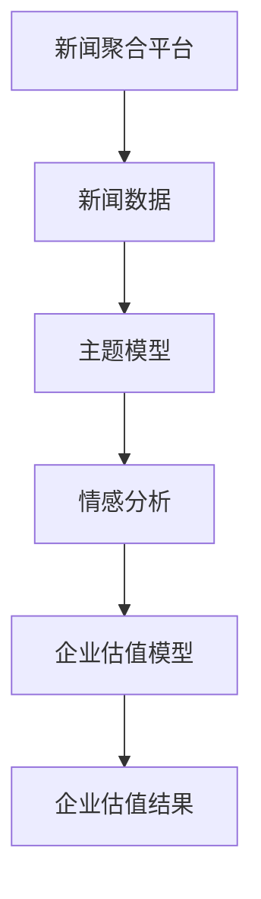
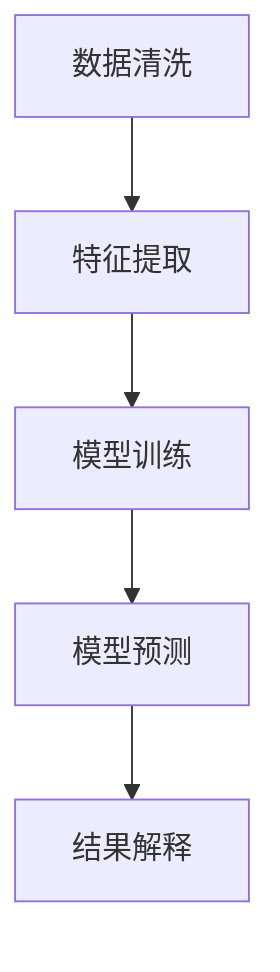
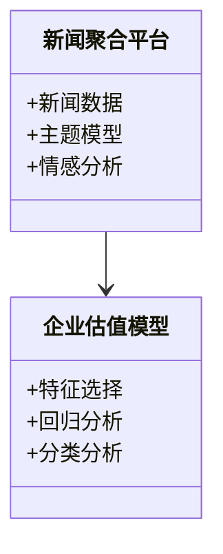
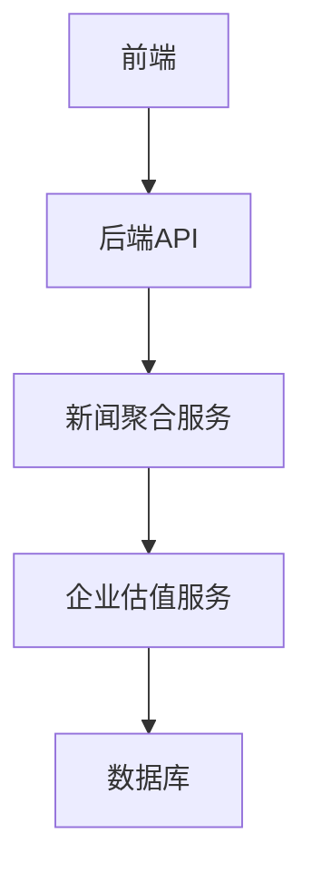
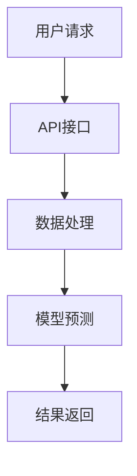
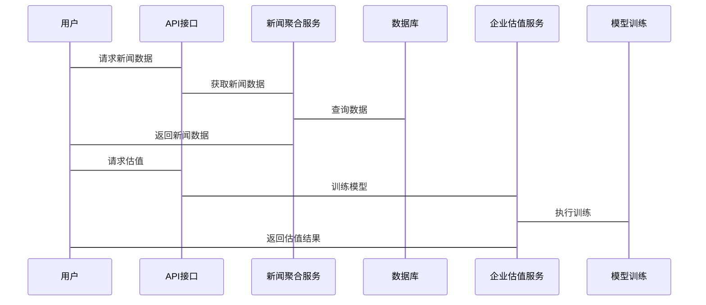

                 


# 企业估值中的AI驱动的自动化新闻聚合平台评估

> 关键词：企业估值，AI驱动，自动化新闻聚合，自然语言处理，大数据分析

> 摘要：本文探讨了在企业估值过程中，如何利用AI驱动的自动化新闻聚合平台来提高估值的效率和准确性。通过分析新闻数据，结合自然语言处理和大数据技术，构建企业估值模型，为企业提供更精准的估值支持。

---

# 第一部分: 企业估值中的AI驱动的自动化新闻聚合平台背景介绍

## 第1章: 问题背景与定义

### 1.1 问题背景

#### 1.1.1 企业估值的传统方法与局限性
企业估值是企业管理和金融领域中的核心问题之一，传统方法主要包括财务指标法、市场法和资产评估法。然而，这些方法往往依赖于历史数据和定量分析，难以捕捉市场动态和非结构化信息，尤其是来自新闻媒体的实时信息。

#### 1.1.2 新闻数据在企业估值中的潜在价值
新闻数据作为非结构化数据的一种，包含了大量影响企业价值的关键信息，如市场情绪、行业趋势、政策变化等。通过分析这些数据，可以更全面地评估企业的市场地位和潜在风险。

#### 1.1.3 AI驱动的自动化新闻聚合平台的必要性
传统的新闻聚合方法效率低下，难以处理海量数据。AI驱动的自动化新闻聚合平台能够实时抓取、分析和整合新闻数据，为企业的估值提供更高效、更准确的支持。

### 1.2 核心概念定义

#### 1.2.1 自动化新闻聚合平台的定义
自动化新闻聚合平台是指利用爬虫技术、自然语言处理和大数据分析等技术，自动从新闻网站、社交媒体等来源获取、整理和分析新闻数据的平台。

#### 1.2.2 AI驱动的企业估值模型的定义
AI驱动的企业估值模型是指基于机器学习算法，利用新闻数据、财务数据等多源数据，构建企业价值评估模型，预测企业价值。

#### 1.2.3 平台与模型的边界与外延
自动化新闻聚合平台的边界在于数据的获取和初步处理，而企业估值模型的边界在于如何利用这些数据进行建模和预测。两者的结合构成了一个完整的AI驱动的企业估值系统。

### 1.3 问题描述与目标

#### 1.3.1 企业估值中的关键问题
- 数据的多样性和复杂性
- 非结构化数据的处理难度
- 市场动态的实时捕捉

#### 1.3.2 新闻数据的特征与挑战
- 数据的实时性
- 数据的噪声和冗余
- 数据的语义理解

#### 1.3.3 平台的目标与核心功能
- 实时聚合新闻数据
- 自动化分析和处理新闻数据
- 基于新闻数据的企业估值模型构建

### 1.4 问题解决思路

#### 1.4.1 数据采集与处理
- 使用爬虫技术抓取新闻数据
- 数据清洗和预处理
- 数据标注和特征提取

#### 1.4.2 模型训练与优化
- 构建机器学习模型
- 数据特征选择与优化
- 模型的验证与调优

#### 1.4.3 结果解释与应用
- 模型结果的可视化
- 结果的可解释性分析
- 模型在企业估值中的应用

---

## 第2章: 问题背景的现状与趋势

### 2.1 当前企业估值方法的现状

#### 2.1.1 财务指标法
- 优点：简单直观
- 缺点：忽略市场动态和非财务因素

#### 2.1.2 市场法
- 优点：考虑市场价值
- 缺点：依赖于市场数据的可获得性

#### 2.1.3 资产评估法
- 优点：考虑资产的实物形态
- 缺点：难以评估无形资产

### 2.2 新闻数据在企业估值中的应用现状

#### 2.2.1 数据来源的多样性
- 新闻网站、社交媒体、行业报告等

#### 2.2.2 数据处理的复杂性
- 非结构化数据的处理难度大
- 数据清洗和预处理耗时

#### 2.2.3 数据分析的局限性
- 数据量不足
- 数据质量和相关性问题

### 2.3 AI驱动的自动化新闻聚合平台的发展趋势

#### 2.3.1 自然语言处理技术的进步
- 更强大的文本理解和生成能力
- 更高的语义分析精度

#### 2.3.2 大数据分析能力的提升
- 更高效的分布式计算能力
- 更强大的数据处理工具

#### 2.3.3 企业估值领域的智能化转型
- 智能化的企业估值系统
- 实时动态的估值模型

---

## 第3章: 平台的价值与挑战

### 3.1 平台的核心价值

#### 3.1.1 提高估值效率
- 自动化处理新闻数据
- 实时更新估值结果

#### 3.1.2 增强估值准确性
- 全面捕捉市场信息
- 多维度分析企业价值

#### 3.1.3 降低数据处理成本
- 自动化数据聚合
- 减少人工干预

### 3.2 平台面临的挑战

#### 3.2.1 数据质量与完整性
- 数据噪声和冗余
- 数据来源的多样性

#### 3.2.2 模型的泛化能力
- 数据的不平衡性
- 模型的可解释性

#### 3.2.3 用户接受度与信任度
- 模型的透明度
- 用户的使用习惯

### 3.3 未来发展的潜力与方向

#### 3.3.1 技术创新
- 更先进的NLP技术
- 更高效的机器学习算法

#### 3.3.2 数据共享机制
- 数据隐私保护
- 数据共享标准

#### 3.3.3 行业标准的制定
- 行业标准的建立
- 行业合作与交流

---

# 第二部分: 核心概念与联系

## 第4章: 核心概念与联系

### 4.1 核心概念原理

#### 4.1.1 自动化新闻聚合的核心原理
- 数据抓取与清洗
- 文本分析与特征提取
- 数据存储与管理

#### 4.1.2 企业估值模型的核心原理
- 特征选择与模型训练
- 模型预测与结果解释
- 结果应用与反馈优化

### 4.2 核心概念属性特征对比

| 属性 | 新闻聚合平台 | 企业估值模型 |
|------|--------------|--------------|
| 数据来源 | 新闻网站、社交媒体等 | 财务数据、新闻数据等 |
| 数据处理 | 文本清洗、特征提取 | 数据标注、特征选择 |
| 数据分析 | 主题建模、情感分析 | 回归分析、分类分析 |
| 输出结果 | 结构化数据 | 企业估值结果 |

### 4.3 ER实体关系图架构



### 4.4 算法原理

#### 4.4.1 算法流程



#### 4.4.2 特征提取与选择

```python
import pandas as pd
from sklearn.feature_extraction.text import TfidfVectorizer

# 假设news_data是包含新闻文本的数据框
news_data = pd.DataFrame({'text': [...], 'label': [...])}

# 使用TF-IDF进行特征提取
vectorizer = TfidfVectorizer(max_features=500)
X = vectorizer.fit_transform(news_data['text'])
```

#### 4.4.3 模型训练与预测

```python
from sklearn.model import LinearRegression

# 假设X是特征矩阵，y是目标变量
model = LinearRegression()
model.fit(X, y)

# 预测结果
y_pred = model.predict(X)
```

### 4.5 数学模型与公式

#### 4.5.1 线性回归模型

$$ y = \beta_0 + \beta_1x_1 + \beta_2x_2 + ... + \beta_nx_n $$

其中，$y$ 是目标变量，$x_i$ 是特征变量，$\beta_i$ 是回归系数。

#### 4.5.2 逻辑回归模型

$$ P(Y=1|X) = \frac{e^{\beta_0 + \beta_1x_1 + ... + \beta_nx_n}}{1 + e^{\beta_0 + \beta_1x_1 + ... + \beta_nx_n}} $$

---

# 第三部分: 系统分析与架构设计

## 第5章: 系统分析与架构设计

### 5.1 问题场景介绍

#### 5.1.1 项目背景
- 企业估值需求
- 新闻数据的重要性

#### 5.1.2 项目目标
- 构建自动化新闻聚合平台
- 构建企业估值模型
- 提供实时估值支持

### 5.2 系统功能设计

#### 5.2.1 功能模块划分
- 数据采集模块
- 数据处理模块
- 模型训练模块
- 结果展示模块

#### 5.2.2 领域模型



### 5.3 系统架构设计

#### 5.3.1 系统架构



#### 5.3.2 数据流



### 5.4 系统接口设计

#### 5.4.1 API接口

```http
GET /api/news?query=technology
POST /api/train-model
GET /api/valuation?company=Google
```

#### 5.4.2 数据格式

- 请求格式：JSON
- 响应格式：JSON

### 5.5 系统交互设计



---

# 第四部分: 项目实战

## 第6章: 项目实战

### 6.1 环境安装

```bash
pip install requests
pip install beautifulsoup4
pip install sklearn
pip install numpy
pip install pandas
pip install matplotlib
pip install scikit-learn
```

### 6.2 系统核心实现源代码

#### 6.2.1 数据采集

```python
import requests
from bs4 import BeautifulSoup

def scrape_news(url):
    response = requests.get(url)
    soup = BeautifulSoup(response.text, 'html.parser')
    articles = soup.find_all('article')
    for article in articles:
        title = article.find('h2').text
        content = article.find('p').text
        print(f"Title: {title}\nContent: {content}\n")
```

#### 6.2.2 数据处理

```python
import pandas as pd
from sklearn.feature_extraction.text import TfidfVectorizer

def process_data(news_list):
    df = pd.DataFrame({'text': news_list})
    vectorizer = TfidfVectorizer()
    X = vectorizer.fit_transform(df['text'])
    return X
```

#### 6.2.3 模型训练

```python
from sklearn.model_selection import train_test_split
from sklearn.linear_model import LinearRegression

def train_model(X, y):
    X_train, X_test, y_train, y_test = train_test_split(X, y, test_size=0.2)
    model = LinearRegression()
    model.fit(X_train, y_train)
    return model
```

#### 6.2.4 结果展示

```python
import matplotlib.pyplot as plt

def visualize_results(y_true, y_pred):
    plt.scatter(y_true, y_pred)
    plt.xlabel('True Values')
    plt.ylabel('Predictions')
    plt.title('True vs Predicted Values')
    plt.show()
```

### 6.3 代码应用解读与分析

#### 6.3.1 数据采集模块
- 使用requests库抓取网页数据
- 使用BeautifulSoup解析HTML内容
- 提取文章标题和内容

#### 6.3.2 数据处理模块
- 使用pandas进行数据存储
- 使用TF-IDF进行特征提取
- 生成特征矩阵

#### 6.3.3 模型训练模块
- 使用scikit-learn进行数据分割
- 构建线性回归模型
- 训练模型并保存

#### 6.3.4 结果展示模块
- 使用matplotlib进行可视化
- 绘制散点图
- 分析模型的预测能力

### 6.4 实际案例分析与详细讲解

#### 6.4.1 案例背景
- 某科技公司估值
- 新闻数据来源：科技新闻网站

#### 6.4.2 数据处理与分析
- 数据清洗和特征提取
- 模型训练与评估
- 结果可视化与解释

### 6.5 项目小结

#### 6.5.1 项目实现的关键点
- 数据采集的高效性
- 数据处理的准确性
- 模型训练的稳定性

#### 6.5.2 项目实施的经验
- 数据清洗的重要性
- 模型调优的必要性
- 结果可视化的重要性

---

# 第五部分: 最佳实践

## 第7章: 最佳实践

### 7.1 关键点总结

#### 7.1.1 数据采集与处理
- 确保数据的全面性
- 降低数据噪声
- 提升数据质量

#### 7.1.2 模型训练与优化
- 选择合适的算法
- 进行交叉验证
- 优化模型参数

### 7.2 注意事项

#### 7.2.1 数据隐私与安全
- 遵守数据隐私法规
- 保护用户数据安全

#### 7.2.2 模型的可解释性
- 提供模型解释
- 便于用户理解

#### 7.2.3 系统的可扩展性
- 设计模块化架构
- 便于功能扩展

### 7.3 拓展阅读

#### 7.3.1 推荐书籍
- 《Python机器学习实战》
- 《自然语言处理入门》

#### 7.3.2 推荐博客与资源
- 官方文档
- 技术社区

---

# 第六部分: 结论与展望

## 第8章: 结论与展望

### 8.1 核心结论

#### 8.1.1 平台的核心价值
- 提高企业估值的效率和准确性
- 提供实时动态的估值支持

#### 8.1.2 技术实现的关键点
- 高效的数据处理能力
- 强大的模型训练能力
- 可视化的结果展示

### 8.2 未来展望

#### 8.2.1 技术创新
- 更先进的NLP技术
- 更高效的算法优化

#### 8.2.2 行业应用
- 更多行业的应用拓展
- 更多场景的应用探索

#### 8.2.3 标准化与规范化
- 行业标准的制定
- 数据共享机制的完善

---

# 作者：AI天才研究院 & 禅与计算机程序设计艺术

---

