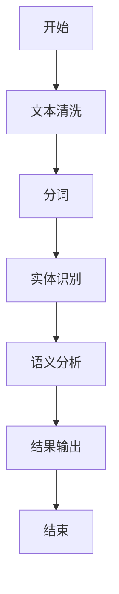
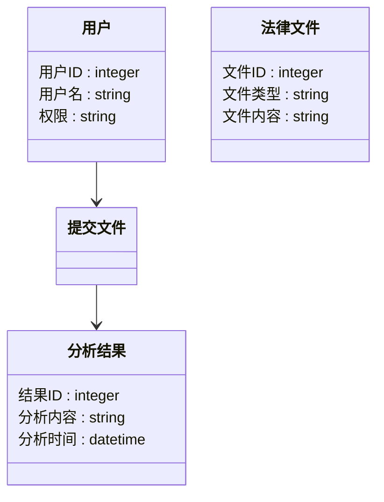
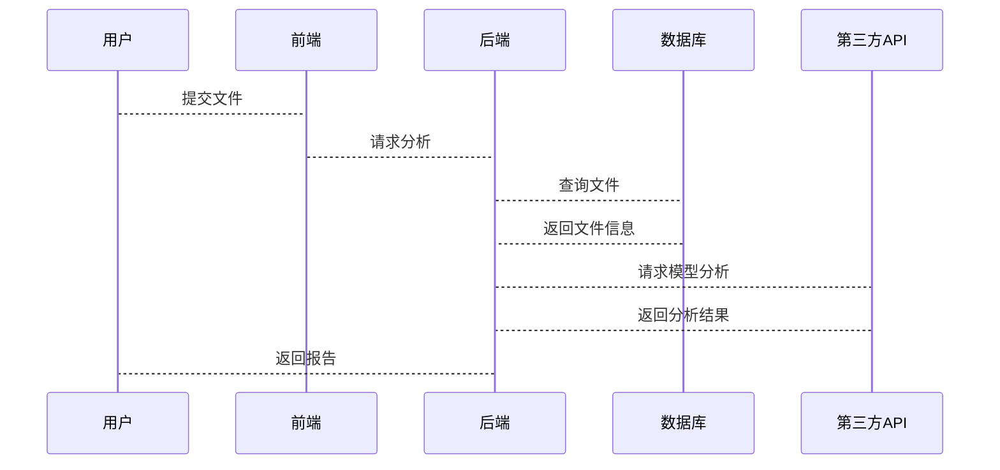

                 


# 企业估值中的AI驱动的自动化法律文件分析平台评估

> 关键词：企业估值，AI驱动，法律文件分析，自动化平台，深度学习

> 摘要：随着企业估值的重要性日益凸显，法律文件分析作为企业估值的关键环节，其效率和准确性对企业决策具有重要影响。本文探讨了AI驱动的自动化法律文件分析平台在企业估值中的应用，分析了其核心概念、算法原理、系统设计以及实际应用案例，为企业估值的智能化提供了新的思路和解决方案。

---

# 第1章: 企业估值与AI驱动法律文件分析平台概述

## 1.1 企业估值的背景与挑战
### 1.1.1 传统企业估值方法的局限性
传统的企业估值方法依赖于人工分析和经验判断，存在以下问题：
- 数据量大：企业涉及的法律文件（如合同、财务报表、合规文件等）种类繁多，人工分析效率低。
- 主观性高：分析结果受分析师主观判断影响，可能导致估值偏差。
- 时间成本高：传统方法需要大量时间进行数据收集和分析，难以满足快速决策的需求。

### 1.1.2 数字化与智能化对企业估值的影响
随着数字化转型的推进，企业估值需要更高效、更准确的工具。AI技术的引入，特别是自然语言处理（NLP）和深度学习技术，为法律文件分析提供了新的可能性。

### 1.1.3 法律文件在企业估值中的关键作用
法律文件（如合同、章程、合规文件等）是企业估值的重要依据。准确解读这些文件可以帮助评估企业的法律风险、财务状况和市场地位。

## 1.2 AI驱动法律文件分析的潜力
### 1.2.1 法律文件分析的复杂性
法律文件通常包含复杂的术语和结构，人工分析容易出错。AI可以通过自然语言处理技术自动提取关键信息，降低错误率。

### 1.2.2 AI技术在法律文件分析中的优势
- 高效性：AI可以快速处理大量法律文件，显著提高分析效率。
- 准确性：通过训练深度学习模型，AI可以准确识别法律术语和关键条款。
- 可扩展性：AI系统可以同时处理多种语言和格式的法律文件。

### 1.2.3 自动化平台对企业估值的推动作用
自动化法律文件分析平台可以将法律文件分析与企业估值模型无缝对接，提供实时、准确的估值支持。

## 1.3 本章小结
本章介绍了企业估值的背景和传统方法的局限性，分析了AI驱动法律文件分析的潜力及其在企业估值中的重要作用。

---

# 第2章: AI驱动法律文件分析的核心概念

## 2.1 法律文件分析平台的核心原理
### 2.1.1 文本挖掘与自然语言处理
文本挖掘（Text Mining）是从非结构化文本中提取有用信息的技术，而自然语言处理（NLP）则专注于理解文本的语义和语法结构。AI驱动的法律文件分析平台结合了这两者的技术。

### 2.1.2 法律术语与语义分析
法律文件中的术语具有特定的含义和语境，AI需要通过上下文理解这些术语的含义，并准确提取关键信息。

### 2.1.3 文档结构化与信息提取
法律文件通常具有固定的结构（如合同条款、财务报表等），AI可以通过结构化处理提取关键信息，如金额、日期、责任条款等。

## 2.2 AI驱动法律文件分析的特征对比
以下表格对比了传统法律分析和AI驱动分析的主要特征：

| 特征 | 传统法律分析 | AI驱动法律分析 |
|------|--------------|----------------|
| 效率 | 低效，依赖人工 | 高效，自动化处理 |
| 准确性 | 受主观因素影响 | 高度准确，基于大数据训练 |
| 成本 | 高，依赖专业人员 | 低，自动化减少人工成本 |
| 灵活性 | 有限，难以处理多种格式 | 高，支持多种语言和格式 |

## 2.3 法律文件分析的ER实体关系图
以下是法律文件分析的实体关系图：

```mermaid
erDiagram
    用户 {
        <属性> 用户ID : integer
        <属性> 用户名 : string
        <属性> 权限 : string
    }
    法律文件 {
        <属性> 文件ID : integer
        <属性> 文件类型 : string
        <属性> 文件内容 : string
    }
    分析结果 {
        <属性> 结果ID : integer
        <属性> 分析内容 : string
        <属性> 分析时间 : datetime
    }
    用户 --> 法律文件 : 提交文件
    法律文件 --> 分析结果 : 分析完成
```

## 2.4 本章小结
本章详细介绍了AI驱动法律文件分析的核心概念，包括文本挖掘、语义分析和文档结构化，并通过对比分析和ER图展示了其特点和优势。

---

# 第3章: AI驱动法律文件分析的算法原理

## 3.1 基于深度学习的文本分析模型
### 3.1.1 Transformer模型的原理
Transformer模型通过自注意力机制（Self-attention）捕获文本中的长距离依赖关系，适用于法律文件中的复杂语义分析。

### 3.1.2 BERT模型在法律文本中的应用
BERT（Bidirectional Encoder Representations from Transformers）是一种预训练的深度学习模型，可以用于法律文件中的语义理解、实体识别和关系抽取。

### 3.1.3 模型训练流程
1. 数据预处理：将法律文件中的文本分词、去除停用词。
2. 模型训练：使用标注数据训练BERT模型，使其能够识别法律术语和关键条款。
3. 模型优化：通过调整超参数（如学习率、批次大小）优化模型性能。

## 3.2 法律文本分析的预处理流程
### 3.2.1 文本清洗与标准化
- 去除特殊字符和空格。
- 统一文本格式（如大小写）。

### 3.2.2 分词与句法分析
- 分词：将文本分割成词语或短语。
- 句法分析：分析句子的语法结构，识别名词、动词等。

### 3.2.3 实体识别与链接
- 实体识别：识别法律文件中的关键实体（如公司名称、金额、日期）。
- 实体链接：将实体与外部知识库（如法律术语库）进行关联。

## 3.3 法律文件分析的流程图
以下是法律文件分析的流程图：



## 3.4 算法实现的Python代码示例
以下是使用BERT模型进行法律文本分类的Python代码示例：

```python
from transformers import BertTokenizer, BertModel
import torch

# 初始化BERT分词器和模型
tokenizer = BertTokenizer.from_pretrained('bert-base-uncased')
model = BertModel.from_pretrained('bert-base-uncased')

# 定义输入文本
text = "合同条款变更，需在30天内完成。"
# 分词
inputs = tokenizer(text, return_tensors='pt')
# 模型推理
outputs = model(**inputs)
# 提取隐藏层输出
hidden_states = outputs.last_hidden_state
```

## 3.5 本章小结
本章详细介绍了AI驱动法律文件分析的核心算法原理，包括Transformer模型、BERT模型的训练流程以及预处理流程，并通过流程图和代码示例展示了其实现过程。

---

# 第4章: 基于AI的法律文件分析数学模型

## 4.1 法律文件分析的数学模型
法律文件分析可以看作是一个文本分类问题，目标是将法律文件中的关键信息提取出来。以下是一个简单的文本分类模型：

$$ P(y|x) = \frac{e^{w_x}}{\sum_{i} e^{w_i}} $$

其中，$P(y|x)$表示给定文本$x$的类别$y$的概率，$w_x$是文本$x$的权重。

## 4.2 基于深度学习的法律文件分析模型
以下是一个基于Transformer的法律文件分析模型的数学公式：

$$ \text{Output} = \text{Self-attention}(Q, K, V) $$

其中，$Q$是查询向量，$K$是键向量，$V$是值向量。

## 4.3 模型优化与训练
通过交叉验证和超参数调整，可以优化模型的性能。以下是一个简单的优化流程：

1. 数据分割：将数据集分为训练集、验证集和测试集。
2. 模型训练：使用训练集训练模型。
3. 模型验证：在验证集上调整超参数。
4. 模型测试：在测试集上评估模型性能。

## 4.4 本章小结
本章详细介绍了法律文件分析的数学模型，包括文本分类模型和Transformer模型的数学公式，并通过优化流程展示了如何提高模型性能。

---

# 第5章: 系统分析与架构设计

## 5.1 项目场景介绍
本项目旨在开发一个AI驱动的法律文件分析平台，用于企业估值中的法律文件分析。平台的主要功能包括文件上传、信息提取、风险评估和估值报告生成。

## 5.2 系统功能设计
以下是系统功能设计的类图：



## 5.3 系统架构设计
以下是系统架构设计的架构图：


## 5.4 系统接口设计
以下是系统接口设计的接口图：



## 5.5 本章小结
本章详细介绍了AI驱动法律文件分析平台的系统架构设计，包括功能设计、架构设计和接口设计。

---

# 第6章: 项目实战

## 6.1 环境安装
以下是安装环境的代码示例：

```bash
pip install transformers torch mermaid4j
```

## 6.2 系统核心实现源代码
以下是系统核心实现的Python代码示例：

```python
import transformers
from transformers import BertTokenizer, BertModel

tokenizer = BertTokenizer.from_pretrained('bert-base-uncased')
model = BertModel.from_pretrained('bert-base-uncased')

def analyze_legal_document(text):
    inputs = tokenizer(text, return_tensors='pt')
    outputs = model(**inputs)
    return outputs.last_hidden_state

# 示例
text = "合同条款变更，需在30天内完成。"
result = analyze_legal_document(text)
print(result)
```

## 6.3 代码应用解读与分析
上述代码实现了法律文件的文本分析功能，通过BERT模型提取文本的隐藏层输出，用于后续的分类或聚类任务。

## 6.4 实际案例分析
以下是一个实际案例的分析流程：

1. 文件上传：用户上传一份合同文件。
2. 文本清洗：去除特殊字符和空格。
3. 分词：将文本分割成词语或短语。
4. 实体识别：识别合同中的关键实体（如公司名称、金额、日期）。
5. 语义分析：分析合同条款的含义和风险。
6. 估值报告生成：基于分析结果生成估值报告。

## 6.5 本章小结
本章通过实际案例展示了AI驱动法律文件分析平台的实现过程，包括环境安装、代码实现和案例分析。

---

# 第7章: 最佳实践与总结

## 7.1 最佳实践
1. 数据质量管理：确保训练数据的多样性和代表性。
2. 模型优化：通过交叉验证和超参数调整优化模型性能。
3. 系统设计：注重系统的可扩展性和可维护性。

## 7.2 小结
本文详细介绍了AI驱动法律文件分析平台在企业估值中的应用，从背景、核心概念、算法原理到系统设计和项目实战，为企业的智能化转型提供了新的思路和解决方案。

## 7.3 注意事项
- 数据隐私：确保法律文件的隐私性和安全性。
- 模型解释性：提高模型的可解释性，便于用户理解和信任。
- 持续优化：定期更新模型和优化系统，以应对新的挑战。

## 7.4 拓展阅读
- 《深度学习入门》
- 《自然语言处理实战》
- 《企业估值与风险管理》

---

# 作者：AI天才研究院/AI Genius Institute & 禅与计算机程序设计艺术 /Zen And The Art of Computer Programming

---

以上是《企业估值中的AI驱动的自动化法律文件分析平台评估》的技术博客文章的完整目录和内容框架，涵盖了从背景到实现的全过程，结合了技术深度和实际应用，为读者提供了全面的指导和参考。

