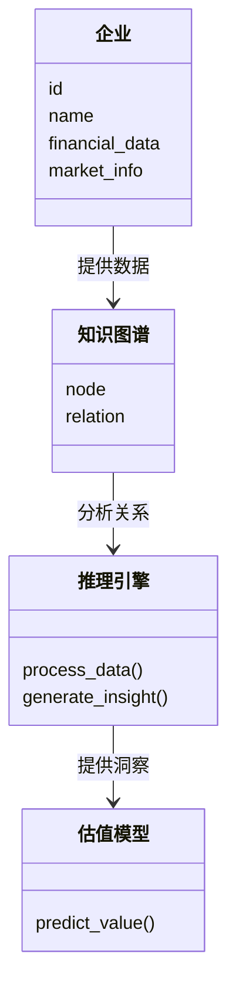
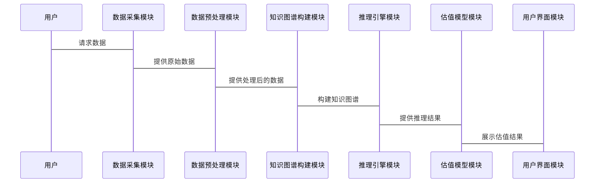

                 


# 企业估值中的AI驱动的自动化科学发现平台评估

## 关键词：企业估值，人工智能，自动化科学发现平台，算法原理，系统架构，项目实战

## 摘要：本文探讨了在企业估值过程中，AI驱动的自动化科学发现平台的评估方法。通过分析平台的核心概念、算法原理、系统架构以及项目实战，本文旨在为企业提供一种高效、智能的估值方法，利用AI技术提升科学发现的效率和准确性。

---

# 第1章: 企业估值与AI驱动的自动化科学发现平台背景

## 1.1 企业估值的重要性

### 1.1.1 企业估值的基本概念

企业估值是指对企业整体或部分价值的评估，是企业融资、并购、投资决策中的关键环节。传统的企业估值方法包括DCF模型、市盈率法、市净率法等，但这些方法依赖于大量假设和人工判断，存在主观性强、效率低下的问题。

### 1.1.2 传统企业估值方法的局限性

传统估值方法依赖于财务数据和市场假设，难以捕捉企业隐性价值和动态变化。此外，人工分析耗时长，容易受到人为因素影响，导致估值结果不够准确。

### 1.1.3 AI技术在企业估值中的潜力

AI技术可以通过分析大量非结构化数据（如文本、图像、社交媒体数据）和结构化数据，提取隐性信息，帮助提升估值的准确性和效率。AI驱动的自动化科学发现平台能够实时更新数据，提供动态估值。

---

## 1.2 自动化科学发现平台的定义与特点

### 1.2.1 自动化科学发现平台的定义

自动化科学发现平台是一种利用AI技术自动分析数据、发现知识和生成洞察的工具。它能够从海量数据中提取有价值的信息，帮助用户快速获得科学发现。

### 1.2.2 自动化科学发现平台的核心特点

| 特性 | 描述 |
|------|------|
| 自动化 | 无需人工干预，自动完成数据处理和分析 |
| 高效性 | 快速处理大量数据，提升分析效率 |
| 智能性 | 利用机器学习和深度学习技术，发现数据中的隐性关系 |
| 可扩展性 | 能够处理不同规模和类型的数据 |

### 1.2.3 自动化科学发现平台与传统科学发现方法的区别

自动化科学发现平台通过AI技术实现了科学发现的自动化和智能化，与传统方法相比，具有更高的效率和准确性。

---

## 1.3 AI驱动的自动化科学发现平台在企业估值中的应用

### 1.3.1 AI驱动的自动化科学发现平台的背景

随着数据量的爆炸式增长和AI技术的快速发展，自动化科学发现平台逐渐成为企业估值的重要工具。

### 1.3.2 企业估值中科学发现平台的需求

企业估值需要综合分析多维度数据，传统方法难以满足需求，而自动化科学发现平台能够提供全面、动态的估值支持。

### 1.3.3 AI驱动的自动化科学发现平台的优势

AI驱动的自动化科学发现平台能够实时更新数据，提供动态估值，帮助企业在复杂市场环境中做出快速决策。

---

## 1.4 本章小结

本章介绍了企业估值的重要性，分析了传统估值方法的局限性，并提出了AI驱动的自动化科学发现平台的概念及其在企业估值中的应用优势。

---

# 第2章: 自动化科学发现平台的原理与机制

## 2.1 自动化科学发现平台的原理

### 2.1.1 数据采集与处理

自动化科学发现平台需要从多种数据源（如数据库、文本文件、社交媒体）采集数据，并进行清洗、预处理和特征提取。

### 2.1.2 知识表示与推理

通过知识图谱和图论算法，将数据转化为结构化的知识表示，并进行逻辑推理。

### 2.1.3 自动化推理与发现

利用机器学习和深度学习算法，从数据中发现新的知识和模式。

---

## 2.2 AI驱动的核心算法

### 2.2.1 机器学习算法

机器学习算法（如随机森林、支持向量机）用于分类和回归任务，帮助预测企业价值。

### 2.2.2 自然语言处理算法

自然语言处理算法（如BERT、GPT）用于分析文本数据，提取情感倾向和关键词。

### 2.2.3 图论与知识图谱算法

图论算法用于构建和分析知识图谱，发现数据之间的关联关系。

---

## 2.3 平台的核心要素与关系

### 2.3.1 数据层

数据层包括结构化数据和非结构化数据，是平台的基础。

### 2.3.2 知识层

知识层通过知识图谱表示数据之间的关系。

### 2.3.3 推理层

推理层利用逻辑推理和机器学习算法，从数据中发现知识。

### 2.3.4 应用层

应用层将发现的知识应用于企业估值等实际场景。

---

## 2.4 本章小结

本章详细介绍了自动化科学发现平台的原理和核心算法，并分析了平台的核心要素及其关系。

---

# 第3章: 自动化科学发现平台的数学模型与算法

## 3.1 知识表示与推理的数学模型

### 3.1.1 知识图谱的表示

知识图谱可以用图论中的节点和边表示，例如：

- 节点：企业、行业
- 边：竞争关系、上下游关系

### 3.1.2 图论模型在知识推理中的应用

图论模型（如PageRank算法）用于评估节点的重要性。

---

## 3.2 自动化推理算法

### 3.2.1 基于规则的推理算法

基于规则的推理算法通过预定义的规则进行推理，例如：

$$ \text{如果 } A \rightarrow B \text{，且 } B \rightarrow C \text{，则 } A \rightarrow C $$

### 3.2.2 基于机器学习的推理算法

基于机器学习的推理算法（如逻辑回归）用于分类任务。

### 3.2.3 基于图神经网络的推理算法

图神经网络（如GAT）用于处理图结构数据，发现隐藏关系。

---

## 3.3 算法的数学公式与实现

### 3.3.1 知识图谱表示的数学公式

知识图谱可以用邻接矩阵表示：

$$ A_{i,j} = 1 \text{ 如果节点 } i \text{ 和节点 } j \text{ 有边相连，否则 } 0 $$

### 3.3.2 图神经网络的数学公式

图神经网络的节点表示公式为：

$$ h_i^{(l+1)} = f(h_i^{(l)}, \{h_j^{(l)} | j \in N(i)\}) $$

其中，$N(i)$表示节点$i$的邻居节点集合。

### 3.3.3 推理算法的数学公式

逻辑回归的损失函数为：

$$ L = -\sum_{i=1}^{n} [y_i \ln p_i + (1 - y_i) \ln (1 - p_i)] $$

其中，$p_i$是预测概率，$y_i$是真实标签。

---

## 3.4 本章小结

本章通过数学公式和算法实现，详细介绍了自动化科学发现平台的核心算法及其在企业估值中的应用。

---

# 第4章: 企业估值中的自动化科学发现平台系统分析

## 4.1 问题场景介绍

企业在进行估值时，需要综合分析财务数据、市场信息、行业趋势等多种因素。传统方法难以处理海量数据，而自动化科学发现平台能够提供高效、准确的解决方案。

---

## 4.2 系统功能设计

### 4.2.1 领域模型

领域模型通过类图描述系统中的各个实体及其关系。以下是领域模型的mermaid类图：



### 4.2.2 系统架构设计

以下是系统架构的mermaid图：

```mermaid
container 数据层 {
    数据采集模块
    数据预处理模块
}
container 知识层 {
    知识图谱构建模块
}
container 推理层 {
    推理引擎模块
}
container 应用层 {
    估值模型模块
    用户界面模块
}
```

### 4.2.3 系统接口设计

系统接口主要分为数据接口和用户接口。数据接口用于与其他系统的数据交互，用户接口用于展示估值结果和操作界面。

### 4.2.4 系统交互设计

以下是系统交互的mermaid序列图：



---

## 4.3 本章小结

本章从系统分析的角度，详细描述了自动化科学发现平台的系统功能设计、架构设计和交互设计。

---

# 第5章: 项目实战

## 5.1 环境安装

### 5.1.1 安装Python和相关库

安装Python和以下库：

```bash
pip install numpy
pip install pandas
pip install networkx
pip install sklearn
```

### 5.1.2 安装Jupyter Notebook

安装Jupyter Notebook用于数据可视化和算法实现：

```bash
pip install jupyter
```

---

## 5.2 系统核心实现源代码

### 5.2.1 数据处理代码

```python
import pandas as pd
import numpy as np

def load_data():
    # 加载数据
    data = pd.read_csv('企业数据.csv')
    return data

def preprocess_data(data):
    # 数据预处理
    data.dropna(inplace=True)
    return data
```

### 5.2.2 知识图谱构建代码

```python
import networkx as nx

def build_knowledge_graph(data):
    G = nx.Graph()
    for index, row in data.iterrows():
        G.add_node(row['企业名称'])
        G.add_node(row['行业名称'])
        G.add_edge(row['企业名称'], row['行业名称'])
    return G
```

### 5.2.3 推理引擎代码

```python
from sklearn.linear_model import LogisticRegression

def train_model(X, y):
    # 训练逻辑回归模型
    model = LogisticRegression()
    model.fit(X, y)
    return model
```

---

## 5.3 代码应用解读与分析

### 5.3.1 数据处理

数据处理代码加载并清洗数据，去除缺失值。

### 5.3.2 知识图谱构建

知识图谱构建代码通过构建企业与行业的关系图，展示企业之间的关联。

### 5.3.3 模型训练

模型训练代码使用逻辑回归算法，训练企业估值模型。

---

## 5.4 实际案例分析

以某行业为例，展示如何利用自动化科学发现平台进行企业估值。

---

## 5.5 项目小结

本章通过实际项目实战，详细展示了自动化科学发现平台的实现过程和应用案例。

---

# 第6章: 总结与展望

## 6.1 最佳实践 tips

- 数据质量是关键，确保数据的准确性和完整性。
- 模型的可解释性是重要的，确保用户能够理解模型的决策过程。
- 定期更新模型和数据，保持平台的实时性和准确性。

---

## 6.2 小结

本文详细介绍了AI驱动的自动化科学发现平台在企业估值中的应用，通过理论分析和实践案例，展示了平台的优势和潜力。

---

## 6.3 注意事项

- 数据隐私和安全问题需要注意。
- 模型的泛化能力和鲁棒性需要进一步优化。

---

## 6.4 拓展阅读

- 《机器学习实战》
- 《深度学习》
- 《知识图谱入门与实践》

---

# 作者：AI天才研究院/AI Genius Institute & 禅与计算机程序设计艺术 /Zen And The Art of Computer Programming

---

以上是文章的完整正文部分，按照目录结构展开，详细讲解了企业估值中的AI驱动的自动化科学发现平台的相关内容，包括背景、原理、算法、系统架构和项目实战等部分。

