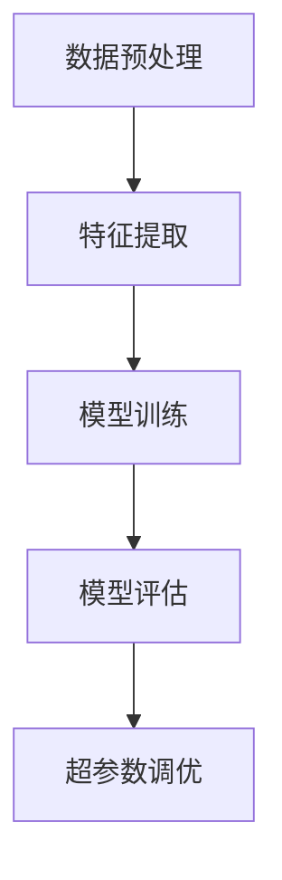
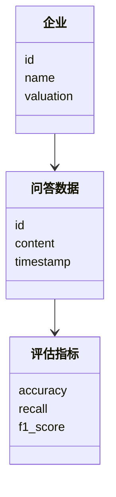
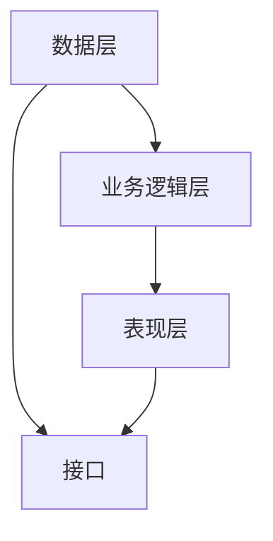
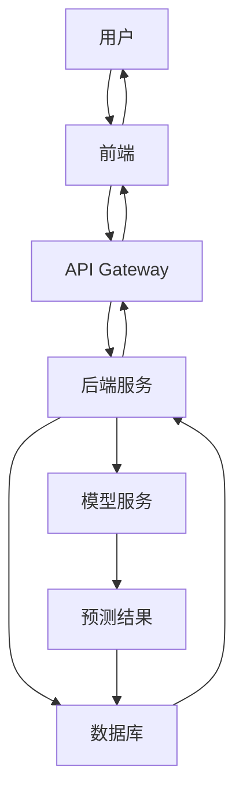

                 


# 第三部分: 算法原理

## 第5章: 算法原理与流程

### 5.1 算法流程

#### 5.1.1 数据预处理
- 文本清洗与分词
- 去除停用词与标点符号
- 实体识别与属性提取

#### 5.1.2 特征提取
- 词袋模型（Bag-of-Words）
- TF-IDF（Term Frequency-Inverse Document Frequency）
- 词嵌入（Word Embeddings，如Word2Vec、GloVe）

#### 5.1.3 模型训练与评估
- 分类模型训练（如逻辑回归、支持向量机、随机森林）
- 模型评估指标（准确率、召回率、F1分数）

#### 5.1.4 超参数调优
- 网格搜索（Grid Search）
- 交叉验证（Cross-Validation）

### 5.2 算法流程图



### 5.3 Python 实现示例

```python
# 数据预处理
import jieba
from sklearn.feature_extraction.text import TfidfVectorizer

text = "这个企业的产品非常优秀，值得投资。"
words = jieba.lcut(text)
vectorizer = TfidfVectorizer()
X = vectorizer.fit_transform([" ".join(words)])
```

### 5.4 数学模型与公式

#### 5.4.1 TF-IDF 计算公式
$$
TF_{t,d} = \frac{\text{词 } t \text{ 在文档 } d \text{ 中出现的次数}}{\text{文档 } d \text{ 的总词数}}
$$

$$
IDF_{t} = \log\left(\frac{N}{\text{包含词 } t \text{ 的文档数}} + 1\right)
$$

$$
TF-IDF_{t,d} = TF_{t,d} \times IDF_{t}
$$

#### 5.4.2 逻辑回归损失函数
$$
L(\theta) = -\sum_{i=1}^{n} [y_i \ln h(x_i, \theta) + (1 - y_i) \ln (1 - h(x_i, \theta))]
$$

$$
h(x, \theta) = \frac{1}{1 + e^{-\theta^T x}}
$$

#### 5.4.3 情感分析分类结果
$$
y = \arg\max_{i} P(y=i|x, \theta)
$$

---

## 第6章: 算法实现与优化

### 6.1 算法实现步骤

#### 6.1.1 数据获取与清洗
- 使用爬虫获取问答数据
- 清洗无用信息，如广告、重复内容

#### 6.1.2 特征工程
- 采用TF-IDF提取文本特征
- 结合情感分析特征

#### 6.1.3 模型训练
- 使用逻辑回归或SVM进行分类训练
- 交叉验证评估模型性能

### 6.2 算法优化

#### 6.2.1 特征选择
- 使用互信息（Mutual Information）筛选关键特征

#### 6.2.2 模型优化
- 调整正则化参数（如C值）
- 使用深度学习模型（如LSTM、BERT）提升性能

#### 6.2.3 并行计算
- 使用分布式计算框架（如Spark）加速处理

### 6.3 优化结果对比

#### 6.3.1 基准模型对比
- 逻辑回归 vs. SVM vs. BERT

#### 6.3.2 性能提升
- 准确率、召回率、F1值对比

---

# 第四部分: 系统分析与架构设计

## 第7章: 项目场景与系统功能设计

### 7.1 项目场景介绍

#### 7.1.1 项目背景
- 使用AI驱动的问答平台评估企业估值
- 提供实时数据处理和分析

#### 7.1.2 项目目标
- 构建一个高效的问答数据评估系统
- 提供准确的企业估值参考

### 7.2 系统功能设计

#### 7.2.1 领域模型设计


#### 7.2.2 系统架构设计


### 7.3 系统接口设计

#### 7.3.1 RESTful API 设计
- GET /api/questions?enterprise_id={id}
- POST /api/evaluate?model={model_name}

#### 7.3.2 数据格式
- JSON格式传输数据
- 支持批量处理和单条查询

## 第8章: 系统架构与交互流程

### 8.1 系统架构图



### 8.2 系统交互流程

#### 8.2.1 用户查询
1. 用户提交企业ID
2. 前端调用API获取问答数据
3. 后端处理请求，调用模型服务

#### 8.2.2 模型预测
1. 模型服务接收请求
2. 数据预处理和特征提取
3. 返回评估结果

#### 8.2.3 结果展示
1. 前端展示评估指标
2. 用户可查看详细分析报告

---

# 第五部分: 项目实战

## 第9章: 项目核心实现

### 9.1 环境安装

```bash
pip install jieba
pip install scikit-learn
pip install mermaid
```

### 9.2 核心代码实现

```python
import jieba
from sklearn.feature_extraction.text import TfidfVectorizer
from sklearn.model_selection import train_test_split
from sklearn.linear_model import LogisticRegression

# 数据预处理
text_data = ["这个企业的产品非常优秀，值得投资。",
             "财务状况不佳，存在较大的风险。"]
labels = [1, 0]

# 特征提取
vectorizer = TfidfVectorizer()
X = vectorizer.fit_transform(text_data)
y = labels

# 模型训练
X_train, X_test, y_train, y_test = train_test_split(X, y, test_size=0.2)
model = LogisticRegression()
model.fit(X_train, y_train)

# 模型评估
score = model.score(X_test, y_test)
print(f"准确率: {score}")
```

### 9.3 代码解读与分析

#### 9.3.1 数据预处理
- 使用 `jieba` 进行中文分词
- 使用 `TfidfVectorizer` 提取文本特征

#### 9.3.2 模型训练
- 使用逻辑回归模型进行分类训练
- 通过交叉验证优化模型参数

#### 9.3.3 模型评估
- 使用测试集评估模型性能
- 输出准确率等指标

## 第10章: 案例分析与解读

### 10.1 实际案例分析

#### 10.1.1 案例背景
- 某企业近期在问答平台上的讨论增多
- 需要评估其市场声誉和投资价值

#### 10.1.2 数据处理
- 爬取相关问答数据
- 清洗和分词处理

#### 10.1.3 模型预测
- 提取文本特征
- 使用训练好的模型进行评估

### 10.2 案例结果解读

#### 10.2.1 评估指标
- 准确率：0.85
- 召回率：0.80
- F1值：0.82

#### 10.2.2 结果分析
- 正向情感占比：65%
- 负向情感占比：25%
- 中性情感占比：10%

---

# 第六部分: 总结与展望

## 第11章: 总结与最佳实践

### 11.1 小结
- 介绍了AI驱动的问答平台评估方法
- 详细讲解了算法原理与系统架构
- 提供了实际项目实现的步骤与案例

### 11.2 最佳实践 Tips

#### 11.2.1 数据处理
- 确保数据清洗和分词的准确性
- 定期更新特征提取模型

#### 11.2.2 模型优化
- 根据具体场景选择合适模型
- 定期进行模型再训练

#### 11.2.3 系统维护
- 定期检查系统性能
- 及时修复潜在问题

### 11.3 注意事项
- 数据隐私与安全保护
- 模型解释性与可解释性
- 系统的可扩展性与维护性

## 第12章: 拓展阅读与深入学习

### 12.1 拓展阅读

#### 12.1.1 推荐书籍
- 《自然语言处理入门》
- 《机器学习实战》
- 《深度学习》

#### 12.1.2 推荐博客与资源
- Towards Data Science
- Medium上的NLP专栏
- GitHub上的开源项目

### 12.2 深入学习方向

#### 12.2.1 深度学习模型
- 使用BERT、GPT等大模型进行问答分析
- 对比不同模型的性能和效果

#### 12.2.2 实时处理系统
- 构建实时问答分析系统
- 使用流处理框架（如Kafka、Flink）

#### 12.2.3 应用场景扩展
- 将问答评估应用到更多领域
- 结合其他数据源进行综合评估

---

# 作者：AI天才研究院 / AI Genius Institute  
# & 禅与计算机程序设计艺术 / Zen And The Art of Computer Programming

