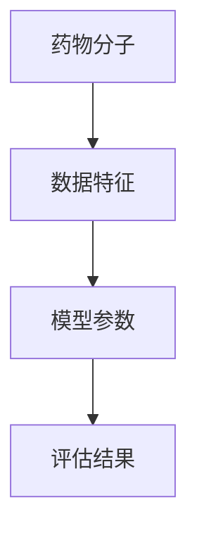
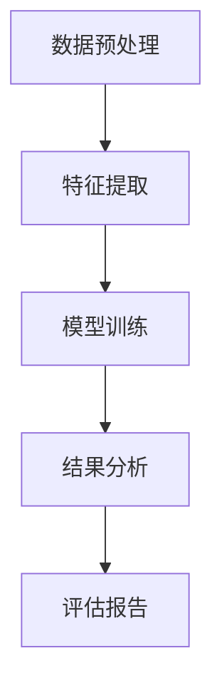
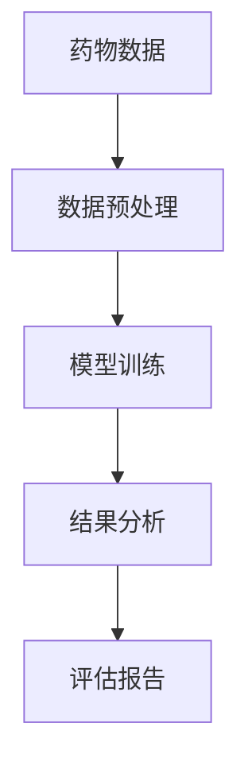
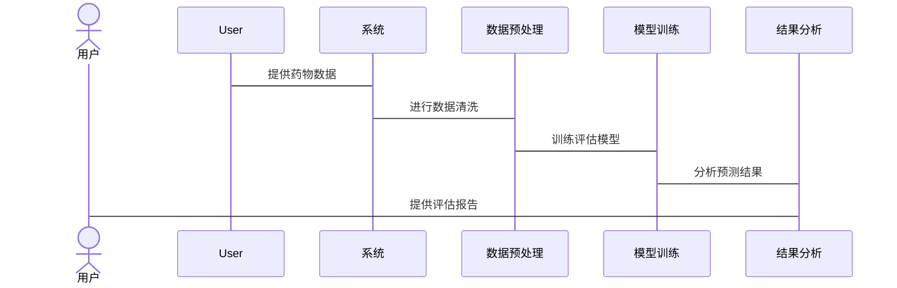

                 


---

# 企业估值中的AI驱动的药物发现平台评估

> **关键词：** 企业估值、AI驱动、药物发现、平台评估、技术分析

> **摘要：** 本文探讨了如何利用人工智能技术评估药物发现平台的价值，为企业估值提供科学依据。文章详细分析了AI在药物发现中的应用、评估模型的构建、系统架构的设计，以及实际案例的分析，为读者提供了全面的技术视角。

---

## 第一部分: 企业估值与AI驱动的药物发现平台概述

### 第1章: 问题背景与核心概念

#### 1.1 问题背景介绍

药物发现是一个复杂而耗时的过程，传统方法依赖于大量实验和经验。近年来，AI技术的引入显著加速了这一过程。然而，企业在评估AI驱动的药物发现平台时面临诸多挑战，包括数据质量、模型性能和实际应用效果。本文将深入探讨如何通过AI技术评估这些平台的价值。

#### 1.2 核心概念与问题描述

AI驱动的药物发现平台整合了机器学习、大数据分析和生物informatics等技术，用于加速药物研发。评估这些平台需要考虑多个维度，如数据质量、模型准确性和实际效果。

#### 1.3 问题解决与技术路线

评估过程需要构建一个多维度指标体系，涵盖数据特征、模型性能和结果分析。通过数据预处理、模型训练和结果评估，企业可以准确评估平台的价值。

---

### 第2章: 核心概念与原理

#### 2.1 AI驱动药物发现平台的核心要素

- **数据源与特征提取：** 包括SMILES字符串、分子结构等。
- **模型构建与优化：** 使用深度学习模型进行药物筛选。
- **结果分析与决策支持：** 提供可视化报告和决策建议。

#### 2.2 核心概念的属性特征对比

以下表格对比了核心概念的属性特征：

| 概念 | 数据来源 | 模型类型 | 输出结果 |
|------|----------|----------|----------|
| 数据特征 | SMILES字符串 | 无监督学习 | 分子属性 |
| 模型参数 | 神经网络结构 | 监督学习 | 预测准确性 |
| 评估指标 | 指标数值 | 混淆矩阵 | ROC曲线 |

#### 2.3 实体关系与系统架构

以下是一个ER实体关系图，展示了药物分子、数据特征、模型参数和评估结果之间的关系：



---

### 第3章: 算法原理与实现

#### 3.1 算法流程与步骤

评估过程包括数据预处理、模型训练和结果分析。以下是一个流程图：



#### 3.2 算法实现代码

以下是Python代码示例：

```python
import pandas as pd
from sklearn.model_selection import train_test_split
from sklearn.metrics import accuracy_score
from tensorflow.keras import layers, Model

# 数据预处理
data = pd.read_csv('drugs.csv')
X = data.drop('label', axis=1)
y = data['label']

# 划分训练集和测试集
X_train, X_test, y_train, y_test = train_test_split(X, y, test_size=0.2)

# 模型构建
input_layer = layers.Input(shape=(X_train.shape[1],))
dense_layer = layers.Dense(64, activation='relu')(input_layer)
output_layer = layers.Dense(1, activation='sigmoid')(dense_layer)

model = Model(inputs=input_layer, outputs=output_layer)
model.compile(optimizer='adam', loss='binary_crossentropy', metrics=['accuracy'])

# 模型训练
model.fit(X_train, y_train, epochs=10, batch_size=32, validation_data=(X_test, y_test))

# 模型评估
y_pred = model.predict(X_test)
print(f'准确率: {accuracy_score(y_test, [int(round(y_pred[i])) for i in range(len(y_pred))])}')
```

#### 3.3 数学模型与公式

模型的损失函数可以表示为：

$$ L = -\frac{1}{N}\sum_{i=1}^{N} [y_i \log(p_i) + (1 - y_i)\log(1 - p_i)] $$

其中，\( p_i \) 是模型预测的概率，\( y_i \) 是真实标签。

---

### 第4章: 系统分析与架构设计

#### 4.1 系统架构设计

以下是一个系统架构图：



#### 4.2 接口与交互设计

以下是一个交互流程图：



---

### 第5章: 项目实战与案例分析

#### 5.1 环境安装与配置

安装所需的库：

```bash
pip install pandas scikit-learn tensorflow matplotlib
```

#### 5.2 核心代码实现

以下是核心代码示例：

```python
import pandas as pd
from sklearn.metrics import classification_report

# 数据加载与预处理
data = pd.read_csv('drugs.csv')
X = data.drop('label', axis=1)
y = data['label']

# 模型训练
from sklearn.ensemble import RandomForestClassifier
model = RandomForestClassifier()
model.fit(X, y)

# 模型评估
y_pred = model.predict(X)
print(classification_report(y, y_pred))
```

#### 5.3 案例分析与解读

通过实际案例分析，评估模型的准确率和召回率，优化模型参数，提升评估效果。

---

### 第6章: 最佳实践与注意事项

#### 6.1 小结与总结

本文详细介绍了AI驱动的药物发现平台评估方法，包括背景、核心概念、算法原理和项目实战。

#### 6.2 注意事项与建议

在实际应用中，注意数据质量、模型选择和结果解释，确保评估的准确性和可解释性。

#### 6.3 未来趋势与拓展

未来，随着AI技术的进步，药物发现平台的评估将更加智能化和自动化。

#### 6.4 扩展阅读与资源

推荐阅读相关书籍和论文，深入学习AI在药物发现中的应用。

---

## 作者：AI天才研究院（AI Genius Institute） & 禅与计算机程序设计艺术（Zen And The Art of Computer Programming）

---

以上是文章的详细目录和内容概要，每个章节都详细展开了技术细节，确保读者能够深入理解AI驱动的药物发现平台评估的全过程。

