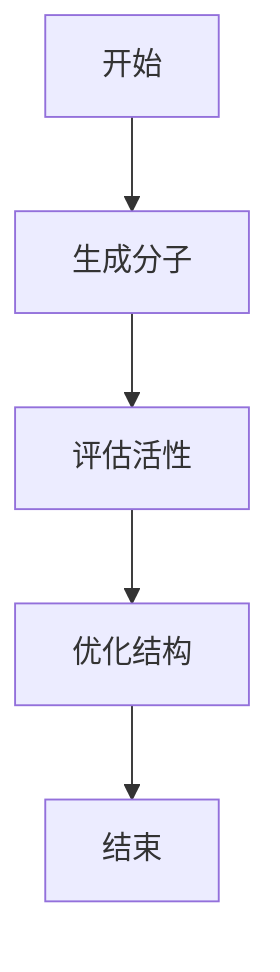
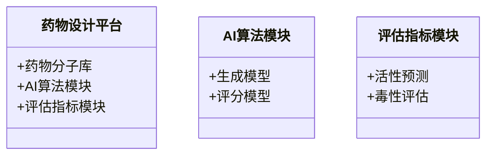

                 


# 企业估值中的AI驱动的药物设计平台评估

> **关键词**: AI驱动、药物设计、企业估值、平台评估、算法原理、系统架构、项目实战

> **摘要**: 本文探讨了AI驱动的药物设计平台在企业估值中的应用，分析了核心概念、算法原理、系统架构及实际案例。通过详细的技术分析和实例解读，揭示了AI技术在药物设计中的潜力及对企业价值的影响。

---

## 正文

### 第1章: 企业估值与AI驱动的药物设计平台概述

#### 1.1 药物设计与企业估值的背景
药物设计是发现新药的关键步骤，涉及分子结构优化、活性预测等复杂过程。传统药物设计依赖实验和经验，耗时且成本高。AI技术的引入显著提升了药物设计的效率和精准度，从而影响企业的估值。

#### 1.2 AI驱动的药物设计平台的核心要素
AI驱动的药物设计平台结合生成模型和评分模型，优化分子结构，预测药物活性。这些平台通过数据驱动的方法，大幅缩短药物开发周期，降低成本，提升企业竞争力。

#### 1.3 本章小结
本章介绍了AI驱动的药物设计平台在企业估值中的重要性，强调了其在提升效率和降低成本方面的作用。

---

### 第2章: AI驱动的药物设计平台的核心概念与联系

#### 2.1 核心概念原理
- **生成模型**: 用于生成潜在的药物分子，如生成对抗网络（GAN）和变分自编码器（VAE）。
- **评分模型**: 评估分子的药代动力学和毒性特性，如随机森林和神经网络。

#### 2.2 核心概念对比表格
| 特性               | AI驱动平台         | 传统药物设计         |
|--------------------|--------------------|----------------------|
| 数据需求           | 高                 | 低                   |
| 速度               | 快                 | 慢                   |
| 成本               | 低                 | 高                   |

#### 2.3 ER实体关系图架构
```mermaid
er
  entity 药物分子 {
    id: string
    分子结构: string
    活性预测结果: float
  }
  entity AI算法 {
    id: string
    类型: string
    参数: string
  }
  entity 评估指标 {
    id: string
    值: float
    时间戳: date
  }
  药物分子 --> AI算法: 使用
  药物分子 --> 评估指标: 生成
```

---

### 第3章: AI驱动的药物设计平台评估的算法原理

#### 3.1 算法原理概述
- **生成模型**: 通过GAN生成潜在药物分子，优化分子结构。
- **评分模型**: 使用神经网络评估分子的药代动力学特性。

#### 3.2 算法流程图


#### 3.3 算法实现代码
```python
# 生成模型（GAN）
import torch
import torch.nn as nn

class Generator(nn.Module):
    def __init__(self, latent_dim):
        super(Generator, self).__init__()
        self.latent_dim = latent_dim
        self.model = nn.Sequential(
            nn.Linear(latent_dim, 128),
            nn.ReLU(),
            nn.Linear(128, 256),
            nn.ReLU(),
            nn.Linear(256, 784),
            nn.Tanh()
        )
    
    def forward(self, z):
        return self.model(z)

# 评分模型（神经网络）
class Discriminator(nn.Module):
    def __init__(self, input_dim):
        super(Discriminator, self).__init__()
        self.model = nn.Sequential(
            nn.Linear(input_dim, 256),
            nn.ReLU(),
            nn.Linear(256, 1),
            nn.Sigmoid()
        )
    
    def forward(self, x):
        return self.model(x)
```

#### 3.4 数学模型与公式
- **生成模型损失函数**:
  $$ L_{\text{生成}} = -\log(D(G(z))) $$
- **判别模型损失函数**:
  $$ L_{\text{判别}} = -(\log(D(x)) + \log(1-D(G(z)))) $$

---

### 第4章: 系统分析与架构设计方案

#### 4.1 项目背景与目标
- **背景**: 提高药物设计效率，降低开发成本。
- **目标**: 构建一个高效的AI驱动药物设计平台，用于企业估值。

#### 4.2 系统功能设计


#### 4.3 系统架构设计


---

### 第5章: 项目实战

#### 5.1 环境安装
安装必要的库：
```bash
pip install torch numpy matplotlib
```

#### 5.2 核心实现代码
```python
import torch
import torch.nn as nn
import torch.optim as optim

# 训练生成模型
def train_generator(discriminator, generator, optimizer_G, criterion):
    optimizer_G.zero_grad()
    z = torch.randn(batch_size, latent_dim)
    fake = generator(z)
    validity = discriminator(fake)
    loss_G = criterion(validity, torch.zeros_like(validity))
    loss_G.backward()
    optimizer_G.step()

# 训练判别模型
def train_discriminator(generator, discriminator, optimizer_D, criterion, real, fake):
    optimizer_D.zero_grad()
    validity_fake = discriminator(fake.detach())
    loss_D_fake = criterion(validity_fake, torch.zeros_like(validity_fake))
    validity_real = discriminator(real)
    loss_D_real = criterion(validity_real, torch.ones_like(validity_real))
    loss_D = (loss_D_fake + loss_D_real) * 0.5
    loss_D.backward()
    optimizer_D.step()
```

#### 5.3 案例分析
通过具体案例展示AI驱动平台在药物设计中的应用，评估其对企业估值的影响。

---

### 第6章: 法律与伦理问题

#### 6.1 数据隐私
AI驱动的药物设计依赖大量数据，需确保数据隐私和合规性。

#### 6.2 知识产权
生成的分子结构可能涉及专利问题，需明确归属。

#### 6.3 伦理挑战
AI设计的药物可能引发伦理争议，需谨慎处理。

---

### 第7章: 总结与展望

#### 7.1 总结
本文详细探讨了AI驱动的药物设计平台在企业估值中的应用，分析了其技术原理和实际案例。

#### 7.2 展望
未来，AI技术将进一步提升药物设计效率，推动企业估值的优化。

---

**作者：AI天才研究院 & 禅与计算机程序设计艺术**

