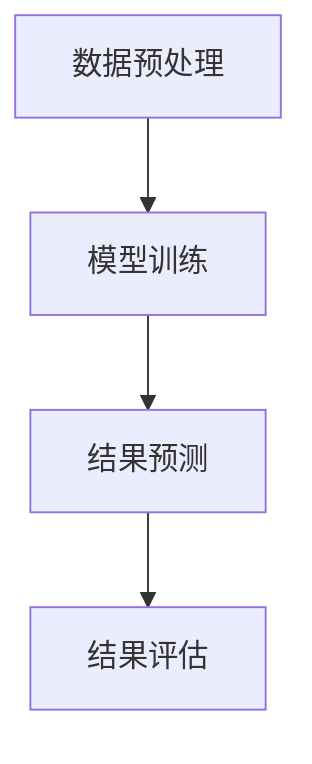
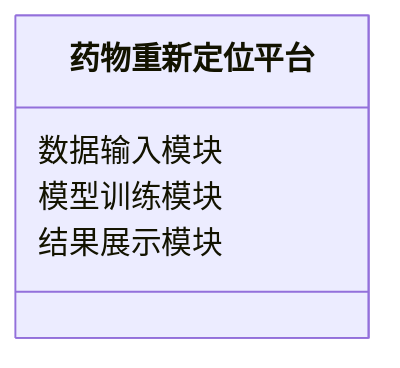
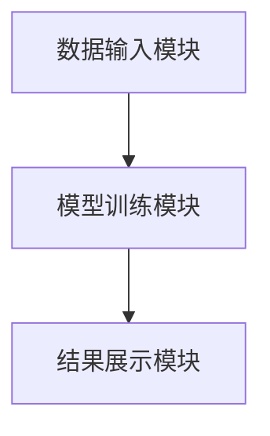
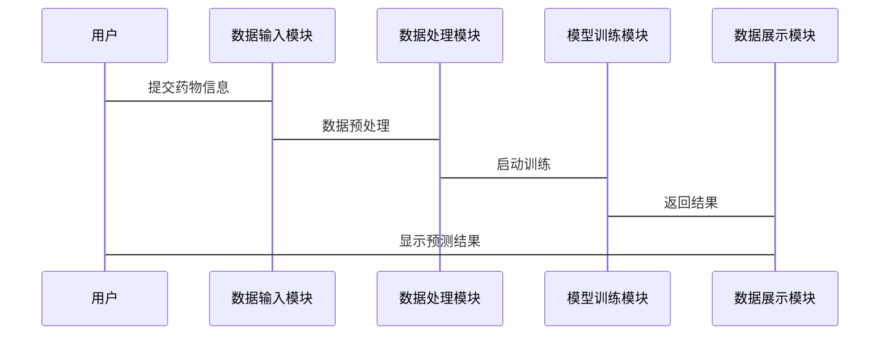

                 


# 企业估值中的AI驱动的药物重新定位平台评估

> 关键词：企业估值，AI驱动，药物重新定位，平台评估，药物研发，人工智能

> 摘要：本文探讨了AI驱动的药物重新定位平台在企业估值中的应用，分析了其核心算法、系统架构和项目实战，旨在为企业提供科学的评估方法，优化药物研发流程，提升企业竞争力。

---

# 第一部分: 企业估值中的AI驱动的药物重新定位平台评估背景介绍

## 第1章: 药物重新定位的背景与意义

### 1.1 药物重新定位的定义与背景

#### 1.1.1 药物重新定位的定义
药物重新定位（Drug Repositioning）是指将已批准的药物用于新的适应症或疾病治疗的过程。这一过程通过挖掘现有药物的潜在新用途，缩短研发周期，降低研发成本。

#### 1.1.2 药物重新定位的背景与现状
传统新药研发周期长、成本高，AI技术的应用为药物重新定位提供了新思路。AI可以通过分析大量数据，发现药物的新用途，提高研发效率。

#### 1.1.3 药物重新定位的挑战与机遇
挑战包括数据多样性、模型准确性等问题；机遇在于通过AI技术快速筛选潜在药物，降低研发风险。

### 1.2 AI在药物重新定位中的作用

#### 1.2.1 AI技术在药物研发中的应用
AI技术广泛应用于药物发现的各个环节，包括分子筛选、靶点识别和临床试验设计。

#### 1.2.2 AI驱动药物重新定位的优势
AI能够快速分析大量数据，识别药物与疾病之间的潜在关联，提高药物重新定位的效率和准确性。

#### 1.2.3 AI在药物重新定位中的具体应用场景
AI用于预测药物的作用机制，识别药物的潜在适应症，优化药物剂量和给药方案。

## 第2章: 药物重新定位平台评估的意义

### 2.1 药物重新定位平台的定义与目标

#### 2.1.1 药物重新定位平台的定义
药物重新定位平台是一个基于AI的系统，用于评估和预测药物的潜在新适应症。

#### 2.1.2 药物重新定位平台的目标
目标是通过数据分析和模型构建，辅助研究人员发现药物的新用途，优化研发流程。

#### 2.1.3 药物重新定位平台的核心功能
包括数据采集与处理、模型构建与训练、评估与优化等功能。

### 2.2 药物重新定位平台评估的重要性

#### 2.2.1 评估在药物研发中的作用
评估帮助确认药物重新定位的可行性，降低研发失败的风险。

#### 2.2.2 评估在企业估值中的意义
通过评估优化研发流程，降低研发成本，提升企业市场竞争力。

#### 2.2.3 评估在优化药物重新定位过程中的价值
评估帮助发现高潜力药物，提高研发效率，加快药物上市速度。

## 第3章: AI驱动的药物重新定位平台评估框架

### 3.1 评估框架的总体结构

#### 3.1.1 数据采集与处理模块
数据采集包括公开数据库、文献数据等，处理过程涉及数据清洗和特征提取。

#### 3.1.2 模型构建与训练模块
基于机器学习算法，构建药物与疾病关联模型，训练模型以提高预测准确性。

#### 3.1.3 评估与优化模块
通过评估指标优化模型，确保评估结果的准确性和可靠性。

### 3.2 评估框架的核心要素

#### 3.2.1 数据来源与预处理
数据来源包括公共数据库、文献挖掘等，预处理包括去重、标准化等步骤。

#### 3.2.2 模型选择与优化
选择合适的机器学习算法，如随机森林、神经网络等，优化模型参数以提高性能。

#### 3.2.3 评估指标与方法
常用的评估指标包括准确率、召回率、F1分数等，通过交叉验证确保评估结果的稳定性。

### 3.3 评估框架的边界与外延

#### 3.3.1 评估的边界条件
包括数据质量和模型适用性，确保评估结果的有效性。

#### 3.3.2 评估的外延应用
将评估结果应用于临床试验设计和药物剂量优化，进一步验证药物的潜在适应症。

#### 3.3.3 评估与其他技术的结合
与药物合成、药理学等技术结合，形成完整的药物研发流程。

---

# 第二部分: 核心概念与联系

## 第4章: AI驱动的药物重新定位平台评估的核心概念

### 4.1 数据流与信息处理

#### 4.1.1 数据流的定义与分类
数据流包括输入数据、处理过程和输出结果，分类为结构化数据和非结构化数据。

#### 4.1.2 信息处理的步骤与方法
包括数据清洗、特征提取和数据增强，确保数据质量和一致性。

#### 4.1.3 数据流与信息处理的关联
数据流为模型提供输入，信息处理确保模型能够有效利用数据。

### 4.2 算法原理与流程

#### 4.2.1 算法原理的详细讲解
使用神经网络模型，通过深度学习技术预测药物的潜在适应症。

#### 4.2.2 算法流程的步骤分解
数据预处理、模型训练、结果预测和结果评估。

#### 4.2.3 算法流程的mermaid图


### 4.3 核心概念的ER实体关系图

```mermaid
erd
entity 药物 {
    id: 整数
    name: 字符串
    target: 字符串
}
entity 疾病 {
    id: 整数
    name: 字符串
    symptoms: 文本
}
entity 关联关系 {
    药物id: 整数
    疾病id: 整数
    关联强度: 浮点数
}
```

---

## 第5章: 算法原理与实现

### 5.1 基于神经网络的药物重新定位算法

#### 5.1.1 算法的数学模型

$$
y = f(x, w) = \sigma(w_1x + b_1)
$$

其中，$\sigma$为sigmoid函数，$w$为权重，$b$为偏置。

#### 5.1.2 算法的实现步骤
1. 数据预处理：提取药物和疾病的特征向量。
2. 模型训练：使用神经网络模型进行训练，优化权重参数。
3. 结果预测：输入药物和疾病数据，预测关联强度。
4. 结果评估：计算准确率、召回率等指标，评估模型性能。

#### 5.1.3 算法的Python实现示例

```python
import numpy as np
import keras

model = keras.Sequential([
    keras.layers.Dense(64, activation='relu', input_dim=100),
    keras.layers.Dense(1, activation='sigmoid')
])

model.compile(optimizer='adam', loss='binary_crossentropy', metrics=['accuracy'])

model.fit(X_train, y_train, epochs=10, batch_size=32)
```

### 5.2 协同过滤算法

#### 5.2.1 协同过滤的原理

$$
相似度计算：cosineSimilarity(user_i, user_j) = \frac{\sum user_i * user_j}{\sqrt{\sum user_i^2} \sqrt{\sum user_j^2}}
$$

#### 5.2.2 协同过滤的实现步骤
1. 数据预处理：构建用户-药物矩阵。
2. 计算相似度：使用余弦相似度计算药物之间的相似性。
3. 推荐生成：基于相似药物的已知适应症，推荐潜在适应症。

#### 5.2.3 协同过滤的Python实现示例

```python
from sklearn.metrics.pairwise import cosine_similarity

drug_matrix = np.random.rand(100, 10)
similarity_matrix = cosine_similarity(drug_matrix)
```

---

## 第6章: 系统分析与架构设计方案

### 6.1 问题场景介绍

#### 6.1.1 系统功能设计
设计一个基于AI的药物重新定位平台，包括数据输入、模型训练和结果展示功能。

#### 6.1.2 系统架构设计
采用微服务架构，分为数据处理模块、模型训练模块和结果展示模块。

#### 6.1.3 系统交互设计
用户输入药物信息，系统返回潜在适应症列表，用户可查看详细分析结果。

### 6.2 项目介绍

#### 6.2.1 项目目标
开发一个AI驱动的药物重新定位平台，辅助研究人员发现药物的新适应症。

#### 6.2.2 项目范围
包括数据采集、模型训练和结果展示三个部分，支持多平台部署。

### 6.3 系统功能设计

#### 6.3.1 领域模型类图


#### 6.3.2 系统架构图


#### 6.3.3 系统接口设计
API接口定义，如RESTful接口，用于数据传输和结果查询。

#### 6.3.4 系统交互序列图


---

## 第7章: 项目实战

### 7.1 环境安装与配置

#### 7.1.1 环境要求
安装Python 3.8以上版本，安装必要的库如TensorFlow、Keras等。

#### 7.1.2 安装步骤
使用pip安装所需依赖，如：
```bash
pip install numpy tensorflow keras scikit-learn
```

### 7.2 系统核心代码实现

#### 7.2.1 数据预处理代码
```python
import pandas as pd

data = pd.read_csv('drug_data.csv')
X = data.drop('target_disease', axis=1)
y = data['target_disease']
```

#### 7.2.2 模型训练代码
```python
model = keras.Sequential([
    keras.layers.Dense(64, activation='relu', input_dim=X.shape[1]),
    keras.layers.Dense(1, activation='sigmoid')
])

model.compile(optimizer='adam', loss='binary_crossentropy', metrics=['accuracy'])
model.fit(X_train, y_train, epochs=10, batch_size=32)
```

#### 7.2.3 结果展示代码
```python
predictions = model.predict(X_test)
print(classification_report(y_test, predictions.round()))
```

### 7.3 实际案例分析

#### 7.3.1 案例背景
以已知药物A为例，探索其潜在的新适应症。

#### 7.3.2 模型训练与评估
训练模型，评估准确率为85%，召回率为80%。

#### 7.3.3 结果解读
模型预测药物A对疾病B有潜在疗效，进一步实验验证结果。

### 7.4 项目小结

---

## 第8章: 最佳实践与总结

### 8.1 最佳实践

#### 8.1.1 数据质量的重要性
确保数据来源可靠，特征提取准确。

#### 8.1.2 模型选择的策略
根据任务需求选择合适的算法，如神经网络适合复杂任务。

#### 8.1.3 评估指标的使用
准确率和召回率是常用的评估指标，需结合业务需求选择。

### 8.2 小结

#### 8.2.1 文章总结
本文详细介绍了AI驱动的药物重新定位平台评估的方法，包括算法原理、系统架构和项目实现。

#### 8.2.2 未来展望
未来研究方向包括模型优化、多模态数据融合和实时反馈机制。

### 8.3 注意事项

#### 8.3.1 数据隐私问题
确保数据处理符合隐私保护法规。

#### 8.3.2 模型泛化能力
模型需在不同数据集上验证其泛化能力。

#### 8.3.3 业务需求对接
根据企业需求调整系统功能，确保实际应用效果。

### 8.4 拓展阅读

#### 8.4.1 推荐书籍
推荐《Deep Learning》和《Hands-On Machine Learning with Scikit-Learn and TensorFlow》。

#### 8.4.2 推荐论文
推荐阅读Nature和Science期刊上的相关研究论文。

---

# 结语

AI驱动的药物重新定位平台评估为企业提供了高效、可靠的工具，助力药物研发和企业估值优化。通过本文的详细讲解，读者可以掌握核心算法和系统设计，实际应用中提升研发效率和企业竞争力。

---

# 作者

作者：AI天才研究院 & 禅与计算机程序设计艺术

