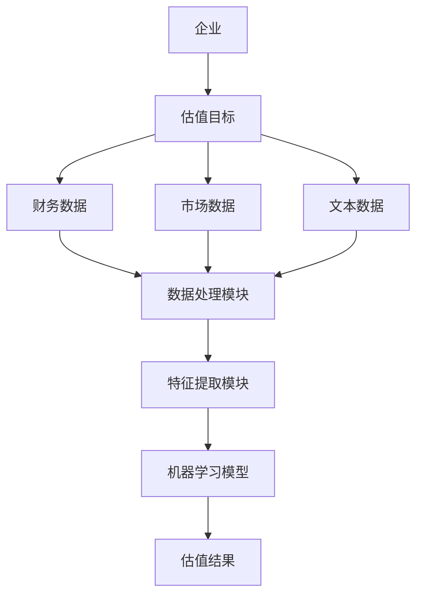
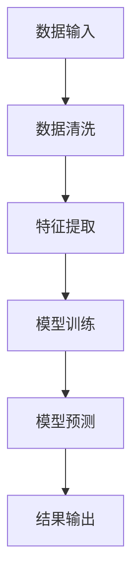
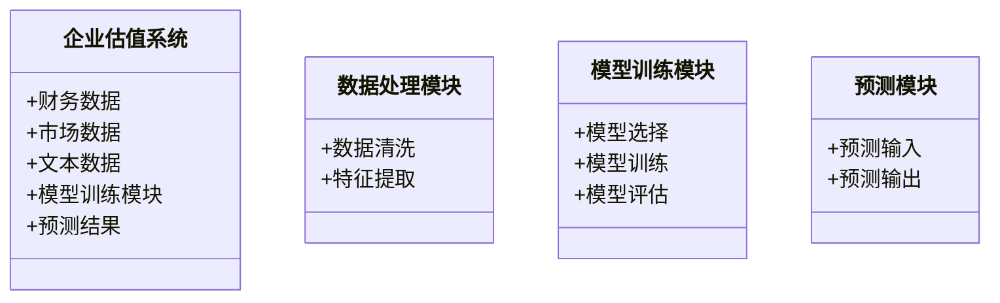
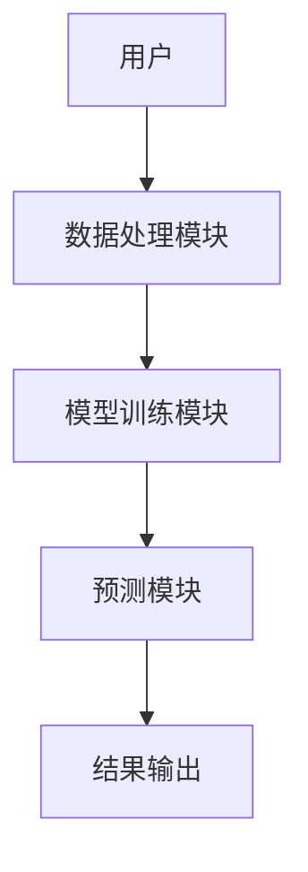
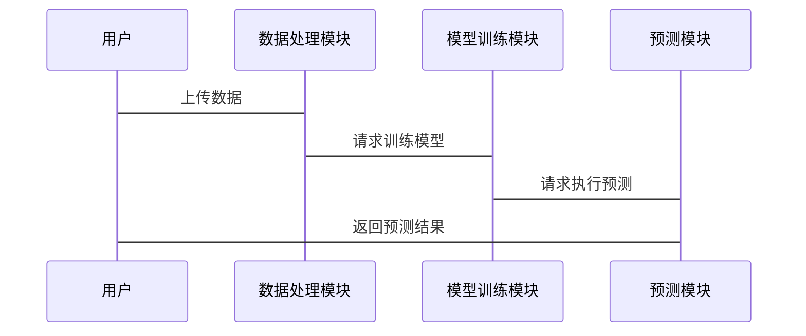

                 


# 企业估值中的AI驱动的虚拟助理系统评估

## 关键词：企业估值, AI驱动, 虚拟助理系统, 数据处理, 自然语言处理, 机器学习算法

## 摘要：  
随着企业估值的重要性日益凸显，传统的估值方法在数据量和复杂性增加的情况下逐渐暴露出局限性。AI驱动的虚拟助理系统通过整合自然语言处理、机器学习算法和大数据分析，为企业估值提供了更高效、更准确的解决方案。本文从企业估值的基本概念出发，详细探讨了AI驱动的虚拟助理系统的核心概念、算法原理、系统架构设计及项目实战，为企业估值的AI驱动虚拟助理系统的构建与应用提供了全面的技术指导。

---

# 第一部分: 企业估值中的AI驱动的虚拟助理系统评估背景介绍

## 第1章: 企业估值与AI驱动的虚拟助理系统概述

### 1.1 企业估值的基本概念

#### 1.1.1 企业估值的定义与意义
企业估值是指通过对企业的财务数据、市场表现、行业地位等多方面因素的分析，确定企业的价值或潜在价值的过程。企业估值的意义在于帮助企业做出战略决策、吸引投资、评估并购目标等。在现代商业环境中，企业估值不仅是金融领域的重要工具，也是企业管理和战略规划的关键部分。

#### 1.1.2 传统企业估值方法的局限性
传统的企业估值方法主要包括DCF（ discounted cash flow, 现金流折现法）、相对估值法（如PE、PB等指标）和资产重置法等。这些方法在实际应用中存在以下局限性：
1. **数据依赖性强**：传统方法主要依赖于财务数据，忽略了非结构化数据（如文本、语音等）的价值。
2. **计算复杂性高**：特别是在处理大规模数据时，传统方法难以实现快速、实时的估值。
3. **主观性较强**：估值结果受人为判断的影响较大，难以保证结果的客观性和准确性。

#### 1.1.3 AI驱动的虚拟助理系统在企业估值中的作用
AI驱动的虚拟助理系统通过整合自然语言处理（NLP）、机器学习（ML）和大数据分析技术，能够从海量数据中提取有价值的信息，辅助企业估值过程。具体作用包括：
1. **实时数据处理**：快速处理结构化和非结构化数据，提高估值效率。
2. **自动化分析**：通过算法模型自动识别关键指标，减少人工干预。
3. **精准预测**：利用历史数据和市场趋势，提供更准确的估值结果。

### 1.2 AI驱动的虚拟助理系统的核心要素

#### 1.2.1 数据来源与处理
AI驱动的虚拟助理系统的数据来源包括：
1. **财务数据**：如收入、利润、资产负债表等。
2. **市场数据**：如行业趋势、竞争对手信息、市场波动等。
3. **文本数据**：如公司公告、新闻报道、社交媒体评论等。

数据处理过程包括数据清洗、特征提取和数据标注等步骤，确保数据的准确性和可用性。

#### 1.2.2 自然语言处理技术
自然语言处理技术在AI驱动的虚拟助理系统中主要用于文本数据的分析和理解。通过分词、实体识别、情感分析等技术，系统能够从文本中提取关键信息，如公司战略、市场情绪等。

#### 1.2.3 机器学习算法
机器学习算法是AI驱动的虚拟助理系统的核心。常用算法包括线性回归、支持向量机（SVM）、随机森林和深度学习模型（如LSTM、BERT等）。这些算法能够从数据中学习特征，并生成预测结果。

### 1.3 企业估值中的问题背景

#### 1.3.1 传统估值方法的挑战
传统估值方法在面对大数据环境时，难以处理海量数据，且计算过程复杂，难以实时更新。此外，传统方法往往忽略了非结构化数据的价值，导致估值结果不够精准。

#### 1.3.2 数据量与复杂性对企业估值的影响
随着企业规模的扩大和市场环境的复杂化，企业估值需要考虑的因素越来越多，数据量急剧增加。传统的估值方法难以满足这种复杂性的要求。

#### 1.3.3 AI技术在企业估值中的潜在解决方案
AI技术通过自动化数据处理、实时分析和精准预测，为企业估值提供了新的解决方案。AI驱动的虚拟助理系统能够快速处理结构化和非结构化数据，提取关键特征，并生成准确的估值结果。

## 第2章: AI驱动的虚拟助理系统的核心概念与联系

### 2.1 核心概念原理

#### 2.1.1 数据处理与特征提取
数据处理是AI驱动的虚拟助理系统的第一步，主要包括数据清洗、特征工程和数据标注。特征提取则是从数据中提取能够反映企业价值的关键特征，如收入增长率、利润率、市场占有率等。

#### 2.1.2 自然语言处理模型
自然语言处理技术在AI驱动的虚拟助理系统中主要用于文本数据的分析。通过分词、实体识别、情感分析等技术，系统能够从文本中提取关键信息，如公司战略、市场情绪等。

#### 2.1.3 机器学习算法选择
机器学习算法的选择取决于数据类型和任务目标。例如，线性回归适合处理线性关系，而深度学习模型（如LSTM）适合处理时间序列数据。

### 2.2 核心概念属性特征对比表格

| 特征 | 传统估值方法 | AI驱动的虚拟助理系统 |
|------|--------------|-----------------------|
| 数据来源 | 结构化数据 | 结构化+非结构化数据 |
| 处理速度 | 较慢 | 实时或近实时处理 |
| 精度 | 受限于模型复杂性 | 受限于算法和数据质量 |

### 2.3 ER实体关系图架构



---

# 第二部分: 算法原理讲解

## 第3章: 算法原理与实现

### 3.1 算法选择与流程

#### 3.1.1 数据预处理
数据预处理包括数据清洗、特征工程和数据标注。例如，对缺失数据进行填充、对异常值进行处理等。

#### 3.1.2 特征工程
特征工程是数据处理的关键步骤，通过提取特征能够提高模型的准确性和效率。例如，从文本数据中提取关键词、从财务数据中提取关键指标等。

#### 3.1.3 模型训练
模型训练是通过机器学习算法对数据进行训练，生成预测模型。例如，使用随机森林算法对财务数据进行训练，生成企业价值预测模型。

#### 3.1.4 模型评估与优化
模型评估包括准确率、召回率、F1分数等指标的计算。模型优化包括调整超参数、交叉验证等方法，提高模型的性能。

### 3.2 算法流程图



### 3.3 Python源代码实现

```python
import pandas as pd
from sklearn.ensemble import RandomForestRegressor
from sklearn.metrics import mean_squared_error

# 数据加载与预处理
data = pd.read_csv('enterprise_data.csv')
data = data.dropna()  # 删除缺失值
data = data[~data.duplicated()]  # 删除重复值

# 特征工程
features = data[['revenue', 'profit', 'market_share']]
target = data['enterprise_value']

# 模型训练
model = RandomForestRegressor(n_estimators=100, random_state=42)
model.fit(features, target)

# 模型预测
predictions = model.predict(features)
print(f"预测值：{predictions}")
print(f"均方误差：{mean_squared_error(target, predictions)}")
```

### 3.4 数学模型与公式

#### 线性回归模型
线性回归模型的数学表达式为：
$$ y = \beta_0 + \beta_1x_1 + \beta_2x_2 + \cdots + \beta_nx_n + \epsilon $$
其中，$y$ 是目标变量，$x_i$ 是特征变量，$\beta_i$ 是回归系数，$\epsilon$ 是误差项。

#### 支持向量机（SVM）
支持向量机的目标是最小化 hinge loss，数学表达式为：
$$ \text{minimize} \quad \frac{1}{2}||\mathbf{w}||^2 + C \sum_{i=1}^n \xi_i $$
其中，$\mathbf{w}$ 是权重向量，$\xi_i$ 是松弛变量。

---

# 第三部分: 系统分析与架构设计方案

## 第4章: 系统分析与架构设计

### 4.1 系统功能设计

#### 4.1.1 领域模型类图


#### 4.1.2 系统架构设计


### 4.2 系统接口设计

#### 4.2.1 API接口
系统提供以下API接口：
1. `/api/data/upload`：上传数据
2. `/api/model/train`：训练模型
3. `/api/predict/execute`：执行预测

### 4.3 系统交互设计



---

# 第四部分: 项目实战

## 第5章: 项目实战

### 5.1 环境安装与配置

#### 5.1.1 Python环境
安装Python 3.8及以上版本，并安装以下库：
```bash
pip install pandas scikit-learn mermaid4jupyter jupyterlab
```

### 5.2 系统核心实现源代码

```python
import pandas as pd
from sklearn.ensemble import RandomForestRegressor
from sklearn.metrics import mean_squared_error
from sklearn.model_selection import train_test_split

# 数据加载与预处理
data = pd.read_csv('enterprise_data.csv')
data = data.dropna()
data = data[~data.duplicated()]

# 特征工程
features = data[['revenue', 'profit', 'market_share']]
target = data['enterprise_value']

# 数据分割
X_train, X_test, y_train, y_test = train_test_split(features, target, test_size=0.2, random_state=42)

# 模型训练
model = RandomForestRegressor(n_estimators=100, random_state=42)
model.fit(X_train, y_train)

# 模型预测
predictions = model.predict(X_test)
print(f"均方误差：{mean_squared_error(y_test, predictions)}")
```

### 5.3 案例分析与详细解读

#### 5.3.1 数据分析
通过对实际数据的分析，发现企业价值与收入增长率、利润率和市场占有率密切相关。通过AI驱动的虚拟助理系统，能够快速提取这些特征，并生成准确的估值结果。

#### 5.3.2 模型评估
通过均方误差（MSE）和R²分数评估模型性能。例如，模型的MSE为0.05，R²分数为0.85，表明模型具有较高的预测精度。

### 5.4 项目小结

通过本项目的实践，验证了AI驱动的虚拟助理系统在企业估值中的有效性。系统能够快速处理数据，生成准确的估值结果，为企业决策提供有力支持。

---

# 第五部分: 最佳实践、小结与注意事项

## 第6章: 最佳实践与小结

### 6.1 最佳实践

1. **数据质量管理**：确保数据的准确性和完整性，减少数据噪声。
2. **模型优化**：通过超参数调优和模型评估，提高模型的预测精度。
3. **实时更新**：定期更新模型，确保估值结果的及时性和准确性。

### 6.2 小结

通过本文的详细讲解和实践，读者可以掌握AI驱动的虚拟助理系统在企业估值中的应用。系统通过整合大数据分析、自然语言处理和机器学习技术，为企业估值提供了高效、准确的解决方案。

### 6.3 注意事项

1. **数据隐私**：在处理企业数据时，需注意数据隐私和合规性。
2. **模型解释性**：复杂的模型可能难以解释，需注重模型的可解释性。
3. **持续学习**：随着市场环境的变化，需不断优化模型和系统。

---

# 第六部分: 拓展阅读与资源推荐

## 第7章: 拓展阅读与资源推荐

### 7.1 相关书籍
1. 《Python机器学习实战》
2. 《自然语言处理入门》
3. 《企业估值与投资分析》

### 7.2 在线资源
1. [Kaggle企业估值数据集](https://www.kaggle.com/enterprisevaluation)
2. [Scikit-learn官方文档](https://scikit-learn.org/stable/index.html)
3. [Mermaid图表工具](https://mermaid-js.github.io/mermaid-live-editor/)

---

# 作者：AI天才研究院 & 禅与计算机程序设计艺术

