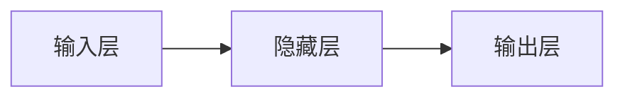
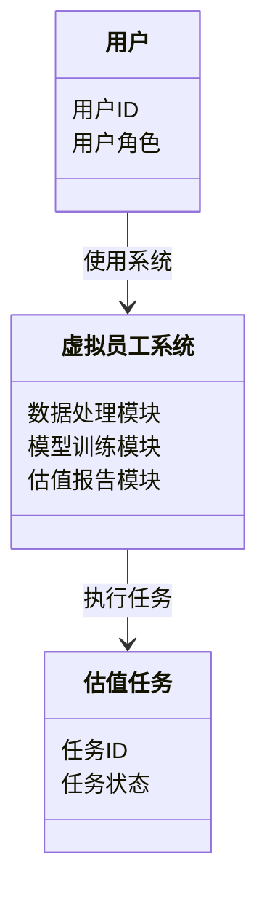
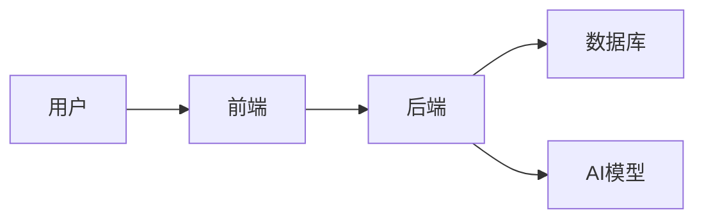
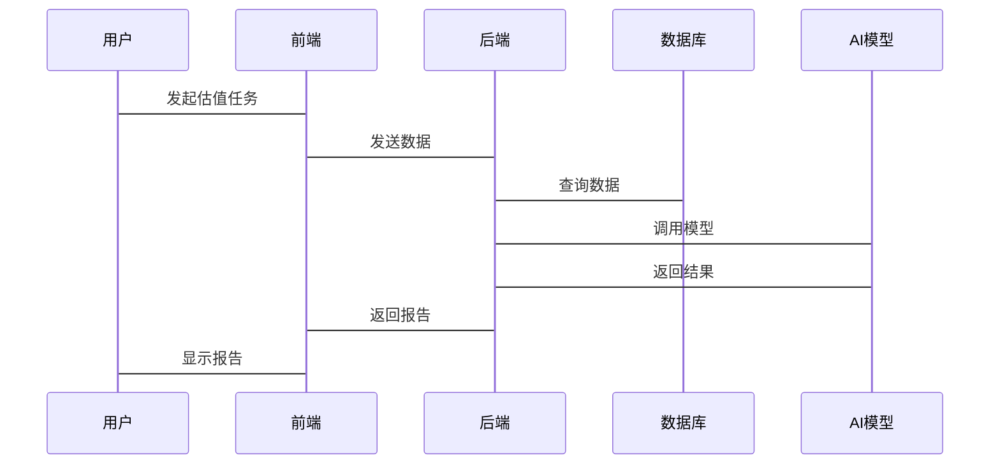

                 


# 企业估值中的AI驱动的虚拟员工系统评估

> 关键词：企业估值，AI驱动，虚拟员工系统，算法原理，系统架构

> 摘要：本文探讨了AI驱动的虚拟员工系统在企业估值中的应用，分析其核心概念、算法原理和系统架构，提供详细的项目实现和案例分析，揭示其对企业估值的重要价值。

---

# 第一部分: 企业估值中的AI驱动的虚拟员工系统概述

# 第1章: 企业估值与虚拟员工系统概述

## 1.1 企业估值的基本概念

### 1.1.1 企业估值的定义与意义
企业估值是对企业价值的评估，通常用于并购、融资、上市等场景。传统估值方法依赖财务数据和人工分析，存在效率低、主观性强的问题。

### 1.1.2 传统企业估值方法的局限性
- 数据依赖性强，难以覆盖非财务因素。
- 人工分析耗时，容易出错。
- 难以实时更新，难以应对市场变化。

### 1.1.3 虚拟员工系统在企业估值中的作用
虚拟员工系统通过自动化数据处理和AI算法，提升估值效率和准确性。

## 1.2 AI驱动的虚拟员工系统介绍

### 1.2.1 虚拟员工系统的定义与特点
虚拟员工是通过AI技术模拟人类工作能力的系统，具有24/7运行、高效率、可扩展等特点。

### 1.2.2 虚拟员工系统的演进与发展趋势
从简单的自动化工具到复杂的智能系统，虚拟员工系统正朝着智能化、个性化方向发展。

### 1.2.3 虚拟员工系统在企业估值中的优势
- 高效处理大量数据。
- 提供实时估值。
- 减少人为错误。

## 1.3 虚拟员工系统与企业估值的关系

### 1.3.1 虚拟员工系统如何影响企业估值
通过自动化数据收集和分析，提升估值的准确性和效率。

### 1.3.2 虚拟员工系统在企业估值中的应用场景
- 数据清洗与预处理。
- 财务指标预测。
- 企业价值评估。

### 1.3.3 虚拟员工系统与企业估值的边界与外延
明确系统的能力和局限，避免超范围应用。

## 1.4 本章小结
本章介绍了企业估值的基本概念和虚拟员工系统的定义、特点及其在估值中的作用，为后续内容打下基础。

---

# 第二部分: 虚拟员工系统的核心概念与联系

# 第2章: 虚拟员工系统的核心概念

## 2.1 虚拟员工系统的属性特征对比

### 2.1.1 虚拟员工系统与传统员工的对比

| 特性       | 传统员工       | 虚拟员工系统   |
|------------|----------------|---------------|
| 工作时间     | 8小时/天       | 24/7无休      |
| 效率         | 受情绪影响       | 高效稳定      |
| 可扩展性     | 有限           | 高            |

### 2.1.2 虚拟员工系统的功能属性
- 数据处理：自动收集和整理数据。
- 分析能力：运用AI算法进行预测和评估。
- 自适应性：根据反馈优化工作流程。

### 2.1.3 虚拟员工系统的性能特征
- 响应速度：毫秒级响应。
- 并发处理能力：支持多任务并行。

## 2.2 虚拟员工系统的ER实体关系图

```mermaid
er
  actor: 用户
  system: 虚拟员工系统
  task: 估值任务
  performance: 性能指标
  relation: 用户 -> 使用 -> 虚拟员工系统
  relation: 虚拟员工系统 -> 执行 -> 估值任务
  relation: 估值任务 <- 关联 -> 性能指标
```

## 2.3 虚拟员工系统的核心要素组成

### 2.3.1 数据输入与处理
- 数据源：财务报表、市场数据。
- 数据清洗：去除无效数据，处理异常值。

### 2.3.2 系统算法与模型
- 算法：线性回归、神经网络。
- 模型：估值预测模型。

### 2.3.3 输出结果与反馈
- 输出：估值报告、预测结果。
- 反馈：用户反馈用于优化系统。

## 2.4 本章小结
本章详细介绍了虚拟员工系统的属性特征、核心要素及其与企业估值的关系，为后续分析打下基础。

---

# 第三部分: 虚拟员工系统的算法原理与数学模型

# 第3章: 虚拟员工系统的算法原理

## 3.1 算法原理概述

### 3.1.1 算法的基本流程
1. 数据收集与预处理。
2. 模型训练。
3. 预测与评估。
4. 反馈优化。

### 3.1.2 算法的核心思想
通过AI算法学习数据特征，预测企业价值。

### 3.1.3 算法的优化策略
- 参数调优。
- 模型融合。

## 3.2 算法的数学模型与公式

### 3.2.1 线性回归模型
$$ y = \beta_0 + \beta_1x + \epsilon $$

### 3.2.2 神经网络模型


### 3.2.3 其他算法模型简介
- 支持向量机（SVM）。
- 随机森林（Random Forest）。

## 3.3 算法的实现与优化

### 3.3.1 算法实现步骤
1. 数据预处理：标准化、特征选择。
2. 模型训练：选择算法，调整参数。
3. 模型评估：交叉验证、准确率计算。

### 3.3.2 算法优化方法
- 超参数优化：网格搜索、随机搜索。
- 模型优化：正则化、Dropout。

### 3.3.3 算法的性能评估
- 准确率、召回率、F1分数。

## 3.4 本章小结
本章详细讲解了虚拟员工系统中使用的算法原理和数学模型，为系统的实现提供了理论基础。

---

# 第四部分: 虚拟员工系统

## 4.1 系统分析与架构设计方案

### 4.1.1 问题场景介绍
企业估值需要处理大量数据，传统方法效率低，AI系统可以提升效率。

### 4.1.2 项目介绍
开发一个基于AI的虚拟员工系统，用于企业估值。

### 4.1.3 系统功能设计（领域模型）



### 4.1.4 系统架构设计（架构图）



### 4.1.5 系统接口设计
- API接口：数据接口、模型接口。

### 4.1.6 系统交互（序列图）



## 4.2 项目实战

### 4.2.1 环境安装
- 安装Python、TensorFlow、Pandas。

### 4.2.2 核心代码实现

```python
import pandas as pd
import numpy as np
from sklearn.linear_model import LinearRegression

# 数据加载
data = pd.read_csv('企业数据.csv')

# 数据预处理
X = data[[' revenue', 'profit']]
y = data['valuation']

# 模型训练
model = LinearRegression()
model.fit(X, y)

# 预测
predicted_valuation = model.predict([[new_revenue, new_profit]])
```

### 4.2.3 代码应用解读与分析
- 数据加载：读取企业数据。
- 数据预处理：选择相关特征。
- 模型训练：训练线性回归模型。
- 预测：输入新数据，输出估值。

### 4.2.4 实际案例分析
以某公司为例，使用系统进行估值，对比传统方法，验证系统准确性。

## 4.3 项目小结
本章通过实际项目展示了虚拟员工系统的实现过程，包括环境配置、代码实现和案例分析，验证了系统的有效性。

---

# 第五部分: 总结与展望

## 5.1 总结
虚拟员工系统通过AI技术提升了企业估值的效率和准确性，具有重要的应用价值。

## 5.2 未来展望
- 更复杂的模型：深度学习、强化学习。
- 多维度数据：整合更多数据源。
- 实时更新：动态调整估值模型。

## 5.3 注意事项
- 数据隐私：确保数据安全。
- 系统维护：定期更新模型。
- 用户培训：提升用户使用能力。

## 5.4 最佳实践 Tips
- 选择合适的算法。
- 定期优化模型。
- 充分测试系统。

## 5.5 本章小结
本文总结了虚拟员工系统在企业估值中的应用，展望了未来的发展方向，并提出了注意事项和最佳实践。

---

# 作者：AI天才研究院 & 禅与计算机程序设计艺术

