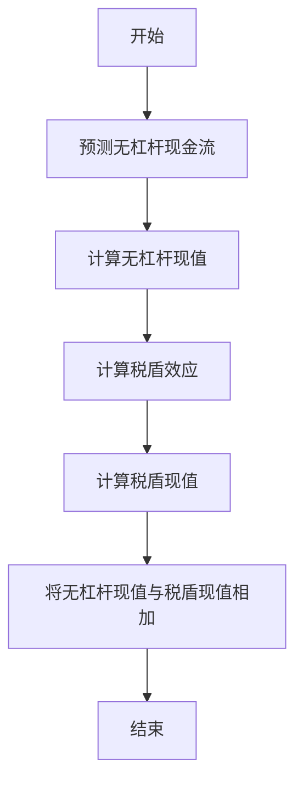
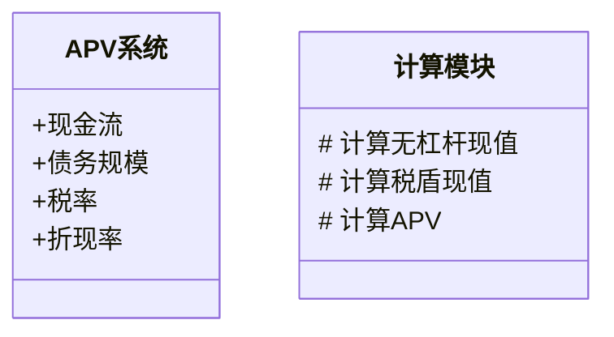
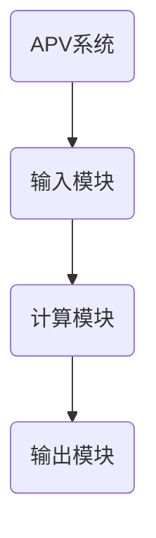
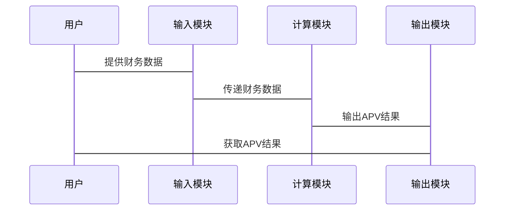

                 


# 企业估值中的APV法

## 关键词

- 企业估值
- APV法
- 调整现值法
- 税盾效应
- 财务模型

## 摘要

企业估值是金融领域中的核心问题之一，而APV（Adjusted Present Value）法作为一种重要的估值方法，在杠杆企业估值中具有独特的优势。本文详细介绍了APV法的核心原理、数学模型、系统架构设计以及实际应用，通过案例分析帮助读者理解如何在实际中运用APV法进行企业估值。

---

# 第1章: APV法的背景与概念

## 1.1 APV法的起源与发展

### 1.1.1 企业估值的传统方法

企业估值的传统方法主要包括：

1. **DCF（Discounted Cash Flow）法**：通过预测企业未来现金流并将其折现到现值，评估企业整体价值。
2. **相对估值法**：基于可比公司的市场数据（如市盈率、市净率等）进行估值。
3. **资产基础法**：将企业资产负债表中的各项资产和负债分别评估后汇总，得出企业整体价值。

### 1.1.2 APV法的提出与演变

APV法由**Freddy倬**在1964年提出，是一种结合了杠杆效应和税盾效应的估值方法。其核心思想是将企业的无杠杆现值与杠杆带来的税盾效应相结合，计算企业的整体价值。

### 1.1.3 APV法的现代发展与应用

随着企业融资结构的复杂化，APV法在实践中得到了广泛应用，尤其是在杠杆收购和私募股权领域。现代APV法结合了更多复杂的因素，如财务风险、流动性溢价等。

---

## 1.2 APV法的核心概念

### 1.2.1 APV法的定义

APV（Adjusted Present Value）法是指在企业无杠杆现值的基础上，调整因杠杆带来的税盾效应，从而得出企业整体价值的方法。

### 1.2.2 APV法的原理

APV法的核心在于将企业的无杠杆现值与杠杆带来的税盾效应分开计算，然后将两者相加得到企业的整体价值。

### 1.2.3 APV法与传统DCF方法的区别

| APV法 | DCF法 |
|------|------|
| 将税盾效应单独计算 | 将税盾效应包含在现金流预测中 |
| 适用于杠杆企业 | 适用于无杠杆企业 |
| 独立计算无杠杆和杠杆价值 | 未区分杠杆和无杠杆价值 |

---

## 1.3 APV法的适用场景与局限性

### 1.3.1 APV法的主要应用场景

1. **杠杆企业估值**：APV法特别适用于存在债务融资的企业，因为其考虑了税盾效应。
2. **并购分析**：在企业并购中，APV法常用于评估目标企业的价值。
3. **杠杆收购分析**：在杠杆收购中，APV法是首选的估值方法。

### 1.3.2 APV法的局限性与挑战

1. **税盾效应的复杂性**：在复杂的税务环境下，税盾效应的计算可能非常复杂。
2. **假设的敏感性**：APV法依赖于多个假设（如折现率、税率），这些假设的变化可能对结果产生重大影响。
3. **流动性溢价**：APV法未考虑流动性溢价，这在私募股权等领域可能会影响估值的准确性。

---

# 第2章: APV法的核心原理与数学模型

## 2.1 APV法的原理分析

### 2.1.1 现金流预测与调整

APV法的现金流预测与DCF法类似，但需要将税盾效应单独计算。

### 2.1.2 税盾效应的计算

税盾效应是指由于债务利息可以在税前扣除，从而减少企业税负。其计算公式为：
$$ PV_{\text{tax shield}} = \frac{D \times t_c}{(1 + r)^n} $$
其中，$D$ 是债务规模，$t_c$ 是税率，$r$ 是折现率，$n$ 是时间跨度。

### 2.1.3 现值计算与调整

将无杠杆现值和税盾现值相加，得到企业的整体价值：
$$ APV = PV_{\text{unlevered}} + PV_{\text{tax shield}} $$

---

## 2.2 APV法的数学模型

### 2.2.1 APV的基本公式

$$ APV = \frac{CF_{\text{unlevered}}}{(1 + r)^n} + \frac{D \times t_c}{(1 + r)^n} $$

其中，$CF_{\text{unlevered}}$ 是无杠杆现金流，$D$ 是债务规模，$t_c$ 是税率，$r$ 是折现率，$n$ 是时间跨度。

### 2.2.2 无杠杆现值的计算

无杠杆现值的计算公式为：
$$ PV_{\text{unlevered}} = \frac{CF_{\text{free cash flow}}}{(1 + r)^n} $$

### 2.2.3 税盾现值的计算

税盾现值的计算公式为：
$$ PV_{\text{tax shield}} = \frac{D \times t_c}{(1 + r)^n} $$

---

## 2.3 APV法的算法流程图



---

# 第3章: APV法的系统分析与架构设计

## 3.1 系统分析

### 3.1.1 问题场景介绍

我们假设一家企业计划进行杠杆融资，需要使用APV法进行估值。

### 3.1.2 项目介绍

本项目旨在开发一个基于APV法的企业估值系统，实现无杠杆现值、税盾现值的计算以及整体APV的输出。

### 3.1.3 系统功能设计

1. **输入模块**：接收企业财务数据（如现金流、债务规模、税率等）。
2. **计算模块**：计算无杠杆现值和税盾现值。
3. **输出模块**：输出APV结果。



---

## 3.2 系统架构设计

### 3.2.1 系统架构图



### 3.2.2 系统接口设计

1. **输入接口**：接收财务数据。
2. **输出接口**：输出APV结果。

### 3.2.3 系统交互序列图



---

# 第4章: APV法的项目实战

## 4.1 环境安装

### 4.1.1 安装Python

```bash
python --version
pip install --upgrade pip
```

### 4.1.2 安装库

```bash
pip install numpy pandas matplotlib
```

---

## 4.2 核心实现

### 4.2.1 Python代码实现

```python
import numpy as np

def calculate_apv(free_cash_flow, debt, tax_rate, discount_rate, n):
    pv_unlevered = np.npv(discount_rate, [0] + [free_cash_flow] * n)
    pv_tax_shield = (debt * tax_rate) / (1 + discount_rate) ** n
    apv = pv_unlevered + pv_tax_shield
    return apv

# 示例
free_cash_flow = 100
debt = 500
tax_rate = 0.3
discount_rate = 0.1
n = 5

apv = calculate_apv(free_cash_flow, debt, tax_rate, discount_rate, n)
print(f"APV: {apv:.2f}")
```

---

## 4.3 案例分析

### 4.3.1 案例介绍

假设某公司未来5年的自由现金流为100万元，债务500万元，税率30%，折现率10%。

### 4.3.2 计算过程

1. **无杠杆现值**：
$$ PV_{\text{unlevered}} = \frac{100}{(1 + 0.1)^5} \approx 62.09万元 $$

2. **税盾现值**：
$$ PV_{\text{tax shield}} = \frac{500 \times 0.3}{(1 + 0.1)^5} \approx 31.25万元 $$

3. **APV**：
$$ APV = 62.09 + 31.25 = 93.34万元 $$

### 4.3.3 结果分析

通过APV法，我们得出该公司的整体价值约为93.34万元。

---

## 4.4 项目小结

本项目通过Python代码实现了APV法的计算，验证了APV法在实际中的应用。通过案例分析，我们掌握了APV法的具体计算步骤和实际应用。

---

# 第5章: APV法的最佳实践

## 5.1 注意事项

1. **数据准确性**：确保输入数据的准确性。
2. **假设合理性**：合理假设折现率和税率。
3. **模型复杂性**：在复杂情况下，可能需要调整模型。

## 5.2 拓展阅读

- 资产评估师考试教材
- 《企业价值评估：APV与DCF的结合》

## 5.3 总结

APV法是一种重要的企业估值方法，尤其适用于杠杆企业。通过本文的学习，读者可以掌握APV法的核心原理和实际应用。

---

# 作者

作者：AI天才研究院 & 禅与计算机程序设计艺术

