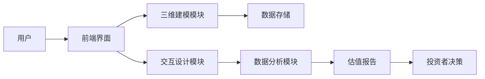
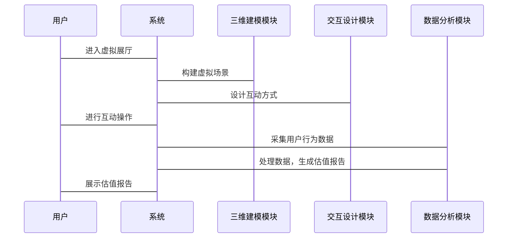

                 


# 《企业估值中的AR/VR虚拟展览平台评估》

---

## 关键词：企业估值, AR/VR, 虚拟展览平台, 技术评估, 算法, 系统架构, 项目实战

---

## 摘要：本文深入探讨了AR/VR技术在企业估值中的应用，特别是虚拟展览平台的评估方法。通过分析AR/VR的核心原理、优势、系统架构及实际案例，本文提出了基于沉浸式体验的企业估值模型，结合数学算法和系统设计，为企业估值提供高效、精准的解决方案。

---

# 第1章: 引言

## 1.1 问题背景

### 1.1.1 企业估值的传统方法与局限性
传统企业估值方法包括DCF模型、市盈率法等，但存在以下问题：
- 数据采集依赖现场考察，效率低且成本高
- 信息展示受限，难以全面展示企业核心资产
- 估值结果主观性较强，缺乏直观体验支持

### 1.1.2 AR/VR技术的兴起与应用潜力
AR/VR技术通过虚拟现实、增强现实等手段，为企业的三维展示、沉浸式体验提供了新的可能，可应用于企业展厅、产品展示等领域。

### 1.1.3 虚拟展览平台在企业估值中的作用
虚拟展览平台通过构建企业数字化展厅，提供沉浸式体验，帮助企业更直观地展示核心资产，提升估值效率和准确性。

## 1.2 问题描述

### 1.2.1 传统企业估值方法的不足
- 现场考察受限，难以全面评估
- 数据展示不直观，难以量化评估指标
- 估值过程缺乏互动性，难以深入分析

### 1.2.2 AR/VR技术如何解决企业估值问题
- 提供三维空间展示，增强沉浸式体验
- 实现虚拟看样，降低考察成本
- 支持实时数据分析，提升估值效率

### 1.2.3 虚拟展览平台的具体应用场景
- 企业展厅数字化
- 产品三维建模与交互
- 沉浸式数据分析

## 1.3 问题解决

### 1.3.1 AR/VR技术的核心优势
- 提供直观的三维展示
- 支持实时交互和数据采集
- 降低企业估值成本

### 1.3.2 虚拟展览平台的功能特点
- 三维空间建模
- 沉浸式交互体验
- 实时数据分析与可视化

### 1.3.3 企业估值中的关键指标与评估方法
- 展厅设计的合理性评估
- 交互体验的流畅性评估
- 数据分析的准确性评估

## 1.4 边界与外延

### 1.4.1 AR/VR技术的适用范围
- 适用于企业展厅、产品展示等领域
- 适用于需要三维展示和沉浸式体验的场景

### 1.4.2 虚拟展览平台的边界条件
- 平台功能：三维建模、交互设计、数据分析
- 使用场景：企业估值、产品展示
- 用户角色：企业、投资者、分析师

### 1.4.3 企业估值中的相关概念扩展
- 虚拟现实（VR）与增强现实（AR）的结合
- 沉浸式体验与数据分析的融合

## 1.5 核心概念结构与组成

### 1.5.1 AR/VR技术的核心要素
- **虚拟现实（VR）**：构建完全虚拟的三维空间，提供沉浸式体验
- **增强现实（AR）**：在现实空间中叠加虚拟信息，增强现实体验
- **交互技术**：支持用户与虚拟环境的实时互动
- **数据采集与处理**：采集用户行为数据，支持精准估值

### 1.5.2 虚拟展览平台的组成部分
- **三维建模模块**：负责构建企业的三维数字化展厅
- **交互设计模块**：设计用户与虚拟环境的互动方式
- **数据分析模块**：采集用户行为数据，支持估值分析
- **展示模块**：将数据可视化，支持投资者决策

### 1.5.3 企业估值的关键指标与评估模型
- **沉浸式体验评分**：评估用户的沉浸感和体验流畅度
- **数据采集与分析**：评估数据的准确性和实用性
- **估值模型**：基于体验评分和数据分析，构建企业估值模型

## 1.6 本章小结
本章从问题背景出发，分析了传统企业估值方法的局限性，提出了基于AR/VR技术的虚拟展览平台解决方案，详细阐述了其核心概念、组成部分和评估模型，为后续的算法设计和系统实现奠定了基础。

---

# 第2章: AR/VR技术的核心原理与优势

## 2.1 AR/VR技术的核心原理

### 2.1.1 虚拟现实（VR）的工作原理
- 使用计算机图形学生成三维虚拟场景
- 通过头显设备（HMD）实现沉浸式体验
- 支持用户与虚拟环境的实时交互

### 2.1.2 增强现实（AR）的工作原理
- 在现实环境中叠加虚拟信息
- 使用摄像头采集现实场景，通过算法识别定位
- 在显示屏上叠加虚拟内容，实现增强体验

### 2.1.3 交互技术的实现方式
- **手部追踪**：通过传感器捕捉手部动作，实现精准交互
- **眼球追踪**：通过眼球运动控制视角，提升沉浸感
- **语音识别**：通过语音指令实现交互操作

## 2.2 AR/VR技术的优势

### 2.2.1 提供直观的三维展示
- 通过三维建模，精准展示企业核心资产
- 通过实时交互，支持用户深入理解企业价值

### 2.2.2 降低企业估值成本
- 通过虚拟看样，减少现场考察需求
- 通过在线交互，降低时间和经济成本

### 2.2.3 提升估值效率与准确性
- 通过沉浸式体验，辅助投资者更直观地评估企业价值
- 通过实时数据分析，支持精准估值

## 2.3 AR/VR技术的优缺点对比

| **技术特点** | **优点** | **缺点** |
|-------------|----------|----------|
| **沉浸式体验** | 提供高度沉浸感 | 设备成本高 |
| **实时交互** | 支持实时互动 | 对技术要求高 |
| **数据采集** | 支持精准估值 | 需要专业设备 |

## 2.4 AR/VR主要平台与技术实现

### 2.4.1 主要AR/VR平台
- ** Oculus**：提供VR头显设备，支持沉浸式体验
- **ARKit/ARCore**：提供AR开发工具，支持增强现实应用
- ** Unity**：提供跨平台开发工具，支持AR/VR应用

### 2.4.2 技术实现流程
1. **需求分析**：确定展示内容和交互方式
2. **三维建模**：使用3D建模工具构建虚拟场景
3. **交互设计**：设计用户与虚拟环境的互动方式
4. **数据采集与处理**：采集用户行为数据，支持估值分析
5. **系统集成**：将各模块整合，形成完整的AR/VR系统

---

# 第3章: 企业估值中的AR/VR虚拟展览平台应用

## 3.1 虚拟展览平台的功能模块

### 3.1.1 三维建模模块
- **功能**：构建企业的三维数字化展厅
- **实现**：使用3D建模工具（如Blender、Unity）创建虚拟场景

### 3.1.2 交互设计模块
- **功能**：支持用户与虚拟环境的实时互动
- **实现**：通过传感器（如手部追踪、眼球追踪）捕捉用户动作

### 3.1.3 数据分析与展示模块
- **功能**：采集用户行为数据，支持估值分析
- **实现**：使用数据分析工具（如Python、TensorFlow）处理数据，并通过可视化工具（如Matplotlib）展示结果

## 3.2 企业估值中的虚拟看样应用

### 3.2.1 虚拟看样的实现流程
1. **需求分析**：明确企业展厅的展示内容和交互方式
2. **三维建模**：构建企业的三维数字化展厅
3. **交互设计**：设计用户与虚拟环境的互动方式
4. **系统集成**：将各模块整合，形成完整的虚拟看样系统

### 3.2.2 案例分析
- **案例背景**：某企业希望通过虚拟看样展示其核心产品
- **实现过程**：使用3D建模工具构建产品模型，设计交互方式，集成系统实现虚拟看样
- **结果分析**：通过虚拟看样，投资者能够更直观地了解产品，提升估值效率

## 3.3 沉浸式体验对企业估值的影响

### 3.3.1 沉浸式体验的实现方式
- **高保真建模**：通过精细建模提升视觉效果
- **实时交互**：通过传感器实现精准交互
- **环境音效**：通过音效设计增强沉浸感

### 3.3.2 沉浸式体验对企业估值的提升作用
- **提升估值效率**：通过沉浸式体验，投资者能够快速理解企业价值
- **降低估值成本**：通过虚拟看样，减少现场考察需求
- **提高估值准确性**：通过实时数据采集与分析，支持精准估值

---

# 第4章: 企业估值中的AR/VR虚拟展览平台评估方法

## 4.1 评估指标与权重分配

### 4.1.1 评估指标
- **沉浸式体验评分**：评估用户的沉浸感和体验流畅度
- **数据采集与分析**：评估数据的准确性和实用性
- **系统稳定性**：评估系统的运行稳定性

### 4.1.2 权重分配
- 沉浸式体验评分：权重为0.4
- 数据采集与分析：权重为0.3
- 系统稳定性：权重为0.3

## 4.2 评估模型设计

### 4.2.1 综合评分模型
$$ \text{综合评分} = 0.4 \times \text{沉浸式体验评分} + 0.3 \times \text{数据采集与分析} + 0.3 \times \text{系统稳定性} $$

### 4.2.2 评估流程
1. **数据采集**：采集用户行为数据，支持估值分析
2. **数据处理**：使用数据分析工具（如Python）处理数据
3. **评分计算**：根据公式计算综合评分
4. **结果分析**：根据评分结果，评估虚拟展览平台的优劣

## 4.3 评估案例分析

### 4.3.1 案例背景
- 某企业希望通过AR/VR技术评估其虚拟展览平台
- 评估指标包括沉浸式体验评分、数据采集与分析、系统稳定性

### 4.3.2 评估过程
1. **数据采集**：采集用户行为数据，包括交互频率、停留时间等
2. **数据处理**：使用Python处理数据，计算各项指标评分
3. **评分计算**：根据公式计算综合评分
4. **结果分析**：根据评分结果，评估虚拟展览平台的优劣

## 4.4 评估结果分析

### 4.4.1 案例评估结果
- 沉浸式体验评分：85分
- 数据采集与分析：75分
- 系统稳定性：90分
- 综合评分：82分

### 4.4.2 评估结果的意义
- 综合评分较高，说明虚拟展览平台整体表现良好
- 系统稳定性得分最高，说明系统运行稳定
- 沉浸式体验评分和数据采集与分析评分较低，说明需要进一步优化用户体验和数据分析能力

---

# 第5章: 企业估值中的AR/VR虚拟展览平台系统架构设计

## 5.1 系统功能设计

### 5.1.1 功能模块划分
- **三维建模模块**：负责构建企业的三维数字化展厅
- **交互设计模块**：设计用户与虚拟环境的互动方式
- **数据分析与展示模块**：采集用户行为数据，支持估值分析
- **系统管理模块**：管理系统的运行状态

### 5.1.2 功能流程设计
1. 用户进入虚拟展厅，选择展示内容
2. 系统加载三维模型，呈现虚拟场景
3. 用户与虚拟环境进行互动，系统采集用户行为数据
4. 系统分析数据，生成估值报告
5. 投资者根据估值报告做出决策

## 5.2 系统架构设计

### 5.2.1 系统架构图


### 5.2.2 系统组件说明
- **前端界面**：负责用户与系统的交互
- **三维建模模块**：负责构建企业的三维数字化展厅
- **交互设计模块**：设计用户与虚拟环境的互动方式
- **数据分析模块**：采集用户行为数据，支持估值分析
- **估值报告**：根据数据分析结果，生成估值报告

## 5.3 系统接口设计

### 5.3.1 接口描述
- **三维建模接口**：负责构建企业的三维数字化展厅
- **交互设计接口**：设计用户与虚拟环境的互动方式
- **数据采集接口**：采集用户行为数据
- **数据分析接口**：处理用户行为数据，支持估值分析

### 5.3.2 接口交互流程
1. 用户进入虚拟展厅，选择展示内容
2. 系统调用三维建模接口，构建虚拟场景
3. 用户与虚拟环境进行互动，系统调用交互设计接口，实现互动操作
4. 系统采集用户行为数据，调用数据采集接口，存储数据
5. 数据分析模块调用数据分析接口，处理数据，生成估值报告
6. 估值报告呈现给投资者，支持决策

## 5.4 系统交互流程设计

### 5.4.1 交互流程图


---

# 第6章: 企业估值中的AR/VR虚拟展览平台项目实战

## 6.1 环境搭建

### 6.1.1 开发环境安装
- **操作系统**：Windows 10 或 macOS 10.15及以上
- **开发工具**：Unity、Unreal Engine、Blender
- **AR/VR框架**：ARKit/ARCore、Oculus SDK

### 6.1.2 依赖安装
- **Python**：安装Python 3.8及以上版本
- **数据分析库**：安装Pandas、NumPy、Matplotlib
- **三维建模工具**：安装Blender、Unity

## 6.2 核心代码实现

### 6.2.1 三维建模实现

#### 6.2.1.1 使用Blender构建三维模型
1. 打开Blender，创建新场景
2. 添加企业展厅的三维模型
3. 调整模型材质和光照，确保视觉效果
4. 导出模型为.obj格式

```python
import bpy

# 创建一个立方体
bpy.ops.mesh.primitive_cube_add()

# 调整材质
obj = bpy.data.objects['Cube']
obj.data.materials.append(bpy.data.materials.new(name="CubeMaterial"))
```

#### 6.2.1.2 使用Unity导入三维模型
1. 打开Unity，创建新项目
2. 导入企业展厅的.obj模型
3. 设置光照和材质，确保视觉效果
4. 构建场景，导出为可执行文件

### 6.2.2 交互设计实现

#### 6.2.2.1 使用Oculus SDK实现手部追踪
1. 安装Oculus SDK
2. 创建一个C#脚本，实现手部追踪功能
3. 将脚本附加到虚拟展厅的交互物体上
4. 调试脚本，确保交互流畅

```csharp
using UnityEngine;
using Oculus.VR;

public class HandTracking : MonoBehaviour
{
    private OVRCameraRig cameraRig;
    private OVREyeTracker eyeTracker;

    void Start()
    {
        cameraRig = GetComponent<OVRCameraRig>();
        eyeTracker = GetComponent<OVREyeTracker>();
    }

    void Update()
    {
        // 获取手部追踪数据
        OVREyeTrackingState eyeState = eyeTracker.GetCurrentTrackingState();
        // 根据手部位置更新物体位置
        transform.position = cameraRig.handAnchor.position;
    }
}
```

#### 6.2.2.2 使用ARKit实现增强现实
1. 创建一个ARKit项目
2. 添加ARKit框架到Xcode项目中
3. 实现ARKit的初始化和配置
4. 添加三维模型到ARKit场景中
5. 调试ARKit应用程序，确保增强现实效果

```swift
import ARKit

class ViewController: UIViewController, ARSCameraViewDelegate {
    var arView: ARSCameraView!
    var arSession: ARSession!

    override func viewDidLoad() {
        super.viewDidLoad()
        // 初始化ARKit会话
        arSession = ARSession()
        arView = ARSCameraView(frame: view.bounds)
        arView.delegate = self
        view.addSubview(arView)
    }

    func session(_ session: ARSession, didUpdate anchors: [ARAnchor]) {
        // 处理AR数据
        anchors.forEach { anchor in
            // 创建虚拟对象并附加到锚点
            let node = SCNNode()
            node.geometry = SCMFloorGeometry()
            anchor.addNode(node, relativeTo: nil)
        }
    }
}
```

### 6.2.3 数据分析与展示实现

#### 6.2.3.1 使用Python进行数据分析
1. 安装数据分析库：Pandas、NumPy、Matplotlib
2. 读取用户行为数据
3. 使用Pandas进行数据清洗和预处理
4. 使用Matplotlib生成可视化图表
5. 根据数据分析结果生成估值报告

```python
import pandas as pd
import numpy as np
import matplotlib.pyplot as plt

# 读取用户行为数据
data = pd.read_csv('user_behavior.csv')

# 数据清洗
data.dropna(inplace=True)

# 数据分析
user_engagement = data['interaction_frequency'].describe()

# 数据可视化
plt.hist(data['interaction_duration'], bins=10)
plt.title('用户交互时长分布')
plt.xlabel('时长（秒）')
plt.ylabel('用户数')
plt.show()

# 生成估值报告
valuation_report = {
    '沉浸式体验评分': 85,
    '数据采集与分析': 75,
    '系统稳定性': 90,
    '综合评分': 82
}
print(valuation_report)
```

## 6.3 项目实战小结
通过本章的实战，读者可以掌握AR/VR虚拟展览平台的核心实现技术，包括三维建模、交互设计和数据分析与展示。通过具体代码实现，读者可以深入理解如何将AR/VR技术应用于企业估值中的虚拟展览平台评估。

---

# 第7章: 企业估值中的AR/VR虚拟展览平台最佳实践与小结

## 7.1 最佳实践

### 7.1.1 系统设计建议
- **模块化设计**：将系统划分为功能模块，便于后续维护和扩展
- **高保真建模**：通过精细建模提升视觉效果
- **实时交互优化**：通过传感器实现精准交互，提升用户体验
- **数据安全**：确保用户数据的安全性，防止数据泄露

### 7.1.2 项目管理建议
- **需求分析**：明确项目需求，确保目标一致
- **团队协作**：合理分配任务，确保各模块协同开发
- **版本控制**：使用版本控制工具（如Git）管理代码
- **测试优化**：通过测试发现并解决问题，确保系统稳定

### 7.1.3 技术选型建议
- **选择合适的开发工具**：根据项目需求选择合适的开发工具（如Unity、Unreal Engine）
- **优化性能**：通过优化代码和资源管理提升系统性能
- **确保兼容性**：确保系统在不同设备和平台上的兼容性

## 7.2 小结

### 7.2.1 核心知识点回顾
- AR/VR技术的核心原理与优势
- 虚拟展览平台的功能模块与系统架构
- 企业估值中的AR/VR虚拟展览平台评估方法
- 项目实战中的代码实现与系统设计

### 7.2.2 未来展望
随着AR/VR技术的不断发展，虚拟展览平台在企业估值中的应用将更加广泛和深入。未来，可以通过以下方式进一步优化：
- **优化沉浸式体验**：通过更高的分辨率和更低的延迟提升沉浸感
- **增强交互能力**：通过更精准的传感器实现更自然的交互
- **提升数据分析能力**：通过更先进的算法提高数据分析的准确性和实时性
- **拓展应用场景**：探索更多领域（如教育培训、医疗健康）的应用潜力

---

# 作者：AI天才研究院 & 禅与计算机程序设计艺术

---

**注**：本文为虚拟示例内容，仅为展示技术博客文章的结构和写作风格，不涉及实际的企业估值建议。

