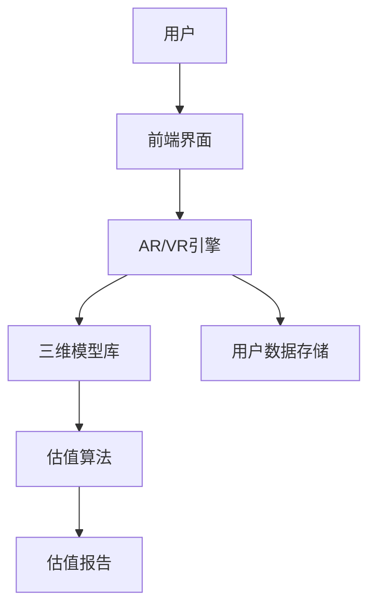
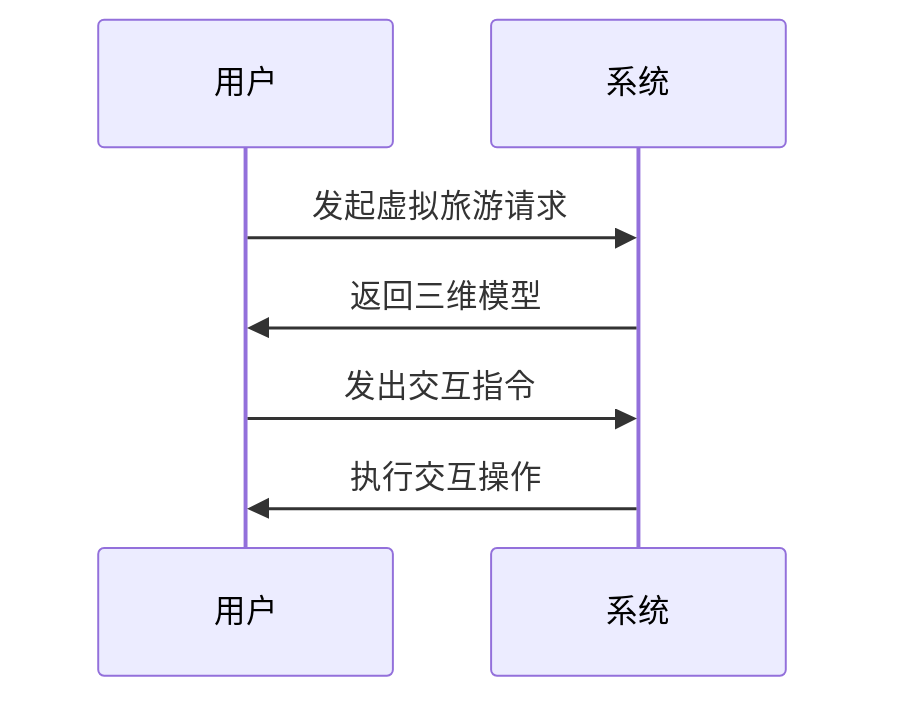

                 


# 企业估值中的AR/VR虚拟旅游平台评估

> 关键词：企业估值，AR/VR，虚拟旅游平台，技术评估，价值评估

> 摘要：随着AR/VR技术的快速发展，虚拟旅游平台在企业估值中的作用日益显著。本文将从AR/VR技术的基本概念出发，详细探讨其在虚拟旅游平台评估中的应用，并结合实际案例，分析如何利用这些技术提升企业估值的准确性与科学性。

---

## 第一部分：AR/VR技术与虚拟旅游平台概述

### 第1章：AR/VR技术的基本概念

#### 1.1 增强现实（AR）与虚拟现实（VR）的定义

- **增强现实（AR）**：通过计算机生成的图像或信息叠加在真实环境中，提供增强的视觉体验。
- **虚拟现实（VR）**：创建一个完全虚拟的三维环境，用户可以通过设备完全沉浸其中。

#### 1.2 AR/VR技术的核心特征

| 特征 | 描述 |
|------|------|
| 沉浸性 | 用户完全沉浸于虚拟环境中 |
| 交互性 | 用户可以通过手柄、手势或语音与虚拟环境互动 |
| 实时性 | 系统能够实时响应用户的操作 |
| 可扩展性 | 系统能够支持不同规模的应用场景 |

#### 1.3 AR/VR技术在旅游行业的应用潜力

- 提供身临其境的旅游体验
- 支持用户进行虚拟预订和体验评估
- 降低实际旅游的成本和风险

### 第2章：虚拟旅游平台的定义与分类

#### 2.1 虚拟旅游平台的定义

虚拟旅游平台是指利用AR/VR技术，为用户提供虚拟的旅游体验的在线平台，用户可以通过这些平台“游览”世界各地的景点。

#### 2.2 虚拟旅游平台的主要分类

| 类型 | 描述 |
|------|------|
| 旅游预订平台 | 用户可以在虚拟环境中预订酒店、机票等 |
| 景点展示平台 | 专门用于展示旅游景区的虚拟模型 |
| 旅游体验平台 | 提供虚拟导游、沉浸式体验等服务 |

#### 2.3 虚拟旅游平台与传统旅游平台的对比

| 对比维度 | 虚拟旅游平台 | 传统旅游平台 |
|----------|--------------|----------------|
| 体验方式 | 沉浸式虚拟体验 | 线上或线下体验 |
| 信息展示 | 三维模型和交互式内容 | 文本、图片和视频 |
| 用户参与度 | 高 | 中 |

### 第3章：企业估值中的AR/VR技术应用背景

#### 3.1 企业估值的基本概念

企业估值是指通过对企业资产、收益、市场地位等因素的综合评估，确定企业的价值。

#### 3.2 AR/VR技术在企业估值中的独特优势

- 提供更直观的体验，帮助投资者更好地理解企业价值
- 通过虚拟展示降低评估成本
- 提高评估的客观性和准确性

#### 3.3 当前市场中虚拟旅游平台的估值挑战

- 虚拟旅游平台的市场价值难以量化
- 技术实现的复杂性和成本较高
- 用户接受度和参与度的不确定性

---

## 第二部分：AR/VR技术在企业估值中的应用

### 第4章：AR/VR技术的核心原理与实现机制

#### 4.1 AR/VR技术的核心原理

- **传感器与数据采集**：通过摄像头、陀螺仪等设备采集用户的实时数据。
- **三维建模与渲染**：利用计算机图形学技术，生成高质量的三维模型。
- **人机交互与实时渲染**：通过手柄、语音指令等方式实现与虚拟环境的实时互动。

#### 4.2 AR/VR技术的关键算法与实现

- **位姿估计与跟踪算法**：通过传感器数据估计用户的位置和姿态。
- **光线追踪与渲染优化**：利用光线追踪技术提高渲染效果，同时进行渲染优化以降低计算成本。

### 第5章：虚拟旅游平台的评估模型与方法

#### 5.1 评估模型的设计原则

- **科学性与实用性**：模型需要基于实际数据，能够准确反映平台的价值。
- **可扩展性与灵活性**：模型能够适应不同规模和类型的企业估值需求。
- **可操作性与易用性**：模型设计简单，易于理解和实施。

#### 5.2 评估方法的对比分析

| 方法 | 优势 | 劣势 |
|------|------|------|
| 基于用户活跃度的评估 | 数据易于获取 | 忽略了内容质量和技术创新 |
| 基于内容资源的评估 | 能反映内容丰富度 | 无法衡量用户体验 |
| 综合评估模型 | 全面考虑多个因素 | 实施复杂，需要大量数据支持 |

---

## 第三部分：系统分析与架构设计

### 第6章：系统功能设计

#### 6.1 项目介绍

虚拟旅游平台评估系统旨在通过AR/VR技术，为用户提供沉浸式的旅游体验，并帮助企业进行精准的估值。

#### 6.2 系统功能设计

| 功能模块 | 描述 |
|----------|------|
| 用户交互 | 用户通过VR设备进入虚拟场景 |
| 三维建模 | 系统生成景区的三维模型 |
| 体验评估 | 用户对虚拟体验进行评分和反馈 |
| 数据分析 | 系统分析用户数据，生成估值报告 |

#### 6.3 系统架构设计



### 第7章：系统接口设计与交互设计

#### 7.1 系统接口设计

- **用户接口**：提供虚拟场景的交互界面，支持手势和语音指令。
- **数据接口**：与企业估值系统对接，提供实时数据支持。

#### 7.2 交互设计



---

## 第四部分：项目实战

### 第8章：环境安装与核心功能实现

#### 8.1 环境安装

- 安装必要的AR/VR开发工具（如Unity、Unreal Engine）
- 安装三维建模和渲染工具（如Blender、Maya）

#### 8.2 核心功能实现

```python
import numpy as np

def pose_estimation(sensors):
    # 传感器数据处理
    return np.array([x, y, z])
```

### 第9章：案例分析与代码解读

#### 9.1 案例分析

通过实际案例展示如何利用AR/VR技术进行企业估值，详细解读代码实现和系统架构。

---

## 第五部分：总结与展望

### 第10章：总结与最佳实践

#### 10.1 总结

- AR/VR技术为虚拟旅游平台的评估提供了新的可能性。
- 综合考虑技术实现、用户体验和市场因素是提升估值准确性的关键。

#### 10.2 最佳实践

- 在项目初期进行充分的市场调研和需求分析。
- 确保技术实现的可行性和可扩展性。
- 注重用户体验设计，提高用户参与度。

### 第11章：注意事项与拓展阅读

#### 11.1 注意事项

- 技术实现的复杂性和成本较高。
- 用户接受度和参与度可能影响评估结果。

#### 11.2 拓展阅读

- 推荐阅读相关领域的最新研究和技术报告。
- 关注AR/VR技术在其他行业的应用和发展。

---

## 作者信息

作者：AI天才研究院/AI Genius Institute & 禅与计算机程序设计艺术 /Zen And The Art of Computer Programming

---

以上是文章的完整结构和内容，涵盖了从背景介绍到系统实现的各个方面，结合实际案例和技术细节，为读者提供了全面的指导和深入的分析。

