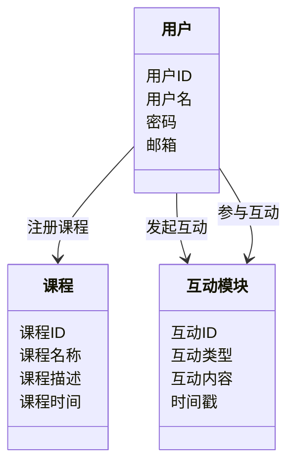
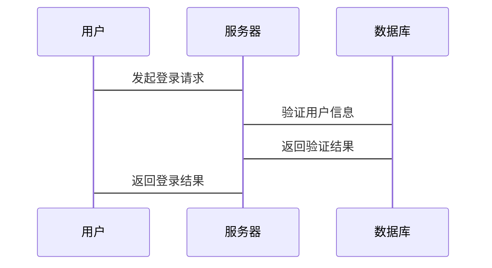

                 


# 企业估值中的AR/VR远程教育平台评估

> **关键词**：企业估值、AR/VR、远程教育、技术评估、数学模型

> **摘要**：本文系统地探讨了AR/VR技术在远程教育中的应用及其对企业估值的影响。通过分析AR/VR远程教育平台的核心技术、系统架构、评估方法和实际案例，本文提供了从理论到实践的全面指导，帮助读者理解如何在企业估值过程中评估AR/VR远程教育平台的价值。

---

# 引言

## 1.1 本书的目的与意义

### 1.1.1 为什么需要评估AR/VR远程教育平台

随着技术的进步，远程教育已经成为教育领域的重要组成部分。AR（增强现实）和VR（虚拟现实）技术的引入，进一步提升了远程教育的沉浸感和互动性。然而，如何评估这些技术在企业中的价值，尤其是在企业估值过程中，成为一个重要挑战。本文旨在为企业提供一套系统化的评估方法，帮助他们更好地理解和应用AR/VR远程教育技术。

### 1.1.2 本书的核心内容与目标

本文将从技术原理、系统架构、评估方法等多个方面，详细探讨AR/VR远程教育平台的评估问题。通过理论分析和实际案例，本文旨在为企业提供一套科学的评估框架，帮助他们在企业估值过程中准确评估AR/VR远程教育平台的价值。

### 1.1.3 读者对象与预期收获

本文适合从事企业估值、教育技术研究以及AR/VR技术研发的专业人士阅读。通过本文，读者可以掌握AR/VR远程教育的核心技术、评估方法和实际应用，从而在企业估值中做出更明智的决策。

---

# 第二部分: AR/VR远程教育平台的背景与概述

## 2.1 AR/VR技术的基本概念与原理

### 2.1.1 AR与VR的定义与区别

- **AR（增强现实）**：通过计算机生成的虚拟信息，增强现实世界中的体验。例如，将虚拟物体叠加在真实环境中。
- **VR（虚拟现实）**：创建一个完全虚拟的环境，让用户沉浸其中，感受身临其境的体验。

### 2.1.2 AR/VR的核心技术与实现原理

#### AR/VR的核心技术
- **传感器技术**：用于捕捉用户的动作、位置和环境信息。
- **图形渲染技术**：用于生成高质量的虚拟图像。
- **交互技术**：实现用户与虚拟环境的实时互动。

### 2.1.3 AR/VR在教育中的优势与劣势

#### 优势
- 提供沉浸式学习体验，增强学习效果。
- 支持实时互动，提升教学效率。
- 个性化学习，满足不同学生的需求。

#### 劣势
- 技术门槛高，实施成本高。
- 设备依赖性强，可能限制部分用户的使用。

## 2.2 远程教育平台的构成与功能

### 2.2.1 远程教育平台的主要组成部分

- **用户界面**：供教师和学生使用的界面，包括课程管理、互动功能等。
- **内容管理系统**：用于管理和发布教学内容。
- **实时互动模块**：支持视频通话、实时协作等功能。

### 2.2.2 平台的核心功能模块

- **课程管理模块**：教师可以上传和管理课程内容。
- **用户管理模块**：管理教师和学生的账户信息。
- **互动模块**：支持实时视频通话、白板协作等。

### 2.2.3 平台的用户角色与交互流程

- **用户角色**：教师、学生、管理员。
- **交互流程**：学生登录、进入课程、与教师互动、完成作业、提交反馈。

## 2.3 企业估值中的技术评估要点

### 2.3.1 技术评估的基本原则

- **技术可行性**：评估平台的技术实现是否可行。
- **用户满意度**：评估平台的用户体验是否良好。
- **经济回报**：评估平台的盈利能力。

### 2.3.2 评估指标与权重分配

- **技术指标**：系统稳定性、响应速度。
- **用户指标**：用户满意度、活跃度。
- **经济指标**：收入、成本、利润率。

### 2.3.3 评估方法的选择与应用

- **定性评估**：通过问卷调查、用户反馈等方式评估用户体验。
- **定量评估**：通过数据分析、财务指标等方式评估经济回报。

---

# 第三部分: AR/VR技术在教育中的应用

## 3.1 沉浸式学习体验的实现

### 3.1.1 AR/VR如何提升学习体验

- **沉浸式学习**：通过虚拟现实技术，学生可以身临其境地体验学习场景，例如历史事件的重现。
- **互动性**：学生可以通过手势或语音与虚拟环境互动，提升学习的趣味性和参与度。

### 3.1.2 沉浸式学习的案例分析

- **案例1**：历史课中，学生通过VR设备“亲历”古代战场。
- **案例2**：科学课中，学生通过AR设备观察分子结构。

### 3.1.3 技术实现的关键点

- **图形渲染**：高质量的虚拟场景需要强大的图形渲染技术支持。
- **交互设计**：设计直观、自然的交互方式，提升用户体验。

## 3.2 实时互动与协作功能

### 3.2.1 远程互动教学的实现方式

- **视频通话**：教师和学生可以通过视频通话进行实时互动。
- **虚拟白板**：教师和学生可以在虚拟白板上协作完成任务。

### 3.2.2 协作学习的场景与技术

- **协作场景**：学生可以在虚拟环境中共同完成实验、设计任务。
- **技术实现**：基于云计算的协作平台，支持多人实时协作。

### 3.2.3 互动功能的评估标准

- **响应速度**：互动功能的延迟是否影响用户体验。
- **稳定性**：系统是否稳定，能否支持多人同时在线。

## 3.3 数据分析与个性化学习

### 3.3.1 数据采集与处理技术

- **数据采集**：通过传感器采集学生的动作、行为数据。
- **数据分析**：利用机器学习算法分析学生的学习行为，提供个性化建议。

### 3.3.2 个性化学习算法的应用

- **推荐算法**：根据学生的学习情况推荐个性化学习内容。
- **适应性学习**：根据学生的学习进度动态调整教学内容。

### 3.3.3 数据驱动的教育决策

- **教学优化**：通过数据分析优化教学内容和教学方法。
- **学生评估**：通过数据分析评估学生的学习效果。

---

# 第四部分: 评估方法论

## 4.1 技术能力评估

### 4.1.1 技术实现的可行性分析

- **技术可行性**：评估平台的技术实现是否可行，是否具备实现目标功能的能力。
- **资源需求**：评估实现目标功能所需的人力、物力和财力资源。

### 4.1.2 平台性能的测试与优化

- **性能测试**：测试平台的响应速度、稳定性、吞吐量等指标。
- **优化策略**：根据测试结果优化系统性能，提升用户体验。

### 4.1.3 技术实现的创新性与独特性

- **创新性**：评估平台在技术实现上的创新点，是否具备独特的竞争优势。
- **独特性**：评估平台在市场上的独特性，是否具备差异化竞争优势。

## 4.2 用户参与度评估

### 4.2.1 用户行为分析

- **用户活跃度**：分析用户的登录频率、在线时长等指标。
- **用户互动频率**：分析用户之间的互动频率，例如提问次数、回答次数等。

### 4.2.2 用户满意度调查

- **满意度调查**：通过问卷调查、访谈等方式收集用户对平台的满意度反馈。
- **用户反馈分析**：分析用户反馈，找出平台的优缺点，为优化提供依据。

### 4.2.3 用户留存率分析

- **用户留存率**：分析用户的留存情况，评估平台的用户粘性。
- **用户流失原因分析**：分析用户流失的原因，优化平台功能和用户体验。

## 4.3 经济模型与收益预测

### 4.3.1 平台经济模型的设计

- **收入来源**：分析平台的收入来源，例如订阅费、广告费等。
- **成本结构**：分析平台的运营成本，例如服务器成本、人工成本等。

### 4.3.2 收益预测模型的建立

- **收益预测**：基于历史数据和市场分析，建立收益预测模型，预测未来的收益情况。
- **风险评估**：评估模型中的潜在风险，例如市场需求变化、竞争压力等。

### 4.3.3 投资回报分析

- **投资回报率（ROI）**：分析平台的投资回报率，评估投资的经济可行性。
- **盈利能力分析**：分析平台的盈利能力，评估平台的市场竞争力。

## 4.4 市场竞争力评估

### 4.4.1 市场定位与目标用户分析

- **市场定位**：分析平台在市场中的定位，确定目标用户群体。
- **目标用户分析**：分析目标用户的需求、行为习惯、消费能力等。

### 4.4.2 竞争对手分析

- **竞争对手分析**：分析市场上主要竞争对手的优势和劣势。
- **竞争优势分析**：评估平台相对于竞争对手的核心竞争优势。

### 4.4.3 市场前景分析

- **市场规模**：分析远程教育市场的规模和增长潜力。
- **市场趋势分析**：分析市场的发展趋势，评估平台的未来发展空间。

---

# 第五部分: 系统架构与技术实现

## 5.1 问题场景介绍

### 5.1.1 问题背景

- **问题背景**：远程教育平台需要支持大规模用户同时在线，提供高质量的互动体验。
- **技术挑战**：如何实现低延迟、高稳定性的实时互动，如何优化系统性能。

### 5.1.2 项目介绍

- **项目目标**：设计一个支持大规模用户的AR/VR远程教育平台，提供高质量的互动体验。
- **项目需求**：支持实时视频通话、虚拟白板协作、个性化学习等功能。

## 5.2 系统功能设计

### 5.2.1 领域模型设计



### 5.2.2 系统架构设计

```mermaid
client {
    用户界面
    本地渲染
}
server {
    应用服务器
    数据库
}
cloud {
    云服务
    第三方API
}
client --> server: 请求处理
server --> cloud: 数据存储与调用
client --> cloud: 实时互动
```

### 5.2.3 系统接口设计

- **API接口**：
  - `/api/register`：用户注册接口。
  - `/api/login`：用户登录接口。
  - `/api/course`：课程管理接口。
  - `/api/interaction`：互动模块接口。

### 5.2.4 系统交互流程



## 5.3 算法原理与实现

### 5.3.1 低延迟实时互动算法

#### 算法原理

- **算法目的**：减少互动延迟，提升用户体验。
- **实现方法**：采用分布式架构，利用边缘计算优化延迟。

#### 代码实现

```python
def optimize_delay():
    import asyncio
    import logging
    import websockets
    async def handle_message(websocket, path):
        async for message in websocket:
            # 处理消息
            processed_message = process(message)
            # 发送处理后的消息
            await websocket.send(processed_message)
    start_server = websockets.serve(handle_message, 'localhost', 8000)
    asyncio.get_event_loop().run_until_complete(start_server)
    asyncio.get_event_loop().run_forever()
```

### 5.3.2 用户行为分析算法

#### 算法原理

- **算法目的**：分析用户行为，提供个性化推荐。
- **实现方法**：基于机器学习的推荐算法，实时分析用户行为数据。

#### 代码实现

```python
import numpy as np
from sklearn.neighbors import NearestNeighbors

def user_behavior_analysis(user_data):
    # 数据预处理
    processed_data = preprocess(user_data)
    # 模型训练
    model = NearestNeighbors(n_neighbors=5).fit(processed_data)
    # 返回推荐结果
    return model.kneighbors(processed_data)
```

---

# 第六部分: 数学模型与评估指标

## 6.1 数学模型建立

### 6.1.1 用户参与度评估模型

#### 模型公式

$$
用户参与度 = \frac{活跃用户数}{总用户数} \times 100\%
$$

### 6.1.2 收益预测模型

#### 模型公式

$$
收益预测 = \beta_0 + \beta_1 \times 用户数 + \beta_2 \times 互动频率
$$

#### 参数解释

- $\beta_0$：基础收益。
- $\beta_1$：每增加一名用户带来的收益增加量。
- $\beta_2$：每增加一次互动带来的收益增加量。

### 6.1.3 经济回报评估模型

#### 模型公式

$$
经济回报 = 收入 - 成本
$$

---

# 第七部分: 项目实战

## 7.1 环境搭建

### 7.1.1 开发环境配置

- **操作系统**：推荐使用Linux或macOS。
- **开发工具**：推荐使用PyCharm或VS Code。
- **依赖安装**：安装Python、Websocket库、Mermaid图表生成工具等。

### 7.1.2 项目初始化

```bash
pip install websockets
pip install matplotlib
pip install numpy
pip install sklearn
```

## 7.2 核心实现

### 7.2.1 低延迟实时互动实现

```python
import websockets
import asyncio

async def handle_client(websocket, path):
    async for message in websocket:
        # 处理消息
        processed_message = process(message)
        # 发送处理后的消息
        await websocket.send(processed_message)

async def main():
    async with websockets.serve(handle_client, 'localhost', 8000) as server:
        await server.wait_closed()

asyncio.run(main())
```

### 7.2.2 用户行为分析与个性化推荐

```python
from sklearn import preprocessing

def preprocess(user_data):
    # 标准化数据
    scaler = preprocessing.StandardScaler().fit(user_data)
    return scaler.transform(user_data)

def recommend_system(user_data):
    # 训练推荐模型
    model = NearestNeighbors(n_neighbors=5).fit(user_data)
    # 返回推荐结果
    return model.kneighbors(user_data)
```

## 7.3 项目小结

### 7.3.1 项目总结

- **项目目标**：成功搭建了一个支持低延迟实时互动的AR/VR远程教育平台。
- **实现成果**：实现了用户行为分析和个性化推荐功能，提升了用户体验。

### 7.3.2 项目经验

- **经验总结**：技术实现需要结合具体场景，灵活调整架构设计。
- **问题解决**：在实际开发中，需要关注系统的可扩展性和可维护性。

---

# 第八部分: 结论与展望

## 8.1 总结

### 8.1.1 核心内容回顾

- **技术评估**：详细探讨了AR/VR远程教育平台的技术实现和评估方法。
- **系统架构**：设计了一个支持大规模用户的系统架构，确保了低延迟和高稳定性。
- **数学模型**：建立了一系列数学模型，用于评估用户参与度和经济回报。

### 8.1.2 主要结论

- AR/VR技术在远程教育中的应用前景广阔，能够显著提升学习体验。
- 企业估值中的技术评估需要结合具体场景，采用科学的方法和工具。

## 8.2 未来展望

### 8.2.1 技术发展

- **人工智能**：进一步融入AI技术，提升平台的智能化水平。
- **5G技术**：利用5G网络的高带宽和低延迟，优化实时互动体验。

### 8.2.2 应用拓展

- **行业扩展**：将AR/VR技术应用到更多行业，例如医疗、培训等领域。
- **国际化发展**：探索国际市场，拓展平台的应用范围。

## 8.3 最佳实践 Tips

### 8.3.1 关键 Tips

- **技术评估**：在评估过程中，要注重技术实现的可行性和经济回报的可持续性。
- **用户体验**：始终以用户体验为核心，优化平台的功能和交互设计。
- **持续优化**：根据用户反馈和市场变化，持续优化平台的功能和性能。

### 8.3.2 注意事项

- **数据安全**：高度重视用户数据的安全性，防止数据泄露。
- **合规性**：确保平台的运营符合相关法律法规，避免法律风险。

### 8.3.3 拓展阅读

- **推荐书籍**：《AR/VR技术与应用》、《企业估值方法论》。
- **推荐网站**：TechCrunch、VentureBeat、CSDN。

---

# 作者

**作者**：AI天才研究院/AI Genius Institute & 禅与计算机程序设计艺术/Zen And The Art of Computer Programming

---

**声明**：本文内容基于公开资料整理，仅供学习和研究使用，如有侵权，请联系删除。

