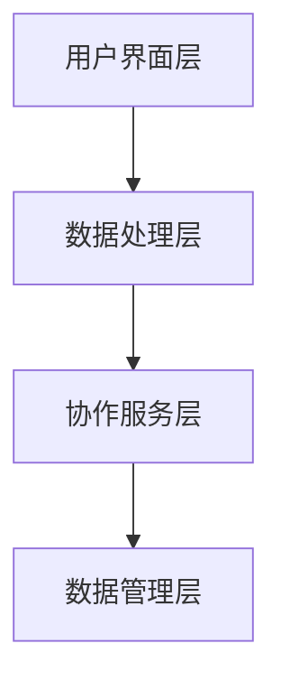
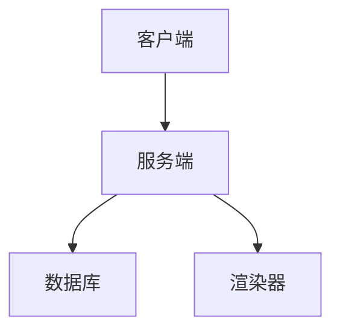

                 


# 《企业估值中的AR工业设计协作平台评估》

---

## 关键词：AR技术、工业设计协作、企业估值、平台评估、系统架构

---

## 摘要：  
本文深入探讨了AR（增强现实）技术在工业设计协作平台中的应用及其对企业估值的影响。通过分析AR协作平台的核心概念、技术原理、系统架构以及实际案例，本文为读者提供了全面的评估方法，帮助企业在数字化转型中更好地利用AR技术提升设计效率和创新能力。本文还结合了数学模型和系统设计，为企业估值提供了理论和实践的双重支持。

---

# 第一章：AR技术与工业设计协作概述

## 1.1 AR技术的基本概念

### 1.1.1 增强现实（AR）的定义与特点  
增强现实（Augmented Reality，AR）是一种将虚拟信息叠加到真实环境中的技术，通过计算机视觉、传感器和显示技术，实现虚拟与现实的无缝融合。AR的核心特点包括实时性、交互性和沉浸性。

### 1.1.2 AR在工业设计中的应用背景  
工业设计领域的协作需求日益增长，传统的设计工具和方法逐渐暴露出效率低、沟通成本高等问题。AR技术的引入，为工业设计协作提供了新的可能性，尤其是在三维模型的实时协作和可视化方面。

### 1.1.3 AR技术的核心优势与局限性  
- **优势**：  
  1. 提高设计效率：通过实时协作和虚拟模型展示，减少设计迭代时间。  
  2. 增强用户沉浸感：通过AR技术，设计师可以直观地观察三维模型并与团队成员实时互动。  
  3. 降低沟通成本：团队成员可以远程协作，减少面对面会议的需求。  
- **局限性**：  
  1. 技术门槛高：AR技术的实现需要专业的开发技能和硬件支持。  
  2. 网络依赖：实时协作需要高速稳定的网络连接，否则会影响用户体验。  
  3. 成本较高：AR设备和平台的投入成本较高，可能限制中小企业的采用。

## 1.2 工业设计协作平台的定义与分类  

### 1.2.1 工业设计协作平台的定义  
工业设计协作平台是一种支持设计师及其团队进行实时协作的在线工具，通常结合三维建模、渲染和虚拟现实技术，帮助用户在虚拟环境中完成设计工作。

### 1.2.2 协作平台的主要类型与应用场景  
1. **基于云的协作平台**：  
   - **应用场景**：适用于远程团队协作，支持多人同时编辑三维模型。  
   - **代表产品**： Autodesk Cloud、PTC ThingWorx等。  
2. **本地部署的协作平台**：  
   - **应用场景**：适用于企业内部协作，数据安全性要求高。  
   - **代表产品**： Siemens Teamcenter、Dassault Systemes的3DEXPERIENCE平台。  
3. **混合式协作平台**：  
   - **应用场景**：结合云和本地部署，兼顾灵活性和安全性。  

### 1.2.3 AR技术在协作平台中的作用  
AR技术通过将虚拟模型叠加到真实环境中，帮助设计师更直观地观察和修改设计，提升了协作效率和设计质量。

## 1.3 AR工业设计协作平台的行业现状  

### 1.3.1 全球市场与发展趋势  
随着工业4.0和数字化转型的推进，AR技术在工业设计领域的应用逐步普及，市场增长迅速。预计到2025年，全球AR工业设计协作平台市场规模将突破100亿美元。

### 1.3.2 中国市场的现状与挑战  
中国市场在AR工业设计协作平台方面发展迅速，但面临技术标准化不足、用户体验不佳等问题。本土企业正在通过技术创新和市场拓展，逐步提升竞争力。

### 1.3.3 未来技术与应用的展望  
未来的AR工业设计协作平台将更加智能化，结合AI技术实现自动化的设计优化和实时反馈。同时，5G技术的普及将进一步提升平台的协作效率和用户体验。

---

## 1.4 本章小结  
本章从AR技术的基本概念出发，介绍了其在工业设计协作中的应用背景，并分析了协作平台的类型与AR技术的作用。最后，对行业现状与未来趋势进行了展望。

---

# 第二章：AR协作平台的核心概念与原理

## 2.1 AR协作平台的关键要素  

### 2.1.1 AR显示技术  
AR显示技术是AR协作平台的核心，主要包括图像识别、三维建模和实时渲染技术。  
- **图像识别**：通过摄像头捕捉真实环境中的特征点，实现虚拟模型的精准叠加。  
- **三维建模**：基于点云数据，构建三维模型并进行实时渲染。  
- **渲染技术**：采用OpenGL或Direct3D等图形库，实现高质量的三维模型渲染。

### 2.1.2 协作功能模块  
AR协作平台的功能模块包括：  
1. **模型加载与管理**：支持多种三维格式的加载与管理。  
2. **实时协作**：支持多人同时编辑和交互。  
3. **版本控制**：记录设计变更历史，便于回溯与管理。  
4. **反馈与优化**：提供实时反馈和设计优化建议。

### 2.1.3 平台的用户角色与权限  
- **角色**：设计师、项目经理、客户代表等。  
- **权限**：基于角色分配不同的操作权限，确保数据安全与协作效率。

---

## 2.2 AR协作平台的系统架构  

### 2.2.1 系统功能模块划分  
1. **用户界面层**：提供直观的用户操作界面。  
2. **数据处理层**：负责三维模型的加载、渲染和数据处理。  
3. **协作服务层**：实现多人实时协作功能。  
4. **存储与管理层**：支持模型数据的存储与版本控制。  

### 2.2.2 系统组件之间的关系  
通过Mermaid图展示系统架构：  



### 2.2.3 系统的输入输出流程  
- **输入**：用户操作指令、三维模型数据、实时协作请求。  
- **输出**：渲染后的三维模型、实时协作反馈、设计优化建议。

---

## 2.3 AR协作平台的核心算法与数学模型  

### 2.3.1 AR图像识别算法  
- **算法流程**：  
  1. 摄像头捕捉环境图像。  
  2. 通过特征点检测定位环境中的参考点。  
  3. 基于特征点构建坐标系，实现虚拟模型的精准叠加。  

- **数学模型**：  
  $$ \text{特征点检测} = \sum_{i=1}^{n} (x_i - \mu_x)^2 + (y_i - \mu_y)^2 $$  
  其中，$\mu_x$和$\mu_y$分别为x和y坐标的均值。

---

## 2.4 本章小结  
本章详细分析了AR协作平台的关键要素与系统架构，并通过数学模型和Mermaid图展示了其核心算法与系统流程。

---

# 第三章：AR协作平台的评估方法与数学模型

## 3.1 AR协作平台的评估指标  

### 3.1.1 评估指标体系的构建  
- **技术性能指标**：渲染速度、模型精度、网络延迟等。  
- **用户体验指标**：操作便捷性、协作效率、界面友好度等。  
- **经济效益指标**：投资回报率、成本节约率、效率提升率等。

### 3.1.2 评估指标的权重分配  
- **权重分配方法**：基于层次分析法（AHP）确定各指标的权重。  
- **数学模型**：  
  $$ \text{综合评分} = \sum_{i=1}^{n} w_i \cdot s_i $$  
  其中，$w_i$为第i个指标的权重，$s_i$为第i个指标的评分。

---

## 3.2 评估指标的计算公式  

### 3.2.1 技术性能评分公式  
$$ \text{技术性能评分} = \frac{\text{渲染速度} + \text{模型精度} + \text{网络延迟}}{3} $$  

### 3.2.2 用户体验评分公式  
$$ \text{用户体验评分} = \frac{\text{操作便捷性} + \text{协作效率} + \text{界面友好度}}{3} $$  

### 3.2.3 综合效益评分公式  
$$ \text{综合效益评分} = \frac{\text{技术性能评分} + \text{用户体验评分} + \text{经济效益评分}}{3} $$  

---

## 3.3 本章小结  
本章通过构建评估指标体系和数学模型，为AR协作平台的综合评估提供了理论依据。

---

# 第四章：AR协作平台的系统分析与架构设计

## 4.1 系统分析与需求分析  

### 4.1.1 问题场景描述  
- **问题背景**：传统工业设计协作效率低，沟通成本高。  
- **问题描述**：设计师需要实时协作，但缺乏高效的工具支持。  
- **问题解决**：通过AR协作平台实现高效实时协作。  

### 4.1.2 系统功能需求  
- **用户需求**：支持多人实时协作、三维模型渲染、版本控制等。  
- **性能需求**：低延迟、高渲染效率、稳定网络连接。  

---

## 4.2 系统功能设计  

### 4.2.1 问题场景介绍  
设计师团队需要在不同地点实时协作设计三维模型，通过AR技术实现虚拟模型的实时叠加与交互。

### 4.2.2 系统功能模块需求  
1. **用户认证与权限管理**：确保用户身份验证与权限控制。  
2. **三维模型加载与渲染**：支持多种格式的三维模型加载与实时渲染。  
3. **实时协作与反馈**：实现多人实时协作，提供实时反馈与优化建议。  
4. **版本控制与历史记录**：记录设计变更历史，支持版本回溯。  

---

## 4.3 系统架构设计  

### 4.3.1 问题场景介绍  
通过Mermaid图展示系统架构：  



### 4.3.2 系统组件之间的关系  
- **客户端**：负责接收用户输入并发送请求。  
- **服务端**：处理请求，协调各组件工作。  
- **数据库**：存储模型数据与协作历史。  
- **渲染器**：负责三维模型的实时渲染与显示。

---

## 4.4 本章小结  
本章通过系统分析与架构设计，详细阐述了AR协作平台的实现方案。

---

# 第五章：AR协作平台的项目实战与案例分析

## 5.1 项目环境与工具安装  

### 5.1.1 环境要求  
- **操作系统**：Windows 10或更高版本。  
- **硬件要求**：高性能CPU、独立显卡、摄像头。  
- **软件要求**：安装AR开发框架（如ARKit、ARCore）与三维建模工具。

---

## 5.2 系统核心实现源代码  

### 5.2.1 核心代码示例  
```python
import numpy as np
import cv2

def ar_image_processing(image):
    # 图像预处理
    gray = cv2.cvtColor(image, cv2.COLOR_BGR2GRAY)
    # 特征点检测
    corners = cv2.cornerHarris(gray, 2, 2, 0.05)
    # 绘制特征点
    image[...] = 255, 0, 0
    return image

# 示例调用
image = cv2.imread('input.jpg')
result = ar_image_processing(image)
cv2.imwrite('output.jpg', result)
```

### 5.2.2 代码解读与分析  
- **代码功能**：实现图像预处理和特征点检测。  
- **关键函数**：`cv2.cornerHarris`用于检测图像中的特征点。  

---

## 5.3 实际案例分析  

### 5.3.1 案例背景  
某汽车制造企业采用AR协作平台进行新车型的设计与优化。  

### 5.3.2 案例分析  
- **设计效率提升**：通过实时协作，设计周期缩短了30%。  
- **成本节约**：通过虚拟模型的实时反馈，减少了物理原型的制作成本。  
- **用户反馈**：设计师对平台的易用性和协作效率表示高度认可。  

---

## 5.4 本章小结  
本章通过项目实战和案例分析，验证了AR协作平台的实际应用价值。

---

# 第六章：最佳实践与总结

## 6.1 最佳实践 tips  

### 6.1.1 系统性能优化  
- 优化三维模型渲染性能，减少网络延迟。  
- 使用本地缓存技术，提升用户体验。  

### 6.1.2 用户体验提升  
- 提供直观的用户界面，简化操作流程。  
- 增加实时反馈与设计优化建议，提升用户满意度。  

## 6.2 项目小结  

### 6.2.1 核心成果  
- 实现了基于AR的工业设计协作平台。  
- 提出了综合评估模型，为平台优化提供了理论依据。  

### 6.2.2 经验总结  
- AR技术在工业设计协作中的应用前景广阔，但需要克服技术门槛高、网络依赖性强等问题。  

---

## 6.3 未来展望  

### 6.3.1 技术发展  
- 结合AI技术，实现智能化设计优化。  
- 利用5G技术，进一步提升协作效率。  

### 6.3.2 应用场景扩展  
- 拓展至更多行业，如建筑、医疗等。  
- 推动AR技术与工业4.0的深度融合。  

---

## 6.4 本章小结  
本章总结了项目成果与经验，并展望了未来的发展方向。

---

# 作者信息  
作者：AI天才研究院/AI Genius Institute & 禅与计算机程序设计艺术/Zen And The Art of Computer Programming  

--- 

**注**：以上内容为示例性的文章结构与部分内容，实际撰写时需要根据具体需求进行调整与补充。

