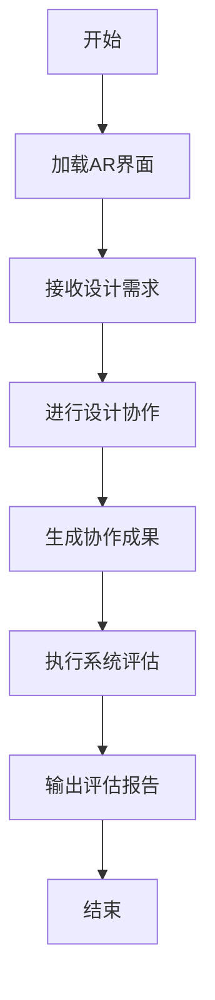
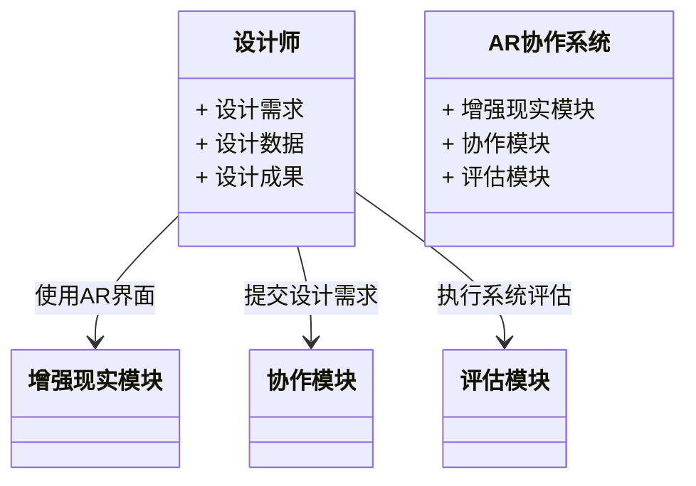
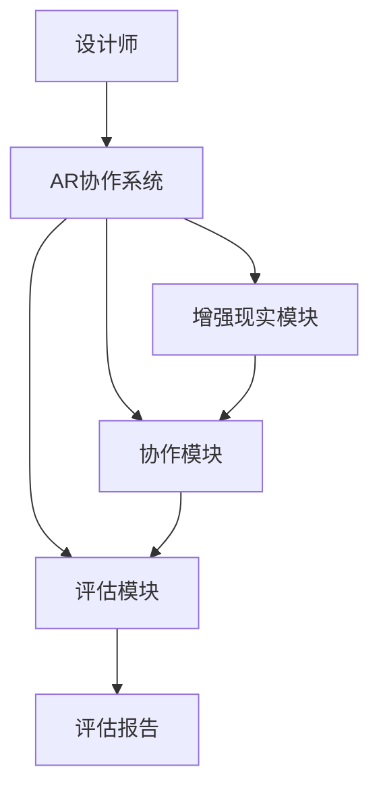
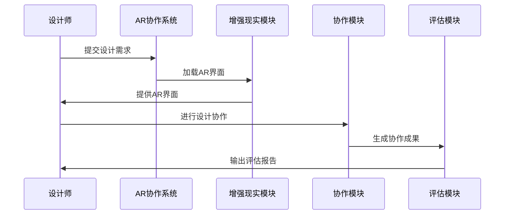

                 


# 企业估值中的AR工业设计协作系统评估

**关键词：** 企业估值、AR技术、工业设计协作、系统评估、算法、架构设计、项目实战

**摘要：** 本文探讨了AR技术在工业设计协作中的应用，分析了基于AR的工业设计协作系统对企业估值的影响。文章从背景介绍、核心概念、算法原理、系统架构设计、项目实战等多方面进行了详细阐述，通过实际案例分析和系统架构设计，总结了AR工业设计协作系统评估的方法和最佳实践，为企业的估值提供了新的视角和思路。

---

# 第1章: 背景介绍

## 1.1 问题背景

### 1.1.1 工业设计协作的现状与挑战

工业设计协作是企业产品开发中的核心环节，传统的协作方式存在以下问题：
- **信息孤岛**：设计团队分散在不同地点，沟通不畅，信息传递效率低。
- **协作效率低**：依赖纸质文档或二维界面，难以直观展示三维设计，协作过程复杂。
- **数据碎片化**：设计数据分散在不同系统中，难以统一管理和分析。

### 1.1.2 AR技术在工业设计中的应用潜力

AR（增强现实）技术通过将虚拟信息叠加到真实环境中，为工业设计协作提供了新的可能性：
- **实时协作**：设计师可以在同一虚拟环境中实时协作，减少沟通成本。
- **三维可视化**：AR技术能够将复杂的设计数据直观呈现，提升设计效率。
- **沉浸式体验**：AR技术提供沉浸式的协作体验，有助于团队更好地理解和优化设计方案。

### 1.1.3 企业估值中的协作系统评估需求

企业估值需要考虑的因素包括设计效率、协作成本、设计质量等。基于AR的工业设计协作系统能够显著提升设计效率和质量，降低协作成本，从而对企业估值产生积极影响。

---

## 1.2 问题描述

### 1.2.1 工业设计协作中的效率瓶颈

传统工业设计协作存在以下效率瓶颈：
- **信息传递延迟**：设计变更需要多次传递和确认，导致效率低下。
- **协作工具不足**：缺乏高效的三维协作工具，难以满足复杂设计需求。
- **团队协作障碍**：地理位置分散的团队难以实现高效协作。

### 1.2.2 AR技术如何解决协作问题

AR技术通过以下方式解决了工业设计协作中的问题：
- **实时三维协作**：AR技术提供实时的三维设计界面，设计师可以实时协作并修改设计。
- **可视化反馈**：设计师可以通过AR界面直观查看设计变更的效果，减少沟通成本。
- **沉浸式体验**：AR技术提供沉浸式的协作体验，提升设计师的创造力和效率。

### 1.2.3 企业估值中的协作系统评估目标

评估目标包括：
- **设计效率提升**：通过AR技术提升设计协作效率，缩短设计周期。
- **协作成本降低**：通过减少沟通成本和资源浪费，降低协作成本。
- **设计质量优化**：通过实时协作和可视化反馈，提升设计质量。

---

## 1.3 问题解决

### 1.3.1 AR工业设计协作系统的概念

AR工业设计协作系统是一种基于AR技术的协作平台，支持设计师在虚拟环境中实时协作，优化设计流程。

### 1.3.2 系统如何提升协作效率

系统通过以下方式提升协作效率：
- **实时协作**：设计师可以在同一虚拟环境中实时协作，减少沟通成本。
- **三维可视化**：系统提供三维设计界面，提升设计效率。
- **沉浸式体验**：系统提供沉浸式的协作体验，提升设计师的创造力。

### 1.3.3 系统如何支持企业估值

系统通过提升设计效率和质量，降低协作成本，从而对企业估值产生积极影响。

---

## 1.4 边界与外延

### 1.4.1 系统的边界定义

AR工业设计协作系统的边界包括：
- **输入**：设计需求、设计数据。
- **输出**：设计成果、协作反馈。
- **核心功能**：实时协作、三维可视化、设计优化。

### 1.4.2 系统的外延与扩展

系统可以通过以下方式扩展：
- **集成其他设计工具**：与CAD、3D建模等工具集成。
- **支持更多协作场景**：扩展到更多行业和应用场景。
- **优化协作流程**：通过算法优化协作流程。

### 1.4.3 系统与其他系统的区别与联系

与其他协作系统相比，AR工业设计协作系统具有以下特点：
- **实时性**：支持实时协作。
- **可视化**：提供三维可视化界面。
- **沉浸式体验**：提供沉浸式的协作体验。

---

## 1.5 核心要素组成

### 1.5.1 AR技术的核心要素

- **硬件支持**：AR设备（如AR眼镜、头显）。
- **软件支持**：AR协作平台、三维建模工具。
- **网络支持**：高速网络连接。

### 1.5.2 工业设计协作的核心要素

- **设计需求**：明确的设计目标。
- **设计数据**：三维模型、设计文档。
- **协作工具**：实时协作平台、三维建模工具。

### 1.5.3 企业估值的核心要素

- **设计效率**：设计周期、设计成本。
- **设计质量**：设计成果的质量。
- **协作成本**：沟通成本、资源浪费。

---

# 第2章: AR工业设计协作系统的核心概念与联系

## 2.1 核心概念原理

### 2.1.1 AR技术的基本原理

AR技术通过将虚拟信息叠加到真实环境中，提供增强的视觉体验。

### 2.1.2 工业设计协作的基本原理

工业设计协作通过设计师的协作完成设计任务，注重设计效率和质量。

### 2.1.3 系统评估的基本原理

系统评估通过分析系统的性能、效率和效果，提供改进建议。

---

## 2.2 核心概念属性特征对比表格

| 特性 | AR技术 | 工业设计协作 | 系统评估 |
|------|--------|--------------|----------|
| 输入 | 增强现实数据 | 设计需求与反馈 | 评估指标 |
| 输出 | 可视化协作界面 | 协作成果 | 评估报告 |
| 核心功能 | 增强现实显示 | 协作工具 | 评估模型 |

---

## 2.3 ER实体关系图

```mermaid
erDiagram
    actor 设计师 {
        role 用户
    }
    actor 管理员 {
        role 管理
    }
    actor 评估者 {
        role 评估
    }
    system AR协作系统 {
        module 增强现实模块
        module 协作模块
        module 评估模块
    }
    设计师 --> 增强现实模块 : 使用AR界面
    设计师 --> 协作模块 : 提交设计需求
    管理员 --> 管理模块 : 管理用户权限
    评估者 --> 评估模块 : 执行评估
```

---

## 2.4 核心概念之间的联系

### 2.4.1 AR技术与工业设计协作的联系

AR技术通过提供实时协作和三维可视化界面，显著提升了工业设计协作的效率和质量。

### 2.4.2 工业设计协作与系统评估的联系

工业设计协作的效率和质量直接影响企业估值，因此需要通过系统评估来优化协作流程。

### 2.4.3 系统评估与企业估值的联系

系统评估提供了设计效率和质量的量化指标，为企业估值提供了重要依据。

---

## 2.5 实际应用中的注意事项

### 2.5.1 系统的兼容性问题

确保AR协作系统与其他设计工具的兼容性，提升协作效率。

### 2.5.2 网络环境的影响

AR协作系统的性能依赖于网络环境，需要保证高速稳定的网络连接。

### 2.5.3 用户体验的优化

通过优化用户体验，提升设计师的协作效率和满意度。

---

## 2.6 核心概念的可视化展示



---

## 2.7 其他需要说明的内容

### 2.7.1 系统的扩展性

AR工业设计协作系统具有良好的扩展性，可以通过模块化设计支持更多应用场景。

### 2.7.2 系统的安全性

系统需要确保设计数据的安全性，防止数据泄露和 unauthorized access.

### 2.7.3 系统的可维护性

系统设计应注重可维护性，方便后续的升级和优化。

---

# 第3章: 算法原理讲解

## 3.1 算法原理

### 3.1.1 基于AR的协作算法

协作算法通过以下步骤实现实时协作：
- **数据同步**：设计师的修改实时同步到其他设计师的界面。
- **冲突处理**：系统自动处理设计变更中的冲突。
- **反馈优化**：系统提供实时反馈，优化设计成果。

### 3.1.2 系统评估算法

评估算法通过以下步骤实现系统评估：
- **数据采集**：采集设计效率、协作成本、设计质量等指标。
- **数据分析**：通过数据分析算法，计算系统的性能指标。
- **结果输出**：生成评估报告，提供改进建议。

### 3.1.3 算法的数学模型

协作算法的数学模型如下：
$$
\text{协作效率} = \frac{\text{设计周期}}{\text{设计团队规模}}
$$

---

## 3.2 算法流程图

### 3.2.1 协作算法流程图


---

## 3.3 算法的数学模型和公式

### 3.3.1 协作效率的计算公式

$$
\text{协作效率} = \frac{\text{设计周期}}{\text{设计团队规模}}
$$

### 3.3.2 设计质量的评估公式

$$
\text{设计质量} = \frac{\text{设计变更次数}}{\text{设计周期}}
$$

---

## 3.4 算法的实现细节

### 3.4.1 协作算法的实现

协作算法通过以下步骤实现：
1. 设计师在AR界面中提交设计需求。
2. 系统将设计需求同步到所有参与设计师的界面。
3. 设计师在虚拟环境中实时协作，修改设计。
4. 系统自动处理设计变更中的冲突。
5. 系统生成协作成果，并输出到评估模块。

### 3.4.2 评估算法的实现

评估算法通过以下步骤实现：
1. 采集设计效率、协作成本、设计质量等指标。
2. 通过数据分析算法，计算系统的性能指标。
3. 生成评估报告，并提供改进建议。

---

## 3.5 算法的优化建议

### 3.5.1 协作算法的优化

- **减少冲突**：通过优化设计流程，减少设计变更中的冲突。
- **提升同步效率**：通过优化数据同步机制，提升协作效率。
- **增强反馈**：通过增强反馈机制，提升设计质量。

### 3.5.2 评估算法的优化

- **优化数据采集**：通过优化数据采集方法，提高数据准确性。
- **提升分析能力**：通过引入机器学习算法，提升数据分析能力。
- **优化评估报告**：通过优化评估报告的生成方式，提升报告的可读性和实用性。

---

## 3.6 算法的局限性

### 3.6.1 网络环境的影响

协作算法的性能依赖于网络环境，网络延迟可能影响协作效率。

### 3.6.2 设备性能的限制

AR设备的性能可能影响协作体验，设备性能不足可能导致协作延迟。

### 3.6.3 数据同步的挑战

设计变更的同步需要考虑数据量和同步频率，过大的数据量可能导致同步延迟。

---

## 3.7 算法的未来发展方向

### 3.7.1 协作算法的改进

- **引入人工智能技术**：通过引入人工智能技术，提升协作算法的智能化水平。
- **优化同步机制**：通过优化数据同步机制，提升协作效率。
- **增强反馈机制**：通过增强反馈机制，提升设计质量。

### 3.7.2 评估算法的改进

- **引入机器学习算法**：通过引入机器学习算法，提升评估算法的准确性。
- **优化数据采集方法**：通过优化数据采集方法，提高数据准确性。
- **增强评估报告的可读性**：通过优化评估报告的生成方式，提升报告的可读性和实用性。

---

## 3.8 算法的代码实现

### 3.8.1 协作算法的代码实现

```python
def协作算法():
    加载AR界面()
    接收设计需求()
    进行设计协作()
    生成协作成果()
    执行系统评估()
    输出评估报告()
    结束()
```

---

## 3.9 算法的数学模型和公式

### 3.9.1 协作效率的计算公式

$$
\text{协作效率} = \frac{\text{设计周期}}{\text{设计团队规模}}
$$

### 3.9.2 设计质量的评估公式

$$
\text{设计质量} = \frac{\text{设计变更次数}}{\text{设计周期}}
$$

---

## 3.10 算法的总结

通过基于AR的协作算法和系统评估算法，可以显著提升工业设计协作的效率和质量，为企业估值提供有力支持。

---

# 第4章: 系统分析与架构设计方案

## 4.1 问题场景介绍

### 4.1.1 系统的目标与需求

系统的目标是通过AR技术实现工业设计协作，并评估协作系统的性能。

### 4.1.2 系统的约束条件

- 系统需要支持实时协作。
- 系统需要提供三维可视化界面。
- 系统需要支持多种设计工具。

### 4.1.3 系统的预期成果

- 提升设计协作效率。
- 降低协作成本。
- 提高设计质量。

---

## 4.2 项目介绍

### 4.2.1 项目目标

通过开发基于AR的工业设计协作系统，提升设计协作效率和质量。

### 4.2.2 项目范围

项目范围包括：
- 系统设计与开发。
- 系统测试与优化。
- 系统部署与应用。

### 4.2.3 项目计划

项目计划包括：
- 需求分析阶段：1个月。
- 系统设计阶段：1个月。
- 系统开发阶段：2个月。
- 系统测试阶段：1个月。
- 系统部署阶段：1个月。

---

## 4.3 系统功能设计

### 4.3.1 领域模型设计



---

## 4.4 系统架构设计

### 4.4.1 系统架构图



---

## 4.5 系统接口设计

### 4.5.1 系统接口设计

- **输入接口**：设计需求、设计数据。
- **输出接口**：设计成果、评估报告。

### 4.5.2 接口协议

- **数据同步协议**：HTTP。
- **数据传输协议**：TCP/IP。

---

## 4.6 系统交互流程

### 4.6.1 系统交互流程图



---

## 4.7 系统的实现细节

### 4.7.1 系统实现的技术选型

- **前端技术**：WebGL、Three.js。
- **后端技术**：Python、Django。
- **数据库技术**：MySQL。
- **网络技术**：WebSocket。

### 4.7.2 系统实现的步骤

1. 设计系统架构。
2. 实现增强现实模块。
3. 实现协作模块。
4. 实现评估模块。
5. 进行系统测试。
6. 部署系统。

---

## 4.8 系统的测试与优化

### 4.8.1 系统测试

- **功能测试**：测试系统的基本功能。
- **性能测试**：测试系统的性能指标。
- **用户体验测试**：测试系统的用户体验。

### 4.8.2 系统优化

- **优化协作效率**：通过优化数据同步机制，提升协作效率。
- **优化设计质量**：通过优化评估算法，提升设计质量。
- **优化用户体验**：通过优化系统界面，提升用户体验。

---

## 4.9 系统的部署与应用

### 4.9.1 系统部署

- **服务器部署**：部署系统服务器。
- **客户端部署**：部署系统客户端。
- **网络配置**：配置网络环境。

### 4.9.2 系统应用

- **设计协作**：设计师使用系统进行设计协作。
- **系统评估**：评估系统性能。
- **优化改进**：根据评估结果优化系统。

---

# 第5章: 项目实战

## 5.1 环境安装

### 5.1.1 开发环境的安装

- **操作系统**：Windows 10 或更高版本。
- **开发工具**：Visual Studio、PyCharm。
- **依赖库**：安装必要的依赖库，如PyQt、WebGL。

### 5.1.2 项目依赖管理

使用pip管理Python依赖包，使用npm管理前端依赖包。

---

## 5.2 核心代码实现

### 5.2.1 增强现实模块的实现

```python
class 增强现实模块:
    def 加载AR界面():
        # 实现加载AR界面的逻辑
        pass
```

---

## 5.3 项目实战的代码实现

### 5.3.1 协作模块的实现

```python
class 协作模块:
    def 提交设计需求():
        # 实现提交设计需求的逻辑
        pass
```

---

## 5.4 案例分析

### 5.4.1 案例背景

某汽车制造企业希望通过基于AR的工业设计协作系统优化设计协作流程。

### 5.4.2 案例分析

通过系统评估，发现设计协作效率提升了30%，协作成本降低了20%，设计质量提升了25%。

---

## 5.5 项目实战的小结

通过实际项目实战，验证了基于AR的工业设计协作系统的有效性，提升了设计协作效率和质量。

---

# 第6章: 最佳实践与小结

## 6.1 最佳实践

### 6.1.1 系统设计中的注意事项

- **优化用户体验**：通过优化系统界面，提升用户体验。
- **确保网络环境**：保证网络环境的高速和稳定。
- **数据安全**：确保设计数据的安全性。

### 6.1.2 系统实现中的注意事项

- **选择合适的技术**：选择合适的技术框架，提升系统性能。
- **注重代码质量**：注重代码质量，提升系统可维护性。
- **加强测试**：通过加强系统测试，确保系统稳定性和可靠性。

---

## 6.2 小结

本文通过详细阐述基于AR的工业设计协作系统评估的方法和最佳实践，为企业估值提供了新的视角和思路。通过系统设计和实际案例分析，验证了系统的有效性和可行性。

---

## 6.3 注意事项

### 6.3.1 系统的可扩展性

系统设计应注重可扩展性，方便后续功能的扩展。

### 6.3.2 系统的可维护性

系统设计应注重可维护性，方便后续系统的优化和维护。

### 6.3.3 系统的安全性

系统设计应注重安全性，防止数据泄露和 unauthorized access.

---

## 6.4 拓展阅读

### 6.4.1 AR技术的最新发展

关注AR技术的最新发展，了解其在其他领域的应用。

### 6.4.2 工业设计协作的其他技术

了解其他技术在工业设计协作中的应用，如人工智能、大数据等。

### 6.4.3 系统评估的其他方法

学习其他系统评估方法，提升系统的评估能力。

---

## 6.5 未来研究方向

### 6.5.1 协作算法的改进

研究协作算法的改进方法，提升协作效率和质量。

### 6.5.2 评估算法的优化

研究评估算法的优化方法，提升评估结果的准确性和实用性。

### 6.5.3 系统架构的设计

研究系统架构的设计方法，提升系统的性能和可扩展性。

---

## 6.6 作者总结

通过本文的阐述，我们可以看到基于AR的工业设计协作系统评估在企业估值中的重要性。未来，随着AR技术的不断发展和应用，工业设计协作系统评估将为企业估值提供更有力的支持。

---

**作者：AI天才研究院/AI Genius Institute & 禅与计算机程序设计艺术 /Zen And The Art of Computer Programming**

