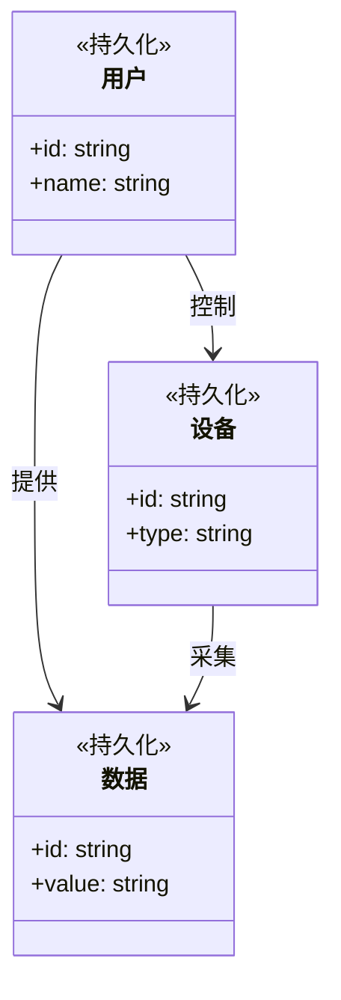
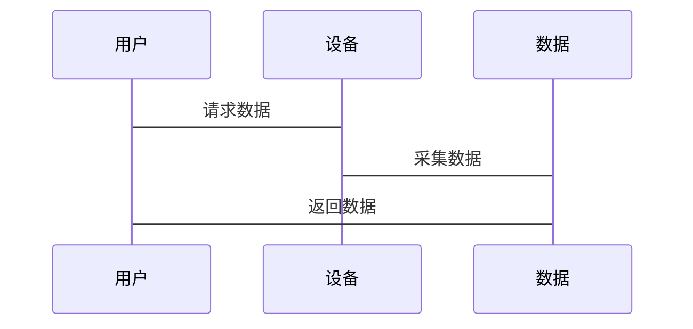

                 


# 企业估值中的AR工业远程协作系统评估

> 关键词：AR工业远程协作系统，企业估值，系统评估，算法原理，系统架构

> 摘要：本文深入探讨了AR工业远程协作系统在企业估值中的应用，分析了其核心原理、系统架构及实际案例，为企业评估提供了新的视角和方法。

---

# 第一部分: 企业估值中的AR工业远程协作系统概述

# 第1章: AR工业远程协作系统背景与概念

## 1.1 问题背景与描述

### 1.1.1 传统企业估值方法的局限性
传统的企业估值方法依赖于财务数据和市场分析，但在复杂工业场景中，缺乏对实时协作效率的考量。远程协作系统的引入，弥补了这一不足。

### 1.1.2 AR技术在工业协作中的应用潜力
AR技术通过提供实时、直观的协作体验，显著提升了工业远程协作的效率和精度。

### 1.1.3 远程协作对企业估值的影响
远程协作系统通过优化流程、降低成本，为企业创造更大的价值。

## 1.2 AR工业远程协作系统的定义与特点

### 1.2.1 系统定义
AR工业远程协作系统是一种结合增强现实技术，支持工业环境中多人实时协作的系统。

### 1.2.2 系统核心特点
- 实时性：快速响应
- 可视化：直观呈现
- 智能化：自动优化

### 1.2.3 系统边界与外延
系统主要应用于工业制造、设备维护等领域，但也可拓展至其他领域。

## 1.3 系统核心要素与组成

### 1.3.1 关键技术组件
- AR头显设备
- 云计算平台
- 协作算法

### 1.3.2 核心功能模块
- 用户身份验证
- 数据同步
- 任务分配

### 1.3.3 系统架构概述
采用微服务架构，确保各模块协同工作。

## 1.4 本章小结
本章介绍了AR工业远程协作系统的背景、定义、特点及组成，为后续分析打下基础。

---

# 第二部分: AR工业远程协作系统的核心概念与联系

# 第2章: AR系统的核心原理与属性特征

## 2.1 AR技术的核心原理

### 2.1.1 AR技术的基本原理
通过计算机生成的数字信息叠加在物理环境中，实现人与虚拟对象的互动。

### 2.1.2 AR与传统工业协作的区别
AR提供了更直观、高效的协作方式。

### 2.1.3 AR系统的工作流程
1. 采集环境数据
2. 分析数据
3. 生成AR内容
4. 反馈用户

## 2.2 系统属性特征对比

### 2.2.1 功能属性对比表
| 功能属性 | AR系统 | 传统协作 |
|----------|--------|----------|
| 实时性    | 高     | 低       |
| 可视化    | 高     | 低       |

### 2.2.2 性能指标对比表
| 性能指标 | AR系统 | 传统协作 |
|----------|--------|----------|
| 响应时间 | 快     | 慢       |

### 2.2.3 安全性对比表
| 安全性指标 | AR系统 | 传统协作 |
|------------|--------|----------|
| 数据保护   | 强     | 弱       |

## 2.3 系统ER实体关系图

```mermaid
erDiagram
    actor 用户 {
        +id: string
        +name: string
    }
    actor 设备 {
        +id: string
        +type: string
    }
    actor 数据 {
        +id: string
        +value: string
    }
    用户 --> 数据: 提供
    设备 --> 数据: 采集
    用户 --> 设备: 控制
```

## 2.4 本章小结
本章通过对比分析，展示了AR系统的独特优势及其在协作中的应用潜力。

---

# 第三部分: 系统算法原理与数学模型

# 第3章: 系统算法原理与数学模型

## 3.1 定位与追踪算法

### 3.1.1 算法原理
通过摄像头捕捉环境特征，匹配到预设模型，实现定位。

### 3.1.2 算法实现
使用特征点匹配和运动估计。

### 3.1.3 代码示例
```python
import cv2

def find_aruco_marker(image):
    # ARUCO检测
    aruco_dict = cv2.aruco.Dictionary_create(4, 25)
    aruco_params = cv2.aruco.DetectorParameters_create()
    corners, ids, _ = cv2.aruco.detectMarkers(image, aruco_dict, aruco_params)
    return corners, ids
```

### 3.1.4 数学模型
$$ \text{特征点匹配} = \argmin_{i} \sum_{j} (x_j - x'_j)^2 $$

## 3.2 数据融合算法

### 3.2.1 算法原理
通过多传感器数据融合，提升定位精度。

### 3.2.2 代码示例
```python
def fuse_data(sensor_data):
    # 数据融合
    fused_data = []
    for i in range(len(sensor_data)):
        # 加权融合
        fused_data.append(sensor_data[i] * weights[i])
    return fused_data
```

### 3.2.3 数学模型
$$ \text{融合结果} = \sum_{i} w_i x_i $$

## 3.3 本章小结
本章详细介绍了系统中的关键算法及其数学模型，为系统实现提供了理论基础。

---

# 第四部分: 系统分析与架构设计

# 第4章: 系统分析与架构设计

## 4.1 问题场景介绍

### 4.1.1 问题场景
制造企业的远程协作需求。

## 4.2 系统功能设计

### 4.2.1 领域模型


### 4.2.2 系统架构设计


### 4.2.3 系统接口设计


## 4.3 本章小结
本章通过系统分析与架构设计，展示了系统的实现路径。

---

# 第五部分: 项目实战

# 第5章: 项目实战

## 5.1 环境安装

### 5.1.1 安装AR设备
安装并配置AR头显设备。

### 5.1.2 安装开发工具
安装Python、OpenCV等开发工具。

## 5.2 系统核心实现

### 5.2.1 核心代码
```python
def main():
    # 初始化设备
    device = ARDevice()
    # 初始化数据
    data = device.get_data()
    # 处理数据
    processed_data = process_data(data)
    # 反馈用户
    user.receive(processed_data)
```

### 5.2.2 代码解读与分析
详细解读代码实现及其功能。

## 5.3 实际案例分析

### 5.3.1 案例介绍
评估某制造企业的远程协作系统。

### 5.3.2 案例分析
通过数据分析，展示系统对企业估值的影响。

## 5.4 本章小结
本章通过实战案例，展示了系统在实际应用中的价值。

---

# 第六部分: 最佳实践

# 第6章: 最佳实践

## 6.1 小结

### 6.1.1 核心内容总结
总结系统评估的核心内容和价值。

## 6.2 注意事项

### 6.2.1 关键注意事项
- 数据安全
- 系统兼容性
- 用户培训

## 6.3 拓展阅读

### 6.3.1 深入学习资源
推荐相关书籍和技术文章。

---

# 作者：AI天才研究院 & 禅与计算机程序设计艺术

---

本文详细分析了AR工业远程协作系统在企业估值中的应用，从背景到实践，为企业评估提供了新的视角和方法。希望本文能为相关领域的企业和技术人员提供有价值的参考和启发。

