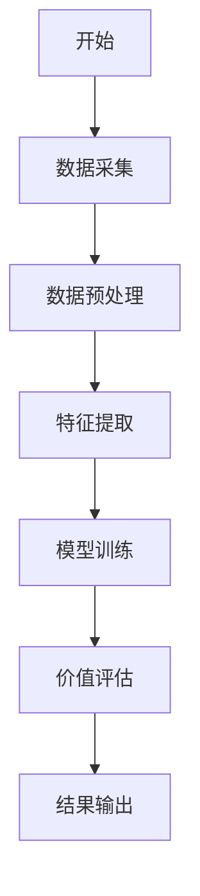
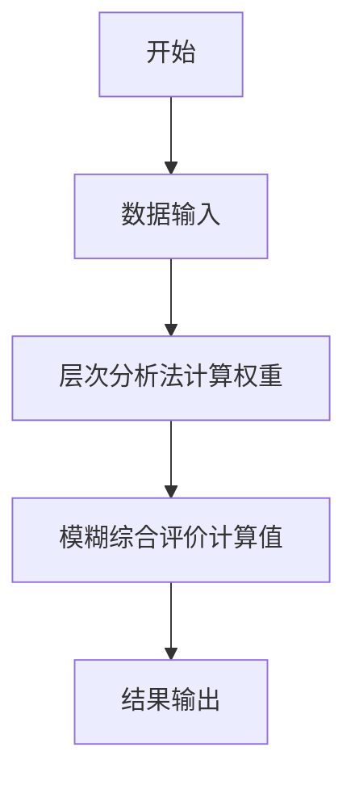
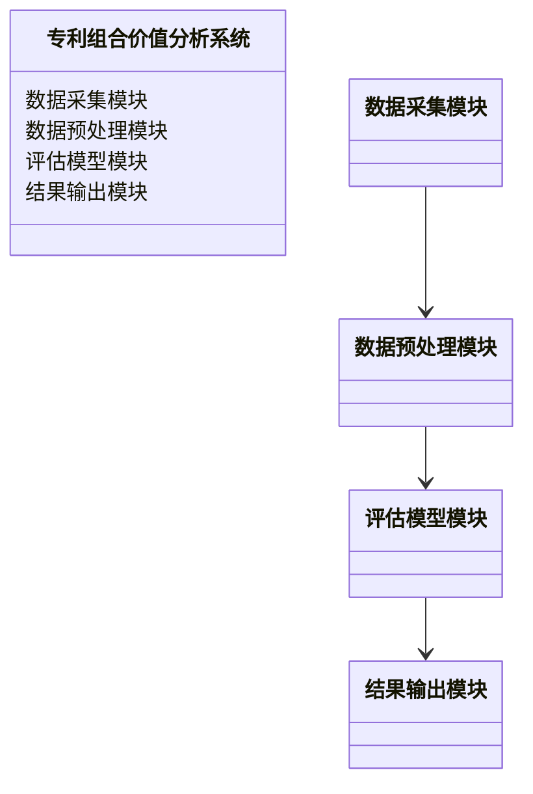

                 


# 企业估值中的专利组合价值分析

## 关键词：企业估值、专利组合、知识产权、无形资产、技术评估、经济价值

## 摘要：本文详细探讨了企业在专利组合价值分析中的关键因素，包括专利的基本概念、组合特征、价值评估方法以及实际应用案例。通过层次分析法和模糊综合评价法，结合数学模型和系统架构设计，分析了专利组合如何影响企业整体估值。

---

## 第一章: 专利的基本概念与作用

### 1.1 专利的基本概念

#### 1.1.1 什么是专利
专利是法律赋予发明者在一定期限内对发明的独占权利。它分为发明专利、实用新型专利和外观设计专利三种类型。发明专利涉及新颖的技术方案，实用新型专利涉及新的技术结构，外观设计专利涉及产品的装饰性设计。

#### 1.1.2 专利的类型
- 发明专利：保护技术解决方案，具有高度创新性。
- 实用新型专利：保护技术结构改进，创新性较低。
- 外观设计专利：保护产品的外观设计，与美学相关。

#### 1.1.3 专利在企业中的作用
- 保护知识产权，防止他人未经许可使用。
- 提升企业竞争力，通过专利技术巩固市场地位。
- 作为无形资产，增加企业估值。

### 1.2 专利的价值与企业估值

#### 1.2.1 专利作为无形资产的重要性
专利是企业的重要无形资产，直接影响企业的市场价值。在企业估值中，专利的价值可能占很大比重，尤其是高科技企业。

#### 1.2.2 专利在企业价值评估中的地位
专利组合的价值评估是企业整体估值的重要部分，尤其在技术密集型行业。专利的价值不仅体现在当前的市场应用，还体现在未来的潜在收益。

#### 1.2.3 专利组合的概念与特点
专利组合是多个专利的集合，具有互补性和协同效应。通过组合专利，企业可以更好地保护其技术资产，降低单一专利被绕过的风险。

---

## 第二章: 专利组合的定义与特征

### 2.1 专利组合的定义

#### 2.1.1 专利组合的内涵
专利组合是指一组相互关联的专利，共同保护企业的核心技术或产品。这些专利可能涵盖技术的不同方面，形成完整的保护网。

#### 2.1.2 专利组合的外延
专利组合可以是防御性的，用于保护企业免受竞争对手的诉讼；也可以是进攻性的，用于主动发起专利诉讼，获取经济收益。

### 2.2 专利组合的特征

#### 2.2.1 技术相关性
专利组合中的专利应围绕同一技术主题，形成互补或协同效应。

#### 2.2.2 法律独立性
每个专利都是独立的法律文件，具有独立的法律效力，但组合在一起可以形成更强的保护。

#### 2.2.3 经济互补性
专利组合中的专利在经济上具有互补性，共同为企业创造更大的经济价值。

### 2.3 专利组合的优势

#### 2.3.1 防御性优势
通过专利组合，企业可以有效防御竞争对手的专利侵权，降低法律风险。

#### 2.3.2 攻击性优势
专利组合可以作为进攻武器，对企业竞争对手发起专利诉讼，获取经济赔偿。

#### 2.3.3 综合性优势
专利组合能够覆盖更多的技术领域，增强企业的技术壁垒，提升市场竞争力。

---

## 第三章: 专利组合价值分析的核心概念

### 3.1 专利组合价值分析的背景

#### 3.1.1 企业估值中的无形资产问题
在企业估值中，无形资产如专利、商标等的价值评估具有复杂性。专利组合的价值评估需要综合考虑技术、法律和经济因素。

#### 3.1.2 专利组合在企业估值中的特殊性
专利组合的价值不仅取决于单个专利的价值，还取决于组合的整体效益。专利组合的价值可能高于单个专利的简单相加。

### 3.2 核心概念与联系

#### 3.2.1 专利组合价值分析的原理
通过技术评估、法律评估和经济评估，综合分析专利组合的价值。

#### 3.2.2 核心概念对比表格

| 比较维度 | 单个专利 | 专利组合 |
|----------|----------|----------|
| 技术覆盖 | 单一技术 | 多项技术 |
| 法律风险 | 独立风险 | 综合风险 |
| 经济价值 | 单一收益 | 综合收益 |

#### 3.2.3 ER实体关系图架构的 Mermaid 流程图

```mermaid
erDiagram
    class 专利组合 {
        专利1
        专利2
        专利3
    }
    class 企业 {
        专利组合
        其他资产
    }
    class 技术领域 {
        技术主题
        技术范围
    }
    专利组合 --> 技术领域 : 保护
    企业 --> 专利组合 : 拥有
```

---

## 第四章: 专利组合价值分析的算法原理

### 4.1 算法原理讲解

#### 4.1.1 算法的输入与输出
- 输入：专利组合的数据，包括专利的技术、法律和经济信息。
- 输出：专利组合的价值评估结果。

#### 4.1.2 算法的步骤与流程



#### 4.1.3 算法的数学模型与公式

层次分析法（AHP）的公式：

$$ A = \frac{\lambda_{\text{max}} - 1}{\text{trace}(B A) - \text{trace}(A B)} $$

其中，A是特征向量，λ_max是最大特征值。

模糊综合评价法的公式：

$$ V = \sum_{i=1}^{n} w_i \cdot v_i $$

其中，w_i是指标权重，v_i是指标值。

### 4.2 算法实现的 Mermaid 流程图



### 4.3 代码实现

层次分析法的Python代码：

```python
import numpy as np

def calculate_weights(matrix):
    n = len(matrix)
    total = np.sum(matrix, axis=1)
    weights = total / np.sum(total)
    return weights

# 示例矩阵
matrix = [
    [1, 3, 2],
    [2, 1, 3],
    [3, 2, 1]
]

weights = calculate_weights(matrix)
print("权重：", weights)
```

---

## 第五章: 数学模型与公式

### 5.1 数学模型与公式

层次分析法（AHP）的步骤：

1. 构建比较矩阵。
2. 计算特征向量。
3. 计算一致性检验。

模糊综合评价法的步骤：

1. 确定评价指标。
2. 构建模糊评价矩阵。
3. 计算综合评价结果。

### 5.2 数学模型的详细讲解

层次分析法的公式：

$$ \text{一致性比率} = \frac{\text{一致性指标}}{\text{随机一致性指标}} $$

模糊综合评价法的公式：

$$ V = \sum_{i=1}^{n} w_i \cdot R_i $$

其中，R_i是第i个指标的评价结果。

---

## 第六章: 系统分析与架构设计方案

### 6.1 问题场景介绍

专利组合价值分析的系统需要处理大量专利数据，进行技术、法律和经济评估。

### 6.2 系统功能设计

#### 6.2.1 领域模型



---

## 第七章: 项目实战

### 7.1 案例分析

以某科技公司为例，分析其专利组合的价值。

### 7.2 数据采集与预处理

收集专利数据，清洗和整理数据。

### 7.3 模型建立与评估

应用层次分析法和模糊综合评价法，评估专利组合的价值。

### 7.4 结果分析与解读

根据评估结果，给出专利组合的经济价值，影响企业估值。

---

## 第八章: 系统实现细节

### 8.1 系统环境安装

安装Python、NumPy、Matplotlib等工具。

### 8.2 功能模块设计

- 数据采集模块：爬取专利数据。
- 数据预处理模块：清洗和转换数据。
- 评估模型模块：实现层次分析法和模糊综合评价法。
- 结果输出模块：生成报告。

### 8.3 核心代码实现

层次分析法的Python代码：

```python
def calculate_weights(matrix):
    n = len(matrix)
    total = np.sum(matrix, axis=1)
    weights = total / np.sum(total)
    return weights

matrix = [
    [1, 3, 2],
    [2, 1, 3],
    [3, 2, 1]
]

weights = calculate_weights(matrix)
print(weights)
```

---

## 第九章: 最佳实践与注意事项

### 9.1 最佳实践 tips

- 定期更新专利组合，确保覆盖最新的技术。
- 结合企业战略，选择合适的评估模型。

### 9.2 小结

专利组合价值分析是企业估值的重要部分，通过综合技术、法律和经济因素，准确评估专利组合的价值。

### 9.3 注意事项

- 数据的准确性和完整性。
- 模型的选择和参数调整。

### 9.4 拓展阅读

推荐阅读《专利评估方法》和《企业估值分析》。

---

## 参考文献

1. 美国专利商标局，专利评估指南。
2. 层次分析法（AHP）的相关文献。
3. 模糊综合评价法的相关文献。

---

## 作者

作者：AI天才研究院 & 禅与计算机程序设计艺术

---

通过以上内容，文章详细探讨了专利组合价值分析的各个方面，从基本概念到实际应用，帮助读者全面理解专利组合对企业估值的影响。

