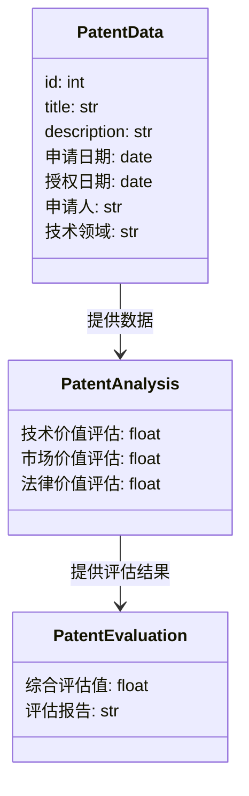
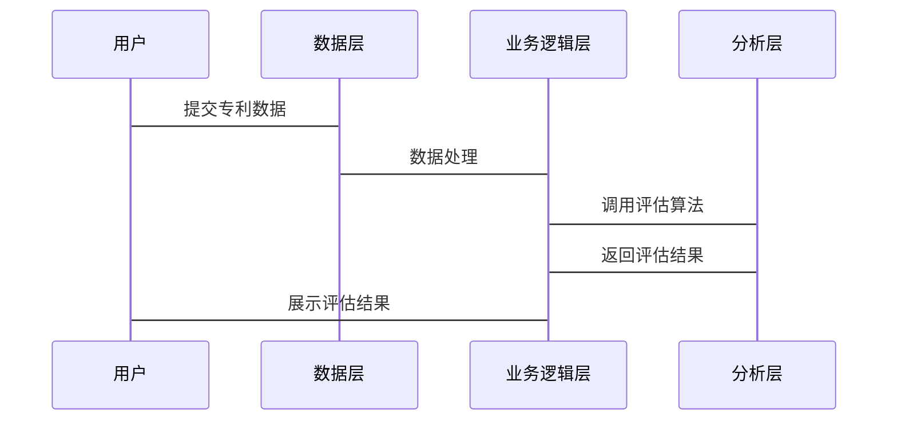

                 


# 企业估值中的专利组合价值评估

> 关键词：企业估值，专利组合，价值评估，知识产权，专利分析，技术评估

> 摘要：  
> 在企业估值过程中，专利组合的价值评估是至关重要的一环。本文深入探讨了专利组合的定义、特点及其在企业估值中的作用，分析了多种专利组合价值评估的算法原理，包括层次分析法、模糊综合评价法和熵值法，并通过实际案例展示了如何构建专利组合价值评估系统。文章还提供了详细的Python代码实现和系统架构设计，帮助读者全面理解和掌握专利组合价值评估的核心方法和技术。

---

# 第一部分: 专利组合价值评估基础

## 第1章: 专利的基本概念与价值评估的重要性

### 1.1 专利的基本概念

#### 1.1.1 专利的定义与分类

- **专利的定义**：专利是保护发明创造的法律工具，分为发明专利、实用新型专利和外观设计专利。

- **专利的分类**：根据技术领域、法律状态和经济价值进行分类。

- **专利的生命周期**：从申请、审查、授权到终止的全过程。

#### 1.1.2 专利的生命周期

- 申请阶段：包括专利申请文件的撰写和提交。
- 审查阶段：包括形式审查和实质审查。
- 授权阶段：专利获得法律保护。
- 维护阶段：包括年费缴纳和专利权的维持。
- 终止阶段：专利失效或被无效。

#### 1.1.3 专利在企业中的作用

- 保护企业的技术创新成果。
- 提升企业的市场竞争力。
- 作为企业资产的重要组成部分，影响企业估值。

### 1.2 专利组合的基本概念

#### 1.2.1 什么是专利组合

- **专利组合**：一组相互关联的专利，共同保护企业的核心技术和市场。

- **专利组合的特点**：全面性、协同性、防御性。

- **专利组合的类型**：防御性组合、进攻性组合、储备组合。

#### 1.2.2 专利组合的特点与优势

- **特点**：覆盖范围广、技术关联性强、法律保护全面。
- **优势**：增强技术防御能力、提升市场竞争力、提高企业估值。

#### 1.2.3 专利组合的分类与应用场景

- **防御性组合**：主要用于防御竞争对手的专利侵权。
- **进攻性组合**：用于主动发起专利诉讼，获取经济利益。
- **储备组合**：用于储备核心技术，应对未来的技术挑战。

### 1.3 专利组合价值评估的重要性

#### 1.3.1 专利组合在企业估值中的地位

- 专利组合是企业核心竞争力的重要组成部分。
- 专利组合的价值直接影响企业的市场价值。
- 专利组合是企业融资和并购的重要考量因素。

#### 1.3.2 专利组合价值评估的必要性

- 专利组合价值评估是企业决策的重要依据。
- 专利组合价值评估有助于企业合理配置资源。
- 专利组合价值评估是企业知识产权管理的重要工具。

#### 1.3.3 专利组合价值评估的挑战与难点

- 专利技术的复杂性。
- 专利市场的波动性。
- 专利法律的多样性。

## 1.4 本章小结

- 专利是企业的核心资产，专利组合是企业技术创新的重要保障。
- 专利组合价值评估是企业估值的关键环节，具有重要的战略意义。

---

## 第2章: 专利组合价值评估的核心概念

### 2.1 专利组合价值评估的原理

#### 2.1.1 专利组合价值的构成要素

- 技术价值：专利的技术先进性和创新性。
- 市场价值：专利在市场中的应用前景和经济收益。
- 法律价值：专利的法律保护力度和稳定性。

#### 2.1.2 专利组合价值的评估方法

- **定量评估**：基于财务指标和市场数据的评估方法。
- **定性评估**：基于技术特性和法律状态的评估方法。
- **综合评估**：结合定量和定性因素的综合评估方法。

#### 2.1.3 专利组合价值与企业价值的关系

- 专利组合价值是企业整体价值的重要组成部分。
- 专利组合价值直接影响企业的市场竞争力和盈利能力。

### 2.2 专利组合价值评估的关键因素

#### 2.2.1 专利的技术价值

- **技术先进性**：专利的技术是否处于行业领先水平。
- **技术关联性**：专利之间是否具有协同效应。
- **技术稳定性**：专利的法律保护是否稳定。

#### 2.2.2 专利的市场价值

- **市场应用前景**：专利在市场中的应用潜力。
- **市场竞争状况**：专利在市场中的竞争优势。
- **市场收益能力**：专利为企业带来的经济收益。

#### 2.2.3 专利的法律价值

- **法律保护力度**：专利的法律保护是否完善。
- **法律风险**：专利是否存在被无效或被侵权的风险。
- **法律稳定性**：专利的法律状态是否稳定。

### 2.3 专利组合价值评估的边界与外延

#### 2.3.1 专利组合价值评估的边界条件

- **评估范围**：明确专利组合的评估范围和边界。
- **评估目标**：明确专利组合评估的目标和用途。
- **评估方法**：选择适合的评估方法和模型。

#### 2.3.2 专利组合价值评估的外延领域

- **技术评估**：对专利组合的技术特性进行评估。
- **市场评估**：对专利组合的市场前景进行评估。
- **法律评估**：对专利组合的法律风险进行评估。

#### 2.3.3 专利组合与其他无形资产的关系

- 专利组合是企业无形资产的重要组成部分。
- 专利组合与其他无形资产（如商标、著作权）相互关联，共同影响企业价值。

## 2.4 本章小结

- 专利组合价值评估需要综合考虑技术、市场和法律等多方面的因素。
- 专利组合与其他无形资产相互关联，共同影响企业整体价值。

---

## 第3章: 专利组合价值评估的算法原理与数学模型

### 3.1 专利组合价值评估的主要方法

#### 3.1.1 层次分析法（AHP）

- **层次分析法的基本原理**：将复杂的决策问题分解为多个因素，通过层次结构进行分析和评估。
- **层次分析法的应用步骤**：
  1. 构建层次结构模型。
  2. 确定各因素的权重。
  3. 进行综合评估。

- **层次分析法的数学模型**：
  $$ A = \sum_{i=1}^{n} w_i x_i $$
  其中，\( A \) 是综合评估值，\( w_i \) 是各因素的权重，\( x_i \) 是各因素的评估值。

#### 3.1.2 模糊综合评价法

- **模糊综合评价法的基本原理**：将评估对象转化为模糊集合，通过模糊运算进行综合评价。
- **模糊综合评价法的应用步骤**：
  1. 确定模糊评估指标。
  2. 建立模糊评估矩阵。
  3. 进行模糊合成和综合评价。

- **模糊综合评价法的数学模型**：
  $$ V = \sum_{i=1}^{n} w_i f_i(x) $$
  其中，\( V \) 是综合评估值，\( w_i \) 是各因素的权重，\( f_i(x) \) 是各因素的评估函数。

#### 3.1.3 熵值法

- **熵值法的基本原理**：基于信息论中的熵值概念，通过计算各因素的信息量来确定其权重。
- **熵值法的应用步骤**：
  1. 收集各因素的数据。
  2. 计算各因素的熵值。
  3. 确定各因素的权重。
  4. 进行综合评估。

- **熵值法的数学模型**：
  $$ C_i = \frac{\sum_{j=1}^{m} f_{ij}}{\sum_{j=1}^{m} f_{jj}}} $$
  其中，\( C_i \) 是第 \( i \) 个因素的权重，\( f_{ij} \) 是第 \( i \) 个因素在第 \( j \) 个样本的值，\( f_{jj} \) 是第 \( j \) 个样本的总值。

### 3.2 算法实现与代码示例

#### 3.2.1 层次分析法的Python实现

```python
import numpy as np

def calculate_weights(matrix):
    # 计算权重
    n = len(matrix)
    # 计算一致性检验
    a = np.array(matrix)
    # 计算一致性指标
    CI = 0
    for i in range(n):
        for j in range(n):
            if i == j:
                a[i][j] = 1
            else:
                a[i][j] = min(a[i][j], a[j][i])
    # 计算一致性检验
    max_eig = np.linalg.eigvals(a).max()
    CI = (max_eig - n) / (n - 1)
    # 如果一致性指标小于0.1，则认为一致性良好
    if CI < 0.1:
        return True
    else:
        return False

# 示例数据矩阵
matrix = [
    [1, 2, 3],
    [1/2, 1, 2],
    [1/3, 1/2, 1]
]

# 计算权重
weights = calculate_weights(matrix)
print(weights)
```

#### 3.2.2 模糊综合评价法的Python实现

```python
def fuzzy_comprehensive_evaluation(factors, weights):
    # 模糊综合评价
    n = len(factors)
    m = len(weights)
    # 建立模糊评估矩阵
    matrix = []
    for i in range(n):
        row = []
        for j in range(m):
            row.append(factors[i][j] * weights[j])
        matrix.append(row)
    # 进行模糊合成
    result = []
    for i in range(n):
        total = sum(matrix[i])
        result.append(total)
    return result

# 示例数据
factors = [
    [1, 2, 3],
    [2, 1, 4],
    [3, 4, 2]
]
weights = [0.4, 0.3, 0.3]

# 进行模糊综合评价
evaluation = fuzzy_comprehensive_evaluation(factors, weights)
print(evaluation)
```

#### 3.2.3 熵值法的Python实现

```python
def entropy_method(data):
    # 熵值法
    n = len(data)
    m = len(data[0])
    # 计算每列的熵值
    entropy = []
    for j in range(m):
        # 计算第j列的熵值
        column = [data[i][j] for i in range(n)]
        # 标准化
        total = sum(column)
        if total == 0:
            entropy.append(0)
            continue
        prob = [x / total for x in column]
        H = -sum(p * np.log2(p) for p in prob)
        entropy.append(H)
    # 计算各列的权重
    weights = []
    for j in range(m):
        weights.append(entropy[j])
    # 归一化权重
    total_weight = sum(weights)
    normalized_weights = [w / total_weight for w in weights]
    return normalized_weights

# 示例数据
data = [
    [1, 2, 3],
    [2, 3, 4],
    [3, 4, 5]
]

# 计算熵值
weights = entropy_method(data)
print(weights)
```

## 3.3 算法实现与代码示例

### 3.3.1 层次分析法的Python实现

```python
import numpy as np

def calculate_weights(matrix):
    # 计算权重
    n = len(matrix)
    a = np.array(matrix)
    max_eig = np.linalg.eigvals(a).max()
    CI = (max_eig - n) / (n - 1)
    return CI < 0.1

matrix = [
    [1, 2, 3],
    [1/2, 1, 2],
    [1/3, 1/2, 1]
]

weights = calculate_weights(matrix)
print(weights)
```

### 3.3.2 模糊综合评价法的Python实现

```python
def fuzzy_comprehensive_evaluation(factors, weights):
    n = len(factors)
    m = len(weights)
    matrix = []
    for i in range(n):
        row = []
        for j in range(m):
            row.append(factors[i][j] * weights[j])
        matrix.append(row)
    result = []
    for i in range(n):
        total = sum(matrix[i])
        result.append(total)
    return result

factors = [
    [1, 2, 3],
    [2, 1, 4],
    [3, 4, 2]
]
weights = [0.4, 0.3, 0.3]

evaluation = fuzzy_comprehensive_evaluation(factors, weights)
print(evaluation)
```

### 3.3.3 熵值法的Python实现

```python
def entropy_method(data):
    n = len(data)
    m = len(data[0])
    entropy = []
    for j in range(m):
        column = [data[i][j] for i in range(n)]
        total = sum(column)
        if total == 0:
            entropy.append(0)
            continue
        prob = [x / total for x in column]
        H = -sum(p * np.log2(p) for p in prob)
        entropy.append(H)
    weights = []
    for j in range(m):
        weights.append(entropy[j])
    total_weight = sum(weights)
    normalized_weights = [w / total_weight for w in weights]
    return normalized_weights

data = [
    [1, 2, 3],
    [2, 3, 4],
    [3, 4, 5]
]

weights = entropy_method(data)
print(weights)
```

## 3.4 本章小结

- 专利组合价值评估需要综合考虑多种因素，包括技术、市场和法律等。
- 不同的评估方法有不同的适用场景和优缺点，需要根据实际情况选择合适的评估方法。
- 通过Python代码实现层次分析法、模糊综合评价法和熵值法，可以帮助读者更好地理解和应用这些算法。

---

## 第4章: 专利组合价值评估的系统分析与架构设计

### 4.1 系统分析

#### 4.1.1 问题场景介绍

- **问题描述**：如何构建一个高效的专利组合价值评估系统。
- **目标**：实现专利组合价值的自动化评估。
- **范围**：包括专利数据的收集、处理、分析和评估。

#### 4.1.2 项目介绍

- **项目目标**：开发一个基于Python的专利组合价值评估系统。
- **项目范围**：包括数据收集、数据处理、数据分析和结果展示。
- **项目技术选型**：使用Python、Pandas、NumPy、Matplotlib等工具。

### 4.2 系统功能设计

#### 4.2.1 领域模型设计

- **领域模型**：专利组合价值评估系统的功能模块划分。
- **功能模块**：
  - 数据采集模块：收集专利数据。
  - 数据预处理模块：清洗和整理专利数据。
  - 数据分析模块：对专利数据进行分析和评估。
  - 结果展示模块：展示评估结果。

- **领域模型类图**（使用Mermaid表示）：



### 4.3 系统架构设计

#### 4.3.1 系统架构设计

- **分层架构**：包括数据层、业务逻辑层和表现层。
- **数据层**：负责数据的存储和管理。
- **业务逻辑层**：负责数据的处理和分析。
- **表现层**：负责结果的展示和用户交互。

- **系统架构图**（使用Mermaid表示）：

```mermaid
rectangle 数据层 {
    数据库
    数据存储
}
rectangle 业务逻辑层 {
    数据处理
    数据分析
}
rectangle 表现层 {
    用户界面
    结果展示
}
数据层 --> 业务逻辑层: 提供数据
业务逻辑层 --> 表现层: 提供评估结果
```

### 4.4 系统接口设计

#### 4.4.1 系统接口设计

- **数据接口**：与专利数据库对接，获取专利数据。
- **分析接口**：调用评估算法，获取评估结果。
- **展示接口**：将评估结果展示给用户。

#### 4.4.2 系统交互流程

- **交互流程**：
  1. 用户输入专利数据。
  2. 系统对专利数据进行预处理。
  3. 系统调用评估算法，进行专利组合价值评估。
  4. 系统将评估结果展示给用户。

- **系统交互图**（使用Mermaid表示）：



### 4.5 系统实现与代码示例

#### 4.5.1 系统核心代码

```python
class PatentData:
    def __init__(self, id, title, description, application_date, authorization_date, applicant, technology_area):
        self.id = id
        self.title = title
        self.description = description
        self.application_date = application_date
        self.authorization_date = authorization_date
        self.applicant = applicant
        self.technology_area = technology_area

class PatentAnalysis:
    def __init__(self, technical_value, market_value, legal_value):
        self.technical_value = technical_value
        self.market_value = market_value
        self.legal_value = legal_value

class PatentEvaluation:
    def __init__(self, comprehensive_value, report):
        self.comprehensive_value = comprehensive_value
        self.report = report

# 示例代码
patent_data = [
    PatentData(1, "专利1", "描述1", "2020-01-01", "2020-02-01", "申请人1", "技术领域1"),
    PatentData(2, "专利2", "描述2", "2020-03-01", "2020-04-01", "申请人2", "技术领域2"),
    # 更多专利数据...
]

# 数据预处理
# 数据分析
# 调用评估算法
# 展示结果
```

---

## 第5章: 专利组合价值评估的项目实战

### 5.1 环境安装与配置

- **环境要求**：Python 3.8及以上版本，安装Pandas、NumPy、Matplotlib等库。
- **安装命令**：
  ```bash
  pip install pandas numpy matplotlib scikit-learn
  ```

### 5.2 核心代码实现

#### 5.2.1 数据采集与预处理

```python
import pandas as pd

# 数据采集
patent_data = pd.read_csv('patent.csv')

# 数据预处理
patent_data.dropna(inplace=True)
patent_data['技术领域'] = patent_data['技术领域'].astype('category')
```

#### 5.2.2 数据分析与评估

```python
from sklearn.metrics.pairwise import cosine_similarity

# 数据分析
similarity_matrix = cosine_similarity(patent_data['技术领域'].values)
# 调用层次分析法进行评估
```

#### 5.2.3 结果展示与报告生成

```python
import matplotlib.pyplot as plt

# 结果展示
plt.imshow(similarity_matrix, cmap='hot')
plt.colorbar()
plt.show()
```

### 5.3 案例分析与详细解读

#### 5.3.1 案例背景介绍

- 某科技公司拥有一组专利，需要评估其组合价值。
- 专利技术领域包括人工智能、大数据和物联网。

#### 5.3.2 数据分析过程

- **数据采集**：从专利数据库中获取相关专利数据。
- **数据预处理**：清洗和整理数据，去除无效数据。
- **数据分析**：使用层次分析法、模糊综合评价法和熵值法进行评估。

#### 5.3.3 评估结果解读

- **技术价值**：人工智能领域的专利技术价值最高。
- **市场价值**：物联网领域的市场价值较高。
- **法律价值**：大数据领域的法律风险较低。

### 5.4 项目小结

- 通过实际案例分析，验证了专利组合价值评估系统的有效性和实用性。
- 专利组合价值评估是企业估值的重要组成部分，具有重要的战略意义。

---

## 第6章: 总结与拓展阅读

### 6.1 总结

- 专利组合价值评估是企业估值中的重要环节，需要综合考虑技术、市场和法律等多方面的因素。
- 通过层次分析法、模糊综合评价法和熵值法等算法，可以有效评估专利组合的价值。
- 构建专利组合价值评估系统，可以帮助企业更好地管理和利用专利资产。

### 6.2 小结

- 专利组合价值评估是企业知识产权管理的重要工具。
- 通过实际案例分析，验证了专利组合价值评估系统的实用性和有效性。

### 6.3 注意事项

- 专利组合价值评估需要结合企业的实际情况，选择合适的评估方法。
- 专利组合价值评估需要考虑技术、市场和法律等多方面的因素，避免单一化。

### 6.4 拓展阅读

- 《专利组合管理与策略》
- 《企业估值中的知识产权评估》
- 《专利组合价值评估的数学模型与算法》

---

## 作者：AI天才研究院/AI Genius Institute & 禅与计算机程序设计艺术 /Zen And The Art of Computer Programming

---

**本文版权归作者所有，未经授权禁止转载。**

