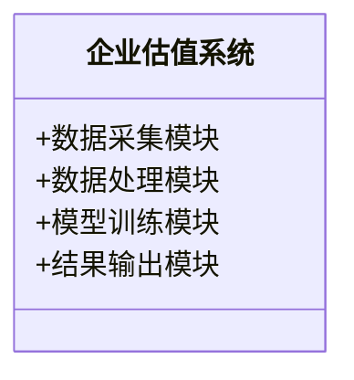

                 


# 企业估值中的人工智能应用价值评估

> 关键词：企业估值，人工智能，价值评估，机器学习，深度学习，数据驱动

> 摘要：本文深入探讨了人工智能在企业估值中的应用价值，分析了其技术原理和实际应用场景。通过详细阐述机器学习算法、深度学习模型以及数据驱动的估值方法，本文揭示了人工智能如何优化传统估值流程，提高估值的准确性和效率。同时，本文还结合实际案例，展示了人工智能在企业估值中的最佳实践，并总结了当前技术的局限性及未来发展方向。

---

# 第一部分：企业估值与人工智能概述

## 第1章：企业估值的基本概念

### 1.1 企业估值的定义与方法

#### 1.1.1 企业估值的基本概念
企业估值是通过对企业的财务状况、市场地位、竞争优势等多方面因素的综合分析，估算其整体价值的过程。传统的估值方法包括资产基础法、市场法和收益法。

#### 1.1.2 传统企业估值方法
- 资产基础法：基于企业资产负债表中的资产和负债进行评估。
- 市场法：通过与可比企业的市场交易数据进行比较。
- 收益法：基于企业的未来现金流折现值进行评估。

#### 1.1.3 人工智能在企业估值中的应用潜力
人工智能技术的引入，可以通过大数据分析、机器学习模型和自动化流程，显著提升企业估值的效率和准确性。

---

### 1.2 人工智能的基本概念

#### 1.2.1 人工智能的定义与特点
人工智能（AI）是模拟人类智能的技术，通过算法和数据处理实现问题解决、模式识别和决策优化。其特点包括数据驱动、自动化和可扩展性。

#### 1.2.2 机器学习与深度学习的简介
- 机器学习：通过训练数据，学习模式并进行预测。
- 深度学习：基于多层神经网络，能够处理复杂的非线性关系。

#### 1.2.3 人工智能在企业估值中的优势
- 高效的数据处理能力。
- 精准的预测模型构建。
- 自动化和智能化的评估流程。

---

## 第2章：人工智能在企业估值中的应用价值

### 2.1 人工智能在企业估值中的应用场景

#### 2.1.1 数据处理与分析
- 处理海量财务数据和市场数据。
- 数据清洗和特征提取。

#### 2.1.2 预测模型构建
- 利用机器学习算法预测企业未来现金流。
- 通过深度学习模型分析市场趋势。

#### 2.1.3 自动化评估系统
- 开发自动化估值系统，实现快速估值。
- 提供实时市场反馈和动态调整。

---

### 2.2 人工智能在企业估值中的核心价值

#### 2.2.1 提高估值效率
- 简化繁琐的手工计算流程。
- 实现自动化数据处理和模型训练。

#### 2.2.2 增强估值准确性
- 利用机器学习算法捕捉数据中的细微关系。
- 通过深度学习模型识别非线性趋势。

#### 2.2.3 优化决策过程
- 提供数据驱动的决策支持。
- 实现多维度的估值分析。

---

### 2.3 人工智能在企业估值中的挑战

#### 2.3.1 数据质量问题
- 数据不完整或不准确。
- 数据偏见影响模型结果。

#### 2.3.2 模型的可解释性
- 复杂模型难以解释。
- 法律和监管要求的透明性。

#### 2.3.3 技术与业务的融合难度
- 技术团队与业务团队的协作挑战。
- 技术更新与业务需求的动态平衡。

---

# 第二部分：人工智能在企业估值中的核心概念与联系

## 第3章：企业估值与人工智能的核心概念

### 3.1 企业估值的核心要素

#### 3.1.1 财务指标分析
- 收入、利润、现金流等财务数据。
- 资产负债表和现金流量表的分析。

#### 3.1.2 市场分析与竞争环境
- 行业趋势和竞争格局。
- 宏观经济环境的影响。

#### 3.1.3 企业战略与管理因素
- 企业战略规划。
- 管理层能力和公司治理。

---

### 3.2 人工智能在企业估值中的核心算法

#### 3.2.1 机器学习算法
- 线性回归。
- 支持向量机（SVM）。
- 随机森林。

#### 3.2.2 深度学习算法
- 神经网络。
- 长短期记忆网络（LSTM）。
- 图神经网络。

#### 3.2.3 自然语言处理技术
- 文本挖掘。
- 情感分析。
- 信息抽取。

---

## 第4章：核心概念的联系与对比

### 4.1 企业估值与人工智能的联系

#### 4.1.1 数据驱动的估值模型
- 利用大数据分析构建估值模型。
- 数据特征与估值结果的关系。

#### 4.1.2 AI算法在估值中的应用
- 使用机器学习算法预测企业价值。
- 深度学习模型分析市场趋势。

#### 4.1.3 人工智能如何优化传统估值方法
- 提高数据处理效率。
- 增强预测模型的准确性。
- 实现自动化和智能化的估值流程。

---

### 4.2 核心概念的对比分析

#### 4.2.1 传统估值方法与AI估值方法的对比

| 方法类型 | 传统估值方法 | AI估值方法 |
|----------|--------------|------------|
| 数据依赖 | 较低         | 高         |
| 模型复杂度 | 简单         | 复杂       |
| 可扩展性 | 低           | 高         |

#### 4.2.2 不同AI算法在企业估值中的表现

| 算法类型 | 优点                     | 缺点                     |
|----------|--------------------------|--------------------------|
| 线性回归 | 简单，易于解释            | 非线性关系表现较差        |
| 支持向量机 | 高精度，适合中小数据集    | 数据预处理要求高          |
| 随机森林 | 抗噪声能力强，无偏        | 对计算资源要求较高        |

#### 4.2.3 数据质量对AI估值的影响
- 数据质量直接影响模型的准确性和可靠性。
- 数据清洗和特征工程是确保模型性能的关键步骤。

---

# 第三部分：人工智能在企业估值中的算法原理

## 第5章：常见算法原理与流程图

### 5.1 机器学习算法

#### 5.1.1 线性回归算法
- 算法流程：
  1. 收集数据。
  2. 数据预处理。
  3. 模型训练。
  4. 模型评估。
- 数学公式：
  $$ y = \beta_0 + \beta_1 x + \epsilon $$

#### 5.1.2 支持向量机算法
- 算法流程：
  1. 数据预处理。
  2. 特征提取。
  3. 模型训练。
  4. 模型评估。
- 数学公式：
  $$ \text{目标函数} = \sum_{i=1}^{n} \xi_i + \frac{1}{2}\lambda \sum_{i=1}^{n}\xi_i^2 $$

#### 5.1.3 随机森林算法
- 算法流程：
  1. 数据预处理。
  2. 生成决策树。
  3. 集成预测。
- 数学公式：
  $$ y = \sum_{i=1}^{n} \text{Tree}(x) $$

---

### 5.2 深度学习算法

#### 5.2.1 神经网络算法
- 算法流程：
  1. 初始化权重。
  2. 前向传播。
  3. 计算损失。
  4. 反向传播。
  5. 更新权重。
- 数学公式：
  $$ \text{损失函数} = \frac{1}{m}\sum_{i=1}^{m} (y_i - \hat{y}_i)^2 $$

#### 5.2.2 长短期记忆网络
- 算法流程：
  1. 输入数据。
  2. 计算遗忘门。
  3. 计算输入门。
  4. 更新状态。
  5. 输出结果。
- 数学公式：
  $$ f_t = \sigma(W_f x_t + U_f h_{t-1}) $$

---

## 第6章：算法实现与案例分析

### 6.1 线性回归算法实现

```python
import numpy as np

# 生成数据
X = np.array([1, 2, 3, 4, 5])
y = np.array([2, 3, 4, 5, 6])

# 训练模型
X_b = np.c_[np.ones(len(X)), X]
beta = np.linalg.inv(X_b.T.dot(X_b)).dot(X_b.T.dot(y))

# 预测
X_new = np.array([6])
X_new_b = np.c_[np.ones(len(X_new)), X_new]
y_pred = beta.dot(X_new_b.T)
print(y_pred)
```

---

## 第7章：系统分析与架构设计

### 7.1 问题场景介绍
- 企业估值系统需要处理大量的财务数据和市场数据。
- 系统需要支持多种估值方法和模型。

### 7.2 项目介绍
- 开发一个基于AI的企业估值系统。
- 实现数据采集、模型训练和结果输出的功能。

---

### 7.3 系统功能设计

#### 7.3.1 领域模型（Mermaid 类图）


---

### 7.4 系统架构设计

#### 7.4.1 系统架构（Mermaid 架构图）
```mermaid
docker
    services {
        db
        web
        worker
    }
```

---

## 第8章：项目实战

### 8.1 环境安装

#### 8.1.1 安装Python
```bash
python --version
pip install --upgrade pip
```

#### 8.1.2 安装机器学习库
```bash
pip install numpy pandas scikit-learn
```

---

### 8.2 系统核心实现源代码

#### 8.2.1 数据处理代码
```python
import pandas as pd
import numpy as np

# 读取数据
df = pd.read_csv('data.csv')

# 数据清洗
df.dropna(inplace=True)

# 特征提取
X = df[['revenue', 'profit']]
y = df['valuation']
```

---

## 第9章：总结与展望

### 9.1 总结
人工智能在企业估值中的应用价值显著，能够提高估值效率和准确性。通过机器学习和深度学习算法，企业可以更好地应对复杂的市场环境和数据挑战。

### 9.2 展望
未来，随着AI技术的不断发展，企业估值将更加智能化和自动化。同时，如何解决模型的可解释性和数据隐私问题，也是需要进一步研究的方向。

---

作者：AI天才研究院 & 禅与计算机程序设计艺术

