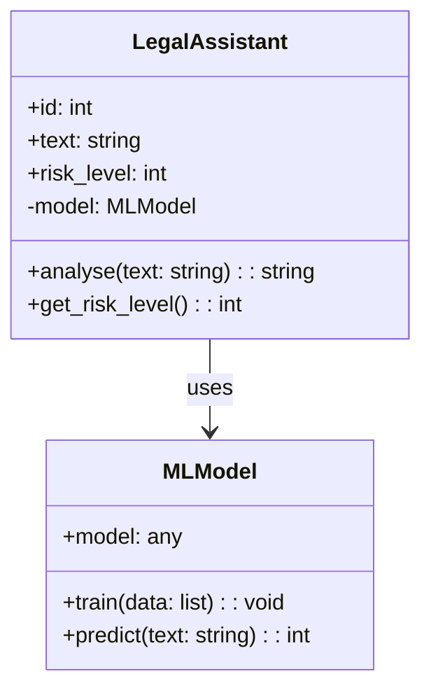
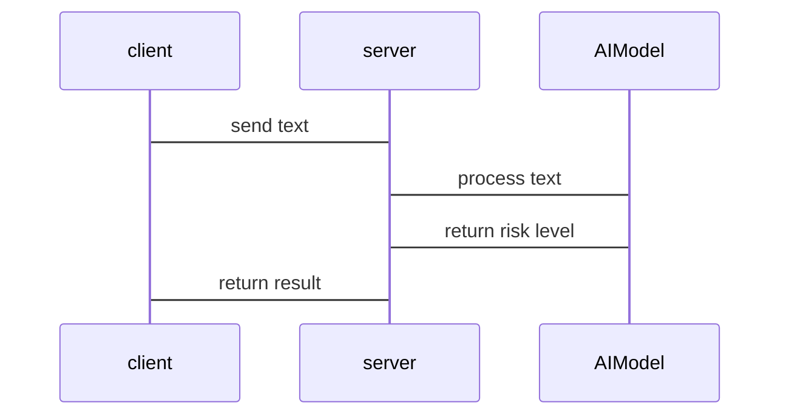

                 


# 《企业估值中的人工智能法律助手评估》

> 关键词：企业估值，人工智能，法律助手，法律评估，算法原理

> 摘要：随着企业估值的重要性日益凸显，如何利用人工智能技术提高法律评估的效率和准确性成为一个重要课题。本文详细探讨了人工智能在企业估值中的法律评估应用，分析了基于自然语言处理和机器学习的法律文本分析算法，构建了法律知识图谱，并通过具体案例展示了人工智能法律助手的系统设计与实现。本文旨在为企业估值中的法律评估提供一种高效、智能的解决方案，推动人工智能技术在法律领域的深度应用。

---

# 第一部分: 背景与基础

# 第1章: 企业估值与人工智能法律助手概述

## 1.1 企业估值的基本概念

### 1.1.1 企业估值的定义与作用
企业估值是指对企业整体价值的评估，通常用于企业并购、融资、上市等场景。传统的估值方法包括财务指标分析、DCF模型、可比公司法等，但这些方法往往依赖人工分析，存在效率低、主观性强的问题。

### 1.1.2 传统企业估值方法的局限性
传统方法依赖大量人工分析，容易受到人为因素影响，且难以处理复杂的法律问题。例如，企业合同中的法律条款可能影响估值结果，但传统方法难以系统化地分析这些法律风险。

### 1.1.3 人工智能在企业估值中的潜力
人工智能技术可以通过自然语言处理和机器学习，自动提取企业合同、财务报表中的法律风险，量化其对估值的影响。这不仅提高了效率，还能够发现传统方法难以察觉的潜在风险。

## 1.2 人工智能法律助手的定义与特点

### 1.2.1 人工智能法律助手的定义
人工智能法律助手是指基于自然语言处理和机器学习技术，能够理解和分析法律文本，提供法律咨询、风险评估等服务的智能系统。

### 1.2.2 人工智能法律助手的核心功能
- 法律文本分析：提取合同、法律条款中的关键信息。
- 风险评估：识别潜在的法律风险并量化其影响。
- 估值建议：结合法律风险分析，提供企业估值建议。

### 1.2.3 人工智能法律助手与传统法律咨询的区别
人工智能法律助手能够快速处理大量法律文本，提供数据支持的决策建议，而传统法律咨询依赖人工分析，效率较低。

## 1.3 企业估值中的法律问题

### 1.3.1 企业估值中的法律风险
- 合同风险：企业合同中的违约条款可能影响估值。
- 知识产权风险：专利、商标等知识产权的纠纷可能影响企业价值。
- 法律合规性：企业是否遵守相关法律法规可能影响估值结果。

### 1.3.2 法律法规对企业估值的影响
法律法规的变化可能影响企业的经营环境，从而影响其估值。例如，环保法规的变化可能增加企业的合规成本。

### 1.3.3 人工智能在法律问题中的应用前景
人工智能可以通过分析大量的法律案例和法规，识别潜在的法律风险，并提供数据支持的估值建议。

## 1.4 本章小结
企业估值中的法律问题复杂且重要，人工智能技术的应用能够显著提高法律评估的效率和准确性。通过分析法律文本和案例，人工智能法律助手能够帮助企业在估值过程中更好地识别和管理法律风险。

---

# 第二部分: 核心概念与原理

# 第2章: 人工智能法律助手的核心原理

## 2.1 自然语言处理在法律文本分析中的应用

### 2.1.1 自然语言处理的基本原理
自然语言处理（NLP）通过计算机理解、生成和分析人类语言。在法律文本分析中，NLP用于提取关键词、识别实体和分析语义。

### 2.1.2 法律文本的特征与挑战
法律文本通常具有高度的结构化特征，但可能存在大量复杂的法律术语和模糊的表述。这使得法律文本的分析需要高度的精确性和严谨性。

### 2.1.3 基于NLP的法律文本分析流程
1. 文本预处理：分词、去停用词、词干提取。
2. 信息提取：识别合同条款、提取关键实体。
3. 语义分析：理解法律条款的含义和潜在风险。

## 2.2 机器学习在法律评估中的应用

### 2.2.1 机器学习的基本原理
机器学习通过训练数据学习模式，用于分类、回归等任务。在法律评估中，机器学习可以用于识别合同中的风险条款，预测法律纠纷的可能性。

### 2.2.2 法律评估中的特征提取
- 文本特征：关键词频率、句法结构。
- 实体特征：合同涉及的公司、金额、时间。
- 关系特征：合同条款之间的逻辑关系。

### 2.2.3 基于机器学习的法律评估模型
- 分类模型：随机森林、支持向量机（SVM）用于分类合同条款的风险等级。
- 回归模型：线性回归、神经网络用于预测合同的价值。

## 2.3 法律知识图谱的构建与应用

### 2.3.1 法律知识图谱的定义与构建方法
法律知识图谱是将法律知识结构化为图的形式，包括法律术语、法律条文、案例等。构建方法包括数据抽取、实体识别和关系抽取。

### 2.3.2 法律知识图谱在企业估值中的应用
- 提供法律术语的解释和上下文。
- 支持法律文本的语义分析和推理。
- 识别合同中的潜在法律风险。

### 2.3.3 法律知识图谱的更新与维护
法律知识图谱需要定期更新，以反映最新的法律法规变化和案例。

## 2.4 本章小结
人工智能法律助手的核心原理包括自然语言处理、机器学习和法律知识图谱。这些技术的结合能够高效地分析法律文本，识别潜在的法律风险，为企业的估值提供支持。

---

# 第三部分: 算法原理

# 第3章: 基于NLP的企业估值分析算法

## 3.1 基于NLP的企业信息提取

### 3.1.1 文本预处理与分词
文本预处理包括去除噪声、分词。例如，将合同文本分词为“违约”、“赔偿”等关键词。

### 3.1.2 基于词嵌入的企业信息表示
使用词嵌入模型（如Word2Vec）将法律术语映射为向量，表示其语义信息。

### 3.1.3 基于注意力机制的信息抽取
注意力机制能够聚焦于重要的法律条款，提高信息提取的准确性。

## 3.2 基于机器学习的法律风险评估

### 3.2.1 数据特征提取与选择
从法律文本中提取文本特征、实体特征和关系特征，作为机器学习模型的输入。

### 3.2.2 基于随机森林的法律风险分类
随机森林是一种集成学习方法，能够处理高维特征数据，适合分类任务。

### 3.2.3 基于深度学习的法律风险预测
使用循环神经网络（RNN）或 transformers（如BERT）进行法律文本分析，预测合同的风险等级。

## 3.3 基于规则的法律文本分析

### 3.3.1 法律规则的提取与表示
从大量法律案例和法规中提取规则，例如“违约条款通常涉及赔偿金额”。

### 3.3.2 基于规则的文本匹配
使用正则表达式匹配特定的法律条款，例如匹配“违约金”相关的条款。

## 3.4 本章小结
基于NLP的企业估值分析算法结合了文本处理、特征提取和机器学习技术，能够高效地从法律文本中提取信息，评估法律风险。

---

# 第四部分: 系统分析与设计

# 第4章: 系统架构设计

## 4.1 问题场景介绍
企业估值中的法律评估需要处理大量的法律文本，包括合同、法规、案例等。传统的手动分析效率低，容易出错。

## 4.2 项目介绍
本项目旨在开发一个基于人工智能的法律评估系统，辅助企业估值。

## 4.3 系统功能设计

### 4.3.1 领域模型设计（Mermaid类图）


### 4.3.2 系统架构设计（Mermaid架构图）


### 4.3.3 系统交互设计（Mermaid序列图）


## 4.4 本章小结
系统架构设计包括客户端、服务器、数据库和AI模型，通过模块化设计提高了系统的可扩展性和可维护性。

---

# 第五部分: 项目实战

# 第5章: 项目实战与案例分析

## 5.1 环境安装
安装必要的Python库，例如`numpy`、`scikit-learn`、`spacy`、`transformers`。

## 5.2 系统核心实现源代码

### 5.2.1 法律文本分析代码
```python
import spacy
from sklearn.feature_extraction.text import TfidfVectorizer
from sklearn.ensemble import RandomForestClassifier

# 加载预训练的词嵌入模型
nlp = spacy.load("en_core_web_sm")

def extract_entities(text):
    doc = nlp(text)
    entities = [ent.text for ent in doc.ents]
    return entities

# 示例文本
text = "违约金为100万元，赔偿损失。"
entities = extract_entities(text)
print("提取的实体：", entities)
```

### 5.2.2 基于随机森林的分类模型
```python
from sklearn.datasets import make_classification
from sklearn.ensemble import RandomForestClassifier

# 生成示例数据
X, y = make_classification(n_samples=100, n_features=20, n_classes=2)

# 训练随机森林模型
model = RandomForestClassifier()
model.fit(X, y)

# 预测
print("模型训练完成。")
```

## 5.3 代码应用解读与分析
通过上述代码，我们可以提取法律文本中的实体，并使用随机森林模型进行分类。这为法律风险评估提供了数据支持。

## 5.4 实际案例分析
以一份合同为例，展示如何使用上述代码提取实体、分析风险，并生成估值建议。

## 5.5 本章小结
通过具体案例，展示了人工智能法律助手的实际应用价值。

---

# 第六部分: 最佳实践与总结

# 第6章: 最佳实践与总结

## 6.1 最佳实践 tips
- 数据质量是关键：确保法律文本数据的准确性和完整性。
- 模型更新：定期更新机器学习模型，以适应法律法规的变化。
- 人机结合：人工智能法律助手应与人工审查相结合，确保结果的准确性。

## 6.2 小结
人工智能法律助手通过自然语言处理和机器学习技术，能够高效地分析法律文本，评估法律风险，为企业的估值提供支持。

## 6.3 注意事项
- 数据隐私：处理法律文本时需注意数据隐私和合规性。
- 模型解释性：确保模型的可解释性，便于用户理解结果。

## 6.4 拓展阅读
推荐相关书籍和论文，进一步深入学习人工智能在法律领域的应用。

---

# 作者：AI天才研究院 & 禅与计算机程序设计艺术

---

通过以上结构，您可以撰写一篇详细的技术博客文章，涵盖企业估值中人工智能法律助手的背景、核心原理、算法实现、系统设计和项目实战等内容。希望这篇文章能够为您提供有价值的参考和启发。

