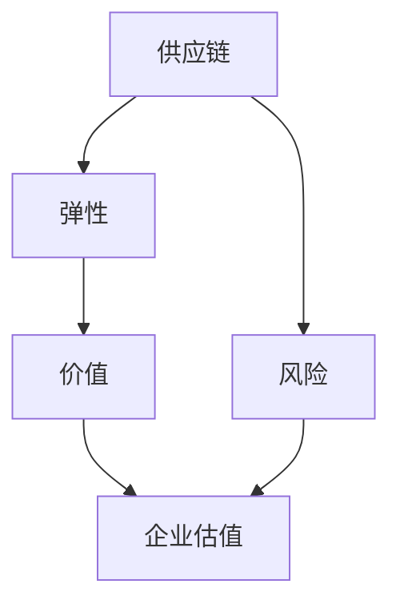
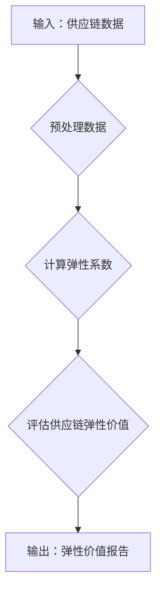
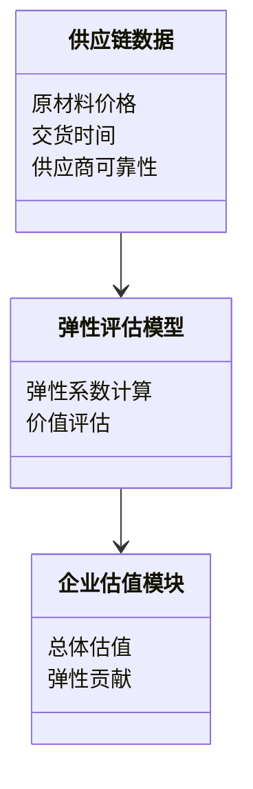
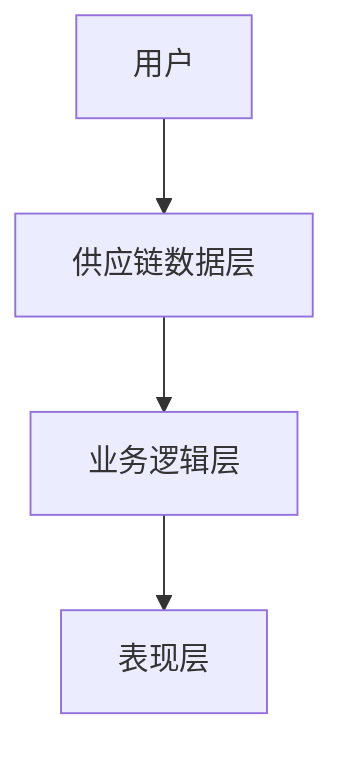
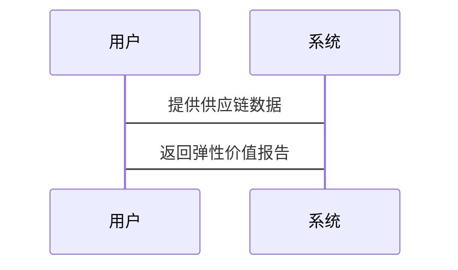

                 


# 《企业估值中的供应链弹性价值评估》

## 关键词：
企业估值，供应链弹性，供应链管理，风险管理，弹性价值，企业架构

## 摘要：
本文深入探讨了供应链弹性在企业估值中的重要性。通过分析供应链弹性价值评估的核心概念、算法原理和系统架构，结合实际案例和项目实战，详细阐述了如何通过弹性价值评估提升企业估值。文章还提供了最佳实践和注意事项，帮助读者更好地理解和应用这些方法。

---

## 第一部分：供应链弹性价值评估的背景与概念

### 第1章：供应链弹性价值评估的定义与背景

#### 1.1 供应链弹性的定义
- 1.1.1 供应链弹性的基本概念
  - 供应链弹性是指企业在面对市场波动、供应中断或其他不确定性时，能够快速调整和恢复的能力。
- 1.1.2 供应链弹性与企业估值的关系
  - 供应链弹性直接影响企业的运营稳定性，进而影响其市场价值。
- 1.1.3 供应链弹性在现代企业中的重要性
  - 全球化和供应链复杂性增加了弹性的重要性。

#### 1.2 企业估值的基本概念
- 1.2.1 企业估值的定义
  - 企业估值是通过财务指标和市场因素评估企业整体价值的过程。
- 1.2.2 传统企业估值方法
  - 市盈率、市净率、现金流折现法等。
- 1.2.3 供应链弹性对企业估值的影响
  - 弹性高的供应链能够降低企业风险，提高估值。

#### 1.3 供应链弹性价值评估的定义
- 1.3.1 供应链弹性价值的定义
  - 弹性价值是供应链在面对冲击时能够为企业带来的额外价值。
- 1.3.2 供应链弹性价值与企业整体估值的关系
  - 弹性价值是企业估值的重要组成部分，反映了供应链的稳定性。
- 1.3.3 供应链弹性价值评估的必要性
  - 通过评估弹性价值，企业可以优化供应链管理，提升整体估值。

#### 1.4 问题背景与问题描述
- 1.4.1 当前供应链管理面临的挑战
  - 疫情导致的供应链中断、原材料价格上涨等。
- 1.4.2 供应链弹性价值评估的必要性
  - 提高供应链弹性可以降低企业风险，提升市场竞争力。
- 1.4.3 问题解决思路
  - 通过建立弹性评估模型，量化供应链弹性对估值的影响。

---

## 第二部分：供应链弹性价值评估的核心概念与联系

### 第2章：供应链弹性价值评估的核心要素

#### 2.1 核心概念与属性
- 2.1.1 弹性
  - 供应链在面对冲击时的恢复能力。
- 2.1.2 风险
  - 供应链中断的可能性及其影响。
- 2.1.3 成本
  - 供应链弹性化所需的投入。
- 2.1.4 收益
  - 弹性供应链带来的额外价值。

#### 2.2 核心概念的对比分析
- 表2.1：弹性、风险、成本、收益的对比

| 属性 | 定义 | 影响 | 关系 |
|------|------|------|------|
| 弹性 | 恢复能力 | 影响收益 | 正相关 |
| 风险 | 中断可能性 | 影响成本 | 负相关 |
| 成本 | 投入 | 影响弹性 | 正相关 |
| 收益 | 额外价值 | 受弹性影响 | 正相关 |

#### 2.3 供应链弹性价值评估的实体关系
- 图2.1：使用Mermaid绘制的实体关系图



---

## 第三部分：供应链弹性价值评估的算法原理

### 第3章：基于弹性系数的评估模型

#### 3.1 算法原理
- 图3.1：使用Mermaid绘制的算法流程图



#### 3.2 算法实现
- 代码3.1：使用Python实现的弹性系数计算

```python
import pandas as pd

# 数据预处理
def preprocess_data(data):
    # 数据清洗和特征提取
    pass

# 弹性系数计算
def calculate_elasticity_coefficient(data):
    # 使用线性回归模型计算弹性系数
    pass

# 价值评估
def assess_elasticity_value(elasticity_coefficient):
    # 根据弹性系数评估价值
    pass

# 主函数
def main():
    data = pd.read_csv('supply_chain_data.csv')
    processed_data = preprocess_data(data)
    ec = calculate_elasticity_coefficient(processed_data)
    value = assess_elasticity_value(ec)
    print(f"弹性价值评估结果：{value}")

if __name__ == "__main__":
    main()
```

#### 3.3 数学模型与公式
- 公式3.1：线性回归模型

$$ \text{弹性系数} = \beta_0 + \beta_1 \times \text{供应链中断概率} $$

---

## 第四部分：供应链弹性价值评估的系统架构设计

### 第4章：系统功能设计

#### 4.1 问题场景介绍
- 供应链中断对企业估值的影响。

#### 4.2 系统功能设计
- 图4.1：使用Mermaid绘制的领域模型类图



#### 4.3 系统架构设计
- 图4.2：使用Mermaid绘制的系统架构图



#### 4.4 系统接口设计
- 序列图4.1：用户与系统交互流程



---

## 第五部分：供应链弹性价值评估的项目实战

### 第5章：环境安装与系统实现

#### 5.1 环境安装
- Python 3.8+
- 安装依赖：pandas, numpy, scikit-learn

#### 5.2 核心代码实现
- 代码5.1：弹性价值评估模型实现

```python
from sklearn.linear_model import LinearRegression

def calculate_elasticity(data):
    model = LinearRegression()
    model.fit(data[['中断概率']], data['价值影响'])
    return model.coef_[0]

# 示例数据
data = {
    '中断概率': [0.1, 0.2, 0.3, 0.4],
    '价值影响': [10, 20, 30, 40]
}
```

#### 5.3 项目小结
- 弹性价值评估的关键步骤和注意事项。

---

## 第六部分：供应链弹性价值评估的最佳实践

### 第6章：最佳实践与注意事项

#### 6.1 小结
- 弹性价值评估的核心要点和应用场景。

#### 6.2 注意事项
- 数据质量的重要性。
- 模型局限性与优化方向。

#### 6.3 拓展阅读
- 推荐相关书籍和资源。

---

## 作者：AI天才研究院 & 禅与计算机程序设计艺术

---

通过以上步骤，我们系统地分析了供应链弹性价值评估的各个方面，从背景概念到算法实现，再到系统设计和项目实战，帮助读者全面理解和应用这些方法。

