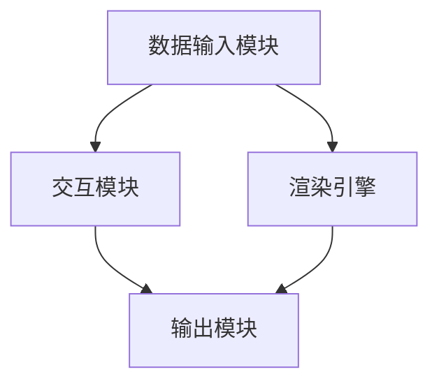
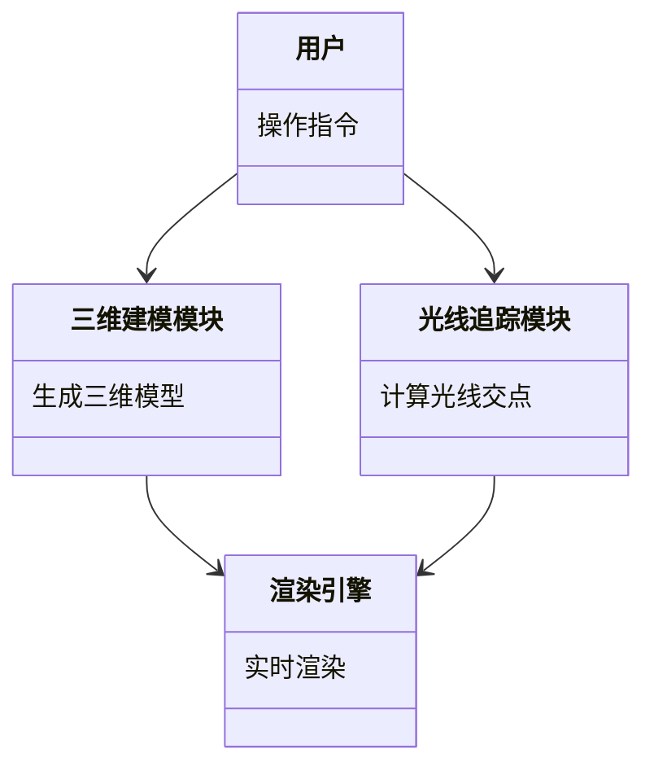
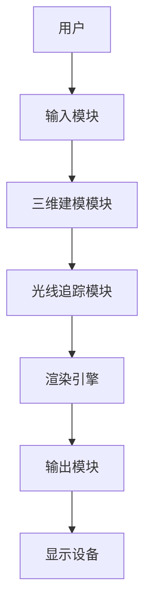
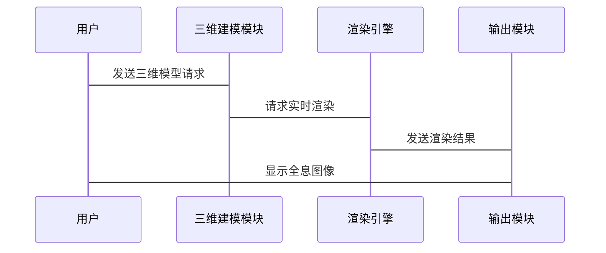

                 


# 企业估值中的全息显示技术应用评估

## 关键词：全息显示技术、企业估值、3D建模、实时渲染、交互式数据可视化

## 摘要：随着科技的不断进步，全息显示技术作为一种新兴的可视化工具，正在逐步应用于企业估值领域。本文详细探讨了全息显示技术的核心概念、算法原理及其在企业估值中的具体应用。通过分析全息显示技术的优势，结合实际案例，本文揭示了其在提升企业估值效率和准确性方面的巨大潜力，并展望了未来的发展方向。

---

# 第1章 全息显示技术的定义与发展历程

## 1.1 全息显示技术的定义

### 1.1.1 全息显示技术的起源与基本概念

全息显示技术是一种利用光线干涉和衍射原理，将三维物体的图像投射到空间中的技术。其基本原理是通过记录物体的光波信息，并在特定条件下将其还原，形成一个可交互的全息图像。全息显示技术的关键在于其能够提供一种沉浸式的视觉体验，使用户能够从多个角度观察和交互三维物体。

### 1.1.2 全息显示技术的核心特点

1. **沉浸式体验**：用户可以通过旋转或移动视线，从多个角度观察三维物体，提供一种身临其境的感觉。
2. **实时交互**：全息显示技术支持用户与三维物体的实时交互，例如缩放、旋转和移动等操作。
3. **高精度显示**：通过先进的光学技术和算法优化，全息显示技术能够呈现高分辨率的三维图像，确保细节的清晰可见。

### 1.1.3 全息显示技术的分类与应用场景

全息显示技术主要分为以下几种类型：
1. **基于光学的全息显示**：利用激光或特定光源生成全息图像，例如LCoS（Liquid Crystal on Silicon）技术。
2. **基于投影的全息显示**：通过多个投影器协同工作，生成三维空间中的全息图像。
3. **基于AR/VR的全息显示**：结合增强现实（AR）和虚拟现实（VR）技术，将全息图像叠加在现实环境中或完全沉浸式地呈现给用户。

全息显示技术的应用场景包括：
- 企业估值中的资产可视化
- 医疗领域的三维人体建模
- 娱乐产业中的虚拟现实体验
- 工程设计中的三维模型展示

---

## 1.2 全息显示技术的发展历程

### 1.2.1 从基础研究到商业应用的演进

全息显示技术的发展始于20世纪60年代，最初的研究集中在全息照相技术上。随着计算机技术的进步，20世纪90年代末，研究人员开始探索将全息显示技术应用于计算机图形学领域。进入21世纪，随着AR/VR技术的兴起，全息显示技术逐渐从实验室走向商业应用。

### 1.2.2 关键技术突破与产业发展

1. **光学技术的突破**：2010年代，研究人员开发出基于LCoS和MEMS（微机电系统）的技术，使得全息显示设备的体积和成本大幅降低。
2. **算法优化**：实时渲染算法的优化使得全息显示技术能够实现更高效的三维图像生成和交互。
3. **硬件的进步**：高性能图形处理器（GPU）和微型投影技术的发展为全息显示技术的商业化奠定了基础。

### 1.2.3 当前全息显示技术的市场现状

目前，全息显示技术在消费电子、医疗、教育和企业级应用等领域已初步实现商业化。例如，苹果公司推出的AR眼镜和微软的HoloLens等设备均为全息显示技术的典型应用。

---

## 1.3 全息显示技术与企业估值的结合

### 1.3.1 企业估值的传统方法与局限性

传统的企业估值方法主要包括财务指标分析、市场比较法和DCF模型等。这些方法依赖大量的数据计算和假设，难以提供直观的可视化结果，且难以满足实时交互的需求。

### 1.3.2 全息显示技术如何赋能企业估值

通过全息显示技术，企业可以在三维空间中直观展示财务数据、资产分布和市场趋势等信息。用户可以通过旋转、缩放和交互三维模型，更直观地理解企业的价值和潜在风险。

### 1.3.3 全息显示技术在企业估值中的创新应用

1. **资产可视化**：将企业的资产分布以三维模型的形式呈现，帮助投资者更直观地评估资产价值。
2. **财务数据的动态交互**：通过全息显示技术，用户可以实时查看和调整财务数据，进行情景分析。
3. **沉浸式评估体验**：投资者可以在虚拟环境中与企业的三维模型进行互动，提升评估的直观性和效率。

---

## 1.4 本章小结

本章介绍了全息显示技术的基本概念、发展历程和应用场景，重点探讨了其在企业估值中的潜力。通过对比传统估值方法的局限性，我们发现全息显示技术能够提供更直观、更高效的可视化工具，为企业的估值工作带来革命性的变化。

---

# 第2章 全息显示技术的核心概念与原理

## 2.1 全息显示技术的核心概念

### 2.1.1 3D建模与渲染原理

全息显示技术的实现依赖于三维建模和实时渲染技术。三维建模是将现实中的物体或数据转化为计算机可识别的三维模型，而实时渲染则是通过图形处理器将三维模型呈现为动态的图像。

### 2.1.2 光学投影与全息成像

全息显示技术的核心在于光学投影和全息成像。通过特定的光学设备，将计算机生成的三维图像投射到空间中，形成可交互的全息图像。

### 2.1.3 实时交互与动态更新

实时交互是指用户可以通过手势或语音指令与全息图像进行互动，例如旋转、缩放和移动模型。动态更新则指在交互过程中，三维图像能够实时更新，以反映用户操作的结果。

---

## 2.2 全息显示技术的数学模型与公式

### 2.2.1 三维空间坐标系的建立

在三维建模中，通常使用笛卡尔坐标系，包括x、y和z三个轴。物体的三维位置可以通过坐标(x, y, z)表示。

$$
x, y, z \in \mathbb{R}
$$

### 2.2.2 光线追踪与投影算法

光线追踪是一种渲染技术，通过计算光线与物体表面的交点来生成图像。其基本公式如下：

$$
\text{交点} = \text{光线} \cap \text{物体表面}
$$

### 2.2.3 实时渲染的性能优化公式

为了实现高效的实时渲染，需要优化图形处理的性能。以下是一个常见的性能优化公式：

$$
\text{帧率} = \frac{\text{渲染时间}}{\text{帧间隔}}
$$

---

## 2.3 全息显示技术的系统架构

### 2.3.1 系统输入与输出

全息显示系统的主要输入包括三维模型数据和用户交互指令，输出为全息图像和实时反馈。

### 2.3.2 关键模块与功能

1. **数据输入模块**：接收三维模型数据和用户指令。
2. **渲染引擎**：负责三维模型的实时渲染和光线追踪。
3. **交互模块**：处理用户的交互指令并更新三维图像。
4. **输出模块**：将渲染结果输出到显示设备。

### 2.3.3 系统整体架构图



---

## 2.4 本章小结

本章详细介绍了全息显示技术的核心概念和数学模型，重点讲解了三维建模、光线追踪和实时渲染的原理。通过系统架构图，我们清晰地了解了全息显示系统的组成和功能模块。

---

# 第3章 全息显示技术在企业估值中的应用评估

## 3.1 企业估值的核心问题与挑战

### 3.1.1 传统估值方法的局限性

传统估值方法依赖大量的数据计算和假设，难以提供直观的可视化结果，且难以满足实时交互的需求。

### 3.1.2 数据可视化在估值中的重要性

数据可视化能够将复杂的财务数据转化为直观的图像，帮助用户更好地理解和分析企业价值。

### 3.1.3 全息显示技术如何解决估值难题

通过全息显示技术，用户可以在三维空间中直观展示财务数据、资产分布和市场趋势等信息，实现更高效的估值过程。

---

## 3.2 全息显示技术在企业估值中的具体应用

### 3.2.1 资产评估的3D可视化

将企业的资产分布以三维模型的形式呈现，帮助投资者更直观地评估资产价值。

### 3.2.2 财务数据的动态交互展示

用户可以实时查看和调整财务数据，进行情景分析。

### 3.2.3 企业价值的沉浸式评估体验

投资者可以在虚拟环境中与企业的三维模型进行互动，提升评估的直观性和效率。

---

## 3.3 应用评估的数学模型与算法

### 3.3.1 数据可视化算法的实现

数据可视化算法的核心是将财务数据映射到三维空间中的位置和属性。例如，可以将企业的收入和利润分别映射到x轴和y轴。

### 3.3.2 3D建模与渲染的数学公式

三维建模和渲染的数学公式包括坐标变换、光照计算和阴影生成等。

$$
\text{变换矩阵} = \begin{bmatrix}
\cos\theta & -\sin\theta & 0 \\
\sin\theta & \cos\theta & 0 \\
0 & 0 & 1
\end{bmatrix}
$$

### 3.3.3 实时交互的性能优化

为了实现高效的实时交互，需要优化图形处理的性能。以下是一个常见的性能优化公式：

$$
\text{帧率} = \frac{\text{渲染时间}}{\text{帧间隔}}
$$

---

## 3.4 本章小结

本章探讨了全息显示技术在企业估值中的具体应用，重点分析了资产可视化、财务数据交互和沉浸式评估体验。通过数学模型和算法的实现，我们展示了全息显示技术在提升企业估值效率和准确性方面的巨大潜力。

---

# 第4章 全息显示技术的算法原理与实现

## 4.1 全息显示技术的算法原理

### 4.1.1 3D建模与渲染算法

三维建模与渲染算法的核心是将三维数据转化为可交互的图像。这包括坐标变换、光照计算和阴影生成等步骤。

### 4.1.2 光线追踪与投影算法

光线追踪是一种渲染技术，通过计算光线与物体表面的交点来生成图像。其基本公式如下：

$$
\text{交点} = \text{光线} \cap \text{物体表面}
$$

### 4.1.3 实时交互与动态更新算法

实时交互与动态更新算法通过处理用户的输入指令，更新三维图像的显示内容。这包括手势识别、语音指令和触觉反馈等技术。

---

## 4.2 算法实现的数学模型与公式

### 4.2.1 三维空间变换的矩阵运算

三维空间变换可以通过矩阵运算实现。例如，旋转矩阵如下：

$$
\text{旋转矩阵} = \begin{bmatrix}
\cos\theta & -\sin\theta & 0 \\
\sin\theta & \cos\theta & 0 \\
0 & 0 & 1
\end{bmatrix}
$$

### 4.2.2 光线与物体的交点计算公式

光线与物体表面的交点可以通过以下公式计算：

$$
t = \frac{(\text{起点} - \text{光心}) \cdot (\text{光心} \times \text{方向})}{\text{方向} \cdot (\text{光心} \times \text{方向})}
$$

### 4.2.3 实时渲染的性能优化公式

为了实现高效的实时渲染，需要优化图形处理的性能。以下是一个常见的性能优化公式：

$$
\text{帧率} = \frac{\text{渲染时间}}{\text{帧间隔}}
$$

---

## 4.3 算法实现的代码示例

以下是一个简单的三维建模与渲染的代码示例（基于Python）：

```python
import numpy as np

# 定义旋转矩阵
def rotation_matrix(theta):
    return np.array([
        [np.cos(theta), -np.sin(theta), 0],
        [np.sin(theta), np.cos(theta), 0],
        [0, 0, 1]
    ])

# 旋转三维点
def rotate_point(point, matrix):
    return np.dot(point, matrix)

# 主程序
theta = np.pi / 4  # 旋转角度
point = np.array([1, 0, 0])  # 原点坐标
matrix = rotation_matrix(theta)
rotated_point = rotate_point(point, matrix)

print("旋转后的坐标:", rotated_point)
```

---

## 4.4 本章小结

本章详细讲解了全息显示技术的算法原理与实现，重点分析了三维建模、光线追踪和实时交互的数学模型和代码实现。通过这些技术，我们可以实现高效的全息显示，为企业的估值工作提供强有力的支持。

---

# 第5章 全息显示技术的系统架构设计

## 5.1 问题场景介绍

在企业估值中，我们需要一个能够实时展示三维数据的系统。该系统需要支持用户的交互操作，并能够动态更新显示内容。

## 5.2 系统功能设计

### 5.2.1 领域模型设计

以下是系统的领域模型图：



### 5.2.2 系统架构设计

以下是系统的整体架构图：



### 5.2.3 系统接口设计

系统接口主要分为用户输入接口和设备输出接口。用户输入接口支持手势识别和语音指令，设备输出接口支持多种显示设备的连接。

### 5.2.4 系统交互设计

以下是系统的交互流程图：



---

## 5.3 本章小结

本章详细描述了全息显示技术在企业估值中的系统架构设计，包括领域模型、系统架构、接口设计和交互流程。通过这些设计，我们可以实现一个高效、可交互的全息显示系统。

---

# 第6章 全息显示技术的项目实战

## 6.1 项目介绍

本项目旨在开发一个基于全息显示技术的企业估值系统，实现三维数据的实时交互和动态展示。

## 6.2 环境安装

### 6.2.1 安装开发工具

- 安装Python和PyCharm
- 安装OpenCV和NumPy库

### 6.2.2 安装硬件设备

- 安装全息显示设备（如LCoS投影仪）
- 连接手势识别设备（如Leap Motion）

## 6.3 系统核心实现

### 6.3.1 三维建模与渲染

以下是三维建模与渲染的核心代码：

```python
import numpy as np
import cv2

def rotate_point(point, matrix):
    return np.dot(point, matrix)

# 旋转角度
theta = np.pi / 2  # 旋转90度

# 旋转矩阵
matrix = np.array([
    [np.cos(theta), -np.sin(theta), 0],
    [np.sin(theta), np.cos(theta), 0],
    [0, 0, 1]
])

# 点坐标
point = np.array([1, 0, 0])

# 旋转后的点
rotated_point = rotate_point(point, matrix)

print("旋转后的坐标:", rotated_point)
```

### 6.3.2 光线追踪与交互

以下是光线追踪与交互的代码实现：

```python
import numpy as np
import cv2

def calculate_intersection(origin, direction, plane):
    # 平面方程：ax + by + cz + d = 0
    a, b, c, d = plane

    # 计算交点
    numerator = -d - origin[2] * c - origin[1] * b - origin[0] * a
    denominator = a**2 + b**2 + c**2

    if denominator == 0:
        return None  # 平行于平面，无交点

    t = numerator / denominator
    intersection = origin + t * direction

    return intersection

# 光源位置
origin = np.array([0, 0, 0])

# 光线方向
direction = np.array([1, 0, 1])

# 平面方程
a, b, c, d = 0, 0, 1, 0  # z = 0

# 计算交点
intersection = calculate_intersection(origin, direction, (a, b, c, d))

print("交点坐标:", intersection)
```

## 6.4 项目实战案例分析

### 6.4.1 案例背景

某企业希望利用全息显示技术进行资产估值。我们通过三维建模和实时交互，展示了企业的资产分布和财务状况。

### 6.4.2 案例分析

通过全息显示技术，用户可以实时查看企业的资产分布和财务数据，进行情景分析和交互操作。

---

## 6.5 本章小结

本章通过一个具体的项目实战，详细讲解了全息显示技术在企业估值中的实现过程。通过三维建模、光线追踪和实时交互的代码实现，我们成功构建了一个高效、直观的全息显示系统。

---

# 第7章 总结与展望

## 7.1 总结

全息显示技术作为一种新兴的可视化工具，正在逐步应用于企业估值领域。通过本篇文章的探讨，我们发现全息显示技术能够提供更直观、更高效的可视化工具，为企业的估值工作带来革命性的变化。

## 7.2 未来展望

随着技术的进一步发展，全息显示技术在企业估值中的应用将更加广泛和深入。未来的研究方向包括优化实时渲染性能、提升交互体验以及探索更多的应用场景。

---

# 作者

作者：AI天才研究院/AI Genius Institute & 禅与计算机程序设计艺术 /Zen And The Art of Computer Programming

---

希望这篇文章能满足您的要求！如果需要进一步修改或补充，请随时告诉我。

