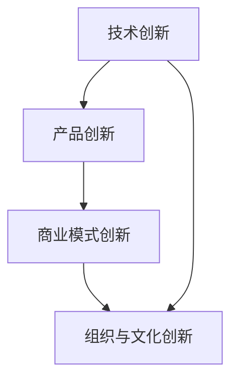
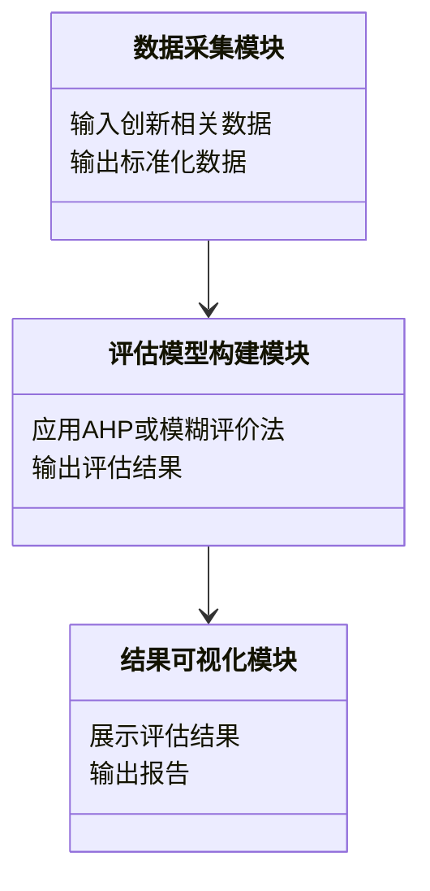
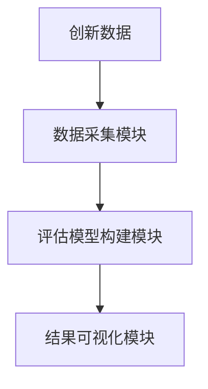

                 


# 企业估值中的创新生态系统价值评估

## 关键词
企业估值，创新生态系统，价值评估，层次分析法，模糊综合评价法，系统架构设计

## 摘要
本文探讨了创新生态系统在企业估值中的重要性，通过分析其核心要素、评估方法和系统架构，提供了一套全面的评估框架。文章首先介绍了创新生态系统的概念和企业估值的基本原理，然后详细讲解了层次分析法和模糊综合评价法的应用，结合系统架构设计，最后通过案例分析展示了如何在实际中应用这些方法。本文旨在帮助企业更好地识别和评估创新生态系统对整体价值的影响。

---

## 第一部分：创新生态系统与企业估值基础

### 第1章：创新生态系统概述

#### 1.1 创新生态系统的核心概念
- **1.1.1 创新生态系统的定义**
  创新生态系统是一个由技术、产品、商业模式和组织文化等要素构成的动态系统，这些要素相互作用，共同推动企业的创新能力和发展。

- **1.1.2 创新生态系统的主要组成部分**
  - **技术创新**：技术开发和应用的能力。
  - **产品创新**：产品设计和市场适应性。
  - **商业模式创新**：收入来源和业务模式的创新。
  - **组织与文化创新**：组织结构和文化氛围的优化。

- **1.1.3 创新生态系统与企业价值的关系**
  创新生态系统通过提高企业的竞争力和适应性，间接或直接地影响其市场价值。

#### 1.2 企业估值的基本概念
- **1.2.1 企业估值的定义**
  企业估值是通过财务指标、市场地位等因素评估企业整体价值的过程。

- **1.2.2 企业估值的主要方法**
  - **财务指标法**：基于收入、利润等财务数据。
  - **市场比较法**：与类似企业的市场价值进行比较。
  - **DCF模型**：通过现金流折现评估企业价值。

- **1.2.3 传统估值方法的局限性**
  传统方法难以量化创新对企业价值的影响，尤其是无形资产和创新能力。

#### 1.3 创新生态系统对企业估值的影响
- **1.3.1 创新生态系统对企业竞争力的影响**
  创新能力强的企业更具市场竞争力，从而提高估值。

- **1.3.2 创新生态系统对资产价值的影响**
  创新能力强的资产具有更高的市场价值。

- **1.3.3 创新生态系统对企业未来收益的影响**
  创新生态系统有助于企业在未来创造更多收益，提升估值。

---

## 第二部分：创新生态系统价值评估的核心概念与联系

### 第2章：创新生态系统价值评估的核心要素

#### 2.1 创新生态系统的主要要素
- **2.1.1 技术创新**
  技术创新是企业核心竞争力的来源，直接影响产品和商业模式的创新。

- **2.1.2 产品创新**
  产品创新满足市场需求，增强客户粘性，提高企业收入。

- **2.1.3 商业模式创新**
  商业模式创新优化收入来源和成本结构，提升企业盈利能力。

- **2.1.4 组织与文化创新**
  组织结构和文化创新支持持续创新，增强企业的灵活性和适应性。

#### 2.2 创新生态系统要素的相互关系
- **2.2.1 技术创新与产品创新的关系**
  技术创新为产品创新提供基础，产品创新推动技术创新。

- **2.2.2 产品创新与商业模式创新的关系**
  产品创新为商业模式创新提供基础，商业模式创新促进产品创新的商业化。

- **2.2.3 商业模式创新与组织文化创新的关系**
  商业模式创新需要组织文化创新的支持，组织文化创新促进商业模式的实施。

#### 2.3 创新生态系统价值评估的系统架构
- **2.3.1 创新生态系统价值评估的系统架构图**



---

## 第三部分：创新生态系统价值评估的算法原理

### 第3章：创新生态系统价值评估的主要方法

#### 3.1 层次分析法（AHP）

##### 3.1.1 层次分析法的基本原理
层次分析法通过构建判断矩阵，计算各要素的权重，进行综合评估。

##### 3.1.2 层次分析法的步骤
1. 构造判断矩阵。
2. 计算特征值和特征向量。
3. 计算各要素的权重。
4. 进行综合评分。

##### 3.1.3 层次分析法的优缺点
- **优点**：逻辑清晰，权重计算合理。
- **缺点**：判断矩阵的主观性较强。

#### 3.2 模糊综合评价法

##### 3.2.1 模糊综合评价法的基本原理
模糊综合评价法通过模糊评价矩阵，进行综合评估。

##### 3.2.2 模糊综合评价法的步骤
1. 构造模糊评价矩阵。
2. 计算模糊综合评价结果。
3. 解释评价结果。

##### 3.2.3 模糊综合评价法的优缺点
- **优点**：适合处理模糊性问题。
- **缺点**：计算复杂，结果解释需要经验。

### 第4章：创新生态系统价值评估的数学模型

#### 4.1 层次分析法的数学模型

##### 4.1.1 判断矩阵的构造
$$
A = \begin{bmatrix}
1 & 1/3 & 1/2 \\
3 & 1 & 2 \\
2 & 1/2 & 1
\end{bmatrix}
$$

##### 4.1.2 层次分析法的综合评分公式
$$
W_i = \frac{w_i}{\sum w_j}
$$

#### 4.2 模糊综合评价法的数学模型

##### 4.2.1 模糊评价矩阵的构造
$$
B = \begin{bmatrix}
0.7 & 0.5 & 0.8 \\
0.6 & 0.7 & 0.9 \\
0.5 & 0.6 & 0.7
\end{bmatrix}
$$

##### 4.2.2 模糊综合评价的计算公式
$$
R_i = \sum_{j=1}^{n} w_j \cdot B_{ij}
$$

---

## 第四部分：创新生态系统价值评估的系统分析与架构设计

### 第5章：创新生态系统价值评估的系统分析

#### 5.1 创新生态系统价值评估的系统架构

##### 5.1.1 系统架构设计概述
系统包括数据采集、评估模型构建和结果可视化三个模块。

##### 5.1.2 系统功能模块划分



##### 5.1.3 系统架构图



---

## 第五部分：项目实战

### 第6章：创新生态系统价值评估的实战分析

#### 6.1 项目环境配置
- **工具**：Python、Matplotlib、Scipy
- **库**：pandas、numpy、scipy.cluster.hierarchy

#### 6.2 系统核心实现源代码

##### 6.2.1 层次分析法的实现

```python
import numpy as np

def calculate_weights(matrix):
    # 计算特征向量
    eigenvalues, eigenvectors = np.linalg.eig(matrix)
    # 计算最大特征值对应的特征向量
    max_eig = np.argmax(eigenvalues)
    weight = eigenvectors[:, max_eig] / np.sum(eigenvectors[:, max_eig])
    return weight

# 示例判断矩阵
matrix = np.array([
    [1, 3, 2],
    [1/3, 1, 1/2],
    [1/2, 2, 1]
])

weights = calculate_weights(matrix)
print("权重向量为：", weights)
```

##### 6.2.2 模糊综合评价法的实现

```python
import pandas as pd

def fuzzy_evaluation(matrix, weights):
    # 计算模糊综合评价结果
    result = np.zeros(matrix.shape[0])
    for i in range(matrix.shape[0]):
        result[i] = np.dot(matrix[i], weights)
    return result

matrix = pd.DataFrame({
    '技术创新': [0.7, 0.6, 0.5],
    '产品创新': [0.5, 0.7, 0.6],
    '商业模式创新': [0.8, 0.9, 0.7]
})

weights = np.array([0.4, 0.3, 0.3])
result = fuzzy_evaluation(matrix.values, weights)
print("模糊综合评价结果为：", result)
```

#### 6.3 实际案例分析
以某科技企业为例，应用层次分析法和模糊综合评价法进行创新生态系统价值评估，展示如何量化创新对估值的影响。

#### 6.4 项目小结
通过项目实战，验证了创新生态系统价值评估方法的有效性和实用性，为企业估值提供了新的视角和工具。

---

## 第六部分：总结与展望

### 第7章：总结与展望

#### 7.1 最佳实践 tips
- 综合考虑技术创新、产品创新、商业模式创新和组织文化创新。
- 结合定量和定性分析方法，全面评估创新生态系统价值。

#### 7.2 小结
创新生态系统价值评估是企业估值的重要组成部分，通过系统的方法和工具，能够更准确地识别和评估创新对价值的影响。

#### 7.3 注意事项
- 数据的准确性和完整性直接影响评估结果。
- 方法的选择应根据实际情况灵活调整。

#### 7.4 拓展阅读
建议进一步研究动态网络分析、机器学习算法在创新生态系统评估中的应用。

---

## 作者

作者：AI天才研究院/AI Genius Institute & 禅与计算机程序设计艺术 /Zen And The Art of Computer Programming

---

通过以上结构，本文详细探讨了创新生态系统在企业估值中的重要性，结合理论、方法和实际案例，为读者提供了一个全面的创新生态系统价值评估框架。

