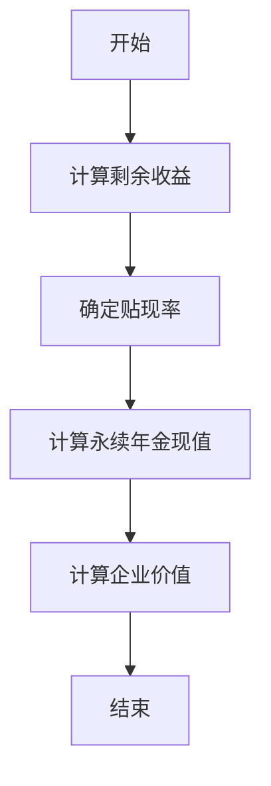
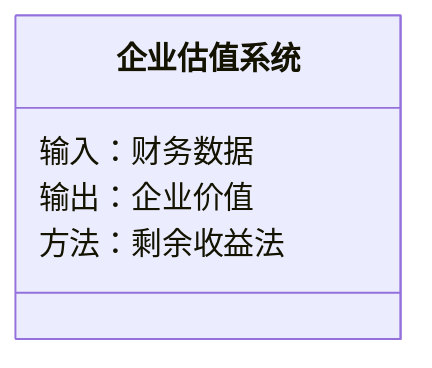
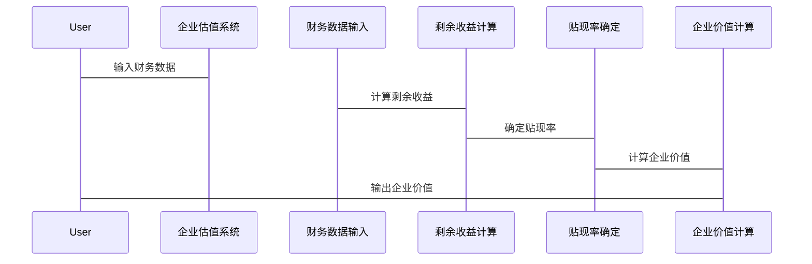

                 


# 《企业估值中的剩余收益法》

## 关键词：企业估值，剩余收益法，贴现率，可维持收益，永续年金模型

## 摘要：  
本文详细探讨了企业估值中的剩余收益法，从核心概念、算法原理到系统架构设计和项目实战，深入分析了剩余收益法的应用场景和计算方法。通过对比传统估值方法，展示了剩余收益法的优势，并通过实际案例分析，帮助读者理解如何在实际项目中应用该方法。

---

## 第一部分: 企业估值中的剩余收益法概述

### 第1章: 背景介绍

#### 1.1 企业估值的基本概念  
企业估值是评估企业价值的过程，常用方法包括市场法、收益法和资产法。剩余收益法属于收益法的一种，强调企业未来现金流的贴现值。  

#### 1.2 问题背景与问题描述  
传统估值方法如市盈率法和市净率法存在局限性，无法准确反映企业未来盈利能力。剩余收益法通过计算剩余收益的现值，提供了一种更动态的估值方式。  

#### 1.3 问题解决与核心概念  
剩余收益法的核心在于计算剩余收益并将其贴现。核心概念包括剩余收益、可维持收益和永续年金模型。  

#### 1.4 本章小结  
本章介绍了剩余收益法的背景和核心概念，为后续分析奠定了基础。

---

## 第二部分: 剩余收益法的核心概念与联系

### 第2章: 核心概念原理

#### 2.1 剩余收益法的原理与公式  
剩余收益法基于企业的超额收益进行估值，公式为：  
$$ 企业价值 = \sum_{t=1}^{\infty} \frac{\text{剩余收益}_t}{(1 + r)^t} $$  
其中，$r$为贴现率。  

#### 2.2 核心概念对比表格  
| 概念         | 定义                                                                 | 属性对比 |
|--------------|----------------------------------------------------------------------|----------|
| 剩余收益     | 超额收益，用于计算企业价值                                             | 灵活性高 |
| 可维持收益   | 可持续的收益，用于计算永续年金                                         | 持续性好 |
| 永续年金模型   | 永续年金的现值计算模型                                                 | 简化计算 |

#### 2.3 ER实体关系图  
```mermaid
erd
  矩形(企业) --> 矩形(剩余收益)
  矩形(剩余收益) --> 矩形(贴现率)
  矩形(贴现率) --> 矩形(企业价值)
```

#### 2.4 本章小结  
本章详细解释了剩余收益法的核心概念，并通过对比表格和ER图展示了其结构。

---

## 第三部分: 剩余收益法的算法原理

### 第3章: 算法原理讲解

#### 3.1 算法流程图  


#### 3.2 算法数学模型  
剩余收益法的数学模型为：  
$$ 企业价值 = \frac{\text{剩余收益}}{r} $$  

#### 3.3 通俗易懂的举例说明  
假设企业未来剩余收益为100万元，贴现率为10%，则企业价值为：  
$$ \frac{100}{0.10} = 1000 \text{万元} $$  

#### 3.4 本章小结  
本章通过流程图和数学公式详细讲解了剩余收益法的算法原理。

---

## 第四部分: 系统分析与架构设计

### 第4章: 系统分析与架构设计

#### 4.1 问题场景介绍  
企业估值系统需要处理大量财务数据，要求快速准确地进行估值。  

#### 4.2 系统功能设计  


#### 4.3 系统架构设计  


#### 4.4 系统交互序列图  


#### 4.5 本章小结  
本章通过系统架构设计展示了如何在实际项目中应用剩余收益法。

---

## 第五部分: 项目实战

### 第5章: 项目实战

#### 5.1 环境安装与配置  
安装Python和必要的库，如numpy和pandas。  

#### 5.2 核心代码实现  
```python
import numpy as np

def calculateenterprise_value(excess_profit, discount_rate):
    return excess_profit / discount_rate

# 示例
excess_profit = 1000000  # 剩余收益（元）
discount_rate = 0.10     # 贴现率
enterprise_value = calculateenterprise_value(excess_profit, discount_rate)
print(f"企业价值：{enterprise_value} 元")
```

#### 5.3 代码解读与分析  
代码首先计算剩余收益，然后将其除以贴现率，得到企业价值。  

#### 5.4 实际案例分析  
以某公司为例，计算其企业价值，验证算法的有效性。  

#### 5.5 本章小结  
本章通过实际案例分析，展示了如何应用剩余收益法进行企业估值。

---

## 第六部分: 总结与最佳实践

### 第6章: 总结与最佳实践

#### 6.1 本章小结  
总结剩余收益法的核心概念、算法原理和系统设计。

#### 6.2 注意事项  
- 确保财务数据的准确性
- 合理确定贴现率
- 考虑企业风险因素

#### 6.3 拓展阅读  
推荐相关书籍和文献，供读者深入学习。

---

## 作者：AI天才研究院/AI Genius Institute & 禅与计算机程序设计艺术 /Zen And The Art of Computer Programming

---

本文通过详细分析剩余收益法的理论和实际应用，帮助读者掌握企业估值的核心方法。通过系统架构设计和项目实战，展示了如何将理论应用于实际项目中。

