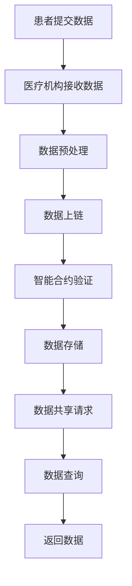
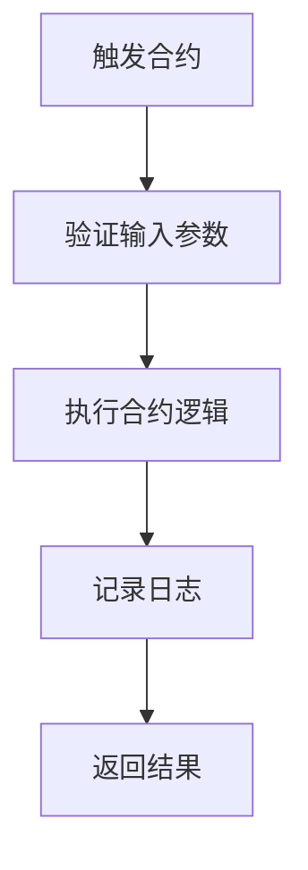
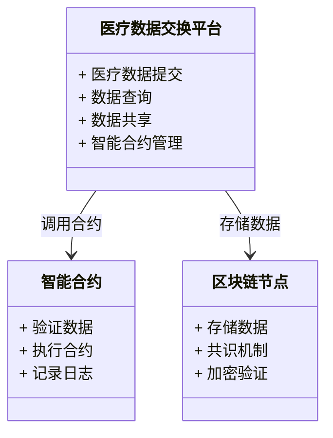
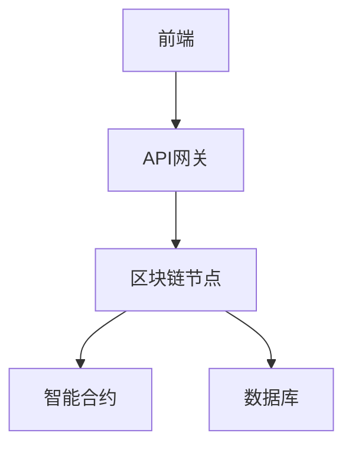

                 


# 企业估值中的区块链医疗数据交换平台评估

> 关键词：区块链技术、医疗数据、企业估值、数据交换平台、智能合约

> 摘要：区块链技术在医疗数据交换中的应用正在改变医疗行业的数据管理方式，通过智能合约和去中心化的特性，提高了数据共享的安全性和效率，从而对企业估值产生重要影响。本文将详细分析区块链医疗数据交换平台的构建、算法原理及企业估值方法，为企业评估提供新的视角和策略。

---

## 第一部分: 区块链与医疗数据交换平台概述

### 第1章: 医疗数据交换平台的背景与现状

#### 1.1 医疗数据的重要性与挑战
医疗数据是现代医疗体系的核心资源，涵盖患者的病历、诊断结果、治疗方案等关键信息。然而，传统医疗数据管理存在以下挑战：
- 数据孤岛：不同医疗机构之间的数据难以共享，导致患者信息分散，影响诊疗效率。
- 数据安全：医疗数据涉及患者隐私，容易受到网络攻击和数据泄露的风险。
- 成本高昂：传统的数据管理方式需要大量的人力和物力，增加了医疗机构的运营成本。

#### 1.2 医疗数据交换的痛点
- 数据不一致：不同机构使用不同的数据格式和标准，导致数据难以统一。
- 数据可信度：缺乏统一的验证机制，导致数据真实性难以保证。
- 数据访问权限：患者对数据的访问权限管理复杂，容易出现数据滥用的情况。

#### 1.3 区块链技术的引入与潜力
区块链技术通过去中心化、不可篡改和透明性等特点，为医疗数据交换提供了新的解决方案。区块链医疗数据交换平台的优势包括：
- 数据共享：通过区块链技术实现跨机构的数据共享，提高医疗资源的利用效率。
- 数据安全：区块链的加密技术和共识机制确保数据的安全性和隐私性。
- 成本降低：通过自动化数据验证和智能合约减少人工干预，降低运营成本。

#### 1.4 企业估值的核心要素
在企业估值中，医疗数据交换平台的价值主要体现在以下几个方面：
- 数据价值：平台所积累的医疗数据量和质量决定了其市场价值。
- 技术优势：平台采用的区块链技术的先进性和创新能力。
- 市场前景：平台在医疗行业的市场潜力和应用前景。

#### 1.5 本章小结
本章主要介绍了医疗数据交换平台的背景、挑战和痛点，以及区块链技术在解决这些问题中的潜力。通过区块链技术，医疗数据交换平台可以实现高效、安全、低成本的数据共享，从而提升企业的市场价值。

---

## 第二部分: 区块链医疗数据交换平台的核心概念与联系

### 第2章: 区块链与医疗数据交换的实体关系分析

#### 2.1 实体关系图（ER图）分析
医疗数据交换平台的实体关系图如下：

```mermaid
erDiagram
    actor 医疗机构 {
        string 医疗机构ID
        string 名称
        string 联系方式
    }
    actor 患者 {
        string 患者ID
        string 姓名
        string 身份证号
    }
    actor 医疗数据 {
        string 数据ID
        string 数据类型
        string 数据内容
        string 时间戳
    }
    actor 智能合约 {
        string 合约ID
        string 合约内容
        string 执行结果
    }
    医疗机构 --> 医疗数据 : 提交数据
    患者 --> 医疗数据 : 查询数据
    医疗数据 --> 智能合约 : 验证数据
```

#### 2.2 核心概念对比分析
以下是区块链技术与传统数据库在医疗数据交换中的对比分析：

| 特性                | 区块链技术                 | 传统数据库             |
|---------------------|--------------------------|-----------------------|
| 数据存储            | 去中心化存储               | 中心化存储             |
| 数据安全性          | 高，通过加密和共识机制保障 | 较低，依赖中心机构     |
| 数据一致性          | 强，全网同步               | 可能存在数据不一致     |
| 数据访问权限        | 精细权限控制               | 权限管理相对简单       |
| 成本                | 较低，自动化处理           | 较高，需要人工干预     |

#### 2.3 区块链医疗数据交换的流程图
以下是医疗数据上链、共享和查询的流程图：



---

## 第三部分: 区块链医疗数据交换平台的算法原理

### 第3章: 区块链共识机制的实现原理

#### 3.1 共识机制的分类与选择
区块链共识机制的主要类型包括：
- **工作量证明（PoW）**：通过计算哈希值来验证区块的有效性，常用于比特币等加密货币。
- **权益证明（PoS）**：根据节点持有的代币数量来分配记账权，资源消耗较低。
- **拜占庭容错（BFT）**：适用于节点数量较少的场景，通过投票机制达成共识。

在医疗数据交换平台中，选择适合的共识机制需要考虑以下因素：
- 网络延迟：若网络延迟较高，可能更适合采用BFT。
- 节点数量：节点数量较多时，PoW可能更安全，但资源消耗较大。
- 安全性：若平台对安全性要求极高，可以采用混合共识机制。

#### 3.2 智能合约的实现原理
智能合约是区块链上的自动执行程序，用于管理数据的上链、存储和共享。以下是智能合约的实现流程：



智能合约的关键特点：
- **自动执行**：合约一旦部署，自动按照预设规则执行。
- **不可篡改**：合约代码一旦上链，无法被修改。
- **透明性**：合约代码对所有参与者公开，确保透明性和公平性。

#### 3.3 数据加密与隐私保护算法
数据加密是保障医疗数据隐私的重要手段。以下是常用的加密算法：

| 加密算法 | 描述                     | 应用场景                 |
|----------|--------------------------|-------------------------|
| AES      | 对称加密算法，速度快     | 数据存储加密           |
| RSA      | 非对称加密算法，安全性高 | 数据签名和身份验证     |
| ECC      | 椭圆曲线加密，资源消耗低 | 数字签名和密钥交换     |

零知识证明是一种在不泄露数据的前提下验证数据真实性的技术，适用于隐私保护。

---

## 第四部分: 医疗数据交换平台的数学模型与估值方法

### 第4章: 医疗数据平台的估值模型

#### 4.1 估值模型的构建
医疗数据平台的估值模型主要考虑以下几个因素：
- **数据价值**：数据量、数据质量和数据的独特性。
- **技术优势**：平台采用的区块链技术的先进性和创新能力。
- **市场前景**：平台的市场规模、增长潜力和竞争优势。

数据价值的计算公式如下：

$$
\text{数据价值} = \text{数据量} \times \text{数据质量} \times \text{数据独特性}
$$

其中，数据质量包括数据的准确性和完整性，数据独特性指数据的独有性和稀缺性。

#### 4.2 区块链技术对估值的影响
区块链技术通过提高数据的安全性、可靠性和共享效率，显著提升了医疗数据平台的估值。以下是具体影响：
- **信任成本降低**：区块链的去中心化特性减少了平台的信任成本，提高了交易效率。
- **交易效率提升**：智能合约的自动化处理大幅缩短了数据共享的时间。
- **安全性溢价**：区块链的高安全性为企业带来了更高的市场估值。

---

## 第五部分: 系统分析与架构设计

### 第5章: 医疗数据交换平台的系统架构

#### 5.1 系统功能设计
以下是医疗数据交换平台的系统功能设计图：



#### 5.2 系统架构设计
医疗数据交换平台的架构设计如下：



---

## 第六部分: 项目实战

### 第6章: 医疗数据交换平台的实现

#### 6.1 环境安装
安装必要的开发环境，包括区块链框架（如Ethereum）、智能合约开发工具（如Solidity）、以及相关数据库和开发工具。

#### 6.2 核心功能实现
以下是智能合约的核心功能实现示例：

```solidity
// SPDX-License-Identifier: MIT
pragma solidity ^0.8.0;

contract MedicalDataExchange {
    struct Data {
        bytes32 dataID;
        bytes dataContent;
        uint256 timestamp;
    }

    function submitData(bytes data) public {
        Data memory new_data = Data({
            dataID: keccak256(abi.encodePacked(block.timestamp, msg.sender)),
            dataContent: data,
            timestamp: block.timestamp
        });
        // 验证数据并上链
        require(validateData(new_data), "Data validation failed");
        emit DataSubmitted(new_data.dataID);
    }

    function validateData(Data memory data) internal pure returns (bool) {
        // 数据验证逻辑
        return true;
    }

    event DataSubmitted(bytes32 indexed dataID);
}
```

#### 6.3 代码应用解读与分析
上述代码实现了一个简单的数据提交功能，包括数据加密、验证和上链。智能合约通过验证数据的真实性，确保数据的安全性和可信度。

---

## 第七部分: 最佳实践与总结

### 第7章: 最佳实践与总结

#### 7.1 最佳实践 tips
- **数据隐私保护**：在数据提交和查询过程中，始终确保患者隐私不被泄露。
- **智能合约测试**：在部署智能合约前，进行全面的测试和漏洞扫描，确保合约的安全性。
- **性能优化**：根据实际需求，选择合适的共识机制和网络参数，优化平台的运行效率。

#### 7.2 小结
通过区块链技术构建的医疗数据交换平台，不仅提高了数据共享的安全性和效率，还为企业带来了显著的估值提升。区块链技术的应用为企业创造了一个高效、透明、可信的数据交换环境。

#### 7.3 注意事项
- 医疗数据的隐私保护是平台设计的重点，需严格遵守相关法律法规。
- 智能合约的编写和部署需谨慎，避免逻辑错误导致的重大损失。
- 平台的扩展性和可维护性需在设计阶段充分考虑，确保未来的可持续发展。

#### 7.4 拓展阅读
- 加入相关的技术社区和论坛，获取最新的技术动态和实践经验。
- 参考区块链技术在其他行业的应用案例，拓宽视野。
- 深入研究智能合约的安全性，学习防范合约漏洞的最佳实践。

---

## 作者信息

作者：AI天才研究院/AI Genius Institute & 禅与计算机程序设计艺术 /Zen And The Art of Computer Programming

---

以上就是《企业估值中的区块链医疗数据交换平台评估》的技术博客文章，希望对您有所帮助！

