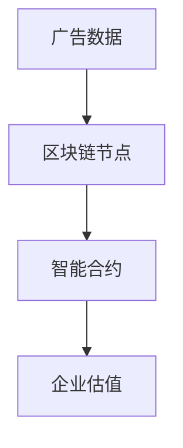
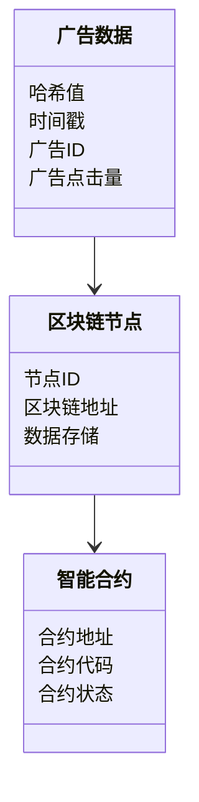
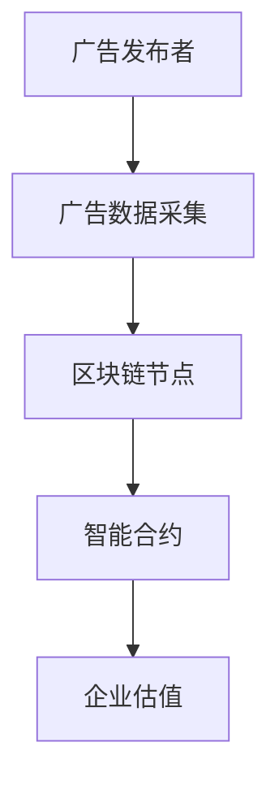

                 


# 《企业估值中的区块链数字广告追踪平台评估》

---

## 关键词：区块链、数字广告、企业估值、追踪平台、去中心化、哈希算法、智能合约

---

## 摘要：

本文深入探讨了区块链技术在数字广告追踪领域的应用，及其对广告支出企业估值的影响。通过分析广告数据的全生命周期管理、区块链共识机制、智能合约、数学建模与评估方法等核心内容，本文揭示了如何利用区块链技术提升广告数据的可信度和透明度，从而为广告支出企业的估值提供更加准确和可靠的数据支持。文章结构清晰，内容涵盖理论分析、算法实现、系统设计和实际案例，旨在为广告行业、区块链技术研究者和企业估值专家提供有益的参考。

---

# 第1章: 区块链与数字广告追踪概述

## 1.1 区块链技术的基本概念

### 1.1.1 区块链的定义与核心特征

区块链是一种去中心化的分布式账本技术，通过加密算法、共识机制和分布式网络实现数据的安全性和不可篡改性。其核心特征包括：

- **去中心化**：数据由多个节点共同维护，避免单点故障。
- **不可篡改性**：数据一旦写入区块链，难以被修改。
- **透明性**：所有交易记录公开可查，确保数据透明。
- **可追溯性**：通过区块链记录，可以追踪数据的来源和流向。

### 1.1.2 区块链的去中心化特性

去中心化是区块链的核心优势之一。通过分布式账本技术，区块链能够避免单点故障，降低数据被篡改的风险。在数字广告领域，去中心化技术可以确保广告数据的来源和流向透明可信。

### 1.1.3 区块链在广告追踪中的应用潜力

区块链技术可以记录广告的全生命周期，包括广告投放、点击、转化等行为。通过区块链技术，广告数据可以实现不可篡改的记录，为广告支出企业的估值提供可靠的数据支持。

## 1.2 数字广告追踪的现状与挑战

### 1.2.1 数字广告的定义与分类

数字广告是指通过互联网平台展示的广告，主要包括 banner 广告、搜索广告、视频广告、社交媒体广告等多种形式。广告的形式多样，但其核心目标是通过数据追踪和分析，优化广告投放效果。

### 1.2.2 当前广告追踪的主要问题

当前数字广告追踪面临以下主要问题：

- **数据造假**：广告点击量、展示量等数据容易被篡改，导致广告支出企业难以获得真实的数据支持。
- **数据孤岛**：不同广告平台的数据难以整合，导致广告效果难以全面评估。
- **隐私问题**：广告追踪涉及用户隐私数据，容易引发隐私泄露问题。

### 1.2.3 区块链技术如何解决广告追踪问题

区块链技术可以通过以下方式解决广告追踪问题：

- **数据不可篡改**：通过区块链记录广告数据，确保数据的真实性。
- **数据透明性**：广告数据对所有参与者公开，避免数据造假。
- **去中心化存储**：数据分散存储在多个节点，避免数据被篡改或丢失。

## 1.3 企业估值与数字广告的关系

### 1.3.1 企业估值的核心要素

企业估值的核心要素包括财务状况、市场表现、管理团队、行业地位等。在数字广告领域，广告数据的真实性和完整性是影响企业估值的重要因素。

### 1.3.2 数字广告在企业估值中的作用

数字广告是企业市场推广的重要手段。通过广告数据追踪，可以评估广告投放的效果，进而影响企业的市场表现和估值。

### 1.3.3 区块链技术对广告数据可信度的提升

区块链技术可以确保广告数据的可信度，从而为广告支出企业的估值提供更加准确的数据支持。

---

## 本章小结

本章介绍了区块链技术的基本概念和去中心化特性，并分析了数字广告追踪的现状与挑战。通过区块链技术，可以有效解决广告数据造假、数据孤岛等问题，为广告支出企业的估值提供更加可靠的数据支持。

---

# 第2章: 区块链数字广告追踪平台的核心概念与系统架构

## 2.1 平台核心概念与组成要素

### 2.1.1 广告数据的全生命周期管理

广告数据的全生命周期包括数据采集、存储、分析和应用。通过区块链技术，可以实现广告数据的全流程记录和管理。

### 2.1.2 区块链节点的角色与职责

区块链节点是区块链网络中的参与者，负责数据的存储、验证和传播。在数字广告追踪平台中，区块链节点可以包括广告发布者、广告平台、广告受众等。

### 2.1.3 智能合约在广告追踪中的应用

智能合约是区块链技术中的重要组成部分，可以自动执行预设的规则和协议。在数字广告追踪中，智能合约可以用于自动结算广告费用、验证广告数据的真实性等。

## 2.2 平台核心功能模块

### 2.2.1 广告数据采集与记录

广告数据采集包括广告展示、点击、转化等行为的记录。通过区块链技术，可以确保广告数据的实时性和完整性。

### 2.2.2 数据存储与区块链共识机制

数据存储在区块链网络中，通过共识机制确保数据的一致性和可靠性。常见的共识机制包括工作量证明（PoW）、权益证明（PoS）等。

### 2.2.3 数据分析与企业估值计算

通过对广告数据的分析，可以评估广告投放的效果，进而影响企业的市场表现和估值。

## 2.3 平台核心数据模型与实体关系

### 2.3.1 数据模型的定义与设计

数据模型是数字广告追踪平台的核心组成部分，定义了广告数据的结构和关系。常见的数据模型包括关系型数据库和NoSQL数据库。

### 2.3.2 ER实体关系图

以下是数字广告追踪平台的实体关系图：



## 2.4 本章小结

本章详细介绍了区块链数字广告追踪平台的核心概念和系统架构，包括广告数据的全生命周期管理、区块链节点的角色与职责、智能合约的应用等。通过合理的系统设计，可以确保广告数据的可信度和透明度。

---

# 第3章: 区块链共识机制与广告追踪算法

## 3.1 共识机制的核心原理

### 3.1.1 工作量证明（PoW）

工作量证明是比特币采用的共识机制，通过计算哈希值来证明工作量。其核心步骤如下：

1. 矿工需要找到一个随机数，使得哈希值满足特定条件。
2. 矿工将随机数和区块头信息提交到区块链网络。
3. 其他节点验证该随机数是否满足条件，若满足则接受该区块。

### 3.1.2 权益证明（PoS）

权益证明是一种基于持有币龄的共识机制。其核心步骤如下：

1. 节点根据持有的代币数量和时间随机选择验证者。
2. 验证者对区块进行验证并生成签名。
3. 其他节点验证签名是否有效，若有效则接受该区块。

### 3.1.3 其他共识机制

除了PoW和PoS，还有许多其他共识机制，如 delegated proof of stake (DPoS)、拜占庭容错共识（BFT）等。

---

## 3.2 广告追踪算法的实现

### 3.2.1 广告数据的哈希计算

广告数据的哈希计算是区块链追踪的重要步骤。通过哈希函数，可以将广告数据映射为固定长度的哈希值，确保数据的唯一性和完整性。

以下是Python中常见的哈希算法实现示例：

```python
import hashlib

def compute_hash(data):
    hash_object = hashlib.sha256(data.encode())
    return hash_object.hexdigest()
```

### 3.2.2 智能合约的自动执行

智能合约是区块链平台中的自动化程序，用于验证和执行广告数据的规则。以下是智能合约的简单实现示例：

```solidity
// Solidity智能合约代码
contract AdvertisementTracker {
    function track(bytes32 adHash) public {
        require(adHash != 0, "Invalid ad hash");
        // 记录广告数据
        recordAdvertisement(adHash);
    }
}
```

### 3.2.3 广告数据的存储与查询

广告数据的存储和查询可以通过区块链节点完成。以下是数据查询的Python示例：

```python
from blockchain import Blockchain

def queryAdvertisement(hash):
    blockchain = Blockchain()
    return blockchain.get_data(hash)
```

---

## 3.3 数学模型与公式

### 3.3.1 广告数据可信度模型

广告数据可信度模型可以通过以下公式计算：

$$
可信度 = \frac{有效广告数据量}{总广告数据量}
$$

其中，有效广告数据量是指通过区块链验证的广告数据量，总广告数据量是指所有广告数据量。

### 3.3.2 广告支出企业估值公式

广告支出企业的估值可以通过以下公式计算：

$$
企业估值 = k \times \text{广告数据可信度} \times \text{广告效果}
$$

其中，k是常数因子，广告效果可以通过广告点击率、转化率等指标衡量。

---

## 3.4 本章小结

本章详细介绍了区块链共识机制的核心原理，包括工作量证明（PoW）、权益证明（PoS）等。同时，还讲解了广告追踪算法的实现，包括哈希计算、智能合约的自动执行以及广告数据的存储与查询。通过数学模型和公式，进一步验证了区块链技术在广告追踪中的优势。

---

# 第4章: 区块链数字广告追踪平台的系统分析与架构设计

## 4.1 系统问题场景介绍

### 4.1.1 广告数据的全生命周期管理

广告数据的全生命周期包括数据采集、存储、分析和应用。通过区块链技术，可以实现广告数据的全流程记录和管理。

### 4.1.2 广告数据的可信度验证

通过区块链技术，可以确保广告数据的不可篡改性和透明性，从而提高广告数据的可信度。

### 4.1.3 广告数据的隐私保护

广告数据涉及用户隐私，通过区块链技术可以实现数据的隐私保护，避免数据泄露。

---

## 4.2 平台系统架构设计

### 4.2.1 领域模型设计

以下是数字广告追踪平台的领域模型：



### 4.2.2 系统架构设计

以下是数字广告追踪平台的系统架构图：



### 4.2.3 系统接口设计

数字广告追踪平台的主要接口包括：

- 数据采集接口：用于采集广告数据。
- 数据存储接口：用于存储广告数据。
- 数据查询接口：用于查询广告数据。
- 智能合约接口：用于调用智能合约。

---

## 4.3 本章小结

本章详细介绍了数字广告追踪平台的系统架构设计，包括领域模型设计、系统架构图以及系统接口设计。通过合理的系统设计，可以实现广告数据的全生命周期管理，提高广告数据的可信度和透明度。

---

# 第5章: 区块链数字广告追踪平台的项目实战

## 5.1 环境安装与配置

### 5.1.1 区块链平台的选择与安装

可以选择以太坊、Hyperledger Fabric等区块链平台进行开发。以太坊的安装和配置相对简单，适合快速开发。

### 5.1.2 开发工具的安装

安装Solidity编译器、以太坊钱包（如MetaMask）等开发工具。

## 5.2 核心代码实现

### 5.2.1 广告数据的哈希计算

```python
import hashlib

def compute_hash(data):
    return hashlib.sha256(data.encode()).hexdigest()
```

### 5.2.2 智能合约的部署

```solidity
// Solidity智能合约代码
contract AdvertisementTracker {
    function track(bytes32 adHash) public {
        require(adHash != 0, "Invalid ad hash");
        // 记录广告数据
        recordAdvertisement(adHash);
    }
}
```

### 5.2.3 区块链节点的配置

配置区块链节点，确保广告数据能够被正确记录和验证。

## 5.3 实际案例分析

### 5.3.1 案例背景

某广告支出企业希望利用区块链技术实现广告数据的可信追踪，提高广告支出的透明度和效率。

### 5.3.2 数据采集与记录

广告数据包括广告ID、广告点击量、广告转化率等，通过区块链技术实现数据的实时记录和验证。

### 5.3.3 数据分析与估值计算

通过广告数据的分析，计算广告支出企业的估值，验证区块链技术在广告追踪中的优势。

## 5.4 项目小结

本章通过实际案例分析，详细讲解了区块链数字广告追踪平台的项目实战。通过环境安装、核心代码实现以及实际案例分析，进一步验证了区块链技术在广告追踪中的应用价值。

---

# 作者：AI天才研究院/AI Genius Institute & 禅与计算机程序设计艺术 /Zen And The Art of Computer Programming

