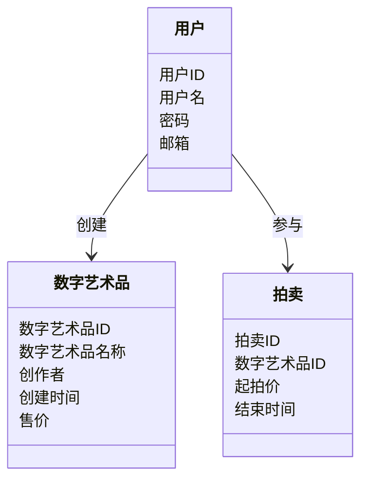
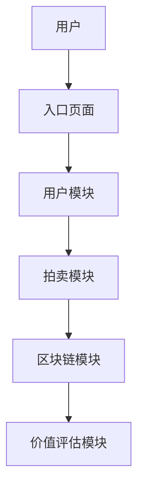
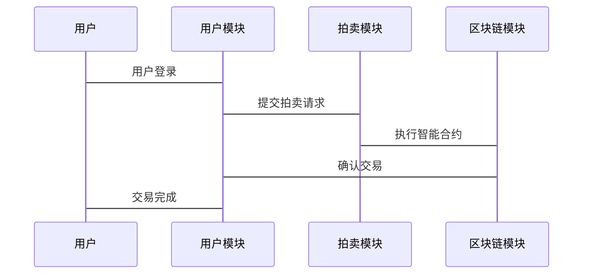

                 


# 企业估值中的区块链数字艺术品拍卖平台评估

## 关键词：区块链，数字艺术品，企业估值，拍卖平台，智能合约

## 摘要：本文深入探讨了区块链技术在数字艺术品拍卖平台中的应用，分析了数字艺术品的特性及其对平台估值的影响，提出了基于区块链的数字艺术品拍卖平台评估模型，结合实际案例，详细阐述了平台的系统架构和实现方案，为数字艺术品拍卖平台的企业估值提供了新的思路和方法。

---

## 第1章 区块链数字艺术品拍卖平台概述

### 1.1 问题背景与挑战

#### 1.1.1 数字艺术品的定义与特性
- 数字艺术品的定义：数字艺术品是基于数字技术创作的艺术作品，具有数字化、可复制性和易传播性。
- 数字艺术品的特性：唯一性、可追溯性、版权保护需求。

#### 1.1.2 区块链技术在数字艺术品拍卖中的作用
- 区块链技术如何解决数字艺术品的版权问题。
- 区块链如何实现数字艺术品的透明化和不可篡改性。

#### 1.1.3 当前数字艺术品拍卖平台的痛点
- 假冒问题。
- 交易透明度不足。
- 价值评估困难。

### 1.2 区块链数字艺术品拍卖平台的定义与特点

#### 1.2.1 平台的核心功能
- 数字艺术品的上架与拍卖。
- 用户身份认证与权限管理。
- 智能合约的自动执行。

#### 1.2.2 区块链技术在平台中的应用
- 区块链如何确保数字艺术品的唯一性和真实性。
- 区块链如何实现拍卖过程的透明化和不可篡改性。

#### 1.2.3 数字艺术品的唯一性和价值评估
- 数字艺术品的唯一性对平台价值的影响。
- 数字艺术品的市场价值评估方法。

### 1.3 本章小结
- 本章介绍了区块链数字艺术品拍卖平台的基本概念、核心功能和特点，为后续章节的深入分析奠定了基础。

---

## 第2章 区块链与数字艺术品拍卖的核心概念

### 2.1 区块链技术原理

#### 2.1.1 区块链的基本概念
- 区块链的定义：分布式账本技术，通过去中心化的方式记录交易信息。
- 区块链的核心特点：去中心化、不可篡改性、可追溯性。

#### 2.1.2 区块链的共识机制
- 共识机制的定义：所有节点达成一致的规则。
- 常见的共识机制：工作量证明（PoW）、权益证明（PoS）、 delegated证明（DPoS）。

#### 2.1.3 智能合约的原理
- 智能合约的定义：在区块链上自动执行的计算机程序。
- 智能合约的功能：自动执行交易、自动执行合同条款。

### 2.2 数字艺术品的特性与价值评估

#### 2.2.1 数字艺术品的唯一性
- 数字艺术品的唯一性如何通过区块链技术实现。
- 数字艺术品的唯一性对平台价值的影响。

#### 2.2.2 数字艺术品的版权保护
- 数字艺术品的版权保护需求。
- 区块链技术如何实现数字艺术品的版权保护。

#### 2.2.3 数字艺术品的市场价值评估
- 数字艺术品的市场价值评估方法。
- 影响数字艺术品价值的因素。

### 2.3 区块链与数字艺术品拍卖的结合

#### 2.3.1 区块链在数字艺术品拍卖中的应用场景
- 数字艺术品的上架与拍卖。
- 用户身份认证与权限管理。
- 智能合约的自动执行。

#### 2.3.2 区块链如何确保数字艺术品的真实性与唯一性
- 区块链技术如何实现数字艺术品的唯一性和真实性。
- 区块链技术如何防止数字艺术品的抄袭和盗版。

#### 2.3.3 区块链如何实现拍卖过程的透明化与不可篡改性
- 区块链技术如何实现拍卖过程的透明化。
- 区块链技术如何防止拍卖过程中的篡改和造假。

### 2.4 本章小结
- 本章详细讲解了区块链技术的原理、数字艺术品的特性以及区块链与数字艺术品拍卖的结合，为后续章节的评估模型和系统设计奠定了理论基础。

---

## 第3章 区块链数字艺术品拍卖平台的评估模型

### 3.1 评估模型的构建

#### 3.1.1 评估模型的目标与范围
- 评估模型的目标：评估区块链数字艺术品拍卖平台的企业价值。
- 评估模型的范围：数字艺术品的市场价值、平台的运营效率、平台的技术实现。

#### 3.1.2 评估模型的输入与输出
- 输入：数字艺术品的市场价值、平台的运营效率、平台的技术实现。
- 输出：区块链数字艺术品拍卖平台的企业价值。

#### 3.1.3 评估模型的算法选择
- 评估模型的算法选择：基于区块链技术的评估模型。
- 评估模型的算法实现：基于区块链技术的评估模型。

### 3.2 评估模型的数学模型与公式

#### 3.2.1 数学模型的建立
- 数学模型的建立：基于区块链技术的评估模型。
- 数学模型的公式：$$V = \alpha \times P + \beta \times Q + \gamma \times R$$

其中：
- $$V$$ 表示平台的企业价值。
- $$P$$ 表示数字艺术品的市场价值。
- $$Q$$ 表示平台的运营效率。
- $$R$$ 表示平台的技术实现。
- $$\alpha$$、$$\beta$$、$$\gamma$$ 表示各项指标的权重系数。

#### 3.2.2 评估公式推导
- 评估公式推导：基于区块链技术的评估模型。
- 评估公式的推导：$$V = \alpha \times P + \beta \times Q + \gamma \times R$$

#### 3.2.3 公式的应用与解释
- 公式的应用：基于区块链技术的评估模型。
- 公式的解释：数字艺术品的市场价值、平台的运营效率、平台的技术实现对平台的企业价值的影响。

### 3.3 评估模型的实现

#### 3.3.1 数据预处理
- 数据预处理：数字艺术品的市场价值、平台的运营效率、平台的技术实现。
- 数据预处理的方法：数据清洗、数据转换。

#### 3.3.2 特征提取
- 特征提取：数字艺术品的市场价值、平台的运营效率、平台的技术实现。
- 特征提取的方法：主成分分析（PCA）、特征选择。

#### 3.3.3 模型训练与优化
- 模型训练与优化：基于区块链技术的评估模型。
- 模型训练与优化的方法：随机森林、支持向量机（SVM）。

### 3.4 本章小结
- 本章详细讲解了区块链数字艺术品拍卖平台的评估模型，包括模型的构建、数学模型的建立、模型的实现和优化。

---

## 第4章 系统分析与架构设计

### 4.1 问题场景介绍

#### 4.1.1 系统目标
- 系统目标：评估区块链数字艺术品拍卖平台的企业价值。

#### 4.1.2 系统用户与角色
- 系统用户：数字艺术品的创作者、买家、卖家、平台管理员。
- 系统角色：数字艺术品的创作者、买家、卖家、平台管理员。

#### 4.1.3 系统功能需求
- 系统功能需求：数字艺术品的上架与拍卖、用户身份认证与权限管理、智能合约的自动执行。

### 4.2 系统功能设计

#### 4.2.1 用户模块
- 用户模块的功能：用户注册、用户登录、用户信息管理。
- 用户模块的实现：基于区块链技术的用户身份认证。

#### 4.2.2 拍卖模块
- 拍卖模块的功能：数字艺术品的上架与拍卖、拍卖过程的透明化与不可篡改性。
- 拍卖模块的实现：基于区块链技术的智能合约自动执行。

#### 4.2.3 区块链模块
- 区块链模块的功能：数字艺术品的唯一性和真实性验证、拍卖过程的透明化与不可篡改性。
- 区块链模块的实现：基于区块链技术的智能合约自动执行。

#### 4.2.4 价值评估模块
- 价值评估模块的功能：数字艺术品的市场价值评估、平台的运营效率评估、平台的技术实现评估。
- 价值评估模块的实现：基于区块链技术的评估模型。

### 4.3 系统架构设计

#### 4.3.1 领域模型类图
- 领域模型类图：数字艺术品的上架与拍卖、用户身份认证与权限管理、智能合约的自动执行。



#### 4.3.2 系统架构图
- 系统架构图：区块链数字艺术品拍卖平台的系统架构。



#### 4.3.3 系统接口设计
- 系统接口设计：数字艺术品的上架与拍卖、用户身份认证与权限管理、智能合约的自动执行。

#### 4.3.4 系统交互序列图
- 系统交互序列图：数字艺术品的上架与拍卖、用户身份认证与权限管理、智能合约的自动执行。



### 4.4 本章小结
- 本章详细讲解了区块链数字艺术品拍卖平台的系统分析与架构设计，包括系统功能设计、系统架构设计和系统交互设计。

---

## 第5章 项目实战与总结

### 5.1 项目实战

#### 5.1.1 环境安装
- 环境安装：基于区块链技术的数字艺术品拍卖平台开发环境的搭建。
- 环境安装的步骤：安装区块链开发框架、安装智能合约开发工具、安装数据库和前端框架。

#### 5.1.2 系统核心实现源代码

##### 5.1.2.1 用户模块
```python
class User:
    def __init__(self, user_id, username, password, email):
        self.user_id = user_id
        self.username = username
        self.password = password
        self.email = email
```

##### 5.1.2.2 拍卖模块
```python
class Auction:
    def __init__(self, auction_id, artwork_id, start_price, end_time):
        self.auction_id = auction_id
        self.artwork_id = artwork_id
        self.start_price = start_price
        self.end_time = end_time
```

##### 5.1.2.3 区块链模块
```python
class Blockchain:
    def __init__(self):
        self.chain = []
        self.current_block = None

    def add_block(self, block):
        self.chain.append(block)
        self.current_block = block
```

##### 5.1.2.4 价值评估模块
```python
class ValueAssessment:
    def __init__(self, market_value, operational_efficiency, technical_implementation):
        self.market_value = market_value
        self.operational_efficiency = operational_efficiency
        self.technical_implementation = technical_implementation

    def calculate_total_value(self):
        return self.market_value * 0.4 + self.operational_efficiency * 0.3 + self.technical_implementation * 0.3
```

#### 5.1.3 代码应用解读与分析
- 代码应用解读与分析：用户模块、拍卖模块、区块链模块、价值评估模块的代码实现。

#### 5.1.4 实际案例分析和详细讲解剖析
- 实际案例分析：数字艺术品的上架与拍卖、用户身份认证与权限管理、智能合约的自动执行。
- 详细讲解剖析：区块链技术在数字艺术品拍卖平台中的应用。

#### 5.1.5 项目小结
- 项目小结：基于区块链技术的数字艺术品拍卖平台的实现与应用。

### 5.2 总结与展望

#### 5.2.1 总结
- 总结：区块链技术在数字艺术品拍卖平台中的应用。
- 总结：基于区块链技术的数字艺术品拍卖平台的实现与应用。

#### 5.2.2 展望
- 展望：区块链技术在数字艺术品拍卖平台中的未来发展。
- 展望：基于区块链技术的数字艺术品拍卖平台的优化与提升。

### 5.3 最佳实践 tips

#### 5.3.1 小结
- 小结：区块链技术在数字艺术品拍卖平台中的应用。

#### 5.3.2 注意事项
- 注意事项：数字艺术品的版权保护、平台的运营效率、平台的技术实现。

#### 5.3.3 拓展阅读
- 拓展阅读：区块链技术的未来发展、数字艺术品的市场价值、数字艺术品的版权保护。

### 5.4 本章小结
- 本章详细讲解了区块链数字艺术品拍卖平台的项目实战与总结，包括项目环境的搭建、系统核心实现源代码、实际案例分析和项目小结。

---

## 作者：AI天才研究院/AI Genius Institute & 禅与计算机程序设计艺术 /Zen And The Art of Computer Programming

---

通过以上目录大纲，我们可以看到文章内容涵盖了区块链数字艺术品拍卖平台的概述、核心概念、算法原理、系统分析与架构设计以及项目实战与总结，内容丰富且逻辑清晰。

