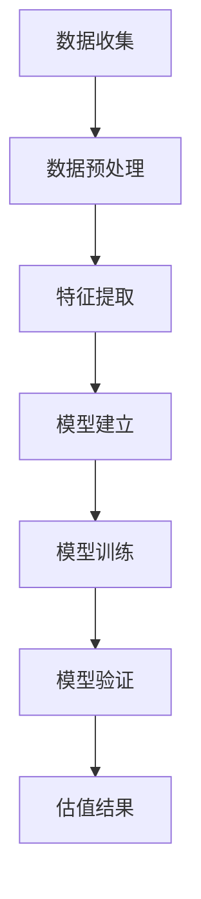
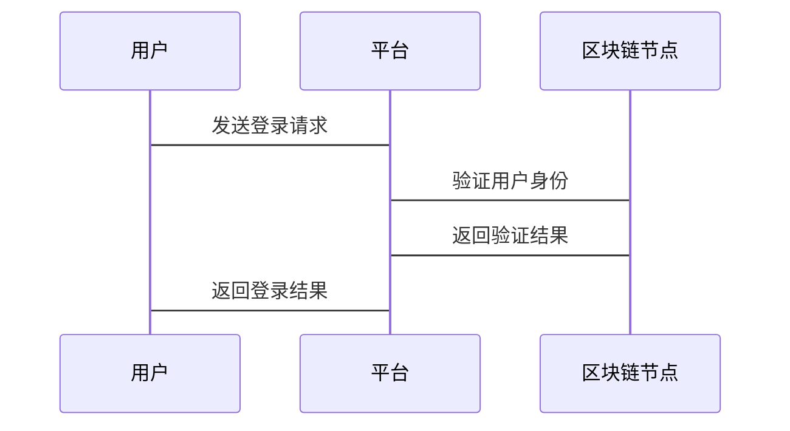
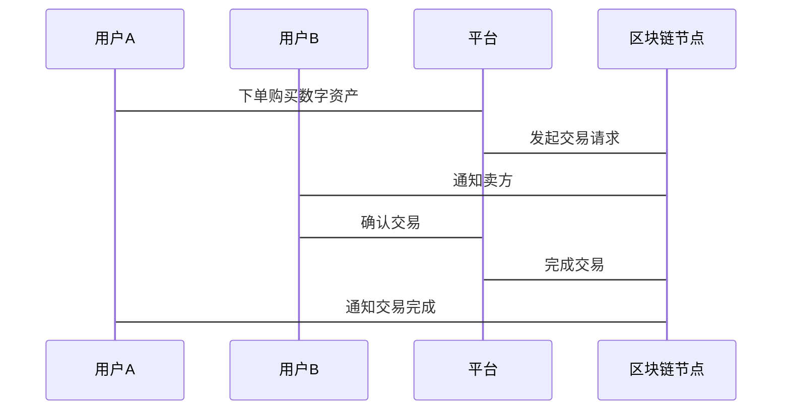

                 


# 《企业估值中的区块链数字资产交易平台评估》

## 关键词：企业估值、区块链、数字资产、交易平台、评估方法、技术实现、应用场景

## 摘要：  
在数字资产快速发展的今天，区块链技术为数字资产交易平台的评估带来了新的可能性。本文从区块链技术的基本概念出发，详细探讨了数字资产交易平台的估值方法，结合实际案例，分析了区块链技术如何提升估值的准确性和效率。文章还介绍了数字资产交易平台的系统架构设计、算法实现及项目实战，为读者提供了全面的技术视角和实践指导。

---

# 第1章 区块链与数字资产交易平台的基本概念

## 1.1 区块链技术基础

### 1.1.1 区块链的基本概念

区块链是一种去中心化的分布式账本技术，通过加密算法和共识机制确保数据的安全性和不可篡改性。区块链由多个节点构成，每个节点都保存完整的交易记录，数据通过哈希函数加密，并以区块的形式连接成链。

区块链的核心特点包括去中心化、不可篡改、透明性和安全性。这些特点使其成为数字资产交易的理想技术基础。

### 1.1.2 区块链的核心特点

- **去中心化**：区块链不依赖于中心化的机构，数据由所有节点共同维护。
- **不可篡改**：一旦数据被写入区块链，几乎无法被修改。
- **透明性**：所有交易记录都可以被查询，但身份信息可以匿名化。
- **安全性**：通过加密算法和共识机制，确保数据的安全性。

### 1.1.3 区块链的分类与应用场景

区块链主要分为公链、私链和联盟链。公链（如比特币、以太坊）面向所有人开放，私链则用于特定组织内部，联盟链用于多个机构之间的协作。

区块链在数字资产交易、供应链管理、金融支付等领域有广泛应用。

## 1.2 数字资产的基本概念

### 1.2.1 数字资产的定义

数字资产是指以数字形式存在的资产，包括比特币、以太坊等加密货币，以及NFT（非同质化代币）等。

### 1.2.2 数字资产的分类

数字资产主要分为以下几类：

1. **加密货币**：如比特币、以太坊，用于价值存储和转移。
2. **实用型代币**：用于特定平台或服务的代币，如GAS（以太坊的燃料代币）。
3. **NFT**：非同质化代币，用于表示唯一性资产，如数字艺术品、虚拟土地等。
4. **证券型代币**：代表传统资产（如股票、债券）的数字凭证。

### 1.2.3 数字资产与传统资产的区别

- **形式**：数字资产是数字化的，而传统资产多为实体或纸质形式。
- **交易效率**：数字资产交易速度快，全球可实时到账，传统资产交易多涉及中间机构。
- **安全性**：数字资产通过区块链技术确保安全性，传统资产依赖于法律和机构保障。

## 1.3 数字资产交易平台的定义与特点

### 1.3.1 数字资产交易平台的定义

数字资产交易平台是指提供数字资产交易服务的平台，用户可以在此买卖比特币、以太坊等数字资产。

### 1.3.2 数字资产交易平台的核心功能

- **用户注册与登录**：用户需要注册账户并完成身份验证。
- **资产展示**：平台展示可交易的数字资产及其价格。
- **交易撮合**：用户下单后，系统自动匹配买卖双方，完成交易。
- **资产托管与结算**：平台托管用户资产，并完成交易的清算和结算。

### 1.3.3 数字资产交易平台的优缺点

**优点**：
- **高效性**：交易速度快，24小时全球可交易。
- **透明性**：区块链技术确保交易记录公开透明。
- **便捷性**：用户可通过平台方便地买卖数字资产。

**缺点**：
- **安全性风险**：平台可能面临黑客攻击或内部欺诈。
- **监管风险**：不同国家对数字资产的监管政策不同，平台可能面临合规性问题。
- **波动性大**：数字资产价格波动剧烈，可能带来投资风险。

## 1.4 区块链在数字资产交易平台中的作用

### 1.4.1 区块链技术在数字资产交易中的优势

- **去中心化**：减少对中心机构的依赖，降低平台被操控的风险。
- **透明性**：所有交易记录公开，用户可以随时查询。
- **安全性**：区块链技术确保交易数据的安全性和不可篡改性。

### 1.4.2 区块链技术在数字资产交易中的应用

- **智能合约**：通过智能合约自动执行交易，减少人为干预。
- **去信任化**：用户无需信任平台，交易由区块链技术自动执行。
- **高效结算**：区块链技术实现快速清算，降低交易成本。

### 1.4.3 区块链技术对数字资产交易平台的影响

- **提升信任度**：区块链技术增加了交易的透明性和可信度。
- **降低运营成本**：去中心化减少了对大量中间机构的依赖，降低了运营成本。
- **提高交易效率**：区块链技术实现快速交易和结算，提升用户体验。

---

## 1.5 本章小结

本章介绍了区块链技术的基本概念、特点及其在数字资产交易中的应用。通过对比数字资产与传统资产的区别，阐述了数字资产交易平台的核心功能和优缺点。最后，重点分析了区块链技术对数字资产交易平台的积极影响，包括去中心化、透明性和安全性等方面的优势。

---

# 第2章 传统企业估值方法与区块链技术的结合

## 2.1 传统企业估值方法概述

### 2.1.1 市盈率法

市盈率法是通过企业的市盈率与行业平均水平进行比较，来判断企业价值的一种方法。市盈率=股票价格/每股收益。如果企业的市盈率低于行业平均水平，可能意味着企业被低估。

### 2.1.2 市净率法

市净率法是将企业的市场价值与账面价值进行比较，市净率=股票价格/每股净资产。如果企业的市净率低于1，可能意味着企业被低估。

### 2.1.3 股权自由现金流法

股权自由现金流法是通过计算企业未来现金流的现值，来评估企业的价值。股权自由现金流=净利润-折旧-资本支出。通过贴现率将未来现金流折现，计算企业价值。

## 2.2 区块链技术对传统估值方法的改进

### 2.2.1 区块链技术如何提高估值数据的透明度

区块链技术可以实时记录企业的财务数据、交易记录等信息，并通过智能合约自动执行，减少人为干预，提高数据的透明度。

### 2.2.2 区块链技术如何降低估值过程中的信息不对称

区块链技术可以确保数据的真实性和完整性，减少信息不对称，提高估值的准确性。

### 2.2.3 区块链技术如何提高估值结果的准确性

通过区块链技术，可以实时监控企业的经营状况，动态调整估值模型，提高估值结果的准确性。

## 2.3 数字资产交易平台的特殊估值需求

### 2.3.1 数字资产交易平台的特殊性

数字资产交易平台具有高波动性、高风险性、高技术依赖性等特点，这些特点使得传统的估值方法难以准确评估其价值。

### 2.3.2 区块链技术对数字资产交易平台估值的影响

区块链技术可以通过智能合约实时监控平台的交易量、用户数量、资产规模等关键指标，为估值提供更准确的数据支持。

### 2.3.3 数字资产交易平台估值的核心挑战

- **数据获取难**：数字资产交易平台的数据分散且难以获取。
- **高波动性**：数字资产价格波动剧烈，影响估值的准确性。
- **技术复杂性**：数字资产交易平台涉及复杂的区块链技术，增加了估值的难度。

---

## 2.4 本章小结

本章探讨了传统企业估值方法与区块链技术的结合，分析了区块链技术如何提高估值的透明度、降低信息不对称，并提高估值结果的准确性。同时，详细分析了数字资产交易平台的特殊性及其估值的核心挑战。

---

# 第3章 区块链数字资产交易平台的估值模型与算法

## 3.1 估值模型的设计思路

### 3.1.1 基于交易数据的估值模型

通过分析平台的交易量、交易额、用户活跃度等数据，建立估值模型。

### 3.1.2 基于智能合约的估值模型

利用智能合约自动执行和记录的交易数据，建立更准确的估值模型。

### 3.1.3 综合估值模型

结合交易数据和智能合约数据，建立综合估值模型，综合考虑平台的交易量、用户数量、资产规模等多因素。

## 3.2 算法实现

### 3.2.1 数据收集与预处理

从区块链节点获取交易数据，清洗和预处理数据，确保数据的准确性和完整性。

### 3.2.2 交易数据的特征提取

提取交易量、交易额、用户数量、资产规模等关键特征，为估值提供数据支持。

### 3.2.3 估值模型的建立与训练

使用机器学习算法（如线性回归、随机森林等）建立估值模型，并通过历史数据进行训练和优化。

### 3.2.4 模型的验证与测试

通过回测和交叉验证，评估模型的准确性和稳定性，确保模型的有效性。

---

## 3.3 数学公式与算法流程

### 3.3.1 线性回归模型

$$ y = \beta_0 + \beta_1 x_1 + \beta_2 x_2 + \cdots + \beta_n x_n $$

其中，$y$ 表示估值结果，$x_i$ 表示各个特征变量，$\beta_i$ 表示回归系数。

### 3.3.2 算法流程图



---

## 3.4 本章小结

本章详细介绍了区块链数字资产交易平台的估值模型与算法，通过数据收集、特征提取、模型建立和验证，提供了一种基于区块链技术的估值方法，为数字资产交易平台的估值提供了新的思路和方法。

---

# 第4章 系统分析与架构设计

## 4.1 系统功能设计

### 4.1.1 用户模块

- 用户注册与登录
- 个人资产查询
- 交易记录查询

### 4.1.2 交易模块

- 数字资产展示
- 交易下单
- 交易确认

### 4.1.3 管理模块

- 平台监控
- 交易数据查询
- 系统设置

## 4.2 系统架构设计

### 4.2.1 分层架构

- **前端层**：用户界面，实现用户交互。
- **业务逻辑层**：处理用户的交易请求，调用智能合约。
- **数据持久化层**：存储交易数据，支持区块链节点的数据同步。

### 4.2.2 智能合约设计

智能合约用于自动执行交易逻辑，确保交易的透明性和不可篡改性。

---

## 4.3 系统交互设计

### 4.3.1 用户登录流程



### 4.3.2 交易流程



---

## 4.4 本章小结

本章通过分层架构设计和智能合约实现，详细介绍了数字资产交易平台的系统架构和交互流程。通过用户模块、交易模块和管理模块的设计，确保了系统的安全性和高效性。

---

# 第5章 项目实战

## 5.1 环境配置

- 安装以太坊节点：使用Geth或Infura。
- 安装Solidity编译器：用于编写智能合约。
- 安装Python开发环境：用于后端开发和数据分析。

## 5.2 核心代码实现

### 5.2.1 智能合约实现

```solidity
// SPDX-License-Identifier: MIT
pragma solidity ^0.8.0;

contract TradingPlatform {
    mapping(address => uint256) public balances;

    function deposit(uint256 amount) external {
        balances[msg.sender] += amount;
    }

    function withdraw(uint256 amount) external {
        require(balances[msg.sender] >= amount, "Insufficient balance");
        balances[msg.sender] -= amount;
    }

    function trade(address buyer, address seller, uint256 amount) external {
        require(balances[seller] >= amount, "Insufficient balance");
        balances[seller] -= amount;
        balances[buyer] += amount;
    }
}
```

### 5.2.2 后端代码实现

```python
from web3 import Web3
from web3.middleware import gethRPCMiddleware

# 连接以太坊节点
w3 = Web3(Web3.HTTPProvider("http://localhost:8545"))

# 智能合约地址
contract_address = '0x...'

# 智能合约接口
contract = w3.eth.contract(contract_address, abi=...)

# 存储交易数据
def save_transaction_data(tx_hash, tx_receipt):
    # 将交易数据保存到数据库或日志
    pass

# 下单交易
def place_order(buyer, seller, amount):
    try:
        tx_hash = contract.functions.trade(buyer, seller, amount).transact()
        tx_receipt = w3.eth.waitForTransactionReceipt(tx_hash)
        save_transaction_data(tx_hash, tx_receipt)
        return True
    except Exception as e:
        print(f"交易失败：{e}")
        return False
```

## 5.3 测试与部署

### 5.3.1 测试环境搭建

- 使用Geth搭建本地测试网络。
- 部署智能合约到测试网络。
- 编写测试用例，验证智能合约功能。

### 5.3.2 部署到生产环境

- 部署智能合约到以太坊主网或其他公链。
- 配置后端服务，连接智能合约接口。
- 部署前端界面，实现用户交互。

---

## 5.4 本章小结

本章通过实际项目案例，详细介绍了数字资产交易平台的环境配置、核心代码实现和测试部署过程。通过智能合约和后端代码的实现，展示了如何将理论应用于实践，确保系统的安全性和高效性。

---

# 第6章 最佳实践与总结

## 6.1 最佳实践

### 6.1.1 系统安全性

- 定期进行安全审计，确保系统免受黑客攻击。
- 使用多重签名钱包，减少单点故障风险。

### 6.1.2 交易合规性

- 遵守相关法律法规，确保平台的合规性。
- 建立风险提示和投资者教育机制，降低投资风险。

### 6.1.3 系统性能优化

- 使用分片技术提高区块链的处理能力。
- 优化智能合约代码，减少交易 gas 费用。

---

## 6.2 项目小结

通过本文的详细分析和实际案例，我们展示了如何利用区块链技术提升数字资产交易平台的估值效率和准确性。从系统架构设计到算法实现，再到实际项目部署，本文为读者提供了全面的技术视角和实践指导。

---

## 6.3 展望未来

随着区块链技术的不断发展，数字资产交易平台的估值方法将更加多样化和精准化。未来，随着区块链技术的成熟和普及，数字资产交易平台将在企业估值中发挥更大的作用，为投资者提供更高效、更准确的估值服务。

---

## 6.4 注意事项

- **合规性风险**：数字资产交易平台可能面临法律监管风险，需密切关注相关政策变化。
- **技术风险**：区块链技术尚处于发展阶段，可能存在技术不成熟带来的风险。
- **市场风险**：数字资产价格波动剧烈，可能影响平台的估值结果。

---

## 6.5 拓展阅读

- 《区块链技术进阶与实战》
- 《数字资产与金融创新》
- 《企业估值方法与案例分析》

---

# 作者：AI天才研究院/AI Genius Institute & 禅与计算机程序设计艺术/Zen And The Art of Computer Programming

---

> **摘要**：  
> 本文详细探讨了区块链技术在数字资产交易平台估值中的应用，从基本概念到实际案例，全面分析了区块链技术如何提升估值的透明度和准确性。通过系统架构设计和算法实现，本文为数字资产交易平台的估值提供了新的思路和方法，为读者提供了全面的技术视角和实践指导。

