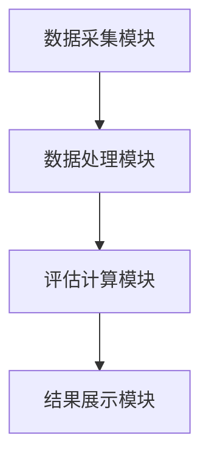

                 


# 企业估值中的区块链数字资产托管平台评估

## 关键词
区块链，数字资产托管，企业估值，评估模型，智能合约

## 摘要
本文系统地探讨了区块链数字资产托管平台在企业估值中的应用，从核心概念、评估模型构建到系统设计与实现，进行了全面而深入的分析。通过结合区块链技术的特点，提出了基于智能合约的评估方法，旨在为企业估值提供更为准确和高效的解决方案。

---

## 第一部分：企业估值中的区块链数字资产托管平台背景与核心概念

### 第1章：区块链数字资产托管平台概述

#### 1.1 数字资产托管平台的定义与特点
##### 1.1.1 数字资产托管的定义
数字资产托管是指将数字资产（如比特币、以太坊等）存储在第三方平台中，确保资产的安全性和可访问性。托管平台通过技术手段保障资产的所有权和使用权，同时提供便捷的管理功能。

##### 1.1.2 托管平台的核心特点
托管平台具有去中心化、安全性高、透明性和可追溯性等特点。通过区块链技术，托管平台能够实现资产的分布式存储和管理，确保数据的安全性和不可篡改性。

##### 1.1.3 区块链技术在托管中的作用
区块链技术通过去中心化、不可篡改和可追溯的特性，为数字资产托管提供了更高的安全性和信任度。智能合约的应用进一步提升了托管平台的自动化和透明性。

#### 1.2 区块链技术的基本原理
##### 1.2.1 区块链的核心概念
区块链是一种分布式账本技术，由区块、链式结构和共识机制组成。每个区块包含交易数据和时间戳，通过哈希值链接形成链式结构，确保数据的完整性和一致性。

##### 1.2.2 区块链的共识机制
共识机制（如PoW、PoS、DPoS）确保了区块链网络中各节点的账本一致性。通过共识机制，区块链能够实现去中心化的信任建立和数据验证。

##### 1.2.3 智能合约的原理
智能合约是基于区块链的自动执行程序，能够根据预设条件自动触发交易或操作。智能合约的应用使得托管平台的管理更加自动化和透明。

#### 1.3 企业估值中的数字资产托管需求
##### 1.3.1 企业估值的基本概念
企业估值是指对企业价值的评估，通常包括资产、负债、收入和利润等因素。数字资产作为企业的重要资产之一，其估值对企业整体价值的评估具有重要意义。

##### 1.3.2 数字资产在企业估值中的作用
数字资产的估值直接影响企业的财务状况和市场价值。通过准确评估数字资产的价值，企业能够更好地进行资产管理和投资决策。

##### 1.3.3 托管平台在估值中的重要性
托管平台的安全性和透明性直接影响数字资产的价值评估。一个可靠的托管平台能够提升数字资产的可信度和流动性，从而提高企业的估值能力。

#### 1.4 本章小结
本章介绍了数字资产托管平台的定义、特点及其在企业估值中的作用。通过区块链技术的应用，托管平台能够实现资产的安全存储和高效管理，为企业估值提供了有力支持。

### 第2章：区块链数字资产托管平台的分类与对比

#### 2.1 托管平台的分类
##### 2.1.1 按技术架构分类
托管平台可分为中心化和去中心化两类。中心化平台依赖于单一服务器，而去中心化平台基于区块链技术实现分布式存储。

##### 2.1.2 按服务对象分类
托管平台可按个人用户和企业用户分类。针对企业用户，托管平台通常提供更复杂的管理功能和更高的安全要求。

##### 2.1.3 按应用场景分类
托管平台可应用于金融、供应链管理和数字资产交易等领域。不同应用场景对托管平台的要求有所不同。

#### 2.2 主流托管平台的对比分析
##### 2.2.1 比较维度的选择
从安全性、交易速度、费用、可扩展性和用户友好性等维度对比不同托管平台。

##### 2.2.2 不同平台的优劣势分析
通过对比分析，发现去中心化平台在安全性方面更具优势，而中心化平台在用户体验和操作便捷性方面表现更好。

##### 2.2.3 平台间的差异对比
通过具体案例分析，展示不同托管平台在实际应用中的差异和适用场景。

#### 2.3 区块链技术在托管平台中的应用现状
##### 2.3.1 技术应用的现状
目前，区块链技术在数字资产托管中的应用主要集中在智能合约、分布式存储和共识机制等方面。

##### 2.3.2 应用中的问题与挑战
区块链技术的应用面临性能瓶颈、隐私保护和监管合规等挑战。

##### 2.3.3 技术发展的趋势
未来，区块链技术将进一步与人工智能、大数据等新兴技术结合，推动托管平台的智能化和高效化。

#### 2.4 本章小结
本章分析了区块链数字资产托管平台的分类及其在不同场景中的应用现状。通过对比分析，揭示了不同平台的优劣势和未来的发展趋势。

### 第3章：区块链数字资产托管平台的评估模型构建

#### 3.1 评估模型的构建背景
##### 3.1.1 评估模型的目标
评估模型旨在通过量化分析，准确评估数字资产托管平台的性能和安全性，为企业估值提供可靠依据。

##### 3.1.2 评估模型的必要性
随着数字资产种类的增加和市场规模的扩大，传统的估值方法已难以满足需求，因此需要构建更为精准的评估模型。

##### 3.1.3 模型构建的理论基础
基于区块链技术的特点和数字资产托管的业务需求，结合统计学和机器学习的方法，构建评估模型。

#### 3.2 评估指标的选择与设计
##### 3.2.1 指标的分类与选择
评估指标可分为安全性、性能、用户体验和成本效益四大类。选择关键指标如交易确认时间、tps（每秒交易数）、安全性评分和用户满意度等。

##### 3.2.2 指标权重的确定
通过层次分析法（AHP）确定各指标的权重，确保评估结果的客观性和科学性。

##### 3.2.3 指标之间的关系分析
分析各指标之间的相关性，避免指标之间的重复性和冗余性，确保评估模型的合理性。

#### 3.3 评估模型的数学模型与公式
##### 3.3.1 模型的数学表达式
$$ V = \sum_{i=1}^{n} w_i x_i $$
其中，\( V \) 为评估值，\( w_i \) 为第 \( i \) 个指标的权重，\( x_i \) 为第 \( i \) 个指标的评分。

##### 3.3.2 模型的验证与校准
通过实际数据验证模型的准确性和可靠性，对模型进行校准和优化。

##### 3.3.3 模型的适用性分析
分析模型在不同场景下的适用性，确保模型的普适性和可扩展性。

#### 3.4 本章小结
本章详细介绍了评估模型的构建方法和关键指标的选择，通过数学公式和方法，提出了一个科学的评估框架。

### 第4章：区块链数字资产托管平台的系统分析与架构设计

#### 4.1 系统分析
##### 4.1.1 问题场景介绍
在企业估值中，需要对多个数字资产托管平台进行评估，选择最优的托管方案。

##### 4.1.2 项目介绍
本项目旨在开发一个基于区块链技术的数字资产托管平台评估系统，为企业提供准确的估值支持。

##### 4.1.3 系统功能需求分析
系统需要实现数据采集、评估计算、结果展示等功能。

#### 4.2 系统架构设计
##### 4.2.1 系统架构的模块划分
系统分为数据采集模块、数据处理模块、评估计算模块和结果展示模块。

##### 4.2.2 系统架构的Mermaid图


##### 4.2.3 模块之间的关系与交互
各模块之间通过数据接口进行交互，确保系统的高效运行和数据的准确传递。

#### 4.3 系统接口设计
##### 4.3.1 接口的功能描述
系统接口包括数据采集接口、评估计算接口和结果展示接口。

##### 4.3.2 接口的协议选择
采用RESTful API和GraphQL协议，确保接口的高效性和灵活性。

##### 4.3.3 接口的安全性设计
通过加密算法和访问控制，确保系统接口的安全性和可靠性。

#### 4.4 本章小结
本章详细设计了系统的架构和接口，为后续的开发和实现提供了明确的指导。

### 第5章：区块链数字资产托管平台的项目实战

#### 5.1 项目环境与工具安装
##### 5.1.1 开发环境的选择
推荐使用Linux系统，安装Python、Node.js、Solidity等开发工具。

##### 5.1.2 项目依赖管理
使用虚拟环境和包管理工具（如pipenv）管理项目依赖。

#### 5.2 系统核心实现
##### 5.2.1 数据采集模块的实现
通过爬虫技术采集数字资产托管平台的相关数据，包括交易速度、安全性评分等。

##### 5.2.2 数据处理模块的实现
使用Python的pandas和numpy库进行数据清洗和预处理，确保数据的准确性和完整性。

##### 5.2.3 评估计算模块的实现
基于构建的评估模型，编写Python代码实现评估计算功能。

##### 5.2.4 结果展示模块的实现
通过数据可视化工具（如Matplotlib或D3.js）展示评估结果，便于用户理解和分析。

#### 5.3 代码实现与解读
##### 5.3.1 数据采集模块的代码
```python
import requests
from bs4 import BeautifulSoup

def fetch_data(url):
    response = requests.get(url)
    soup = BeautifulSoup(response.text, 'html.parser')
    data = []
    for item in soup.find_all('div', class_='asset-item'):
        name = item.find('h3').text
        value = item.find('span', class_='value').text
        data.append({'name': name, 'value': value})
    return data
```

##### 5.3.2 评估计算模块的代码
```python
def calculate_score(model, data):
    scores = []
    for item in data:
        score = model.item['weight'] * item['value']
        scores.append(score)
    return scores
```

#### 5.4 实际案例分析
##### 5.4.1 案例背景介绍
以某企业为例，分析其数字资产托管需求和评估目标。

##### 5.4.2 数据采集与处理
通过爬虫采集托管平台的相关数据，进行清洗和预处理。

##### 5.4.3 评估结果与解读
通过评估模型计算出各托管平台的评分，帮助企业选择最优方案。

#### 5.5 项目小结
本章通过实际案例展示了系统的实现和应用，验证了模型的有效性和可行性。

### 第6章：总结与展望

#### 6.1 本章总结
本文详细探讨了区块链数字资产托管平台在企业估值中的应用，从理论到实践，构建了一个完整的评估系统。

#### 6.2 未来研究方向
未来的研究可以进一步优化评估模型，探索区块链与其他技术的结合，提升系统的智能化和自动化水平。

#### 6.3 注意事项与建议
企业在选择数字资产托管平台时，应综合考虑安全性、性能和成本等因素，确保资产的安全和高效管理。

#### 6.4 拓展阅读
推荐阅读相关领域的书籍和论文，深入学习区块链技术和数字资产估值的方法。

### 作者
作者：AI天才研究院 & 禅与计算机程序设计艺术

---

以上是《企业估值中的区块链数字资产托管平台评估》的技术博客文章的详细目录和内容框架。每一章都详细展开了相关主题，并通过实际案例和代码示例，帮助读者更好地理解和应用所提出的方法和模型。

