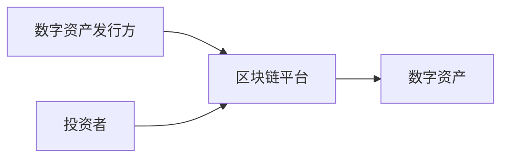
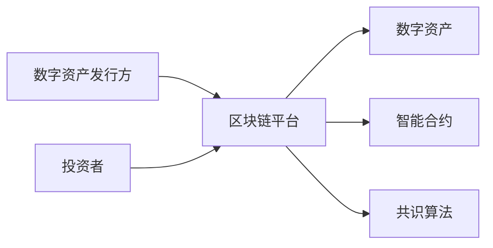

                 


# 《企业估值中的区块链数字资产证券化平台评估》

> **关键词**：企业估值、区块链、数字资产、证券化、智能合约、共识算法、资产评估

> **摘要**：本文深入探讨了区块链技术在企业估值中的应用，特别是数字资产证券化平台的评估方法。通过分析区块链的核心原理、数字资产的发行与交易机制，以及智能合约的应用，本文旨在为企业估值提供一种创新的评估框架。结合实际案例和系统设计，本文详细阐述了区块链数字资产证券化平台的构建过程，并提出了相应的评估模型和方法。

---

## 第1章: 区块链与数字资产证券化平台的背景与概念

### 1.1 区块链技术的基本概念

区块链是一种分布式账本技术，通过去中心化的方式记录和验证数据的真实性。其核心特点包括：

- **去中心化**：数据存储在多个节点上，避免单点故障。
- **不可篡改**：通过加密算法确保数据的安全性和不可篡改性。
- **智能合约**：自动化执行预定义的规则和协议。

区块链的分类主要分为公有链、联盟链和私有链，每种类型适用于不同的场景。

### 1.2 数字资产证券化的定义与特点

数字资产证券化是指将传统资产（如股权、债权）转化为数字形式，并通过区块链技术进行发行和交易。其特点包括：

- **高效性**：通过区块链技术实现资产的快速发行和交易。
- **透明性**：所有交易记录在区块链上，公开透明。
- **安全性**：利用加密技术确保资产的安全性。

### 1.3 区块链在数字资产证券化中的作用

区块链在数字资产证券化中的作用主要体现在以下几个方面：

- **资产发行**：通过智能合约自动发行数字资产。
- **资产交易**：支持去中心化的资产交易，降低交易成本。
- **资产估值**：通过区块链上的交易数据，提供实时资产估值。

---

## 第2章: 区块链数字资产证券化平台的核心概念

### 2.1 区块链数字资产证券化平台的构成要素

区块链数字资产证券化平台由以下几个核心要素组成：

- **数字资产发行方**：负责发行数字资产。
- **投资者**：购买和持有数字资产。
- **平台运营商**：提供区块链平台和技术支持。

### 2.2 数字资产证券化的核心流程

数字资产证券化的核心流程包括资产上链、资产发行和资产交易三个阶段。

- **资产上链**：将传统资产转化为数字形式，并记录在区块链上。
- **资产发行**：通过智能合约发行数字资产。
- **资产交易**：投资者在区块链上进行资产的买卖。

### 2.3 区块链数字资产证券化平台的实体关系图

以下是一个简单的实体关系图，展示了数字资产证券化平台的主要参与者及其关系。



---

## 第3章: 区块链数字资产证券化平台的算法原理

### 3.1 共识算法

共识算法是区块链的核心技术之一，用于确保所有节点达成一致。常见的共识算法包括：

- **PoW（工作量证明）**：通过计算哈希值来验证交易。
- **PoS（权益证明）**：基于持币者的权益进行验证。
- **Dpos（ delegated proof of stake）**：通过选举代表进行验证。

### 3.2 智能合约算法

智能合约是区块链上的自动执行程序，用于实现资产发行和交易的自动化。智能合约的执行流程如下：

1. **触发条件**：当满足预设条件时，智能合约自动执行。
2. **执行操作**：根据智能合约的逻辑，执行相应的操作（如转账）。
3. **记录结果**：将操作结果记录在区块链上。

---

## 第4章: 区块链数字资产证券化平台的系统架构设计

### 4.1 系统功能设计

区块链数字资产证券化平台的功能设计包括以下几个方面：

- **资产发行模块**：负责数字资产的发行和上链。
- **资产交易模块**：支持数字资产的买卖交易。
- **资产估值模块**：根据市场数据计算资产价值。

### 4.2 系统架构设计

以下是一个简单的系统架构图，展示了平台的主要组成部分。



---

## 第5章: 区块链数字资产证券化平台的项目实战

### 5.1 项目背景

假设我们正在评估一家创业公司的数字资产证券化平台，目标是通过区块链技术实现资产的高效发行和交易。

### 5.2 环境安装

以下是安装平台所需的环境配置：

- 操作系统：Linux/Windows/MacOS
- 区块链框架：Ethereum
- 开发工具：Solidity、Web3.js

### 5.3 核心代码实现

以下是数字资产发行的智能合约代码示例：

```solidity
contract DigitalAsset {
    mapping(address => uint256) public balances;

    function mint(address _to, uint256 _amount) public {
        balances[_to] += _amount;
    }

    function burn(address _from, uint256 _amount) public {
        balances[_from] -= _amount;
    }
}
```

### 5.4 案例分析

通过分析实际案例，我们可以看到区块链数字资产证券化平台在企业估值中的巨大潜力。例如，某创业公司通过平台发行数字股权，投资者可以实时查看股权价值，并进行交易。

---

## 第6章: 区块链数字资产证券化平台的最佳实践

### 6.1 小结

区块链技术为企业估值提供了新的可能性，特别是在数字资产证券化领域。通过智能合约和共识算法的应用，我们可以实现高效、透明的资产发行和交易。

### 6.2 注意事项

- **安全性**：确保智能合约的安全性，防止漏洞攻击。
- **合规性**：遵守相关法律法规，确保平台的合法性。
- **可扩展性**：设计可扩展的架构，以应对未来的需求增长。

### 6.3 未来趋势

随着区块链技术的不断发展，数字资产证券化平台将在企业估值中发挥越来越重要的作用。未来，我们可能会看到更多创新的应用场景和更高效的评估方法。

---

## 作者：AI天才研究院/AI Genius Institute & 禅与计算机程序设计艺术 /Zen And The Art of Computer Programming

