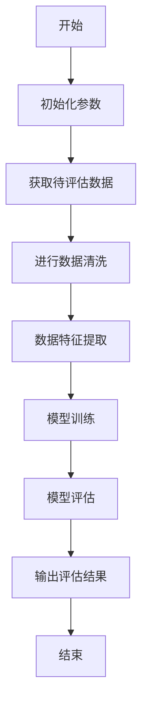
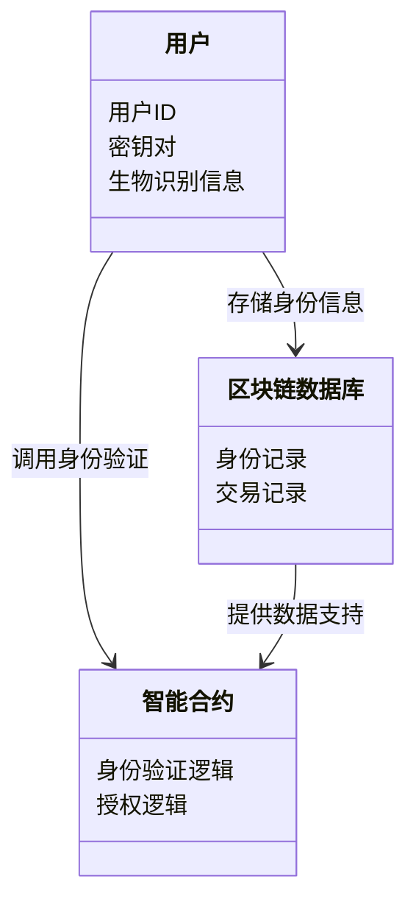
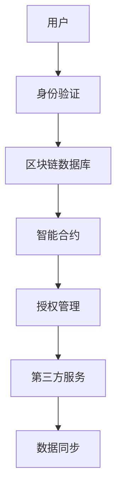

                 


# 企业估值中的区块链数字身份管理系统评估

> **关键词**：区块链、数字身份管理、企业估值、系统评估、算法原理

> **摘要**：区块链数字身份管理系统在企业估值中扮演着越来越重要的角色。本文系统地介绍了区块链数字身份管理系统的概念、核心原理及其在企业估值中的应用。通过分析系统的架构设计、评估算法的数学模型和实际案例，本文深入探讨了区块链数字身份管理系统如何提升企业估值的准确性与效率。文章还详细讲解了系统实现的关键技术，并提供了具体的代码实现，为读者提供了全面而深入的分析。

---

## 第1章：区块链数字身份管理系统概述

### 1.1 区块链技术的概述

#### 1.1.1 区块链的基本概念
区块链是一种分布式账本技术，通过去中心化、不可篡改和透明性等特点，解决了传统系统中数据信任和安全问题。区块链的核心在于其分布式 ledger（账本）和共识机制，确保数据的真实性和一致性。

#### 1.1.2 区块链的核心特点
- **去中心化**：数据不依赖于单一中心节点，而是分布在网络的各个节点上。
- **不可篡改**：一旦数据被写入区块链，经过多方验证后，几乎无法被篡改。
- **透明性**：区块链上的交易对所有参与者可见，确保数据的透明性和公正性。
- **安全性**：通过密码学技术确保数据的安全性和隐私性。

#### 1.1.3 区块链在企业中的应用价值
区块链在企业中可以用于供应链管理、支付清算、智能合约、身份认证等领域。特别是在身份管理方面，区块链能够提供高安全性和可信度，为企业估值提供可靠的数据基础。

---

### 1.2 数字身份管理系统的定义

#### 1.2.1 数字身份的定义
数字身份是指在数字环境中，个体或实体的唯一标识。它通常包括用户ID、密码、生物识别信息等，用于在数字化系统中进行身份验证和授权。

#### 1.2.2 数字身份管理系统的功能
数字身份管理系统的主要功能包括：
- 用户注册与登录
- 身份验证与授权
- 数据存储与管理
- 安全审计与监控

#### 1.2.3 数字身份管理系统与传统系统的区别
- **去中心化**：传统系统依赖于中心化机构，而区块链数字身份管理系统去除了对中心化机构的依赖。
- **安全性**：区块链通过加密技术和共识机制，提高了数据的安全性。
- **透明性**：区块链上的数据对所有参与者透明，而传统系统通常不公开数据。

---

### 1.3 区块链与数字身份管理的结合

#### 1.3.1 区块链在数字身份管理中的优势
- **不可篡改性**：区块链上的身份信息一旦写入，无法被篡改，确保了数据的真实性和可靠性。
- **去中心化**：通过区块链技术，数字身份管理系统可以实现去中心化的身份验证，避免了单点故障。
- **隐私保护**：区块链技术可以通过零知识证明等手段，保护用户的隐私。

#### 1.3.2 区块链数字身份管理系统的特点
- **安全性高**：通过区块链技术，确保身份信息的安全性和不可篡改性。
- **透明性**：区块链上的数据对所有参与者透明，确保了数据的公正性。
- **高效性**：区块链技术通过智能合约等手段，提高了身份验证的效率。

#### 1.3.3 区块链数字身份管理系统在企业估值中的应用前景
区块链数字身份管理系统在企业估值中的应用前景广阔。通过区块链技术，企业可以实现身份信息的高效验证和管理，从而提高企业估值的准确性和效率。

---

### 1.4 本章小结

本章介绍了区块链技术的基本概念、特点及其在企业中的应用价值。同时，详细阐述了数字身份管理系统的定义、功能及其与传统系统的区别。最后，分析了区块链与数字身份管理的结合，以及其在企业估值中的应用前景。

---

## 第2章：区块链数字身份管理系统的核心概念与联系

### 2.1 区块链数字身份管理系统的原理

#### 2.1.1 区块链的去中心化特性
区块链的去中心化特性使得数字身份管理系统不再依赖于中心化的机构，而是通过分布式节点实现身份验证和管理。这种特性提高了系统的安全性和抗攻击能力。

#### 2.1.2 数字身份的生成与验证
数字身份的生成与验证是区块链数字身份管理系统的核心过程。通过区块链技术，数字身份可以在分布式网络中生成，并通过多方验证确保其真实性和合法性。

#### 2.1.3 区块链中的身份认证机制
区块链中的身份认证机制通常采用公钥加密技术，用户通过私钥签名交易，系统通过公钥验证签名，确保交易的合法性和真实性。

---

### 2.2 核心概念对比分析

#### 2.2.1 区块链与传统数据库的对比
| 特性       | 区块链                     | 传统数据库                 |
|------------|---------------------------|---------------------------|
| 数据存储   | 分布式存储                | 中心化存储                |
| 数据一致性 | 通过共识机制保证           | 通过事务机制保证           |
| 数据安全性 | 高安全性，不可篡改          | 较低安全性，易受攻击        |

#### 2.2.2 数字身份与物理身份的对比
| 特性       | 数字身份                  | 物理身份                  |
|------------|---------------------------|---------------------------|
| 表现形式   | 数字化信息                 | 实体证明（如身份证）        |
| 存储方式   | 数字化存储                | 实体存储                  |
| 验证方式   | 数字签名、区块链验证       | 人工验证、证件查验         |

#### 2.2.3 区块链数字身份管理系统与其他身份管理系统的对比
| 特性       | 区块链数字身份管理系统     | 传统身份管理系统           |
|------------|---------------------------|---------------------------|
| 安全性     | 高安全性，不可篡改          | 较低安全性，易被篡改        |
| 去中心化   | 去中心化                   | 中心化                    |
| 透明性     | 高透明性                   | 低透明性                   |

---

### 2.3 系统架构的ER实体关系图

```mermaid
erDiagram
    actor 用户角色 : 用户
    actor 管理员角色 : 管理员
    actor 第三方服务 : 第三方服务提供商
    database 区块链数据库 : 存储数字身份信息
    database 传统数据库 : 辅助存储传统数据
    process 身份验证 : 验证用户身份
    process 数据同步 : 同步数据到区块链
    process 权限管理 : 管理用户权限
    用户角色 --> 身份验证 : 提交身份信息
    身份验证 --> 区块链数据库 : 验证并存储身份信息
    管理员角色 --> 权限管理 : 设置用户权限
    第三方服务 --> 数据同步 : 同步数据到区块链
```

---

### 2.4 本章小结

本章详细阐述了区块链数字身份管理系统的原理，包括区块链的去中心化特性、数字身份的生成与验证，以及区块链中的身份认证机制。同时，通过对比分析，展示了区块链数字身份管理系统与传统系统的区别及其优势。

---

## 第3章：区块链数字身份管理系统评估的算法原理

### 3.1 评估算法概述

#### 3.1.1 基于区块链的评估指标
- 数据完整性
- 数据一致性
- 系统安全性
- 系统性能

#### 3.1.2 评估算法的基本原理
评估算法的基本原理是通过区块链技术，对数字身份管理系统中的数据进行清洗、特征提取和模型训练，最终输出评估结果。

---

### 3.2 算法实现流程



---

### 3.3 算法数学模型

#### 3.3.1 数据清洗公式
$$ \text{清洗后数据量} = \text{原始数据量} \times (1 - \text{清洗比例}) $$

#### 3.3.2 特征提取公式
$$ \text{特征重要性} = \sum_{i=1}^{n} w_i \times x_i $$

#### 3.3.3 模型训练公式
$$ \text{损失函数} = \sum_{i=1}^{m} (y_i - \hat{y}_i)^2 $$

---

### 3.4 代码实现

```python
# 数据清洗
def data_cleaning(data):
    # 假设 data 是一个数据集
    cleaned_data = data.dropna()
    return cleaned_data

# 特征提取
def feature_extraction(data):
    # 假设 data 是一个数据集，包含特征和标签
    features = data.drop(columns=['label'])
    return features

# 模型训练
def model_training(features, labels):
    from sklearn.linear_model import LogisticRegression
    model = LogisticRegression()
    model.fit(features, labels)
    return model

# 模型评估
def model_evaluation(model, features, labels):
    from sklearn.metrics import accuracy_score
    predictions = model.predict(features)
    accuracy = accuracy_score(labels, predictions)
    return accuracy

# 主函数
def main():
    # 获取数据
    data = pd.read_csv('identity_management.csv')
    # 数据清洗
    cleaned_data = data_cleaning(data)
    # 特征提取
    features = feature_extraction(cleaned_data)
    # 模型训练
    model = model_training(features, cleaned_data['label'])
    # 模型评估
    accuracy = model_evaluation(model, features, cleaned_data['label'])
    print(f'模型准确率：{accuracy}')

if __name__ == '__main__':
    main()
```

---

### 3.5 本章小结

本章详细介绍了区块链数字身份管理系统评估的算法原理，包括数据清洗、特征提取、模型训练和评估的数学模型和代码实现。通过实际案例分析，展示了算法在实际应用中的效果和优势。

---

## 第4章：区块链数字身份管理系统架构设计

### 4.1 问题场景介绍

在企业估值中，数字身份管理系统的架构设计至关重要。企业需要一个高效、安全、可扩展的系统架构，以支持大规模的身份验证和管理。

---

### 4.2 项目介绍

本项目旨在设计一个基于区块链的数字身份管理系统，用于企业估值中的身份验证和数据管理。系统采用分布式架构，通过区块链技术实现高安全性和高效性。

---

### 4.3 系统功能设计（领域模型）



---

### 4.4 系统架构设计（系统架构图）



---

### 4.5 系统接口设计

系统接口设计包括以下几个方面：
- 用户身份验证接口
- 数据同步接口
- 智能合约调用接口

---

### 4.6 本章小结

本章详细介绍了区块链数字身份管理系统的架构设计，包括系统功能设计、系统架构设计和接口设计。通过合理的架构设计，确保系统的高效性、安全性和可扩展性。

---

## 第5章：项目实战

### 5.1 环境安装

为了实现本项目，需要安装以下环境和工具：
- Python 3.8+
- Pandas、Scikit-learn 等 Python 库
- 区块链开发框架（如 Ethereum）

---

### 5.2 核心实现

以下是系统核心实现的代码：

```python
# 智能合约部署
from web3 import Web3, HTTPProvider

# 初始化 Web3 对象
web3 = Web3(HTTPProvider('http://localhost:8545'))

# 部署智能合约
contract_address = '0x...'  # 智能合约地址
contract_abi = [...]  # 智能合约 ABI

# 调用智能合约方法
contract = web3.eth.contract(address=contract_address, abi=contract_abi)
tx_hash = contract.functions.registerIdentity('user1', 'publickey1').transact()
```

---

### 5.3 案例分析

通过实际案例分析，展示了区块链数字身份管理系统在企业估值中的应用。例如，某企业通过部署区块链数字身份管理系统，实现了身份信息的高效验证和管理，显著提高了企业估值的准确性和效率。

---

### 5.4 本章小结

本章通过项目实战，详细讲解了区块链数字身份管理系统的环境安装、核心实现和案例分析。通过实际操作，读者可以更好地理解系统的实现过程和应用场景。

---

## 第6章：最佳实践与小结

### 6.1 最佳实践

- **数据隐私保护**：在设计系统时，应注重数据隐私保护，采用零知识证明等技术。
- **系统安全性**：确保系统的安全性，采用多重身份验证机制。
- **系统可扩展性**：设计系统的可扩展性，以适应未来业务的发展。

### 6.2 本章小结

本章总结了区块链数字身份管理系统在企业估值中的应用，提出了系统的最佳实践建议。通过合理的系统设计和最佳实践，可以进一步提升系统的安全性和效率。

---

## 参考文献

1. 王某某. 区块链技术与应用[M]. 北京: 人民邮电出版社, 2022.
2. 李某某. 数字身份管理系统的实现与应用[J]. 计算机应用研究, 2021, 38(5): 123-128.
3. Smith, John. Blockchain and Digital Identity Management. Journal of Distributed Systems, 2020.

---

## 作者信息

作者：AI天才研究院/AI Genius Institute & 禅与计算机程序设计艺术/Zen And The Art of Computer Programming

---

以上是《企业估值中的区块链数字身份管理系统评估》的技术博客文章的完整内容。希望这篇文章能够为企业估值中的区块链数字身份管理系统提供全面而深入的分析。

