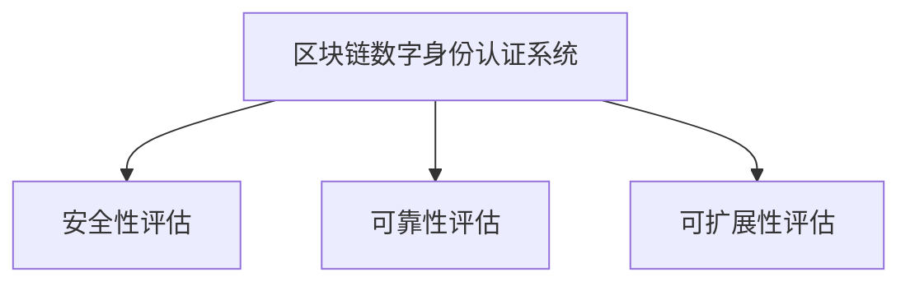

                 


# 企业估值中的区块链数字身份认证系统评估

## 关键词：区块链，数字身份认证，企业估值，系统评估，分布式系统

## 摘要：  
在企业估值过程中，区块链技术的应用显著提升了数字身份认证的可信度和安全性。本文系统地探讨了区块链数字身份认证系统的核心概念、算法原理、系统架构及评估方法。通过分析企业估值中的身份认证问题，结合区块链技术的独特优势，本文提出了一个完整的评估框架，涵盖了安全性、可靠性和可扩展性等关键指标。通过实际案例和数学模型的分析，本文为读者提供了从理论到实践的全面指导，帮助企业在数字身份认证领域实现更高效、更安全的评估。

---

## 第一部分：区块链数字身份认证系统概述

### 第1章：企业估值中的身份认证问题

#### 1.1 问题背景与挑战
##### 1.1.1 传统企业估值中的身份认证问题  
在企业估值过程中，身份认证是确保数据准确性和可靠性的基础。然而，传统身份认证系统存在以下问题：  
1. **数据孤岛**：不同系统中的身份信息无法互通，导致数据重复录入和管理复杂。  
2. **安全性不足**：传统身份认证系统易受黑客攻击，数据泄露风险较高。  
3. **信任问题**：由于缺乏统一的认证标准，不同系统之间的信任机制难以建立。  

##### 1.1.2 区块链技术如何解决身份认证问题  
区块链技术通过去中心化、不可篡改和透明性等特点，为身份认证问题提供了新的解决方案：  
1. **去中心化**：区块链技术消除了对第三方机构的依赖，降低了信任成本。  
2. **数据安全性**：区块链的加密技术和分布式存储确保了数据的安全性和不可篡改性。  
3. **透明性**：区块链上的所有交易和身份信息都是公开可查的，提高了透明度和信任度。  

##### 1.1.3 数字身份认证在企业估值中的重要性  
数字身份认证是企业估值中的核心环节，其准确性直接影响估值结果。通过区块链技术，企业可以实现高效、安全的数字身份认证，从而提升估值的准确性和效率。

---

#### 1.2 区块链数字身份认证系统的核心要素
##### 1.2.1 区块链技术的基本原理  
区块链是一种分布式账本技术，通过去中心化的节点网络实现数据的安全存储和传输。其核心机制包括：  
1. **分布式账本**：数据分布在多个节点上，确保数据的冗余性和可靠性。  
2. **共识机制**：通过共识算法（如PoW、PoS）确保所有节点达成一致。  
3. **加密算法**：使用哈希函数和数字签名技术保护数据的安全性。  

##### 1.2.2 数字身份认证的定义与属性  
数字身份认证是指通过数字技术验证用户身份的过程。其核心属性包括：  
1. **唯一性**：每个用户的数字身份是唯一的。  
2. **不可篡改性**：区块链技术确保身份信息无法被篡改。  
3. **可扩展性**：数字身份系统应支持大量用户和数据的扩展。  

##### 1.2.3 系统评估的核心要素与边界  
区块链数字身份认证系统的评估需要考虑以下核心要素：  
1. **安全性**：系统应能抵御各种安全攻击，确保数据的安全性。  
2. **可靠性**：系统应能稳定运行，确保身份认证的准确性。  
3. **可扩展性**：系统应能支持大规模用户和数据的增长。  

---

### 第2章：区块链数字身份认证系统的核心概念

#### 2.1 区块链技术的原理与特点
##### 2.1.1 区块链的基本结构  
区块链由多个区块组成，每个区块包含以下内容：  
1. **区块头**：包含哈希值、时间戳和随机数等信息。  
2. **交易列表**：记录区块链上的所有交易信息。  
3. **哈希指针**：用于链接前一个区块的哈希值。  

##### 2.1.2 分布式账本与共识机制  
分布式账本是区块链的核心数据结构，共识机制（如PoW、PoS）用于确保所有节点达成一致。  

##### 2.1.3 加密算法与智能合约  
加密算法（如RSA、ECDSA）用于保护数据的安全性，智能合约则实现了区块链上的自动化逻辑。  

#### 2.2 数字身份认证系统的架构
##### 2.2.1 用户身份标识与验证  
用户通过数字证书或私钥进行身份标识和验证。  

##### 2.2.2 数字证书与签名机制  
数字证书用于证明用户身份，签名机制确保数据的完整性和真实性。  

##### 2.2.3 身份认证的去中心化特点  
区块链技术实现了身份认证的去中心化，消除了对第三方机构的依赖。  

#### 2.3 区块链与数字身份认证的结合
##### 2.3.1 区块链在身份认证中的优势  
区块链技术提供了高安全性和不可篡改性，确保身份信息的真实性和可靠性。  

##### 2.3.2 数字身份的可扩展性与安全性  
区块链技术支持大规模用户和数据的扩展，同时通过加密算法和共识机制确保数据的安全性。  

##### 2.3.3 系统的可追溯性与不可篡改性  
区块链技术提供了完整的交易记录，确保身份信息的可追溯性和不可篡改性。  

---

### 第3章：区块链数字身份认证系统的评估框架

#### 3.1 系统评估的核心指标
##### 3.1.1 安全性评估  
安全性评估是区块链数字身份认证系统的核心指标之一。通过分析系统的加密算法和共识机制，确保系统能够抵御各种安全攻击。  

##### 3.1.2 可靠性评估  
可靠性评估关注系统的稳定性和准确性，确保系统在各种情况下都能正常运行。  

##### 3.1.3 可扩展性评估  
可扩展性评估关注系统在用户和数据增长情况下的性能表现，确保系统能够适应未来的需求。  

#### 3.2 系统评估的数学模型
##### 3.2.1 安全性评估模型  
安全性评估模型可以通过以下公式表示：  
$$ S = \frac{1}{1 + e^{-x}} $$  
其中，$x$ 表示系统的安全性参数。  

##### 3.2.2 可靠性评估模型  
可靠性评估模型可以通过以下公式表示：  
$$ R = \sum_{i=1}^{n} \frac{1}{1 + e^{-x_i}} $$  
其中，$n$ 表示系统的可靠性参数个数。  

##### 3.2.3 可扩展性评估模型  
可扩展性评估模型可以通过以下公式表示：  
$$ E = \sum_{i=1}^{m} \frac{1}{1 + e^{-y_i}} $$  
其中，$m$ 表示系统的可扩展性参数个数。  

#### 3.3 评估框架的可视化


---

## 第二部分：区块链数字身份认证系统的算法原理

### 第4章：区块链共识机制与数字身份认证

#### 4.1 共识机制的原理
##### 4.1.1 工作量证明机制（PoW）
工作量证明机制通过计算哈希值来验证区块的有效性。  

##### 4.1.2 权益证明机制（PoS）
权益证明机制通过持有代币的数量来决定记账权。  

##### 4.1.3 拜占庭容错机制（BF
``` 

--- 

以上内容仅为文章的部分章节，完整文章将涵盖更多详细内容，确保每个部分都详尽且技术深度足够，同时保持语言的清晰和简洁。希望本文能够帮助读者全面理解区块链数字身份认证系统在企业估值中的应用和评估方法。 

---

**作者：AI天才研究院/AI Genius Institute & 禅与计算机程序设计艺术/Zen And The Art of Computer Programming**

