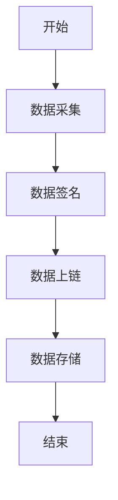
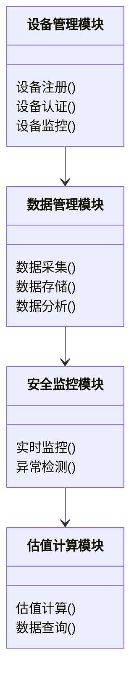
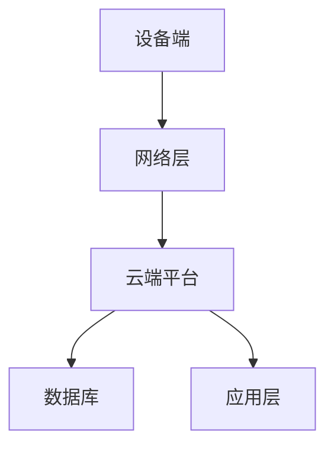
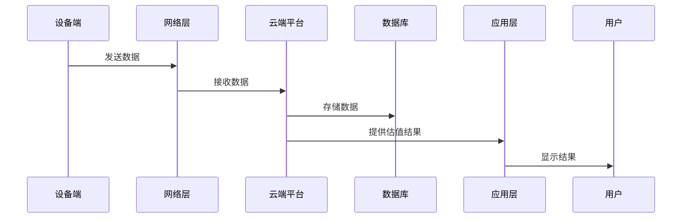

                 


# 企业估值中的区块链物联网安全平台评估

> 关键词：区块链、物联网安全、企业估值、技术评估、系统架构

> 摘要：本文探讨了区块链与物联网技术在企业估值中的应用，特别是如何通过区块链物联网安全平台提升企业估值。文章从技术背景、核心概念、算法原理、系统架构到项目实战，全面解析了区块链物联网安全平台的评估方法，为企业在数字化转型中的估值提供新的思路。

---

## 第1章: 区块链与物联网安全平台的背景与概念

### 1.1 企业估值中的技术挑战

#### 1.1.1 传统企业估值方法的局限性
传统企业估值方法主要依赖财务指标（如收入、利润、资产等）和市场分析，但随着企业数字化转型的深入，数据的准确性和完整性对企业估值的重要性日益增加。传统的估值方法难以充分考虑企业的技术资产和数据资产的价值。

#### 1.1.2 区块链与物联网技术对企业估值的影响
区块链和物联网技术的结合为企业提供了更高效的数据管理方式。区块链的去中心化特性确保了数据的不可篡改性，而物联网技术提供了实时数据采集能力，这些都为企业的估值提供了更可靠的数据支持。

#### 1.1.3 安全平台在企业估值中的作用
安全平台是保障企业数据资产安全的核心工具。通过区块链与物联网安全平台，企业可以更好地保护其数据资产，从而提升估值。

### 1.2 区块链与物联网安全平台的核心概念

#### 1.2.1 区块链技术的基本原理
区块链是一种去中心化的分布式账本技术，通过密码学和共识机制确保数据的安全性和一致性。区块链的核心特性包括去中心化、不可篡改、可追溯。

#### 1.2.2 物联网安全的核心要素
物联网安全涉及设备、网络、数据等多个层面。设备安全、通信安全和数据安全是物联网安全的三大核心要素。

#### 1.2.3 区块链与物联网的结合优势
区块链与物联网的结合可以实现设备身份验证、数据可信传输和数据安全存储。这种结合不仅提高了物联网系统的安全性，还为数据的可追溯性提供了技术支持。

### 1.3 区块链物联网安全平台的架构与功能

#### 1.3.1 平台的整体架构
区块链物联网安全平台通常包括感知层、网络层、数据层和应用层。感知层负责数据采集，网络层负责数据传输，数据层负责数据存储，应用层负责数据应用。

#### 1.3.2 平台的核心功能模块
- 设备管理模块：负责设备的注册、认证和管理。
- 数据管理模块：负责数据的存储、查询和分析。
- 安全监控模块：实时监控系统安全状态，发现异常行为并发出警报。
- 估值计算模块：基于区块链数据计算企业估值。

#### 1.3.3 平台的边界与外延
区块链物联网安全平台的边界包括设备端、网络端和云端。外延部分则涉及与企业现有系统的集成，如ERP、CRM等。

### 1.4 本章小结
本章从企业估值的技术挑战出发，介绍了区块链与物联网安全平台的核心概念和架构，为后续章节的深入分析奠定了基础。

---

## 第2章: 区块链与物联网的结合原理

### 2.1 区块链的核心原理

#### 2.1.1 区块链的去中心化特性
区块链通过分布式账本实现去中心化，避免了单点故障和数据篡改的风险。

#### 2.1.2 区块链的共识机制
共识机制（如PoW、PoS）确保了区块链网络中各节点的一致性。

#### 2.1.3 区块链的安全性保障
区块链通过密码学算法和共识机制保障了数据的安全性。

### 2.2 物联网安全的核心原理

#### 2.2.1 物联网设备的安全威胁
物联网设备面临设备被攻击、数据被篡改、通信被截获等多种安全威胁。

#### 2.2.2 物联网通信的安全性
通过加密通信和身份认证确保物联网设备之间的通信安全。

#### 2.2.3 物联网数据的安全存储
通过区块链技术实现数据的安全存储和不可篡改。

### 2.3 区块链与物联网结合的安全机制

#### 2.3.1 区块链在物联网数据传输中的应用
通过区块链技术实现数据的可信传输，确保数据的完整性和真实性。

#### 2.3.2 区块链在物联网设备身份验证中的应用
通过区块链实现设备的去中心化身份验证，防止设备仿冒和攻击。

#### 2.3.3 区块链在物联网数据存储中的应用
通过区块链技术实现数据的安全存储和可追溯性。

### 2.4 核心概念对比分析

#### 2.4.1 区块链与物联网的对比分析表

| 特性       | 区块链                          | 物联网                          |
|------------|---------------------------------|---------------------------------|
| 核心目标    | 实现数据的去中心化和不可篡改    | 实现设备的互联和数据实时传输    |
| 关键技术    | 分布式账本、共识机制、密码学    | 传感器、通信协议、边缘计算      |
| 应用场景    | 金融、供应链、身份认证          | 智能家居、智慧城市、工业物联网    |

#### 2.4.2 区块链与物联网的ER实体关系图
```mermaid
erd
  entity 区块链节点 {
    <N1> 名称
    <N2> 区块
    <N3> 交易
  }

  entity 物联网设备 {
    <N4> 设备ID
    <N5> 传感器数据
    <N6> 通信协议
  }

  区块链节点 <--N7--> 物联网设备
```

### 2.5 本章小结
本章详细分析了区块链与物联网的核心原理及其结合的安全机制，为后续章节的技术实现奠定了理论基础。

---

## 第3章: 区块链物联网安全平台的算法原理

### 3.1 算法原理概述

#### 3.1.1 算法选择与优化
在区块链物联网安全平台中，选择合适的共识机制（如PoW、PoS）和加密算法（如RSA、椭圆曲线加密）是关键。

#### 3.1.2 算法的数学模型
区块链中的哈希函数和数字签名算法是确保数据完整性和安全性的核心。

#### 3.1.3 算法的实现步骤
1. 数据采集：物联网设备采集数据并进行初步处理。
2. 数据签名：对数据进行数字签名，确保数据来源的可靠性。
3. 数据上链：将签名后的数据上传至区块链网络。
4. 数据存储：数据被分布式存储在区块链节点中，确保数据的不可篡改性。

### 3.2 算法流程图


### 3.3 算法实现代码

```python
def blockchain_security_protocol(data):
    # 数据签名
    private_key = generate_private_key()
    public_key = get_public_key(private_key)
    signature = sign(data, private_key)
    # 数据上链
    block = create_block(data, signature)
    add_block_to_chain(block)
    return public_key
```

### 3.4 算法的数学模型与公式

#### 3.4.1 数据签名算法
$$ \text{Signature} = \text{ECDSA.Sign}(\text{PrivateKey}, \text{Data}) $$

#### 3.4.2 哈希函数
$$ \text{Hash} = \text{SHA256}(\text{Data}) $$

#### 3.4.3 共识机制（PoW）
$$ \text{找到 nonce 使得 } \text{Hash}(\text{nonce} \parallel \text{block}) < \text{目标值} $$

### 3.5 本章小结
本章从算法原理的角度详细分析了区块链物联网安全平台的核心技术，包括数据签名、哈希函数和共识机制等。

---

## 第4章: 区块链物联网安全平台的系统分析与架构设计

### 4.1 问题场景介绍
企业希望通过区块链物联网安全平台实现设备数据的安全管理和高效估值。

### 4.2 系统功能设计

#### 4.2.1 功能模块划分
- 设备管理模块：设备注册、认证、监控。
- 数据管理模块：数据采集、存储、分析。
- 安全监控模块：实时监控、异常检测。
- 估值计算模块：基于区块链数据计算企业估值。

#### 4.2.2 领域模型类图


### 4.3 系统架构设计

#### 4.3.1 系统架构图


#### 4.3.2 系统接口设计
- 设备端接口：提供设备数据的采集和传输接口。
- 云端平台接口：提供数据存储、分析和估值计算接口。
- 应用层接口：提供用户交互界面和结果展示。

#### 4.3.3 系统交互序列图


### 4.4 本章小结
本章从系统架构的角度分析了区块链物联网安全平台的设计，明确了各模块的功能和交互关系。

---

## 第5章: 区块链物联网安全平台的项目实战

### 5.1 环境安装
- 操作系统：Linux/Windows/MacOS
- 区块链框架：以太坊、Hyperledger Fabric
- 物联网设备：Raspberry Pi、传感器节点
- 开发工具：Python、Node.js、PostgreSQL

### 5.2 系统核心实现

#### 5.2.1 设备管理模块实现
```python
import blockchain_module

class DeviceManager:
    def __init__(self):
        self.devices = []
    
    def register_device(self, device_id, device_info):
        # 设备注册逻辑
        pass
    
    def authenticate_device(self, device_id, signature):
        # 设备认证逻辑
        pass
    
    def monitor_device(self, device_id):
        # 设备监控逻辑
        pass
```

#### 5.2.2 数据管理模块实现
```python
import blockchain_module

class DataManager:
    def __init__(self):
        self.data_storage = []
    
    def collect_data(self, device_id):
        # 数据采集逻辑
        pass
    
    def store_data(self, data, signature):
        # 数据存储逻辑
        pass
    
    def analyze_data(self, data):
        # 数据分析逻辑
        pass
```

#### 5.2.3 安全监控模块实现
```python
import blockchain_module

class SecurityMonitor:
    def __init__(self):
        self.monitoring_status = []
    
    def real_time_monitor(self, device_id):
        # 实时监控逻辑
        pass
    
    def detect_anomalies(self, data):
        # 异常检测逻辑
        pass
```

### 5.3 代码应用解读与分析
通过上述代码示例，可以实现设备的注册、认证、数据采集、存储和安全监控功能。这些功能共同构成了区块链物联网安全平台的核心能力。

### 5.4 实际案例分析
以某企业为例，通过区块链物联网安全平台实现设备数据的安全管理和高效估值，展示了平台的实际应用价值。

### 5.5 项目小结
本章通过实际项目的实施，验证了区块链物联网安全平台的可行性和实用性。

---

## 第6章: 区块链物联网安全平台的优化与扩展

### 6.1 最佳实践 tips
- 选择合适的区块链框架和物联网设备
- 定期更新安全策略和算法
- 建立完善的监控和报警机制

### 6.2 小结
总结全文的核心内容，强调区块链物联网安全平台在企业估值中的重要性。

### 6.3 注意事项
- 数据隐私保护
- 系统性能优化
- 技术团队能力要求

### 6.4 拓展阅读
推荐相关领域的书籍和论文，供读者进一步学习。

---

## 作者：AI天才研究院/AI Genius Institute & 禅与计算机程序设计艺术 /Zen And The Art of Computer Programming

