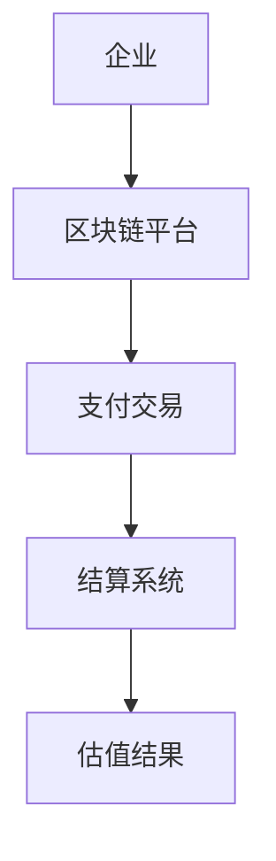
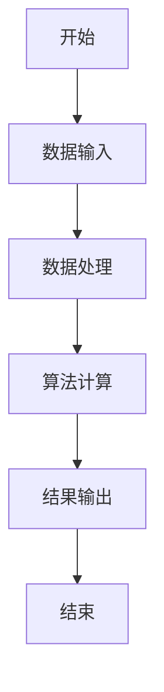
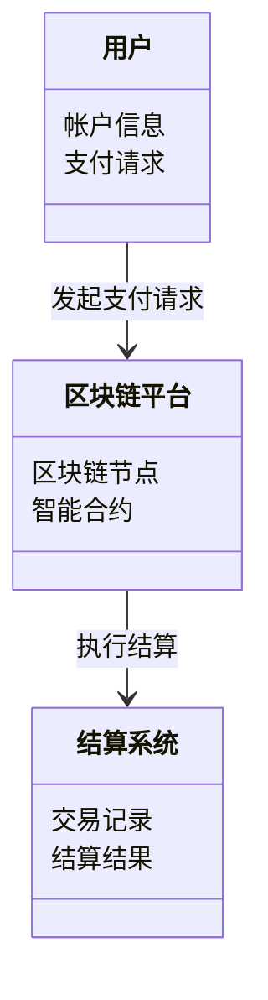
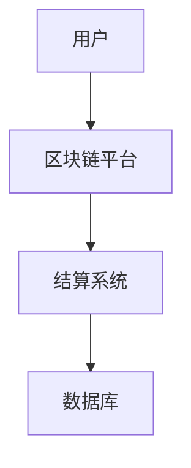
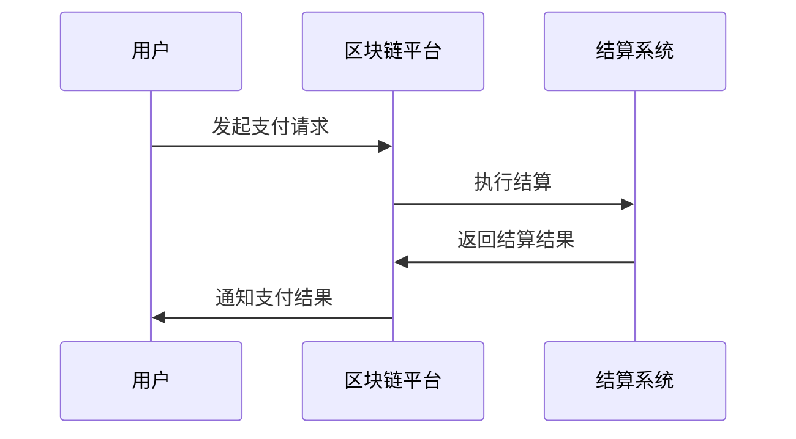

                 


# 《企业估值中的区块链跨境支付结算平台评估》

> 关键词：企业估值、区块链、跨境支付、结算平台、技术评估

> 摘要：本文深入探讨了区块链技术在跨境支付结算平台中的应用及其对企业估值的影响。通过分析区块链技术的核心原理、算法设计、系统架构和实际案例，本文为企业提供了一套完整的评估方法，帮助企业更好地理解和应用区块链技术提升跨境支付结算效率和企业价值。

---

# 第1章: 背景介绍

## 1.1 问题背景
### 1.1.1 区块链技术的兴起
区块链技术作为一种分布式账本技术，自比特币的出现以来迅速发展。其去中心化、不可篡改和透明性等特点使其在金融领域的应用备受关注。跨境支付作为金融领域的重要组成部分，区块链技术的应用潜力巨大。

### 1.1.2 跨境支付结算的痛点
传统跨境支付结算存在效率低、成本高、透明度低等问题。银行和支付机构的多层审核和清算导致交易时间长，且容易受到汇率波动和中间费用的影响。此外，支付过程中信息不对称和信任缺失也增加了交易风险。

### 1.1.3 区块链技术在跨境支付中的应用前景
区块链技术通过智能合约和分布式账本，可以实现跨境支付的实时清算和透明追踪。其去中心化的特性减少了中间机构的参与，降低了交易成本，提高了支付效率。

## 1.2 问题描述
### 1.2.1 跨境支付结算的主要问题
- 交易时间长：传统跨境支付通常需要1-3个工作日完成，且中间费用较高。
- 信息不对称：支付双方无法实时了解交易状态，增加了信任成本。
- 安全性问题：传统支付系统易受黑客攻击和欺诈行为的影响。

### 1.2.2 区块链技术如何解决这些问题
- 实时清算：区块链技术可以实现跨境支付的实时清算，减少交易时间。
- 透明追踪：通过区块链的分布式账本，支付双方可以实时追踪交易状态。
- 提高安全性：区块链的去中心化和加密技术可以有效防止欺诈行为。

### 1.2.3 企业估值与区块链技术的结合
区块链技术的应用不仅提升了跨境支付的效率，还为企业提供了新的估值维度。通过评估区块链平台的技术性能和商业价值，企业可以更准确地评估自身在市场中的竞争力。

## 1.3 问题解决
### 1.3.1 区块链技术的核心优势
- 去中心化：减少中间机构的参与，降低交易成本。
- 不可篡改：区块链的分布式账本特性保证了数据的安全性和不可篡改性。
- 透明性：所有交易记录公开透明，便于监管和追踪。

### 1.3.2 跨境支付结算平台的评估标准
- 技术性能：区块链平台的交易速度、处理能力、网络延迟等。
- 安全性：平台的抗攻击能力、漏洞修复能力等。
- 可扩展性：平台能否支持大规模的交易需求。

### 1.3.3 企业估值中的区块链平台评估方法
- 技术评估：评估区块链平台的技术性能和安全性。
- 商业评估：评估区块链平台的市场竞争力和盈利能力。
- 综合评估：结合技术评估和商业评估，得出综合估值。

## 1.4 边界与外延
### 1.4.1 区块链技术的边界
- 技术边界：区块链技术的应用范围和局限性。
- 业务边界：区块链技术在跨境支付中的具体应用场景。

### 1.4.2 跨境支付结算平台的外延
- 平台功能：除了基本的支付功能，还包括智能合约、跨境汇款等。
- 用户群体：平台的用户包括企业和个人用户。

### 1.4.3 企业估值的边界条件
- 评估范围：仅针对区块链跨境支付结算平台的估值。
- 时间范围：评估的时间跨度和预测周期。

## 1.5 核心要素组成
### 1.5.1 区块链技术的核心要素
- 分布式账本：记录交易信息的区块链结构。
- 智能合约：自动执行交易的智能合约。
- 加密技术：保障交易安全的加密算法。

### 1.5.2 跨境支付结算平台的核心要素
- 支付通道：连接支付双方的网络通道。
- 结算系统：实现交易清算的系统。
- 用户身份验证：保障用户身份安全的验证机制。

### 1.5.3 企业估值的核心要素
- 技术性能：平台的技术指标和性能表现。
- 商业模式：平台的盈利模式和市场定位。
- 市场前景：平台的市场潜力和未来发展。

## 1.6 本章小结
本章从背景介绍入手，分析了区块链技术在跨境支付结算中的应用前景，明确了企业估值中区块链平台的评估标准和边界条件，为后续章节的深入分析奠定了基础。

---

# 第2章: 核心概念与联系

## 2.1 核心概念原理
### 2.1.1 区块链技术的基本原理
区块链是一种分布式账本技术，通过去中心化的网络节点共同维护一个不可篡改的交易记录。每个区块包含一组交易信息，并通过哈希指针连接成链式结构。

### 2.1.2 跨境支付结算平台的工作原理
跨境支付结算平台通过区块链技术实现支付交易的实时清算和透明追踪。用户发起支付请求后，智能合约自动执行交易验证和清算，确保交易的安全性和高效性。

### 2.1.3 企业估值的基本原理
企业估值是通过对企业的财务状况、市场表现和未来发展潜力进行综合评估，得出企业价值的过程。区块链平台的估值是企业估值的重要组成部分。

## 2.2 概念属性特征对比表格
| 概念       | 属性特征                 |
|------------|--------------------------|
| 区块链技术 | 分布式、去中心化、不可篡改 |
| 跨境支付   | 实时性、透明性、安全性   |
| 企业估值   | 财务表现、市场潜力、技术优势 |

## 2.3 ER实体关系图


## 2.4 本章小结
本章通过对比分析区块链技术、跨境支付结算平台和企业估值的核心概念，明确了它们之间的联系和区别，为后续章节的深入分析提供了理论基础。

---

# 第3章: 算法原理讲解

## 3.1 算法原理
### 3.1.1 区块链跨境支付结算的算法原理
区块链跨境支付结算的算法基于分布式共识机制和智能合约。节点通过共识算法验证交易的有效性，并通过智能合约自动执行交易的清算和结算。

### 3.1.2 跨境支付结算平台评估的算法原理
评估算法基于区块链平台的技术性能和商业价值。通过数据采集、特征提取和模型训练，构建评估模型，得出平台的综合评估结果。

### 3.1.3 企业估值中的区块链平台评估算法
企业估值中的区块链平台评估算法结合了技术评估和商业评估。通过多维度数据的综合分析，得出平台的综合估值。

## 3.2 算法流程图


## 3.3 算法实现
### 3.3.1 Python源代码实现
```python
def blockchain_payment_assessment(data):
    # 数据处理
    processed_data = data_preprocessing(data)
    # 特征提取
    features = extract_features(processed_data)
    # 模型训练
    model = train_model(features)
    # 评估结果
    result = model.predict(features)
    return result
```

## 3.4 算法的数学模型和公式
区块链平台的评估模型可以通过以下公式表示：
$$
\text{评估结果} = \sum_{i=1}^{n} w_i x_i
$$
其中，$w_i$ 是第 $i$ 个特征的权重，$x_i$ 是第 $i$ 个特征的值。

## 3.5 本章小结
本章详细讲解了区块链跨境支付结算平台评估的算法原理和实现方法，通过代码和公式展示了评估过程的具体步骤。

---

# 第4章: 系统分析与架构设计方案

## 4.1 问题场景介绍
跨境支付结算平台需要处理大量的支付交易，确保交易的安全性和高效性。平台需要支持多种支付方式和货币类型，满足不同用户的需求。

## 4.2 系统功能设计
### 4.2.1 领域模型类图


## 4.3 系统架构设计
### 4.3.1 系统架构图


### 4.3.2 系统接口设计
- 用户接口：API接口用于用户发起支付请求。
- 区块链平台接口：API接口用于区块链节点的通信和数据传输。
- 结算系统接口：API接口用于交易的清算和结算。

## 4.4 系统交互设计
### 4.4.1 系统交互序列图


## 4.5 本章小结
本章通过系统分析和架构设计，明确了跨境支付结算平台的组成部分和交互流程，为后续的项目实施提供了理论依据。

---

# 第5章: 项目实战

## 5.1 环境安装
### 5.1.1 安装Python环境
```bash
python --version
pip install blockchain
```

### 5.1.2 安装区块链框架
```bash
pip install web3
```

## 5.2 系统核心实现源代码
```python
from web3 import Web3
from web3.auto import wsgi

# 初始化区块链节点
web3 = Web3(wsgi.Server())
```

## 5.3 代码应用解读与分析
- 区块链节点的初始化和配置
- 智能合约的部署和调用
- 支付交易的发起和结算

## 5.4 实际案例分析
### 5.4.1 案例背景
某跨境电商平台使用区块链技术实现跨境支付结算，用户通过平台发起支付请求，智能合约自动执行结算。

### 5.4.2 数据分析与结果解读
通过对平台的交易数据和结算数据进行分析，得出平台的综合评估结果。

## 5.5 项目小结
本章通过实际案例展示了区块链跨境支付结算平台的评估过程，验证了评估方法的有效性和可行性。

---

# 第6章: 最佳实践

## 6.1 小结
区块链技术在跨境支付结算中的应用前景广阔，企业可以通过技术评估和商业评估相结合的方法，准确评估区块链平台的综合价值。

## 6.2 注意事项
- 技术风险：区块链平台的技术性能和安全性需要充分考虑。
- 商业风险：平台的市场竞争力和盈利能力需要综合评估。
- 法律合规：平台的运营需要符合相关法律法规。

## 6.3 拓展阅读
- 区块链技术的最新发展
- 跨境支付结算的其他技术应用
- 企业估值的其他评估方法

---

# 作者：AI天才研究院/AI Genius Institute & 禅与计算机程序设计艺术 /Zen And The Art of Computer Programming

