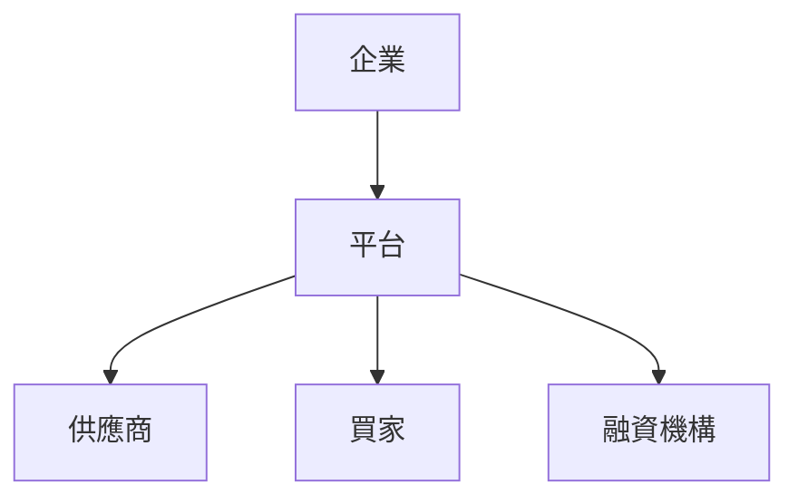
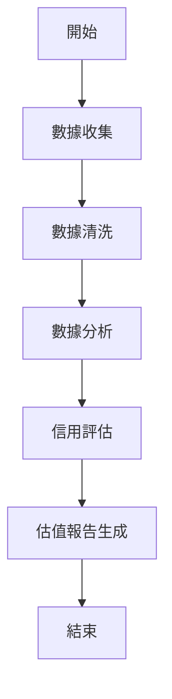
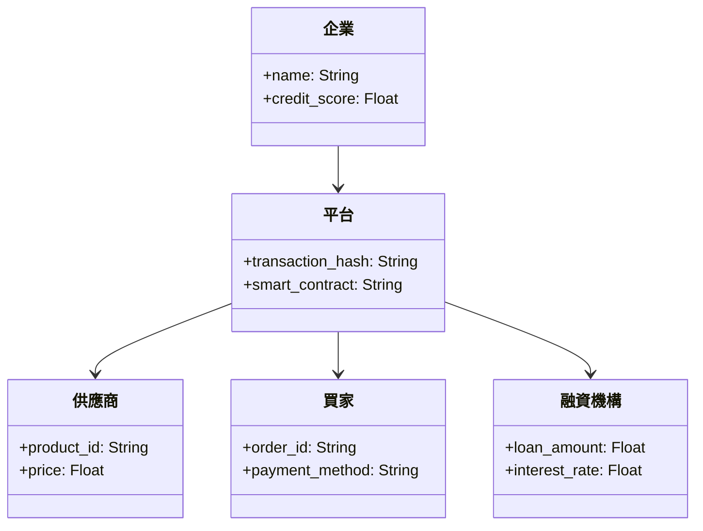
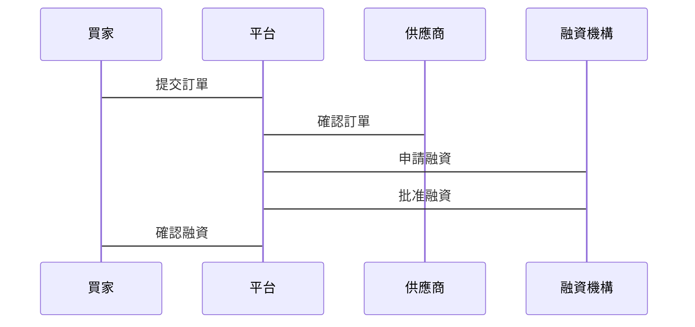

                 


# 企业估值中的区块链跨境贸易融资平台评估

> 关键词：区块链技术、跨境贸易融资、平台评估、企业估值、智能合约、分布式账本

> 摘要：本文深入探讨了区块链技术在跨境贸易融资平台评估中的应用，从核心概念、算法原理到系统架构，再到项目实战，全面解析了如何利用区块链技术提升企业估值的准确性和效率。通过实际案例分析，本文展示了区块链技术在跨境贸易融资中的巨大潜力和实际价值。

---

## 第一部分：背景介绍

### 第1章：问题背景

#### 1.1 跨境貿易融資平台的現狀與挑戰
跨境貿易融資平台在全球經濟中扮演着重要角色，但傳統的融資模式存在信息不透明、效率低、成本高等問題。中介機構的繁多導致融資成本增加，企業之間的信任缺失進一步加劇了融資難題。此外，��境貿易涉及多個國家和金融機構，協調起來極為複雜。

#### 1.2 区块链技術的應用價值
区块链技術以其去中心化、不可篡改和可追溯的特性，為跨境貿易融資平台提供了革命性的解決方案。通過区块链技術，能夠實現數據的透明共享，降低交易成本，提高融資效率，並增強參與方的信任。

#### 1.3 企業估值的核心問題與邊界條件
企業估值是跨境貿易融資平台的核心業務之一，主要涉及企業信用評估、融資需求預測、風險評估等問題。邊界條件包括數據的真實性、評估模型的準確性、平台的可擴展性等。

### 第2章：核心概念與問題描述

#### 2.1 核心概念
- **分布式账本**：区块链的基礎數據結構，記錄所有交易信息，確保數據不可篡改。
- **智能合约**：自動執行的合同，能夠自動執行合同條款，保證交易的可靠性和效率。
- **跨境貿易融資平台**：基於区块链技術的平台，用於管理和協調跨境貿易融資活動。

#### 2.2 平台的參與者
- 企業
- 供應商
- 買家
- 融資機構

#### 2.3 企業估值的關鍵指標
- 企業信用評分
- 融資需求
- 風險評估

### 第3章：小結
本章介紹了跨境貿易融資平台的背景、核心概念和參與者，為後續的技術分析奠定了基礎。

---

## 第二部分：核心概念與原理

### 第4章：區塊鏈技術的核心原理

#### 4.1 分布式账本的基本結構
分布式账本由多個節點共用，每個節點都保存完整的交易記錄，確保數據的一致性和可靠性。

#### 4.2 智能合约的工作原理
智能合约基於区块链網絡運行，能夠根據預定條件自動執行合同條款，確保交易的透明和不可篡改。

#### 4.3 去中心化身份認證的實現方式
去中心化身份認證基於公私钥體系，通過非對稱加密技術實現身份驗證，確保數據的安全性。

### 第5章：跨境貿易融資平台的架構分析

#### 5.1 平台的功能模塊
- **數據采集**：收集企業的基本信息、交易記錄等數據。
- **數據處理**：對數據進行清洗、轉換和存儲。
- **信用評估**：基於數據模型評估企業信用。
- **融資撮合**：根據評估結果撮合融資需求。
- **智能合约執行**：自動執行融資合同條款。

#### 5.2 平台的價值鏈分析
平台通過降低交易成本、提高效率，為企業和融資機構創造價值。

### 第6章：企業估值的核心要素

#### 6.1 平台的市場份額與競爭力
市場份額決定平台的影響力，競爭力則體現平台的技術優勢。

#### 6.2 平台的技術門檻與可擴展性
技術門檻決定平台的技術優勢，可擴展性確保平台能夠應對業務增長。

#### 6.3 平台的盈利能力與風險評估
盈利能力評估平台的商業價值，風險評估則確保平台的穩定運行。

### 第7章：核心概念的ER實體關係圖


### 第8章：小結
本章詳細介紹了區塊鏈技術的核心原理和跨境貿易融資平台的架構，為後續的算法分析奠定了理論基礎。

---

## 第三部分：算法原理

### 第9章：算法原理介紹

#### 9.1 基於区块链的信用評估模型
信用評估模型基於企業的歷史交易記錄和履約情況，評估企業的信用等級。

#### 9.2 基於智能合约的自動化估值方法
智能合约自動計算企業的估值，並根據市場變動實時更新估值。

#### 9.3 基於分布式账本的數據可信度評估
通過分布式账本的數據透明性，確保數據的可信度，並基此評估企業估值。

### 第10章：算法流程圖


### 第11章：算法數學模型

#### 11.1 基於線性回歸的估值模型
$$ y = \beta_0 + \beta_1x_1 + \beta_2x_2 + \epsilon $$

其中，$y$ 是企業估值，$x_1$ 和 $x_2$ 是影響估值的關鍵因素，$\beta_0, \beta_1, \beta_2$ 是模型參數，$\epsilon$ 是誤差項。

#### 11.2 基於機器學習的估值模型
$$ y = f(x) $$

其中，$f$ 是訓練好的機器學習模型。

### 第12章：算法實現與案例分析
```python
import pandas as pd
from sklearn.linear_model import LinearRegression

# 简单线性回归模型
def blockchain_based_assessment():
    data = pd.DataFrame({
        'x1': [1, 2, 3, 4, 5],
        'x2': [2, 3, 5, 6, 8],
        'y': [6, 7, 8, 9, 10]
    })
    
    model = LinearRegression()
    model.fit(data[['x1', 'x2']], data['y'])
    predictions = model.predict(data[['x1', 'x2']])
    print("預測值：", predictions)
    
blockchain_based_assessment()
```

### 第13章：小結
本章介紹了基於區塊鏈技術的算法原理，並通過案例分析展示了算法的實現與應用。

---

## 第四部分：系統分析與架構設計方案

### 第14章：問題場景介紹

#### 14.1 平台的使用場景
平台用於企業的跨境貿易融資需求撮合，並基於智能合约自動執行融資條款。

### 第15章：系統功能設計

#### 15.1 領域模型圖


### 第16章：系統架構設計

#### 16.1 系統架構圖


### 第17章：系統接口設計

#### 17.1 接口定義
- `/api/v1/enterprise/credit_assessment`：企業信用評估接口
- `/api/v1/platform/transaction`：平台交易接口
- `/api/v1/supplier/order`：供應商訂單接口

### 第18章：系統交互設計

#### 18.1 序列圖


### 第19章：小結
本章介紹了平台的系統架構設計和接口設計，展示了平台的整體架構和交互流程。

---

## 第五部分：項目實戰

### 第20章：環境安裝

#### 20.1 需要的工具與庫
- Python
- blockchain libraries (如 Ethereumereum)
- 数据庫 (如 PostgreSQL)
- 管理工具 (如 Docker)

### 第21章：核心代碼實現

#### 21.1 平台核心代碼
```python
class Platform:
    def __init__(self):
        self.transactions = []
        self.participants = {}

    def add_participant(self, participant):
        self.participants[participant.id] = participant

    def record_transaction(self, transaction):
        self.transactions.append(transaction)
```

#### 21.2 智能合约實現
```solidity
pragma solidity ^0.8.0;

contract TradeContract {
    mapping(address => uint) public balances;

    function deposit() payable public {
        balances[msg.sender] += msg.value;
    }

    function withdraw(uint amount) public {
        require(balances[msg.sender] >= amount, "Not enough balance");
        balances[msg.sender] -= amount;
        payable(msg.sender).transfer(amount);
    }
}
```

### 第22章：代碼應用解讀與分析
- **平台核心代碼**：展示了平台的基本功能，包括參與者管理和平臺交易記錄。
- **智能合约實現**：展示了智能合约的基本功能，包括存款和提款。

### 第23章：實際案例分析
假設一家企業通過平台進行融資，平台基於智能合约自動執行融資條款，並實時更新企業估值。

### 第24章：小結
本章介紹了平台的實現細節，展示了如何將理論應用於實踐。

---

## 第六部分：總結與最佳實踐

### 第25章：小結
本文詳細介紹了區塊鏈技術在跨境貿易融資平台中的應用，並展示了如何基於區塊鏈技術進行企業估值。

### 第26章：最佳實踐與注意事項
- 确保數據的透明性和安全性
- 選擇合適的区块链平台
- 定期更新算法模型

### 第27章：未來發展與拓展閱讀
區塊鏈技術在跨境貿易融資平台中的應用將進一步深化，未來可能涉及更多智能合约和自動化交易。

### 第28章：小結
本文為企業估值中的區塊鏈跨境貿易融資平台評估提供了理論和實踐上的指導。

---

## 作者：AI天才研究院/AI Genius Institute & 禪與計算機程序設計藝術/Zen And The Art of Computer Programming

---

**END**

