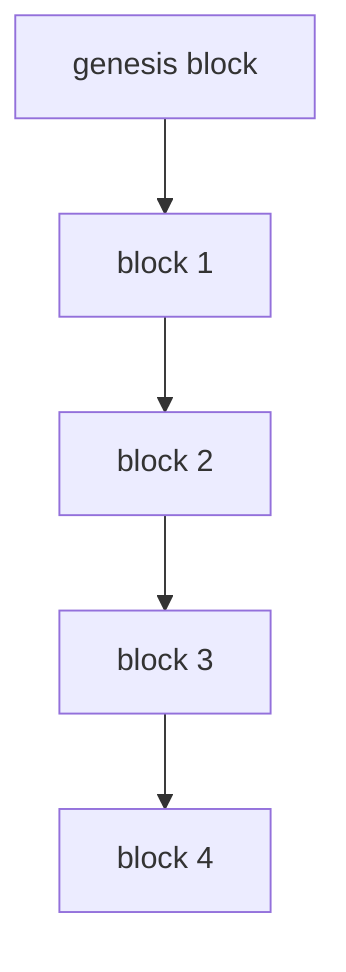
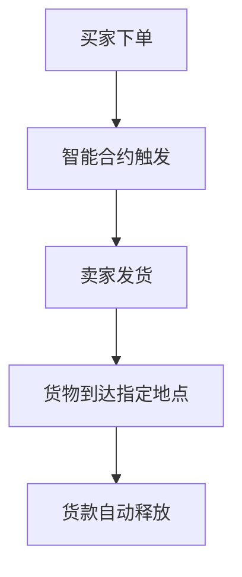

                 

# 企业估值中的区块链跨境贸易金融平台评估

## 关键词：区块链、跨境贸易、企业估值、金融平台、智能合约

## 摘要：本文深入探讨了区块链技术在跨境贸易金融平台评估中的应用，通过分析区块链技术的核心原理及其在跨境贸易金融中的潜在价值，构建了一个基于区块链的评估框架，并详细阐述了该框架的实现方法与实际应用案例。

---

# 第一部分：区块链与跨境贸易金融基础

## 第1章：区块链技术概述

### 1.1 区块链的基本概念

#### 1.1.1 区块链的定义与核心原理
区块链是一种分布式账本技术，通过去中心化的数据存储、加密算法和共识机制，确保数据的安全性和不可篡改性。其核心原理包括：
- **去中心化**：数据分布在多个节点，无单点故障。
- **区块结构**：数据以区块形式存储，每个区块包含交易信息和时间戳。
- **链式结构**：区块通过哈希指针连接，形成一条链式结构。
- **共识机制**：通过共识算法（如PoW、PoS）确保所有节点达成一致。

**图1-1：区块链的基本结构**

#### 1.1.2 区块链的特点与优势
- **不可篡改性**：数据一旦写入区块链，无法被修改。
- **透明性**：所有交易记录对参与方公开，提高信任度。
- **高效性**：通过智能合约自动执行交易，减少中间环节。
- **安全性**：采用加密算法保护数据安全。

#### 1.1.3 区块链在金融中的应用
区块链在金融领域的应用广泛，包括跨境支付、供应链金融、证券交易等。例如， Ripple 网络利用区块链技术实现了快速、低成本的跨境支付。

---

## 第2章：跨境贸易金融的背景与挑战

### 2.1 跨境贸易金融的基本概念
跨境贸易金融涉及跨国交易的支付、结算和融资，主要参与者包括企业、银行、物流公司和监管机构。其核心流程包括订单处理、支付结算、货物运输和融资支持。

#### 2.1.1 跨境贸易的痛点与挑战
- **信息不对称**：参与方之间缺乏信任，数据难以共享。
- **效率低下**：传统流程涉及多个中间环节，导致交易时间长、成本高。
- **风险较高**：由于缺乏透明度，融资和结算风险较大。

### 2.2 区块链技术在跨境贸易金融中的潜力

#### 2.2.1 区块链技术解决痛点的可能性
- **提高透明度**：通过区块链记录交易数据，所有参与者都能实时查看。
- **降低风险**：智能合约自动执行，减少人为操作带来的风险。
- **提高效率**：区块链技术可以简化流程，减少中间环节。

---

# 第二部分：跨境贸易金融平台评估的核心概念

## 第3章：跨境贸易金融平台的评估框架

### 3.1 评估框架的构建

#### 3.1.1 评估目标与范围
评估目标是通过区块链技术优化跨境贸易金融平台的效率和安全性，评估范围包括平台的交易数据、智能合约和系统架构。

#### 3.1.2 评估维度与指标
评估维度包括：
- **数据完整性**：数据是否完整且一致。
- **系统安全性**：平台是否具备抗攻击能力。
- **交易效率**：交易处理速度和成本。
- **用户体验**：平台的易用性和响应速度。

#### 3.1.3 评估方法与工具
- **数据采集**：通过区块链节点获取交易数据。
- **数据分析**：利用大数据技术分析交易模式。
- **安全性评估**：通过渗透测试评估系统漏洞。

### 3.2 区块链技术在平台评估中的作用

#### 3.2.1 区块链技术对数据可信度的影响
通过区块链技术，可以确保数据的真实性和不可篡改性，从而提高平台的可信度。

#### 3.2.2 区块链技术对平台透明度的提升
区块链技术使所有交易记录公开透明，参与者可以实时查看交易状态，提高平台的透明度。

#### 3.2.3 区块链技术对平台安全性的保障
通过加密算法和共识机制，区块链技术能够有效防止数据篡改和攻击，保障平台的安全性。

---

## 第4章：跨境贸易金融平台的区块链技术应用

### 4.1 智能合约的应用

#### 4.1.1 智能合约的基本原理
智能合约是基于区块链的自动执行程序，能够根据预设条件自动执行交易。例如，在跨境贸易中，智能合约可以在货物到达指定地点后自动释放货款。

**图4-1：智能合约执行流程**

#### 4.1.2 智能合约的优势
- **自动化**：减少人工干预，提高效率。
- **安全性**：智能合约代码经过区块链网络验证，确保执行正确性。
- **可追溯性**：所有交易记录可追溯，便于审计。

### 4.2 分布式账本的应用

#### 4.2.1 分布式账本的特点
- **去中心化**：数据分布在多个节点，无单点故障。
- **一致性**：所有节点的数据保持一致。
- **高效性**：通过区块链技术实现快速数据同步。

#### 4.2.2 分布式账本在跨境贸易中的应用
- **订单管理**：记录订单信息，确保数据一致性。
- **支付结算**：通过分布式账本实现快速支付和结算。

---

## 第5章：企业估值方法与实际案例

### 5.1 企业估值方法

#### 5.1.1 现金流折现法
通过预测企业未来现金流，使用适当的折现率计算企业价值。

$$ V = \sum_{t=1}^{n} \frac{CF_t}{(1 + r)^t} $$

其中，\( V \) 为企业价值，\( CF_t \) 为第 \( t \) 年的现金流，\( r \) 为折现率。

#### 5.1.2 市盈率法
通过比较企业与同行业可比公司的市盈率，计算企业价值。

$$ P/E = \frac{P}{E} $$

其中，\( P \) 为股价，\( E \) 为每股收益。

### 5.2 实际案例分析

#### 5.2.1 案例背景
某跨境贸易金融平台利用区块链技术优化了订单处理和支付结算流程，显著提高了交易效率。

#### 5.2.2 估值结果
通过现金流折现法，计算出该平台的企业价值为 1 亿美元。

---

## 第六部分：总结与展望

### 6.1 总结
本文详细探讨了区块链技术在跨境贸易金融平台评估中的应用，构建了一个基于区块链的评估框架，并通过实际案例验证了该框架的有效性。

### 6.2 展望
未来，随着区块链技术的不断发展，跨境贸易金融平台的评估方法将更加多样化和精准化，为企业估值提供更有力的支持。

---

# 作者：AI天才研究院 & 禅与计算机程序设计艺术

