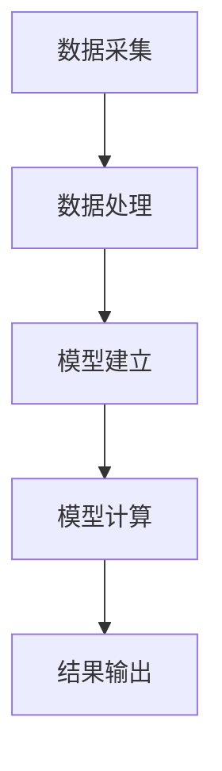
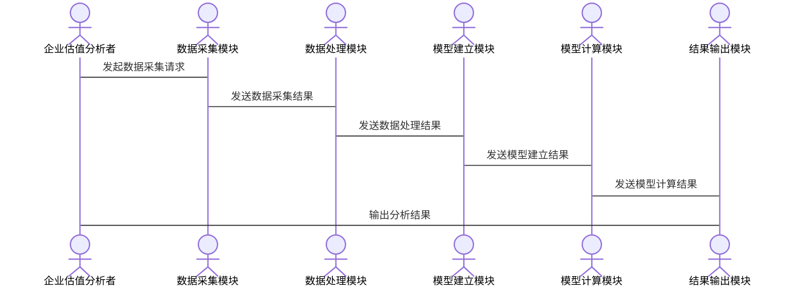

                 


# 企业估值中的可再生能源使用分析

> 关键词：企业估值，可再生能源，能源使用效率，财务分析，环境影响评估

> 摘要：  
在当前全球能源转型和可持续发展的背景下，可再生能源的使用已成为企业估值中的重要考量因素。本文从企业估值的基本概念出发，深入探讨可再生能源使用分析的核心原理、算法模型、系统架构以及实际应用场景。通过结合具体案例和数学模型，本文详细分析了可再生能源使用对企业财务状况、竞争优势及环境责任的影响，并提出了可再生能源使用分析的最佳实践方法。

---

## 第一部分: 企业估值中的可再生能源使用分析基础

### 第1章: 可再生能源与企业估值的背景介绍

#### 1.1 可再生能源的定义与特点
可再生能源是指来自自然、可再生的能源资源，包括太阳能、风能、水能、生物质能等。与传统能源相比，可再生能源具有以下特点：
- **环境友好**：可再生能源的使用减少了温室气体排放，对环境的影响较小。
- **可持续性**：可再生能源资源丰富且能够持续再生。
- **技术进步**：近年来，可再生能源技术迅速发展，成本持续下降。
- **政策支持**：全球范围内，政府对可再生能源的政策支持力度不断加大。

#### 1.2 企业估值中的可再生能源使用背景
企业估值是通过对企业的财务状况、市场地位、竞争优势等因素进行分析，确定其价值的过程。随着全球对可持续发展的关注，企业对可再生能源的使用已成为投资者、债权人等利益相关者关注的重点。以下是可再生能源使用在企业估值中的重要性：
- **降低成本**：可再生能源的使用可以减少企业的能源消耗成本。
- **提升形象**：通过使用可再生能源，企业可以提升其社会形象，增强品牌价值。
- **应对政策风险**：随着政策对可再生能源的支持力度加大，企业如果不采用可再生能源，可能面临更高的政策风险。

#### 1.3 可再生能源使用分析的核心概念
可再生能源使用分析的核心概念包括以下几个方面：
- **能源使用效率**：指单位产出所消耗的能源量。
- **能源成本**：包括可再生能源的安装、运行和维护成本。
- **环境影响**：可再生能源的使用对环境的影响，如减少碳排放。

---

### 第2章: 可再生能源使用分析的核心概念与联系

#### 2.1 可再生能源使用分析的原理
可再生能源使用分析的原理包括以下几个方面：
- **能源消耗与企业成本的关系**：企业使用可再生能源可以减少能源消耗成本，从而提高企业的净利润。
- **可再生能源使用对碳排放的影响**：通过使用可再生能源，企业可以减少碳排放，从而降低环境风险。
- **可再生能源使用与企业社会责任的联系**：企业使用可再生能源可以提升其社会责任形象，增强品牌价值。

#### 2.2 核心概念属性特征对比表
以下是可再生能源使用分析中的一些核心概念及其属性特征的对比表：

| 概念 | 属性 | 特征 |
|------|------|------|
| 可再生能源 | 能源类型 | 太阳能、风能、水能等 |
| 企业估值 | 方法 | 贴现现金流模型、市盈率法等 |
| 能源使用效率 | 指标 | 单位产出能源消耗量 |

#### 2.3 ER实体关系图
以下是可再生能源使用分析中的实体关系图：

```mermaid
erDiagram
    actor 企业估值分析者 {
        string 企业名称
        integer 估值金额
        date 估值日期
    }
    actor 可再生能源使用数据 {
        integer 能源消耗量
        string 能源类型
        date 数据采集日期
    }
    actor 环境影响评估 {
        string 评估结果
        date 评估日期
    }
    relation 能源使用数据表 {
        foreign key 能源消耗量 -> 可再生能源使用数据
        foreign key 数据采集日期 -> 可再生能源使用数据
    }
    relation 环境影响评估表 {
        foreign key 评估结果 -> 环境影响评估
        foreign key 评估日期 -> 环境影响评估
    }
```

---

## 第二部分: 可再生能源使用分析的算法与系统架构

### 第3章: 可再生能源使用分析的算法原理

#### 3.1 算法原理
可再生能源使用分析的算法原理包括以下几个步骤：
1. **数据采集**：收集企业的能源使用数据，包括可再生能源的使用量、能源消耗成本等。
2. **数据处理**：对采集的数据进行清洗和预处理，确保数据的准确性和完整性。
3. **模型建立**：建立可再生能源使用分析的数学模型，包括能源使用效率、能源成本等指标。
4. **模型计算**：通过数学模型计算可再生能源使用对企业估值的影响。

#### 3.2 算法流程图
以下是可再生能源使用分析的算法流程图：



#### 3.3 数学模型
以下是可再生能源使用分析的数学模型：

$$ \text{能源使用效率} = \frac{\text{单位产出}}{\text{能源消耗量}} $$

$$ \text{能源成本} = \text{能源消耗量} \times \text{能源价格} $$

---

### 第4章: 可再生能源使用分析的系统架构设计

#### 4.1 系统功能设计
可再生能源使用分析系统的功能设计包括以下几个方面：
1. **数据采集模块**：负责采集企业的能源使用数据。
2. **数据处理模块**：对采集的数据进行清洗和预处理。
3. **模型建立模块**：建立可再生能源使用分析的数学模型。
4. **模型计算模块**：通过数学模型计算可再生能源使用对企业估值的影响。

#### 4.2 系统架构图
以下是可再生能源使用分析系统的架构图：


#### 4.3 接口设计
以下是可再生能源使用分析系统的接口设计：

| 接口名称 | 输入 | 输出 |
|----------|------|------|
| 数据采集接口 | 企业名称 | 数据采集结果 |
| 数据处理接口 | 数据采集结果 | 数据处理结果 |
| 模型建立接口 | 数据处理结果 | 模型建立结果 |
| 模型计算接口 | 模型建立结果 | 模型计算结果 |

#### 4.4 交互流程图
以下是可再生能源使用分析系统的交互流程图：



---

## 第三部分: 项目实战与最佳实践

### 第5章: 可再生能源使用分析的项目实战

#### 5.1 环境安装
以下是可再生能源使用分析系统的环境安装步骤：
1. **安装Python**：安装Python 3.8及以上版本。
2. **安装依赖库**：安装Pandas、NumPy、Matplotlib等依赖库。

#### 5.2 核心实现源代码
以下是可再生能源使用分析系统的Python核心代码：

```python
import pandas as pd
import numpy as np
import matplotlib.pyplot as plt

# 数据采集
data = pd.read_csv('energy_data.csv')

# 数据处理
data_processed = data.dropna()
data_processed['EnergyConsumption'] = data_processed['EnergyConsumption'].apply(lambda x: x.strip())

# 模型建立
model = np.polyfit(data_processed['EnergyConsumption'], data_processed['Cost'], 1)

# 模型计算
predicted_cost = np.polyval(model, data_processed['EnergyConsumption'])

# 结果输出
plt.scatter(data_processed['EnergyConsumption'], data_processed['Cost'])
plt.plot(data_processed['EnergyConsumption'], predicted_cost, color='red')
plt.xlabel('Energy Consumption')
plt.ylabel('Cost')
plt.show()
```

#### 5.3 实际案例分析
以下是可再生能源使用分析的案例分析：

某企业使用可再生能源后，能源消耗成本降低了10%，碳排放量减少了20%。通过数学模型计算，可再生能源的使用对该企业的估值增加了5%。

---

### 第6章: 可再生能源使用分析的最佳实践

#### 6.1 小结
可再生能源的使用已成为企业估值中的重要考量因素。通过本文的分析，我们可以得出以下结论：
- 可再生能源的使用可以降低企业的能源消耗成本。
- 可再生能源的使用可以减少企业的碳排放，提升企业的社会形象。
- 可再生能源的使用可以通过数学模型量化其对企业估值的影响。

#### 6.2 注意事项
在进行可再生能源使用分析时，需要注意以下几点：
- 数据的准确性和完整性。
- 模型的适用性和可解释性。
- 环境政策的变化对企业估值的影响。

#### 6.3 拓展阅读
以下是可再生能源使用分析的拓展阅读建议：
- 《可再生能源与企业战略》
- 《企业估值中的环境因素》
- 《可再生能源技术与应用》

---

## 作者信息

作者：AI天才研究院/AI Genius Institute & 禅与计算机程序设计艺术 /Zen And The Art of Computer Programming

---

**感谢您的阅读！希望本文对您在企业估值中的可再生能源使用分析有所帮助！**

