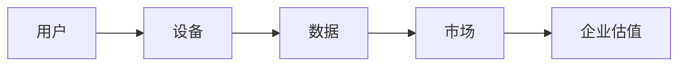
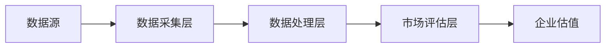
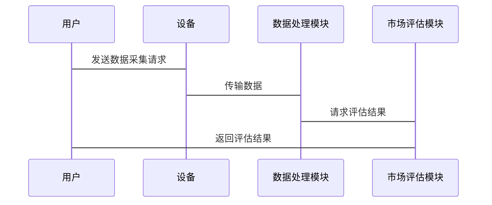

                 


# 企业估值中的可穿戴设备市场评估

## 关键词：
企业估值、可穿戴设备、市场评估、时间序列分析、机器学习、系统架构

## 摘要：
随着可穿戴设备市场的快速发展，企业估值中的可穿戴设备市场评估变得越来越重要。本文详细探讨了如何利用可穿戴设备的数据进行市场分析和企业估值，从数据采集、处理到建模分析，再到系统架构设计，为读者提供了一套完整的解决方案。文章通过实际案例分析，结合时间序列分析和机器学习算法，展示了如何在企业估值中有效应用可穿戴设备市场评估的方法。

---

# 第一部分: 可穿戴设备与企业估值基础

## 第1章: 可穿戴设备市场评估的背景与意义

### 1.1 可穿戴设备的定义与分类
#### 1.1.1 可穿戴设备的定义
可穿戴设备是指能够戴在身上或嵌入人体的智能设备，通常用于健康监测、运动追踪、信息交互等功能。常见的可穿戴设备包括智能手表、健身手环、智能眼镜、医疗监测设备等。

#### 1.1.2 可穿戴设备的主要分类
| 类别              | 描述                                   |
|-------------------|--------------------------------------|
| 健康监测设备      | 如智能手表、健康手环，用于监测心率、血压、睡眠质量等。 |
| 运动追踪设备      | 如运动手环、智能跑鞋，用于记录运动数据、步数、卡路里消耗等。 |
| 智能助手设备      | 如智能眼镜、智能耳机，用于信息交互、语音助手等功能。 |
| 行业专用设备      | 如医疗领域的可穿戴设备，用于患者监测和诊断。 |

#### 1.1.3 可穿戴设备的市场现状
全球可穿戴设备市场近年来快速增长，根据市场调研机构的数据，2023年全球可穿戴设备出货量已经超过3亿台，市场规模超过800亿美元。主要驱动因素包括健康意识的提升、技术的进步以及应用场景的扩展。

### 1.2 企业估值的核心概念
#### 1.2.1 企业估值的定义与方法
企业估值是指对企业整体价值的评估，通常用于投资决策、并购交易、融资等活动。常见的企业估值方法包括资产基础法、收益法和市场法。

#### 1.2.2 可穿戴设备市场对企业估值的影响
可穿戴设备市场为企业提供了新的数据来源，能够帮助企业更精准地了解用户需求、市场趋势和竞争对手的动态，从而优化决策。

#### 1.2.3 市场评估在企业估值中的作用
市场评估是企业估值的重要组成部分，通过分析市场容量、竞争格局、用户行为等，可以为企业的战略制定和价值评估提供支持。

### 1.3 可穿戴设备市场评估的必要性
#### 1.3.1 可穿戴设备数据对企业决策的价值
可穿戴设备数据能够提供实时、精准的用户行为和健康数据，帮助企业更好地理解用户需求，优化产品和服务。

#### 1.3.2 市场评估在企业估值中的应用场景
例如，在企业并购中，通过对目标企业所在市场的可穿戴设备用户数据进行分析，可以更准确地评估其市场地位和潜在价值。

#### 1.3.3 可穿戴设备市场评估的边界与外延
可穿戴设备市场评估的边界包括数据采集范围、时间跨度、用户群体等，外延则包括对产业链上下游的影响分析。

---

## 第2章: 可穿戴设备市场评估的核心概念与联系

### 2.1 可穿戴设备数据的采集与处理
#### 2.1.1 数据采集的原理与方法
可穿戴设备通过传感器采集数据，例如心率、加速度、陀螺仪等，数据通常通过蓝牙或Wi-Fi传输到云端或本地设备。

#### 2.1.2 数据预处理的关键步骤
数据预处理包括数据清洗（去除噪声）、数据标准化（统一数据格式）和数据增强（补充缺失值）。

#### 2.1.3 数据清洗与标准化
例如，对于心率数据，需要处理掉异常值（如传感器干扰导致的 spikes），并将其转换为统一的时间序列格式。

### 2.2 可穿戴设备数据的特征分析
#### 2.2.1 数据特征的分类与对比
| 特征类型       | 描述                                   |
|----------------|--------------------------------------|
| 时间序列特征   | 如心率变化趋势、运动频率等。          |
| 用户行为特征   | 如用户的运动习惯、睡眠模式等。          |
| 设备性能特征   | 如设备的电池寿命、传感器精度等。        |

#### 2.2.2 数据特征与企业估值的关系
例如，用户的运动频率可以反映企业的目标客户群体的健康意识，从而影响企业的市场定位。

#### 2.2.3 数据特征的可视化与分析
通过绘制时间序列图（如折线图）和热图，可以直观地分析数据特征的变化趋势和分布情况。

### 2.3 可穿戴设备市场评估的实体关系图


---

## 第3章: 可穿戴设备市场评估的算法原理

### 3.1 时间序列分析方法
#### 3.1.1 时间序列分析的基本概念
时间序列分析是一种通过历史数据预测未来趋势的方法，常用于销售预测、用户行为分析等场景。

#### 3.1.2 时间序列分析的数学模型
常用的模型包括ARIMA（自回归积分滑动平均模型）和GARCH（广义自回归条件异方差模型）。

#### 3.1.3 时间序列分析的实现步骤
1. 数据预处理：去除趋势和季节性。
2. 模型选择：通过AIC或BIC准则选择最优模型。
3. 模型训练：基于历史数据拟合模型。
4. 模型预测：基于模型预测未来趋势。

### 3.2 机器学习模型在市场评估中的应用
#### 3.2.1 常见机器学习算法的选择
常用的算法包括随机森林、支持向量机（SVM）、神经网络和LSTM（长短期记忆网络）。

#### 3.2.2 基于LSTM的市场预测模型
LSTM是一种特殊的RNN（循环神经网络），适合处理时间序列数据中的长期依赖关系。

#### 3.2.3 基于随机森林的特征选择
随机森林可以通过特征重要性评估，帮助筛选出对市场评估影响最大的特征。

---

## 第4章: 可穿戴设备市场评估的系统分析与架构设计

### 4.1 系统功能设计
#### 4.1.1 数据采集模块
负责从可穿戴设备中采集数据，并将其传输到数据处理模块。

#### 4.1.2 数据处理模块
对采集到的数据进行清洗、标准化和特征提取。

#### 4.1.3 市场评估模块
基于处理后的数据，使用时间序列分析或机器学习模型进行市场评估。

### 4.2 系统架构设计


### 4.3 接口设计与交互流程图


---

## 第5章: 可穿戴设备市场评估的项目实战

### 5.1 环境安装
需要安装Python、TensorFlow、Pandas等工具。

### 5.2 系统核心实现源代码
```python
import pandas as pd
from sklearn.ensemble import RandomForestRegressor
from sklearn.metrics import mean_squared_error

# 数据加载
data = pd.read_csv('wearable_data.csv')

# 特征提取
features = data[['heart_rate', 'step_count', 'sleep_duration']]
target = data['market_share']

# 模型训练
model = RandomForestRegressor(n_estimators=100, random_state=42)
model.fit(features, target)

# 预测与评估
predictions = model.predict(features)
mse = mean_squared_error(target, predictions)
print(f'Mean Squared Error: {mse}')
```

### 5.3 实际案例分析
以某智能手表厂商为例，分析其市场数据，预测未来的市场表现。

### 5.4 项目小结
通过实际案例，验证了可穿戴设备市场评估方法的有效性，并总结了实施中的关键点。

---

## 第6章: 可穿戴设备市场评估的最佳实践

### 6.1 小结
可穿戴设备市场评估是企业估值的重要组成部分，通过数据驱动的方法可以提高评估的准确性和可靠性。

### 6.2 注意事项
1. 数据质量是市场评估的关键，需要确保数据的完整性和准确性。
2. 在模型选择时，需根据具体场景和数据特点进行调整。
3. 建议结合多种方法进行交叉验证，以提高评估结果的稳定性。

### 6.3 拓展阅读
推荐阅读《机器学习实战》和《时间序列分析与应用》等书籍，深入学习相关知识。

---

# 作者：AI天才研究院/AI Genius Institute & 禅与计算机程序设计艺术 /Zen And The Art of Computer Programming

