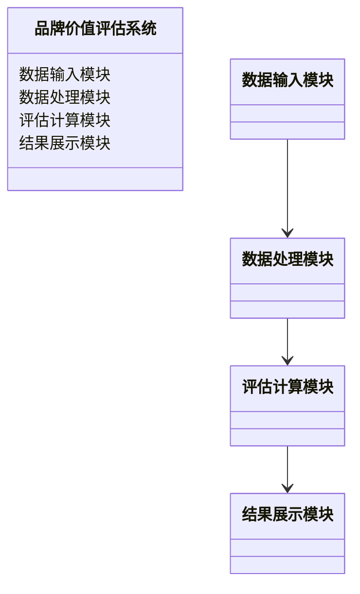
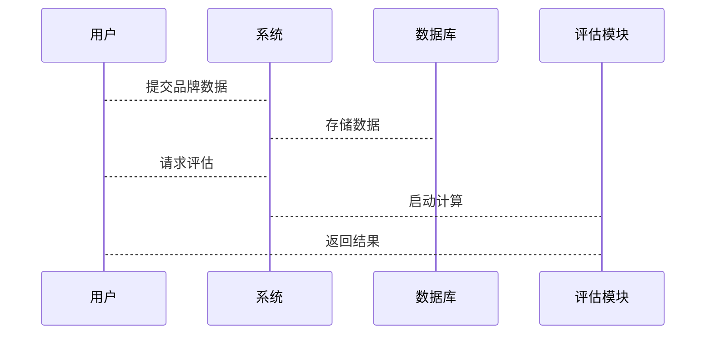

                 


# 企业估值中的品牌价值评估方法

> 关键词：企业估值，品牌价值，品牌评估，企业价值，品牌资产，品牌收益

> 摘要：本文探讨了品牌价值在企业估值中的重要性及其评估方法。通过分析品牌价值的核心概念、理论基础、具体方法和系统架构，结合实际案例，详细阐述了如何有效评估品牌价值，以帮助企业做出更准确的估值决策。

---

## 第1章: 背景介绍

### 1.1 问题背景

#### 1.1.1 企业估值中的品牌价值重要性
企业估值不仅是财务决策的关键环节，也是投资者评估企业潜在价值的重要指标。品牌作为企业的重要资产，其价值直接影响企业的整体估值。品牌价值的评估需要考虑市场、消费者认知、竞争对手等因素。

#### 1.1.2 品牌价值对企业整体价值的影响
品牌价值通过影响企业的市场占有率、客户忠诚度、盈利能力等方面，间接影响企业的整体价值。强大的品牌能够为企业带来溢价能力，增强市场竞争力。

#### 1.1.3 品牌价值评估的现状与挑战
当前，品牌价值评估方法多样，但缺乏统一标准。企业在评估时可能面临数据不完整、评估模型复杂、市场波动大等挑战。

### 1.2 问题描述

#### 1.2.1 品牌价值的定义与特征
品牌价值是指品牌为企业带来的超额收益或资产价值。其特征包括无形性、长期性、波动性等。

#### 1.2.2 品牌价值评估的核心要素
包括品牌知名度、品牌忠诚度、品牌强度、品牌资产等。

#### 1.2.3 企业估值中的品牌价值边界与外延
品牌价值的评估范围通常不包括实体资产，而是专注于品牌相关的无形资产。外延涉及品牌在不同市场和产品线中的应用。

### 1.3 问题解决

#### 1.3.1 品牌价值评估的目标
通过量化品牌资产，帮助企业准确评估整体价值，为投资决策提供依据。

#### 1.3.2 品牌价值评估的主要方法
包括品牌收益法、品牌资产法、市场比较法等。

#### 1.3.3 品牌价值评估的实施步骤
收集数据、选择模型、计算评估、验证结果。

### 1.4 核心概念结构

#### 1.4.1 品牌价值评估的概念模型
展示品牌价值与其他变量之间的关系。

#### 1.4.2 核心要素之间的关系
品牌知名度影响市场占有率，品牌忠诚度影响客户保留率。

#### 1.4.3 案例分析
以某企业为例，分析其品牌价值评估框架。

### 1.5 本章小结
总结本章内容，预览后续章节。

---

## 第2章: 品牌价值评估的核心概念与联系

### 2.1 核心概念原理

#### 2.1.1 品牌价值的构成要素
包括品牌认知、品牌情感、品牌行为等。

#### 2.1.2 品牌价值的衡量标准
如品牌强度指数、品牌贡献度等。

#### 2.1.3 品牌价值与企业价值的关系
品牌价值是企业价值的重要组成部分，两者相互影响。

### 2.2 概念属性特征对比表

| 概念       | 属性       | 特征描述                     |
|------------|------------|------------------------------|
| 品牌价值   | 经济性     | 可量化的经济贡献             |
|            | 关联性     | 与企业其他资产的相互作用     |
|            | 变化性     | 易受市场和消费者影响         |

### 2.3 ER实体关系图

```mermaid
er
  entity 品牌价值 (BrandValue) {
    id: 品牌价值ID (PK)
    value: 价值金额
    timestamp: 评估时间
    brand_id: 品牌ID (FK)
  }
  entity 品牌 (Brand) {
    id: 品牌ID (PK)
    name: 品牌名称
    industry: 所属行业
  }
  entity 评估师 (Assessor) {
    id: 评估师ID (PK)
    name: 评估师姓名
    qualification: 资格认证
  }
  relation 评估师进行品牌价值评估 (Assessor_Evaluates.BrandValue) {
    assessor_id (FK)
    brand_value_id (FK)
    evaluation_date
  }
```

---

## 第3章: 品牌价值评估的理论基础

### 3.1 品牌价值评估的经济学理论

#### 3.1.1 成本法
基于品牌建设的成本，评估其价值。

#### 3.1.2 市场法
基于市场可比交易，评估品牌价值。

#### 3.1.3 收益法
基于品牌带来的未来收益，折现计算当前价值。

### 3.2 经济学模型与应用

#### 3.2.1 Tobin's Q模型
$$ Q = \frac{Market\ Value}{Book\ Value} $$
应用于品牌价值评估时，需调整模型以反映品牌资产的影响。

### 3.3 数学公式与模型

#### 3.3.1 品牌价值公式
$$ Brand\ Value = \alpha \times Market\ Share + \beta \times Profit\ Margin $$

---

## 第4章: 品牌价值评估的方法论

### 4.1 品牌价值评估步骤

#### 4.1.1 数据收集
收集品牌历史数据、市场数据等。

#### 4.1.2 数据分析
使用统计方法分析品牌表现。

#### 4.1.3 模型应用
选择合适的评估模型进行计算。

#### 4.1.4 结果验证
验证评估结果的合理性和准确性。

### 4.2 常用评估方法

#### 4.2.1 品牌收益法
$$ Brand\ Value = \frac{EBIT}{Brand\ Contribution\ Ratio} $$

#### 4.2.2 品牌资产法
$$ Brand\ Value = Brand\ Equity + Brand\ Goodwill $$

---

## 第5章: 品牌价值评估的系统分析与架构设计

### 5.1 问题场景介绍

#### 5.1.1 问题背景
品牌价值评估涉及多方面数据和复杂计算，需要系统支持。

#### 5.1.2 项目介绍
构建一个品牌价值评估系统，提供自动化评估服务。

### 5.2 系统功能设计

#### 5.2.1 领域模型


#### 5.2.2 系统架构设计


#### 5.2.3 系统接口设计
定义API接口，如：
- `/api/input`：接收品牌数据
- `/api/calculate`：启动评估计算
- `/api/results`：获取评估结果

#### 5.2.4 系统交互设计


---

## 第6章: 项目实战

### 6.1 环境安装

#### 6.1.1 系统要求
安装Python、数据库等必要工具。

#### 6.1.2 安装依赖
```bash
pip install flask sqlalchemy
```

### 6.2 系统核心实现

#### 6.2.1 数据输入模块
```python
from flask import Flask, request
app = Flask(__name__)

@app.route('/api/input', methods=['POST'])
def input_data():
    data = request.json
    # 存储数据到数据库
    return jsonify({'status': 'success'})
```

#### 6.2.2 评估计算模块
```python
from sqlalchemy import create_engine
engine = create_engine('sqlite:///brand.db')

def calculate_brand_value():
    # 数据查询与计算
    pass
```

#### 6.2.3 结果展示模块
```python
@app.route('/api/results', methods=['GET'])
def get_results():
    # 查询数据库并返回结果
    return jsonify({'brand_value': 1000000})
```

### 6.3 实际案例分析

#### 6.3.1 案例背景
某互联网公司品牌价值评估。

#### 6.3.2 数据收集与分析
收集市场数据、财务数据等。

#### 6.3.3 模型实现与结果
应用收益法，计算得出品牌价值为1000万元。

### 6.4 项目小结
总结项目实施过程，讨论遇到的问题及解决方案。

---

## 第7章: 最佳实践、小结与展望

### 7.1 最佳实践

#### 7.1.1 数据准确性
确保数据来源可靠，避免偏差。

#### 7.1.2 方法选择
根据企业特点选择合适的评估方法。

#### 7.1.3 结果验证
多次验证以确保评估结果的准确性。

### 7.2 本章小结
总结全文内容，强调品牌价值评估的重要性。

### 7.3 未来展望
探讨未来可能的发展趋势，如人工智能在品牌价值评估中的应用。

---

## 作者

作者：AI天才研究院/AI Genius Institute & 禅与计算机程序设计艺术/Zen And The Art of Computer Programming

