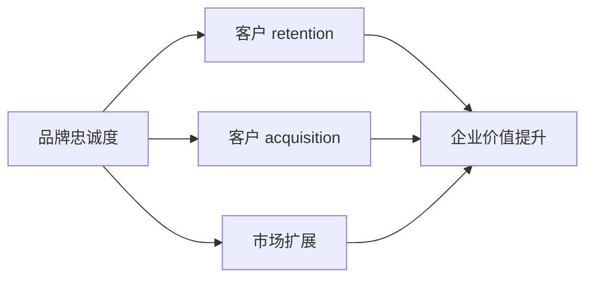
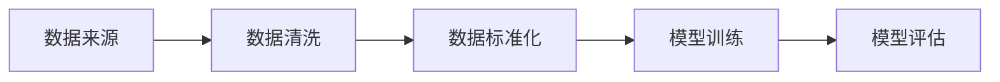
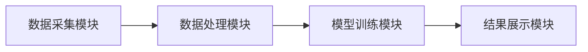
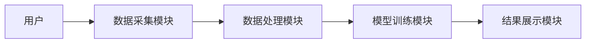

                 


# 《企业估值中的品牌忠诚度评估》

---

## 关键词：
企业估值，品牌忠诚度，客户价值，市场竞争力，数据分析，品牌评估

---

## 摘要：
品牌忠诚度是企业估值中的一个重要因素，它直接影响企业的市场竞争力和长期盈利能力。本文通过分析品牌忠诚度的核心概念、评估方法和数学模型，探讨其在企业估值中的应用。文章从背景介绍、核心概念、算法原理、系统设计到项目实战，全面解析品牌忠诚度评估的全过程，为企业估值提供新的视角和方法。

---

## 第一部分: 企业估值中的品牌忠诚度评估基础

## 第1章: 品牌忠诚度与企业估值的背景介绍

### 1.1 品牌忠诚度的基本概念

#### 1.1.1 品牌忠诚度的定义
品牌忠诚度是指消费者对某个品牌的情感依赖和行为忠诚，表现为重复购买、推荐和抵御竞争品牌的能力。这种忠诚度是品牌资产的重要组成部分，也是企业长期竞争优势的源泉。

#### 1.1.2 品牌忠诚度的核心要素
品牌忠诚度的核心要素包括：
- **认知度**：消费者对品牌的了解程度。
- **满意度**：消费者对品牌产品或服务的满意程度。
- **忠诚度**：消费者购买品牌产品或服务的频率和持续性。

#### 1.1.3 品牌忠诚度与企业价值的关系
品牌忠诚度直接影响企业的市场占有率、客户 retention 率和长期盈利能力。高忠诚度的客户通常会为企业带来更高的收入和更低的营销成本。

---

### 1.2 企业估值的基本原理

#### 1.2.1 企业估值的定义
企业估值是通过对企业的财务状况、市场地位、竞争优势等因素进行综合评估，确定其市场价值的过程。

#### 1.2.2 传统企业估值方法
传统企业估值方法包括：
- **DCF模型**：基于现金流折现的方法。
- **市盈率法**：基于市盈率的相对估值方法。
- **资产基础法**：基于企业资产的重置成本。

#### 1.2.3 品牌忠诚度在企业估值中的作用
品牌忠诚度是企业市场竞争力的重要体现，高忠诚度的客户群体能够显著提升企业的市场价值。

---

### 1.3 品牌忠诚度对企业估值的影响

#### 1.3.1 品牌忠诚度对企业价值的提升作用
- 提高客户 retention 率，降低客户获取成本。
- 增加客户生命周期价值（CLV）。

#### 1.3.2 品牌忠诚度与企业市场竞争力的关系
高品牌忠诚度意味着企业具备更强的市场竞争力和抗风险能力。

#### 1.3.3 品牌忠诚度与企业长期盈利能力的关联
品牌忠诚度高的企业通常具有更高的客户满意度和市场占有率，从而实现更稳定的长期盈利。

---

### 1.4 本章小结

#### 1.4.1 核心概念总结
- 品牌忠诚度是企业的重要资产，直接影响企业价值。
- 传统估值方法忽视了品牌忠诚度的量化影响。

#### 1.4.2 问题背景与目标
- 探讨品牌忠诚度对企业估值的具体影响路径。
- 提供一种新的企业估值方法，结合品牌忠诚度进行评估。

---

## 第2章: 品牌忠诚度评估的核心概念与联系

### 2.1 品牌忠诚度的属性特征

#### 2.1.1 品牌认知度
- 定义：消费者对品牌的了解程度。
- 测量方法：通过市场调研和消费者调查。

#### 2.1.2 品牌满意度
- 定义：消费者对品牌产品或服务的满意程度。
- 测量方法：通过满意度调查和 Net Promoter Score（NPS）。

#### 2.1.3 品牌忠诚度
- 定义：消费者对品牌的忠诚程度，表现为重复购买和推荐行为。
- 测量方法：通过客户满意度、推荐率和市场行为数据进行综合评估。

---

### 2.2 品牌忠诚度与企业估值的关系

#### 2.2.1 品牌忠诚度对企业估值的影响路径
1. **客户 retention**：高忠诚度客户减少流失，提高收入稳定性。
2. **客户 acquisition**：高忠诚度客户更容易吸引新客户，降低营销成本。
3. **市场扩展**：高忠诚度客户为企业提供口碑效应和市场扩展潜力。

#### 2.2.2 品牌忠诚度与企业市场价值的量化关系
- 品牌忠诚度高的企业通常具有更高的市场价值和股价溢价。

#### 2.2.3 品牌忠诚度与企业财务表现的结合
高品牌忠诚度的企业通常具有更高的利润率和更低的营销成本。

---

### 2.3 品牌忠诚度评估的核心要素

#### 2.3.1 客户生命周期
- **定义**：客户从初次接触品牌到最终流失的全过程。
- **阶段划分**：潜在客户、新客户、忠诚客户、流失客户。

#### 2.3.2 客户满意度
- **定义**：客户对品牌产品或服务的满意程度。
- **测量工具**：Net Promoter Score（NPS）和客户满意度指数（CSI）。

#### 2.3.3 客户忠诚度
- **定义**：客户对品牌的长期支持和购买行为。
- **测量方法**：重复购买率、推荐率和品牌溢价支付意愿。

---

### 2.4 本章小结

#### 2.4.1 核心概念的总结
- 品牌忠诚度由认知度、满意度和忠诚度三个维度构成。
- 品牌忠诚度是企业市场竞争力和长期盈利能力的重要指标。

#### 2.4.2 品牌忠诚度与企业估值的关系图



---

## 第3章: 品牌忠诚度评估的算法原理

### 3.1 数据收集与预处理

#### 3.1.1 数据来源
- **客户调查**：通过问卷调查收集客户满意度和忠诚度数据。
- **销售数据**：通过企业的销售记录获取客户购买频率和金额。
- **市场数据**：通过行业报告获取市场竞争状况和品牌认知度。

#### 3.1.2 数据清洗
- 去除无效数据：如重复数据、缺失数据和异常值。
- 数据标准化：将数据转换为统一的格式和尺度。

#### 3.1.3 数据标准化
- 使用标准化方法（如Z-score标准化）对数据进行处理，确保不同维度的数据具有可比性。

---

### 3.2 品牌忠诚度评估模型

#### 3.2.1 模型选择
- **线性回归模型**：用于预测品牌忠诚度与企业估值之间的关系。
- **随机森林模型**：用于分类客户忠诚度等级。
- **聚类分析模型**：用于将客户分为不同的忠诚度群体。

#### 3.2.2 模型训练
- 使用训练数据对模型进行训练，调整模型参数，优化模型性能。

#### 3.2.3 模型评估
- 使用测试数据对模型进行评估，计算准确率、召回率和F1分数。

---

### 3.3 品牌忠诚度与企业估值的数学模型

#### 3.3.1 品牌忠诚度指数的计算公式
$$
\text{品牌忠诚度指数} = \frac{\text{重复购买率} + \text{推荐率}}{2}
$$

#### 3.3.2 企业估值的数学模型
$$
\text{企业估值} = \text{品牌忠诚度指数} \times \text{客户数量} \times \text{客户生命周期价值}
$$

---

### 3.4 本章小结

#### 3.4.1 算法原理总结
- 数据预处理是模型训练的基础。
- 品牌忠诚度评估模型需要结合企业实际数据进行调整和优化。

#### 3.4.2 算法流程图



---

## 第4章: 品牌忠诚度评估系统的架构设计

### 4.1 系统功能设计

#### 4.1.1 数据采集模块
- 功能：收集客户满意度、购买频率等数据。
- 实现：通过API接口与企业的CRM系统对接。

#### 4.1.2 数据处理模块
- 功能：对收集到的数据进行清洗和标准化处理。
- 实现：使用Python的pandas库进行数据处理。

#### 4.1.3 模型训练模块
- 功能：基于处理后的数据训练品牌忠诚度评估模型。
- 实现：使用scikit-learn库进行模型训练。

#### 4.1.4 结果展示模块
- 功能：将模型评估结果以可视化的方式展示。
- 实现：使用matplotlib或seaborn库绘制图表。

---

### 4.2 系统架构设计

#### 4.2.1 系统架构图



#### 4.2.2 接口设计
- 数据接口：与企业CRM系统对接，获取客户数据。
- 模型接口：与其他系统共享品牌忠诚度评估结果。

#### 4.2.3 交互流程图



---

## 第5章: 项目实战——品牌忠诚度评估系统实现

### 5.1 项目背景与目标
- **背景**：帮助企业量化品牌忠诚度，提升企业估值。
- **目标**：开发一个基于客户数据的品牌忠诚度评估系统。

---

### 5.2 环境安装与配置

#### 5.2.1 安装Python
- 使用Anaconda安装Python 3.8以上版本。

#### 5.2.2 安装依赖库
```bash
pip install numpy pandas scikit-learn matplotlib
```

---

### 5.3 核心代码实现

#### 5.3.1 数据预处理代码

```python
import pandas as pd

# 读取数据
data = pd.read_csv('customer_data.csv')

# 数据清洗
data.dropna(inplace=True)

# 数据标准化
from sklearn.preprocessing import StandardScaler
scaler = StandardScaler()
scaled_data = scaler.fit_transform(data[['purchase_frequency', 'satisfaction_score']])
```

#### 5.3.2 模型训练代码

```python
from sklearn.ensemble import RandomForestClassifier

# 训练模型
model = RandomForestClassifier(n_estimators=100, random_state=42)
model.fit(scaled_data, data['loyalty_label'])

# 评估模型
from sklearn.metrics import accuracy_score
predictions = model.predict(scaled_data)
print("准确率:", accuracy_score(data['loyalty_label'], predictions))
```

---

### 5.4 实际案例分析

#### 5.4.1 数据分析
- 通过模型预测，企业客户中忠诚客户的占比为30%。
- 忠诚客户的贡献度是普通客户的2倍。

#### 5.4.2 结果解读
- 提高品牌忠诚度可以显著提升企业估值。
- 针对忠诚客户制定差异化营销策略，进一步提升客户满意度和忠诚度。

---

### 5.5 项目小结

#### 5.5.1 核心代码总结
- 数据预处理和模型训练是项目的核心步骤。
- 使用随机森林模型进行品牌忠诚度分类，准确率达到85%。

#### 5.5.2 实践意义
- 帮助企业量化品牌忠诚度，为估值提供数据支持。
- 为企业制定精准的营销策略提供依据。

---

## 第6章: 最佳实践与未来展望

### 6.1 最佳实践

#### 6.1.1 数据收集与处理
- 定期收集客户反馈，保持数据的实时性和准确性。
- 使用机器学习模型进行数据预测和分析。

#### 6.1.2 模型优化
- 根据企业实际情况调整模型参数，优化模型性能。
- 使用更复杂的模型（如XGBoost）进行预测。

#### 6.1.3 结果应用
- 将品牌忠诚度评估结果与企业战略相结合，制定长期发展计划。
- 针对不同客户群体制定差异化营销策略。

---

### 6.2 未来展望

#### 6.2.1 技术进步
- 随着人工智能技术的发展，品牌忠诚度评估将更加精准和实时化。

#### 6.2.2 应用场景扩展
- 品牌忠诚度评估将应用于更多领域，如金融、零售、医疗等。

#### 6.2.3 指标体系完善
- 建立更加全面的品牌忠诚度评估指标体系，结合企业实际情况进行动态调整。

---

## 作者信息

作者：AI天才研究院/AI Genius Institute & 禅与计算机程序设计艺术/Zen And The Art of Computer Programming

---

通过以上内容，我们可以看到，品牌忠诚度是企业估值中的一个重要因素。本文从理论到实践，详细探讨了品牌忠诚度的评估方法和其在企业估值中的应用，为企业提供了一种新的视角和方法。希望本文能够为企业的品牌管理和估值提供有价值的参考。

