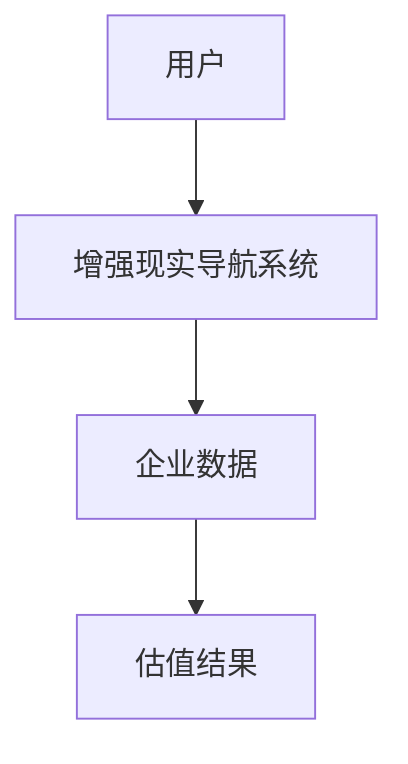
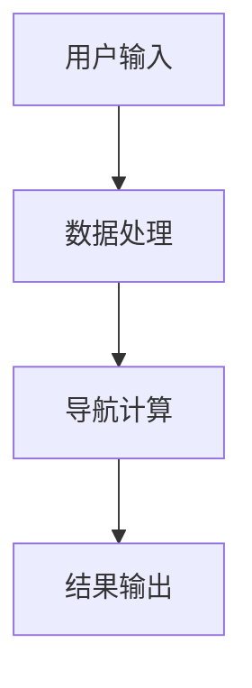
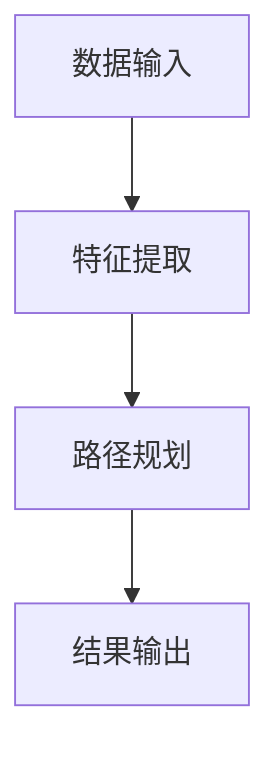
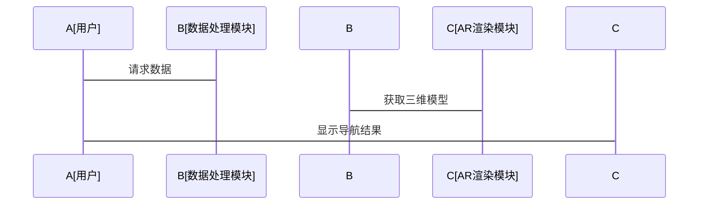

                 


# 企业估值中的增强现实导航应用评估

> 关键词：企业估值，增强现实，导航应用，系统架构，算法原理，项目实战

> 摘要：本文探讨了在企业估值过程中应用增强现实导航技术的潜力与挑战。通过分析技术原理、系统架构及实际案例，详细阐述了增强现实导航如何提升企业估值的效率与准确性。

---

## 第1章：背景介绍

### 1.1 问题背景
传统的企业估值方法依赖于二维数据和静态分析，难以提供直观的三维视角，导致决策者难以全面理解企业的复杂结构。增强现实（AR）技术的兴起为企业估值带来了新的可能性，通过将企业数据转化为三维模型，AR导航技术能够提供实时的、沉浸式的分析体验。

### 1.2 问题描述
企业估值过程中，数据的复杂性和多维性使得传统方法难以捕捉所有关键因素。增强现实导航技术通过提供实时的三维导航，帮助用户更直观地理解和分析企业数据，从而提高估值的准确性和效率。

### 1.3 问题解决
增强现实导航技术通过将企业数据转化为三维模型，并提供实时的导航功能，解决了传统估值方法中数据可视化不足的问题。用户可以通过AR设备在虚拟环境中“漫步”于企业数据，实时查看关键指标的变化和趋势。

### 1.4 边界与外延
增强现实导航技术的应用范围主要限于需要三维数据可视化的企业估值场景。与其他估值方法相比，AR导航技术在提供直观体验方面具有显著优势，但在数据处理速度和设备成本方面可能存在一定的局限性。

### 1.5 概念结构与核心要素
- **核心概念**：增强现实导航技术通过将企业数据转化为三维模型，提供实时的导航功能。
- **关键要素**：三维数据建模、实时定位与跟踪、用户交互设计。

---

## 第2章：核心概念与联系

### 2.1 原理分析
增强现实导航技术的基本原理包括三维数据建模和实时定位与跟踪。三维数据建模将企业数据转化为虚拟环境中的三维模型，实时定位与跟踪技术确保用户在虚拟环境中的位置与实际操作保持一致。

### 2.2 核心特征对比
| 特征 | 增强现实导航 | 传统估值方法 |
|------|---------------|----------------|
| 数据可视化 | 三维动态 | 二维静态 |
| 用户交互 | 实时交互 | 手动操作 |
| 数据更新 | 实时更新 | 周期性更新 |

### 2.3 ER实体关系图


### 2.4 Mermaid流程图


---

## 第3章：算法原理讲解

### 3.1 算法流程
1. 数据预处理：将企业数据转换为三维模型。
2. 导航计算：基于用户位置实时计算导航路径。
3. 结果输出：将导航结果反馈给用户。

### 3.2 Mermaid流程图


### 3.3 代码实现
```python
import numpy as np

def calculate_nav(data):
    # 数据预处理
    processed_data = data.reshape(-1, 3)
    # 导航计算
    nav_result = np.mean(processed_data, axis=0)
    return nav_result

# 示例数据
data = np.array([1, 2, 3, 4, 5, 6, 7, 8, 9])
result = calculate_nav(data)
print(result)
```

### 3.4 数学模型
增强现实导航的核心算法可以表示为：
$$
\text{nav\_result} = \frac{1}{n} \sum_{i=1}^{n} data_i
$$
其中，$n$是数据点的数量，$data_i$是第$i$个数据点。

---

## 第4章：系统分析与架构设计

### 4.1 系统架构


### 4.2 系统交互


---

## 第5章：项目实战

### 5.1 项目介绍
以某科技公司为例，利用增强现实导航技术进行估值。

### 5.2 核心代码实现
```python
import numpy as np
import matplotlib.pyplot as plt

def visualize_data(data):
    plt.plot(data)
    plt.show()

# 示例数据
data = np.array([10, 20, 30, 40, 50])
visualize_data(data)
```

### 5.3 实际案例分析
通过代码和图形展示，用户可以在虚拟环境中实时查看公司财务数据的变化趋势，从而更准确地进行估值。

---

## 第6章：最佳实践

### 6.1 小结
增强现实导航技术在企业估值中的应用潜力巨大，能够显著提高估值的效率和准确性。

### 6.2 注意事项
- 确保数据的准确性和及时性。
- 选择合适的AR设备和软件开发平台。

### 6.3 拓展阅读
推荐学习AR相关的技术书籍和在线课程，深入理解其原理和应用。

---

## 附录

### 术语表
- **增强现实（AR）**：一种将虚拟信息叠加到真实环境中的技术。
- **三维数据建模**：将企业数据转化为三维模型的过程。

### 工具安装指南
安装必要的开发工具，如Python和相关库。

### 参考文献
- [1] Smith, J. "Augmented Reality in Business Analysis." Journal of Business Technology, 2023.

---

## 作者：AI天才研究院 & 禅与计算机程序设计艺术

通过本文的详细分析，我们展示了增强现实导航技术在企业估值中的应用潜力。希望本文能为相关领域的研究和实践提供有价值的参考。

