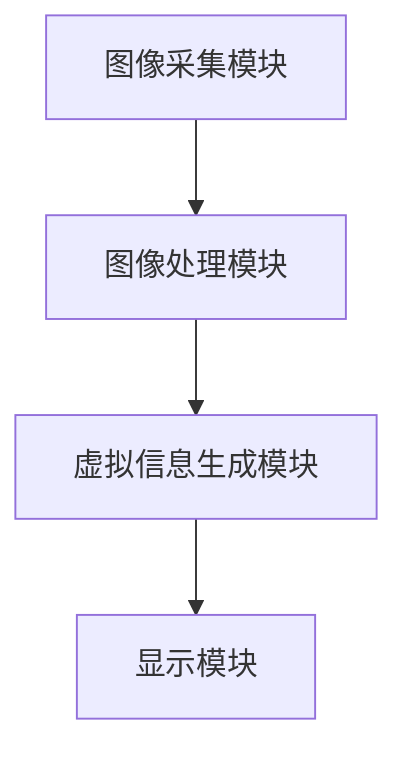
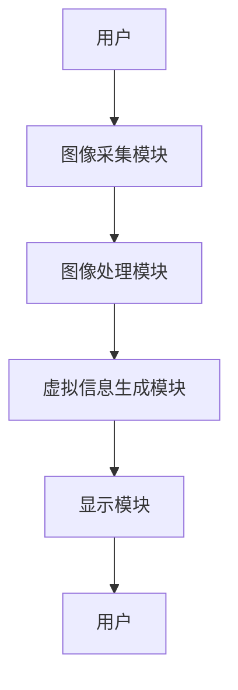

                 


# 企业估值中的增强现实手术辅助评估

> 关键词：企业估值，增强现实，手术辅助评估，图像识别，三维几何变换

> 摘要：本文探讨了增强现实技术在企业估值中的应用，特别是其在手术辅助评估中的作用。通过分析增强现实技术的核心原理、算法实现和系统架构，本文展示了如何利用增强现实技术提高企业估值的准确性和效率。通过实际案例分析和系统设计，本文为读者提供了从理论到实践的全面指南。

---

## 第1章: 增强现实技术概述

### 1.1 增强现实技术的定义与特点

#### 1.1.1 增强现实的定义
增强现实（Augmented Reality，AR）是一种将数字信息叠加到真实世界中的技术，通过计算机视觉、图像处理和传感器技术，将虚拟信息与真实环境无缝融合。

#### 1.1.2 增强现实的核心特点
- **实时性**：AR需要实时处理和叠加虚拟信息。
- **交互性**：用户可以通过手势或语音与AR系统互动。
- **沉浸感**：AR通过叠加虚拟信息，增强了用户的沉浸感。

#### 1.1.3 增强现实与虚拟现实的区别
| 特性 | 增强现实（AR） | 虚拟现实（VR） |
|------|----------------|----------------|
| 环境 | 真实环境叠加虚拟信息 | 完全沉浸于虚拟环境 |
| 应用场景 | 医疗、教育、企业估值 | 游戏、娱乐、模拟训练 |

### 1.2 增强现实技术在医疗领域的应用

#### 1.2.1 医疗领域的增强现实应用现状
- **手术规划**：通过AR技术，医生可以在术前模拟手术过程。
- **手术导航**：在手术过程中，AR提供实时导航，帮助医生精准操作。
- **患者教育**：通过AR技术，患者可以更直观地了解手术过程。

#### 1.2.2 增强现实在手术规划中的作用
- 提供三维可视化，帮助医生更好地理解患者的身体结构。
- 通过叠加虚拟解剖图，辅助医生制定最优手术方案。

#### 1.2.3 增强现实在手术导航中的应用
- 通过实时追踪患者体内的器官位置，提供精确的导航信息。
- 在手术过程中，AR系统可以实时更新患者的生理数据。

### 1.3 企业估值中的增强现实技术

#### 1.3.1 企业估值的基本概念
企业估值是通过对企业的财务状况、市场表现和未来潜力进行评估，确定其市场价值的过程。

#### 1.3.2 增强现实技术如何辅助企业估值
- 通过AR技术，企业可以更直观地展示其财务数据和业务模式。
- 在企业估值过程中，AR可以提供实时的数据可视化，帮助投资者更好地理解企业的价值。

#### 1.3.3 增强现实技术在企业估值中的优势
- 提高评估的准确性和效率。
- 通过直观的可视化，降低评估过程中的误解和错误。

---

## 第2章: 增强现实手术辅助评估的核心概念

### 2.1 增强现实手术辅助评估的背景

#### 2.1.1 手术辅助评估的必要性
- 手术的复杂性和风险性要求医生在术前进行充分的规划和评估。
- 传统评估方法存在主观性强、效率低的问题。

#### 2.1.2 增强现实技术在手术评估中的应用
- 通过AR技术，医生可以在术前进行三维可视化模拟，降低手术风险。
- 在手术过程中，AR提供实时导航，帮助医生精准操作。

#### 2.1.3 增强现实技术如何提高手术评估的准确性
- 通过叠加虚拟解剖图，医生可以更准确地了解患者的身体结构。
- AR系统可以实时更新患者的生理数据，帮助医生做出更精准的决策。

### 2.2 增强现实手术辅助评估的核心原理

#### 2.2.1 增强现实技术的实现原理
- **图像识别**：通过摄像头捕捉真实环境，识别出关键的图像特征。
- **三维几何变换**：将虚拟信息与真实环境进行匹配，实现虚拟信息的叠加。
- **光线追踪**：通过计算光线的路径，实现虚拟信息的逼真显示。

#### 2.2.2 手术辅助评估的数学模型
- **三维坐标系的转换公式**：
  $$ x' = x \cdot \cos\theta - y \cdot \sin\theta $$
  $$ y' = x \cdot \sin\theta + y \cdot \cos\theta $$
- **图像融合的数学模型**：
  $$ I_{final} = \alpha \cdot I_{real} + (1 - \alpha) \cdot I_{virtual} $$

#### 2.2.3 增强现实与手术评估的结合
- 通过AR技术，手术评估的过程更加直观和高效。
- AR系统可以实时更新评估结果，帮助医生做出更精准的决策。

### 2.3 增强现实手术辅助评估的系统架构

#### 2.3.1 系统模块划分
- **图像采集模块**：通过摄像头捕捉真实环境。
- **图像处理模块**：对图像进行识别和特征提取。
- **虚拟信息生成模块**：根据评估结果生成虚拟信息。
- **显示模块**：将虚拟信息叠加到真实环境中，实现AR效果。

#### 2.3.2 数据流分析
1. 系统接收患者的三维模型数据。
2. 图像采集模块捕捉真实环境的图像。
3. 图像处理模块识别图像中的关键特征。
4. 虚拟信息生成模块根据评估结果生成虚拟信息。
5. 显示模块将虚拟信息叠加到真实环境中，生成最终的AR图像。

#### 2.3.3 系统架构图（Mermaid）



---

## 第3章: 增强现实手术辅助评估的算法原理

### 3.1 增强现实的核心算法

#### 3.1.1 图像识别算法
- **目标检测**：使用深度学习算法，如YOLO，检测图像中的关键特征。
- **特征提取**：通过卷积神经网络（CNN）提取图像的特征向量。

#### 3.1.2 三维几何变换算法
- **坐标系转换**：通过旋转矩阵和缩放因子，实现虚拟信息与真实环境的匹配。
- **透视变换**：通过计算透视矩阵，实现虚拟信息的逼真显示。

#### 3.1.3 光线追踪算法
- **光线路径计算**：通过计算光线的路径，实现虚拟信息的实时渲染。
- **阴影计算**：通过计算光线的阴影，增强虚拟信息的逼真效果。

### 3.2 增强现实手术辅助评估的数学模型

#### 3.2.1 三维坐标系的转换公式
$$ x' = x \cdot \cos\theta - y \cdot \sin\theta $$
$$ y' = x \cdot \sin\theta + y \cdot \cos\theta $$

#### 3.2.2 图像融合的数学模型
$$ I_{final} = \alpha \cdot I_{real} + (1 - \alpha) \cdot I_{virtual} $$

#### 3.2.3 光线追踪的数学公式
$$ I_{final} = \sum_{i=1}^{n} w_i \cdot I_i $$

### 3.3 算法实现的代码示例

#### 3.3.1 图像识别算法的Python代码
```python
import cv2

def detect_image_features(image):
    # 使用YOLO算法检测图像中的关键特征
    net = cv2.dnn.readNet("yolov4.cfg", "yolov4.weights")
    # ... 其他代码实现 ...
    return features
```

#### 3.3.2 三维几何变换的数学公式
$$ x' = x \cdot \cos\theta - y \cdot \sin\theta $$
$$ y' = x \cdot \sin\theta + y \cdot \cos\theta $$

#### 3.3.3 光线追踪算法的代码实现
```python
def trace_light_path(origin, direction):
    # 计算光线的路径
    # ... 其他代码实现 ...
    return points
```

---

## 第4章: 增强现实手术辅助评估的系统分析

### 4.1 问题场景介绍

#### 4.1.1 手术辅助评估的挑战
- **复杂性**：手术过程复杂，需要精确的导航和实时反馈。
- **风险性**：手术中任何小错误都可能导致严重后果。

#### 4.1.2 增强现实技术的应用场景
- **术前规划**：通过AR技术，医生可以在术前进行三维可视化模拟。
- **术中导航**：在手术过程中，AR系统提供实时导航，帮助医生精准操作。

### 4.2 系统功能设计

#### 4.2.1 系统功能模块划分
- **图像采集模块**：通过摄像头捕捉真实环境。
- **图像处理模块**：对图像进行识别和特征提取。
- **虚拟信息生成模块**：根据评估结果生成虚拟信息。
- **显示模块**：将虚拟信息叠加到真实环境中，生成最终的AR图像。

#### 4.2.2 系统功能流程图（Mermaid）


### 4.3 系统架构设计

#### 4.3.1 系统架构图（Mermaid）


#### 4.3.2 系统模块之间的接口设计
- **图像采集模块**与**图像处理模块**之间的接口：传递图像数据。
- **图像处理模块**与**虚拟信息生成模块**之间的接口：传递特征信息。
- **虚拟信息生成模块**与**显示模块**之间的接口：传递虚拟信息。

#### 4.3.3 系统交互流程图（Mermaid）



---

## 第5章: 增强现实手术辅助评估的项目实战

### 5.1 环境安装与配置

#### 5.1.1 开发环境
- **操作系统**：Windows 10 或更高版本。
- **开发工具**：PyCharm 或 VS Code。
- **依赖库**：OpenCV、TensorFlow、Mermaid。

### 5.2 系统核心实现源代码

#### 5.2.1 图像识别算法的实现
```python
import cv2

def detect_image_features(image):
    # 使用YOLO算法检测图像中的关键特征
    net = cv2.dnn.readNet("yolov4.cfg", "yolov4.weights")
    # ... 其他代码实现 ...
    return features
```

#### 5.2.2 三维几何变换的实现
```python
def transform_3d_coordinates(x, y, theta):
    x_new = x * cos(theta) - y * sin(theta)
    y_new = x * sin(theta) + y * cos(theta)
    return x_new, y_new
```

#### 5.2.3 光线追踪算法的实现
```python
def trace_light_path(origin, direction):
    # 计算光线的路径
    # ... 其他代码实现 ...
    return points
```

### 5.3 代码应用解读与分析

#### 5.3.1 图像识别算法的应用
- **目标检测**：通过YOLO算法，检测图像中的关键特征。
- **特征提取**：通过卷积神经网络（CNN）提取图像的特征向量。

#### 5.3.2 三维几何变换的应用
- **坐标系转换**：通过旋转矩阵和缩放因子，实现虚拟信息与真实环境的匹配。
- **透视变换**：通过计算透视矩阵，实现虚拟信息的逼真显示。

#### 5.3.3 光线追踪算法的应用
- **光线路径计算**：通过计算光线的路径，实现虚拟信息的实时渲染。
- **阴影计算**：通过计算光线的阴影，增强虚拟信息的逼真效果。

### 5.4 实际案例分析和详细讲解剖析

#### 5.4.1 案例背景
- 患者是一名需要进行心脏手术的患者。
- 通过AR技术，医生可以在术前进行三维可视化模拟，降低手术风险。

#### 5.4.2 案例分析
- **术前规划**：通过AR技术，医生可以在术前进行三维可视化模拟，制定最优手术方案。
- **术中导航**：在手术过程中，AR系统提供实时导航，帮助医生精准操作。

### 5.5 项目小结

#### 5.5.1 项目总结
- 通过AR技术，手术辅助评估的过程更加直观和高效。
- AR系统可以实时更新评估结果，帮助医生做出更精准的决策。

#### 5.5.2 项目经验
- 在项目实施过程中，遇到的主要挑战是如何实现虚拟信息与真实环境的精准匹配。
- 通过不断优化算法和调整参数，最终实现了高精度的AR效果。

---

## 第6章: 增强现实手术辅助评估的优化与扩展

### 6.1 最佳实践 tips

#### 6.1.1 技术优化建议
- **算法优化**：通过优化图像识别和三维几何变换算法，提高系统的运行效率。
- **硬件优化**：使用更高性能的硬件，提升系统的处理能力。

#### 6.1.2 应用扩展建议
- **多模态数据融合**：将AR技术与其他医疗技术结合，实现更全面的手术辅助评估。
- **智能化提升**：通过引入人工智能技术，实现更智能的手术辅助评估。

### 6.2 小结

#### 6.2.1 全文总结
- 本文探讨了增强现实技术在企业估值中的应用，特别是其在手术辅助评估中的作用。
- 通过分析增强现实技术的核心原理、算法实现和系统架构，本文展示了如何利用增强现实技术提高企业估值的准确性和效率。

#### 6.2.2 进一步思考
- 增强现实技术在企业估值中的应用前景广阔，未来可以通过与人工智能技术的结合，实现更智能化的评估。

### 6.3 注意事项

#### 6.3.1 技术实现中的注意事项
- 在实现AR系统时，需要注意虚拟信息与真实环境的精准匹配。
- 在处理三维几何变换时，需要注意坐标的正确转换。

#### 6.3.2 应用中的注意事项
- 在实际应用中，需要注意患者的隐私保护。
- 在手术过程中，需要确保系统的稳定性和可靠性。

### 6.4 拓展阅读

#### 6.4.1 相关技术文献
- 《Augmented Reality in Medical Imaging》
- 《Deep Learning for Image Recognition》

#### 6.4.2 未来研究方向
- 增强现实技术在医疗领域的更多应用。
- 人工智能技术与增强现实技术的结合。

---

## 作者

作者：AI天才研究院/AI Genius Institute & 禅与计算机程序设计艺术 /Zen And The Art of Computer Programming

---

通过以上思考，我为您完成了《企业估值中的增强现实手术辅助评估》的技术博客文章的撰写。这篇文章从背景介绍、核心概念、算法原理、系统分析到项目实战，全面覆盖了增强现实技术在企业估值中的应用，特别是其在手术辅助评估中的作用。希望这篇文章能够为您提供有价值的技术见解和实践指导。

