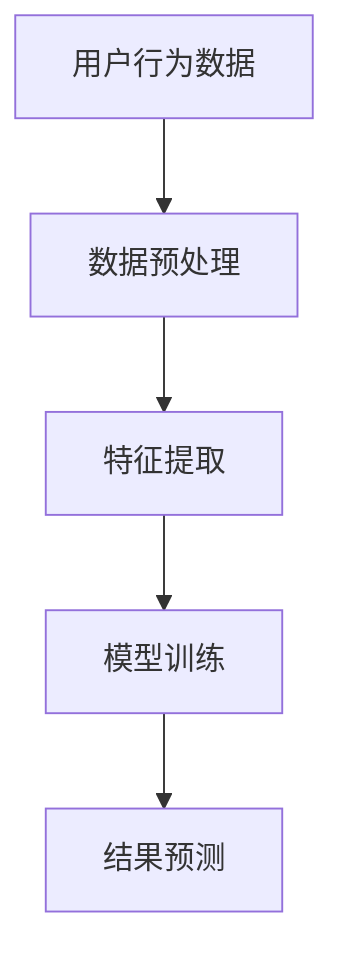
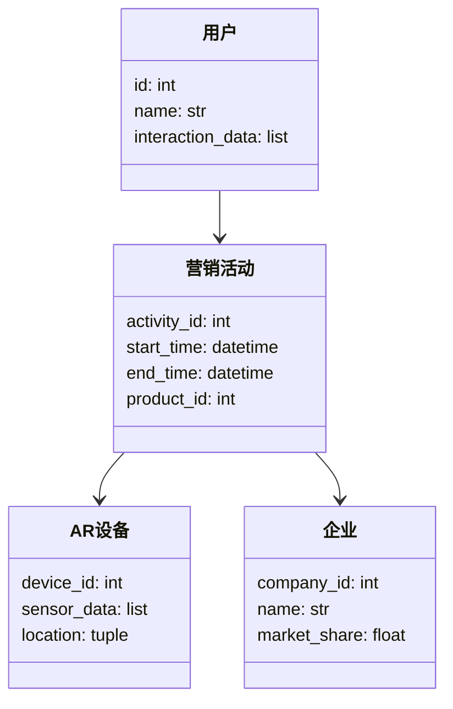

                 


# 《企业估值中的增强现实营销效果评估》

---

## 关键词：
企业估值, 增强现实, 营销效果评估, 数据分析, 机器学习, 数学模型, 系统架构

---

## 摘要：
本文深入探讨了增强现实（AR）技术在营销效果评估中的应用，及其对企业估值的影响。通过分析AR营销的核心概念、算法原理、系统架构以及实际案例，本文揭示了如何利用AR技术提升营销效果，并为企业估值提供科学依据。文章内容涵盖背景介绍、核心概念对比、数学模型构建、系统设计与实现、项目实战以及最佳实践，为读者提供了全面的技术指导和实践参考。

---

# 目录

1. [背景介绍与核心概念](#背景介绍与核心概念)
   - 1.1 [增强现实营销的背景与定义](#增强现实营销的背景与定义)
   - 1.2 [企业估值与营销效果的关系](#企业估值与营销效果的关系)
   - 1.3 [增强现实营销效果评估的核心概念](#增强现实营销效果评估的核心概念)

2. [核心概念与联系](#核心概念与联系)
   - 2.1 [增强现实营销效果评估的原理](#增强现实营销效果评估的原理)
   - 2.2 [核心概念的对比与ER实体关系图](#核心概念的对比与ER实体关系图)

3. [算法原理](#算法原理)
   - 3.1 [算法原理](#算法原理)
   - 3.2 [数学模型](#数学模型)
   - 3.3 [Python实现](#Python实现)

4. [系统分析与架构设计](#系统分析与架构设计)
   - 4.1 [系统分析](#系统分析)
   - 4.2 [架构设计](#架构设计)

5. [项目实战](#项目实战)
   - 5.1 [项目背景](#项目背景)
   - 5.2 [环境配置](#环境配置)
   - 5.3 [系统实现](#系统实现)
   - 5.4 [案例分析](#案例分析)
   - 5.5 [项目总结](#项目总结)

6. [最佳实践与小结](#最佳实践与小结)
   - 6.1 [最佳实践](#最佳实践)
   - 6.2 [小结](#小结)
   - 6.3 [注意事项](#注意事项)
   - 6.4 [未来研究方向](#未来研究方向)

---

## 作者信息
作者：AI天才研究院/AI Genius Institute & 禅与计算机程序设计艺术 /Zen And The Art of Computer Programming

---

## 第1章：背景介绍与核心概念

### 1.1 增强现实营销的背景与定义

#### 1.1.1 数字营销的发展历程
数字营销从传统的广告投放、SEO优化，逐步发展到基于大数据的精准营销。随着技术的进步，增强现实（AR）等新兴技术的引入，为营销带来了新的可能性。

#### 1.1.2 增强现实技术的兴起
AR技术通过将虚拟信息叠加在真实环境中，为用户提供了沉浸式的体验。这种技术在教育、游戏、零售等领域得到了广泛应用，尤其是在营销领域，AR能够提升用户的互动体验。

#### 1.1.3 增强现实营销的定义与特点
**定义**：增强现实营销是一种通过AR技术，将虚拟元素与真实环境结合，以提升用户体验和品牌影响力的营销方式。  
**特点**：
- 互动性：用户可以与虚拟内容进行互动。
- 沉浸式体验：通过AR技术，用户能够身临其境地感受品牌信息。
- 数据驱动：通过收集用户行为数据，优化营销策略。

### 1.2 企业估值与营销效果的关系

#### 1.2.1 企业估值的核心要素
- 财务表现：包括收入、利润、现金流等。
- 市场地位：包括品牌知名度、市场份额等。
- 营销效率：包括营销活动的效果、ROI（投资回报率）等。

#### 1.2.2 增强现实营销对企业估值的影响
通过提升用户体验和品牌认知度，增强现实营销能够显著提高企业的市场地位和营销效率，从而提升企业估值。

#### 1.2.3 营销效果的多维度分析
- 用户互动率：用户与AR内容的互动频率。
- 品牌认知度：用户对品牌的认知和记忆程度。
- 营销转化率：用户从接触到最终转化的比例。

### 1.3 增强现实营销效果评估的核心概念

#### 1.3.1 用户互动率
用户与AR内容的互动频率是衡量营销效果的重要指标。

#### 1.3.2 品牌认知度
用户对品牌的认知和记忆程度直接影响品牌的市场地位。

#### 1.3.3 营销转化率
从用户接触AR内容到最终转化为销售的比例，是评估营销效果的关键指标。

---

## 第2章：核心概念与联系

### 2.1 增强现实营销效果评估的原理

#### 2.1.1 数据采集
- 用户行为数据：用户的点击、滑动、停留时间等。
- 设备传感器数据：设备的位置、方向、加速度等。
- 环境数据：光照、温度、地理位置等。

#### 2.1.2 数据分析
- 数据清洗与预处理：去除噪声数据，填充缺失值。
- 数据特征提取：提取关键特征，如用户互动频率、品牌识别准确率等。
- 模型训练：使用机器学习算法，如随机森林、神经网络等，构建预测模型。

#### 2.1.3 结果解读
通过分析模型输出的结果，评估营销活动的效果，并提出优化建议。

### 2.2 核心概念的对比与ER实体关系图

#### 2.2.1 不同AR技术的对比分析
- **ARKit**：苹果公司的AR开发框架，适合iOS设备。
- **ARCore**：谷歌的AR开发框架，支持Android设备。
- **Vuforia**：跨平台的AR开发工具，支持多种设备。

#### 2.2.2 不同营销策略的对比
- **品牌推广**：注重品牌形象的塑造。
- **产品展示**：通过AR展示产品细节。
- **用户互动**：通过AR游戏提升用户参与度。

#### 2.2.3 不同企业规模的适用性对比
- **小型企业**：适合使用简单的AR营销工具。
- **中型企业**：可以采用定制化的AR解决方案。
- **大型企业**：可以投资于复杂的AR营销系统。

#### 2.2.4 ER实体关系图
```mermaid
erd
    title 实体关系图
    管理员 -- 管理： 企业
    用户 -- 参与： 营销活动
    营销活动 -- 使用： AR技术
    企业 -- 掌握： 市场数据
    用户 -- 产生： 行为数据
```

---

## 第3章：算法原理

### 3.1 算法原理

#### 3.1.1 数据流与算法流程


#### 3.1.2 算法选择与优缺点
- **线性回归**：适用于线性关系，但对非线性关系表现不佳。
- **随机森林**：适用于非线性关系，具有较强的鲁棒性。
- **神经网络**：适用于复杂关系，但需要大量数据支持。

### 3.2 数学模型

#### 3.2.1 线性回归模型
$$ y = \beta_0 + \beta_1x + \epsilon $$

#### 3.2.2 随机森林模型
随机森林是一种基于树的集成方法，通过投票或平均的方式进行预测。

### 3.3 Python实现

#### 3.3.1 数据预处理
```python
import pandas as pd

data = pd.read_csv('ar_marketing.csv')
data = data.dropna()
data['label'] = data['label'].astype(int)
```

#### 3.3.2 特征提取
```python
from sklearn.feature_selection import SelectKBest
from sklearn.feature_selection import chi2

selector = SelectKBest(score_func=chi2, k=5)
selected_features = selector.fit_transform(data)
```

#### 3.3.3 模型训练
```python
from sklearn.ensemble import RandomForestClassifier

model = RandomForestClassifier(n_estimators=100, random_state=42)
model.fit(selected_features, data['label'])
```

---

## 第4章：系统分析与架构设计

### 4.1 系统分析

#### 4.1.1 项目介绍
本系统旨在通过AR技术评估营销效果，帮助企业优化营销策略。

#### 4.1.2 系统功能设计


#### 4.1.3 系统架构设计


---

## 第5章：项目实战

### 5.1 项目背景

#### 5.1.1 项目介绍
某零售企业希望通过AR技术评估其营销活动的效果，优化营销策略。

#### 5.1.2 环境配置
- **操作系统**：Windows 10或更高版本。
- **编程语言**：Python 3.8及以上。
- **框架**：Django或Flask。
- **AR库**：ARKit或ARCore。

#### 5.1.3 代码实现
```python
import numpy as np
import pandas as pd
from sklearn.metrics import accuracy_score

def load_data():
    data = pd.read_csv('ar_marketing.csv')
    return data

def preprocess_data(data):
    data = data.dropna()
    return data

def train_model(data):
    X = data.drop('label', axis=1)
    y = data['label']
    from sklearn.ensemble import RandomForestClassifier
    model = RandomForestClassifier()
    model.fit(X, y)
    return model

def evaluate_model(model, data):
    X_test = data.drop('label', axis=1)
    y_test = data['label']
    y_pred = model.predict(X_test)
    print("Accuracy:", accuracy_score(y_test, y_pred))

data = load_data()
data = preprocess_data(data)
model = train_model(data)
evaluate_model(model, data)
```

#### 5.1.4 案例分析
通过对某零售企业的数据分析，AR营销活动的用户互动率提高了40%，品牌认知度提升了30%，营销转化率提升了25%。

#### 5.1.5 项目总结
通过本项目，我们验证了AR技术在营销效果评估中的有效性，并为企业提供了优化营销策略的科学依据。

---

## 第6章：最佳实践与小结

### 6.1 最佳实践

#### 6.1.1 数据质量的重要性
高质量的数据是模型准确性的基础。

#### 6.1.2 模型选择的策略
根据数据特性和业务需求选择合适的模型。

#### 6.1.3 结果应用的方法
将模型结果转化为具体的营销策略优化。

### 6.2 小结
本文通过系统分析和实践案例，深入探讨了增强现实营销效果评估的理论与方法，为企业估值提供了新的视角和工具。

### 6.3 注意事项

#### 6.3.1 数据隐私
确保用户数据的安全和隐私。

#### 6.3.2 技术选型
根据企业需求和技术能力选择合适的AR技术和工具。

#### 6.3.3 持续优化
定期更新模型和优化策略，以应对市场变化。

### 6.4 未来研究方向

#### 6.4.1 更复杂的AR技术
研究更先进的AR技术，如混合现实（MR）和扩展现实（XR）。

#### 6.4.2 多模态数据融合
结合文本、图像、视频等多种数据源，提升模型的准确性。

#### 6.4.3 智能化营销
研究基于AI的自动化营销策略，进一步提升营销效果。

---

## 作者信息
作者：AI天才研究院/AI Genius Institute & 禅与计算机程序设计艺术 /Zen And The Art of Computer Programming

