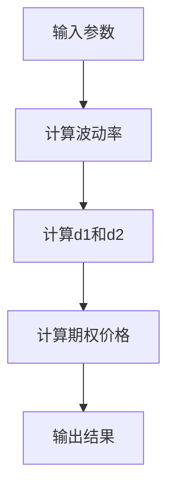

                 


# 企业估值中的实物期权法

> 关键词：实物期权法, 企业估值, Black-Scholes模型, 系统架构设计, 项目实战

> 摘要：实物期权法是一种将企业中的某些资产或项目视为期权来评估其价值的方法。本文详细介绍了实物期权法的核心概念、数学模型、系统架构设计以及实际应用案例，帮助读者全面理解并掌握该方法的实际应用技巧。

---

## 第一部分: 企业估值中的实物期权法概述

### 第1章: 实物期权法的基本概念

#### 1.1 实物期权法的定义与背景

实物期权法是一种将企业中的某些资产或项目视为期权来评估其价值的方法。这种方法尤其适用于评估具有潜在增长机会的企业或项目。与传统估值方法相比，实物期权法能够更好地捕捉企业未来增长的期权价值，而不仅仅是基于当前的财务状况进行评估。

实物期权法的起源可以追溯到金融领域中的期权定价理论，特别是Black-Scholes模型。这种方法的核心思想是将企业的未来增长潜力视为一种期权，从而在估值过程中考虑其潜在的价值。

#### 1.2 实物期权法与传统估值方法的对比

传统的企业估值方法，如DCF模型，主要基于当前的财务数据和假设进行估值，而实物期权法则引入了期权的概念，能够更好地捕捉企业的灵活性和未来增长潜力。以下是实物期权法与传统估值方法的主要区别：

1. **灵活性**：实物期权法考虑了企业在未来可能采取的不同策略，如扩张或收缩，从而更全面地评估企业价值。
2. **不确定性**：实物期权法通过期权定价模型，能够更好地处理不确定性因素，如市场需求的变化和竞争环境的变化。
3. **期权价值**：实物期权法将企业的未来增长潜力视为一种期权，从而能够更准确地评估其潜在价值。

---

### 第2章: 实物期权的核心概念与理论基础

#### 2.1 实物期权的基本原理

实物期权的基本原理与金融期权类似，但其标的资产是企业的未来现金流或某个具体项目。以下是实物期权的核心要素：

1. **标的资产**：企业未来现金流或某个具体项目。
2. **行权价格**：实现标的资产价值所需的最低投资。
3. **时间价值**：期权的有效期越长，其时间价值越高。
4. **内在价值**：期权在当前时刻的执行价格与标的资产市场价格之间的差额。

#### 2.2 实物期权的核心要素

实物期权的核心要素包括期权的买方和卖方、期权的到期日和执行价格，以及期权的内在价值和时间价值。以下是具体解释：

1. **期权的买方**：拥有标的资产购买权的一方。
2. **期权的卖方**：出售标的资产购买权的一方，承担在买方行权时出售标的资产的义务。
3. **期权的到期日**：期权合约的截止日期，到期日后的期权无效。
4. **执行价格**：期权合约中规定的买方购买标的资产的价格。
5. **内在价值**：期权在当前时刻的执行价格与标的资产市场价格之间的差额。
6. **时间价值**：期权的有效期越长，其时间价值越高。

---

### 第3章: 实物期权法的数学模型与算法原理

#### 3.1 Black-Scholes模型的理论基础

Black-Scholes模型是金融领域中广泛使用的期权定价模型，其基本公式为：

$$ C = S_0 \cdot N(d_1) - K \cdot e^{-rT} \cdot N(d_2) $$

其中：
- \( C \)：看涨期权的价格
- \( S_0 \)：标的资产的当前价格
- \( K \)：期权的行权价格
- \( r \)：无风险利率
- \( T \)：期权的到期时间（年）
- \( N(d) \)：标准正态分布的累积分布函数
- \( d_1 = \frac{\ln(S_0/K) + (r + \sigma^2/2)T}{\sigma \sqrt{T}} \)
- \( d_2 = d_1 - \sigma \sqrt{T} \)
- \( \sigma \)：标的资产价格的波动率

#### 3.2 实物期权法的算法流程

1. 确定标的资产和行权价格。
2. 计算标的资产价格的波动率。
3. 应用Black-Scholes模型计算期权的内在价值和时间价值。
4. 综合考虑企业未来增长的潜力，调整期权的定价。

#### 3.3 Python代码实现实物期权定价

以下是使用Python实现Black-Scholes模型的代码示例：

```python
import numpy as np
from scipy.stats import norm

def black_scholes(S, K, r, T, sigma):
    d1 = (np.log(S/K) + (r + sigma**2/2)*T) / (sigma * np.sqrt(T))
    d2 = d1 - sigma * np.sqrt(T)
    C = S * norm.cdf(d1) - K * np.exp(-r*T) * norm.cdf(d2)
    return C

# 示例数据
S = 100  # 标的资产价格
K = 105  # 行权价格
r = 0.05  # 无风险利率
T = 1  # 到期时间（年）
sigma = 0.2  # 波动率

price = black_scholes(S, K, r, T, sigma)
print(f"期权价格为：{price}")
```

---

### 第4章: 实物期权法的系统分析与架构设计

#### 4.1 系统需求分析

- **问题场景**：企业需要评估其未来增长潜力。
- **系统目标**：开发一个基于实物期权法的企业估值系统。
- **功能需求**：
  - 输入标的资产价格、行权价格、波动率等参数。
  - 计算期权的内在价值和时间价值。
  - 输出期权的定价结果。

#### 4.2 系统架构设计

以下是系统架构图（使用mermaid）：



---

### 第5章: 实物期权法的项目实战

#### 5.1 环境安装与库导入

- **环境安装**：安装Python和必要的库（如numpy和scipy）。
- **库导入**：导入所需的Python库，如numpy和scipy.stats。

#### 5.2 核心代码实现

以下是核心代码实现：

```python
import numpy as np
from scipy.stats import norm

def calculate_option_price(S, K, r, T, sigma):
    d1 = (np.log(S/K) + (r + sigma**2/2)*T) / (sigma * np.sqrt(T))
    d2 = d1 - sigma * np.sqrt(T)
    C = S * norm.cdf(d1) - K * np.exp(-r*T) * norm.cdf(d2)
    return C

# 示例计算
S = 100
K = 105
r = 0.05
T = 1
sigma = 0.2

price = calculate_option_price(S, K, r, T, sigma)
print(f"期权价格为：{price}")
```

---

## 第六部分: 最佳实践与小结

### 6.1 最佳实践

- 在实际应用中，建议结合企业的具体情况进行调整，例如考虑市场环境的变化和企业的财务状况。
- 使用实物期权法时，需要准确估计标的资产的波动率，这可能对结果产生较大影响。

### 6.2 小结

实物期权法是一种 powerful tool for valuing businesses with growth potential. 通过将企业的未来增长潜力视为一种期权，可以更全面地评估其价值。本文详细介绍了实物期权法的核心概念、数学模型和实际应用案例，帮助读者更好地理解和应用该方法。

---

作者：AI天才研究院/AI Genius Institute & 禅与计算机程序设计艺术 /Zen And The Art of Computer Programming

