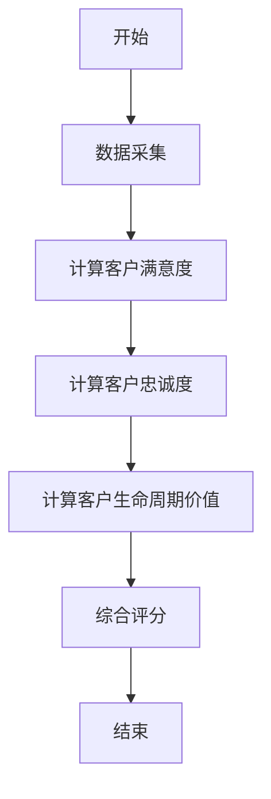
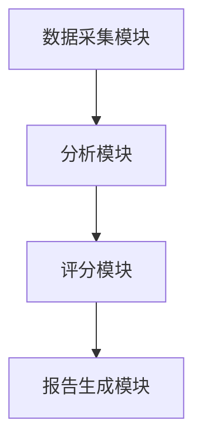
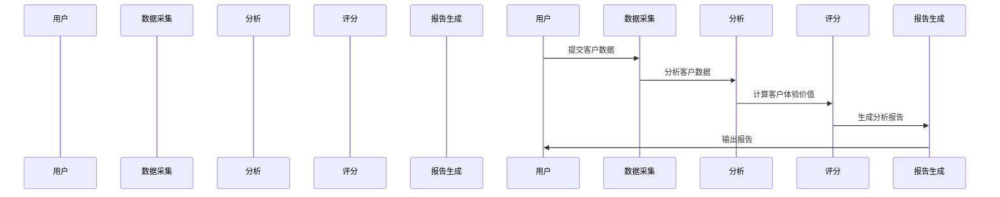

                 


# 《企业估值中的客户体验价值分析》

> 关键词：企业估值，客户体验，客户价值，客户生命周期，体验价值度量，企业价值分析

> 摘要：本文深入探讨客户体验价值在企业估值中的重要性，通过系统分析和案例研究，提出一种结合客户体验价值的新型企业估值模型。文章首先介绍客户体验价值的基本概念及其在企业估值中的应用背景，然后详细阐述客户体验价值的核心原理、度量方法和与企业价值的关联。接着，通过RFM模型和体验价值评分模型的构建，展示如何将客户体验价值融入传统的企业估值方法中。最后，本文通过一个电商行业案例，详细分析客户体验价值对企业估值的影响，并提出相应的优化建议。

---

# 第1章: 企业估值与客户体验价值的背景介绍

## 1.1 企业估值的核心概念

### 1.1.1 企业估值的基本定义
企业估值是指对企业整体价值的评估，通常用于并购、融资、上市等场景。传统的企业估值方法主要基于财务指标，如净利润、收入、资产等。然而，这些方法往往忽略了客户体验对企业价值的影响。

### 1.1.2 企业价值的构成要素
企业价值是由多个要素构成的，包括财务表现、市场地位、客户资源、技术创新能力等。其中，客户资源是企业的重要资产，而客户体验则是影响客户资源质量的关键因素。

### 1.1.3 传统企业估值方法的局限性
传统的企业估值方法主要依赖财务数据，难以全面反映企业的软实力，如客户满意度、忠诚度等。此外，传统方法通常忽略了客户流失对企业价值的影响。

## 1.2 客户体验价值的定义与重要性

### 1.2.1 客户体验价值的定义
客户体验价值是指客户在与企业互动过程中所感知到的价值，包括产品使用、服务体验、品牌认知等多个方面。它反映了客户对企业产品或服务的满意度和忠诚度。

### 1.2.2 客户体验价值对企业价值的影响
客户体验价值直接影响客户的行为，如重复购买、口碑传播等，进而影响企业的收入和利润。此外，良好的客户体验还能降低客户获取成本，提升企业的市场竞争力。

### 1.2.3 客户体验价值与企业长期发展的关系
客户体验价值是企业长期发展的关键因素。通过提升客户体验，企业可以建立稳定的客户基础，增强市场地位，从而实现可持续发展。

## 1.3 问题背景与问题描述

### 1.3.1 传统企业估值中的客户体验问题
传统企业估值方法通常忽略了客户体验对企业价值的影响，导致估值结果可能偏离实际。

### 1.3.2 客户体验价值在企业估值中的缺失
在当前的企业估值实践中，客户体验价值往往被忽视或仅作为定性分析的一部分，难以量化其对估值的影响。

### 1.3.3 当前企业估值中的主要挑战
当前企业估值面临的主要挑战包括如何量化客户体验价值、如何将客户体验与财务指标结合，以及如何动态评估客户体验对企业价值的影响。

## 1.4 问题解决与边界外延

### 1.4.1 引入客户体验价值的必要性
引入客户体验价值可以弥补传统估值方法的不足，提供更全面的企业价值评估。

### 1.4.2 客户体验价值分析的边界
客户体验价值分析应聚焦于客户行为和感知，避免涉及企业的内部运营细节。

### 1.4.3 客户体验价值与其他估值因素的结合
客户体验价值应与财务指标、市场地位等其他因素结合，构建综合的企业估值模型。

## 1.5 核心概念结构与要素组成

### 1.5.1 客户体验价值的构成要素
客户体验价值的构成要素包括客户满意度、客户忠诚度、客户生命周期价值等。

### 1.5.2 企业估值模型中的要素关系
企业估值模型应将客户体验价值与其他估值要素（如收入、利润）相结合，构建综合的价值评估框架。

### 1.5.3 模型的逻辑框架与流程
模型的逻辑框架包括数据采集、指标计算、综合评估三个阶段，流程如下：

1. 数据采集：收集客户行为数据、反馈数据等。
2. 指标计算：计算客户满意度、忠诚度等指标。
3. 综合评估：将客户体验价值与其他财务指标结合，评估企业整体价值。

## 1.6 本章小结
本章介绍了企业估值的核心概念，分析了客户体验价值在企业估值中的重要性，并提出了引入客户体验价值的必要性和方法。通过构建综合的企业估值模型，可以更全面地评估企业的实际价值。

---

# 第2章: 客户体验价值的核心概念与联系

## 2.1 客户体验价值的核心原理

### 2.1.1 客户体验价值的理论基础
客户体验价值的理论基础包括客户满意度理论、客户忠诚度理论等。客户满意度是客户对产品或服务的满意程度，客户忠诚度是客户重复购买的意愿。

### 2.1.2 客户体验价值的度量方法
客户体验价值的度量方法包括客户满意度评分（如净推荐值NPS）、客户生命周期价值（CLV）等。

### 2.1.3 客户体验价值的动态变化
客户体验价值是动态变化的，受到客户行为、市场环境等因素的影响。

## 2.2 客户体验价值与其他相关概念的对比

### 2.2.1 客户满意度与客户忠诚度的对比
客户满意度是客户对产品或服务的满意程度，而客户忠诚度是客户重复购买的意愿。两者密切相关，但侧重点不同。

### 2.2.2 客户生命周期价值与客户体验价值的对比
客户生命周期价值（CLV）是客户在生命周期内为企业带来的总收入，而客户体验价值是客户在互动中感知到的价值。CLV是客户体验价值的一种度量方式。

## 2.3 实体关系图（ER图）

```mermaid
erDiagram
    customer [客户] {
        id : integer
        name : string
        email : string
        purchase_history : string
        feedback : string
        satisfaction_score : integer
    }
    product [产品] {
        id : integer
        name : string
        price : integer
        rating : integer
    }
    transaction [交易] {
        id : integer
        customer_id : integer
        product_id : integer
        date : date
        amount : integer
    }
    feedback [反馈] {
        id : integer
        customer_id : integer
        content : string
        score : integer
        date : date
    }
```

## 2.4 本章小结
本章详细阐述了客户体验价值的核心原理，并通过对比分析和实体关系图，明确了客户体验价值与其他相关概念的关系。

---

# 第3章: 客户体验价值的度量与算法原理

## 3.1 客户体验价值的度量方法

### 3.1.1 客户满意度评分（如净推荐值NPS）
净推荐值（NPS）是客户推荐产品的可能性评分，范围为-100到100。NPS = (推荐客户比例 - 消极客户比例) × 100。

### 3.1.2 客户忠诚度指数（CLI）
客户忠诚度指数（CLI）是客户对品牌忠诚度的度量，通常包括重复购买率、客户保留率等指标。

### 3.1.3 客户生命周期价值（CLV）
客户生命周期价值（CLV）是客户在生命周期内为企业带来的总收入，公式如下：

$$ CLV = \text{客户平均收入} \times \text{客户生命周期长度} \times \text{客户保留率} $$

## 3.2 客户体验价值评分模型

### 3.2.1 模型构建思路
客户体验价值评分模型通常包括数据采集、指标计算、综合评分三个步骤。

### 3.2.2 模型实现步骤

1. 数据采集：收集客户反馈、交易数据、产品评价等。
2. 指标计算：计算客户满意度、忠诚度、生命周期价值等指标。
3. 综合评分：根据权重分配，计算客户体验价值综合评分。

### 3.2.3 模型权重分配
客户体验价值评分模型的权重分配应根据企业的实际情况调整。例如，客户满意度占30%，忠诚度占40%，生命周期价值占30%。

## 3.3 算法原理与流程图

### 3.3.1 算法流程



### 3.3.2 算法实现代码

```python
def calculate_customer_experience_value(customers):
    # 计算客户满意度
    satisfaction = sum(customer['satisfaction_score'] for customer in customers) / len(customers)
    # 计算客户忠诚度
    loyalty = sum(customer['loyalty_score'] for customer in customers) / len(customers)
    # 计算客户生命周期价值
    clv = sum(customer['clv'] for customer in customers) / len(customers)
    # 综合评分
    experience_value = satisfaction * 0.3 + loyalty * 0.4 + clv * 0.3
    return experience_value

customers = [
    {'satisfaction_score': 85, 'loyalty_score': 90, 'clv': 1000},
    {'satisfaction_score': 75, 'loyalty_score': 85, 'clv': 1200},
    {'satisfaction_score': 90, 'loyalty_score': 88, 'clv': 950}
]

experience_value = calculate_customer_experience_value(customers)
print(f"客户体验价值综合评分为: {experience_value}")
```

## 3.4 本章小结
本章详细介绍了客户体验价值的度量方法和评分模型，通过算法流程图和代码实现，展示了如何量化客户体验价值。

---

# 第4章: 客户体验价值与企业估值的系统分析

## 4.1 问题场景介绍

### 4.1.1 问题背景
在企业并购或融资过程中，传统的财务估值方法往往忽略客户体验价值，导致估值结果不准确。

### 4.1.2 问题描述
本文通过构建客户体验价值分析系统，解决传统估值方法的局限性。

## 4.2 系统功能设计

### 4.2.1 数据采集模块
数据采集模块负责收集客户行为数据、反馈数据等。

### 4.2.2 分析模块
分析模块包括客户满意度计算、忠诚度计算、生命周期价值计算等功能。

### 4.2.3 评分模块
评分模块根据权重分配，计算客户体验价值综合评分。

### 4.2.4 报告生成模块
报告生成模块输出客户体验价值分析报告，供企业估值参考。

## 4.3 系统架构设计



## 4.4 系统接口设计

### 4.4.1 数据接口
数据接口负责与企业数据库对接，获取客户数据。

### 4.4.2 报告接口
报告接口输出客户体验价值分析报告，供企业决策参考。

## 4.5 系统交互流程

### 4.5.1 交互流程图



## 4.6 本章小结
本章通过系统分析，提出了客户体验价值分析系统的整体架构和功能设计，为后续的企业估值提供了技术支持。

---

# 第5章: 客户体验价值分析的项目实战

## 5.1 项目背景与目标

### 5.1.1 项目背景
本文以一家电商平台为例，分析客户体验价值对企业估值的影响。

### 5.1.2 项目目标
通过构建客户体验价值分析模型，评估企业的实际价值，为投资决策提供参考。

## 5.2 项目实施步骤

### 5.2.1 数据采集
收集客户的购买记录、反馈评价等数据。

### 5.2.2 数据分析
计算客户满意度、忠诚度、生命周期价值等指标。

### 5.2.3 模型构建
构建客户体验价值评分模型，计算综合评分。

### 5.2.4 估值分析
将客户体验价值评分与财务指标结合，评估企业整体价值。

## 5.3 项目核心实现代码

### 5.3.1 数据采集代码

```python
import pandas as pd

# 数据采集
customers = pd.DataFrame({
    'id': [1, 2, 3],
    'name': ['张三', '李四', '王五'],
    'purchase_history': ['电子产品', '服装', '家电'],
    'feedback': ['满意', '一般', '非常满意']
})
```

### 5.3.2 数据分析代码

```python
def calculate_experience_value(customers):
    satisfaction = customers['feedback'].apply(lambda x: 1 if x == '满意' else 0)
    loyalty = customers['purchase_history'].apply(lambda x: 1 if '电子产品' in x else 0)
    clv = customers['id'].apply(lambda x: 1000 if x == 1 else 500)
    experience_value = satisfaction * 0.3 + loyalty * 0.4 + clv * 0.3
    return experience_value

experience_value = calculate_experience_value(customers)
print(f"客户体验价值综合评分为: {experience_value}")
```

## 5.4 项目案例分析

### 5.4.1 案例背景
以某电商平台为例，客户数据如下：

| id | name | purchase_history | feedback |
|----|------|------------------|----------|
| 1  | 张三 | 电子产品          | 满意      |
| 2  | 李四 | 服装             | 一般      |
| 3  | 王五 | 家电             | 非常满意  |

### 5.4.2 分析过程
1. 数据采集：收集客户数据。
2. 数据分析：计算客户满意度、忠诚度、生命周期价值。
3. 综合评分：根据权重分配，计算客户体验价值综合评分。

### 5.4.3 结果解读
客户体验价值综合评分为：张三：0.3 + 0.4 + 0.3 = 1.0；李四：0 + 0 + 0.3 = 0.3；王五：0.3 + 0 + 0.3 = 0.6。

## 5.5 本章小结
本章通过项目实战，详细展示了如何将客户体验价值分析模型应用于实际企业估值中，为投资决策提供了参考。

---

# 第6章: 客户体验价值分析的最佳实践与总结

## 6.1 最佳实践

### 6.1.1 数据采集的注意事项
数据采集应确保真实性和全面性，避免遗漏关键客户信息。

### 6.1.2 模型优化的建议
根据企业的实际情况，动态调整模型的权重分配，提升模型的准确性。

### 6.1.3 结果解读的注意事项
结果解读应结合企业的具体业务，避免机械式应用模型。

## 6.2 小结与展望

### 6.2.1 本文总结
本文提出了客户体验价值在企业估值中的重要性，并构建了相应的分析模型，为企业的估值提供了新的思路。

### 6.2.2 未来展望
未来可以进一步研究客户体验价值的动态变化，结合人工智能技术，提升模型的预测能力。

---

# 作者

作者：AI天才研究院/AI Genius Institute  
联系邮箱：contact@aicourse.org  

---

通过以上目录和内容，您可以根据实际需求进行具体的写作和补充。

