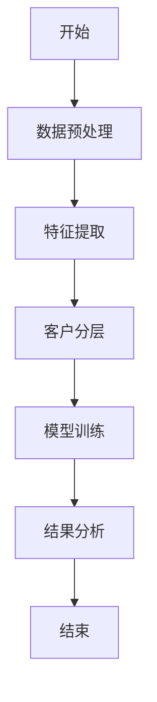
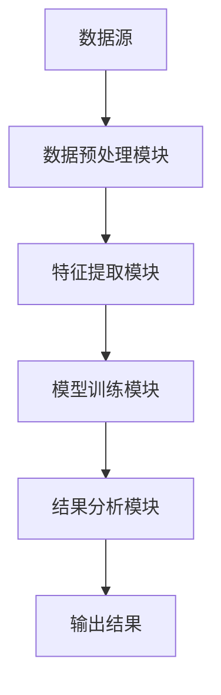

                 


# 企业估值中的客户终身价值计算

> 关键词：客户终身价值，企业估值，数据分析，客户生命周期，机器学习模型

> 摘要：客户终身价值（Customer Lifetime Value，简称CLV）是企业在计算客户价值时的重要指标。本文将详细探讨如何通过数据驱动的方法计算客户终身价值，分析其在企业估值中的应用场景，并通过实际案例展示其计算过程。

---

## 第一部分: 客户终身价值（CLV）概述

### 第1章: 客户终身价值（CLV）的定义与背景

#### 1.1 什么是客户终身价值（CLV）
客户终身价值（CLV）是指一个客户在其整个生命周期内为企业带来的总收入减去相关成本的净现值。它是企业衡量客户价值的重要指标，能够帮助企业更好地进行客户管理、市场营销和战略规划。

- **问题背景**：企业需要了解每个客户的贡献价值，以便优化资源分配。
- **问题描述**：传统的财务指标通常关注短期收益，而CLV能够反映客户长期价值。
- **问题解决方法**：通过数据驱动的方法，结合客户行为和市场数据，计算客户终身价值。
- **边界与外延**：CLV的计算需要考虑客户生命周期、收入预测和成本结构。

#### 1.2 客户终身价值的重要性
CLV在企业估值中的作用不可忽视。它不仅帮助企业评估客户的长期价值，还能为市场营销策略提供数据支持。

- **CLV对企业决策的影响**：优化客户获取和保留策略，提高客户满意度。
- **CLV与客户关系管理（CRM）的联系**：CRM系统中的客户数据是CLV计算的基础。
- **CLV在企业战略规划中的作用**：通过CLV分析，企业可以制定更精准的市场策略。

#### 1.3 CLV的计算方法与挑战
CLV的计算涉及多个步骤，包括数据收集、模型选择和结果分析。以下是常见的计算步骤：

1. 数据收集：收集客户的基本信息、交易记录和行为数据。
2. 数据预处理：清洗数据，处理缺失值和异常值。
3. 客户分层：根据客户的行为和消费习惯进行分层。
4. 模型选择：选择适合的模型，如概率模型或贴现现金流模型。
5. 结果分析：根据计算结果优化客户管理策略。

### 第2章: 客户终身价值的核心概念与联系

#### 2.1 CLV的核心原理
CLV的计算基于客户生命周期模型，包括客户获取、客户保留和客户流失三个阶段。以下是CLV的核心原理：

- **数据驱动的CLV计算模型**：通过分析客户的行为数据，预测客户未来的收入和成本。
- **客户行为分析与CLV的关系**：客户的购买频率、购买金额和忠诚度直接影响CLV的计算。
- **CLV与客户生命周期的关联**：客户生命周期的长短直接影响CLV的数值。

#### 2.2 CLV的核心要素与属性特征对比
以下是CLV的核心要素与属性特征对比表：

| 核心要素       | 描述                                                                 |
|----------------|----------------------------------------------------------------------|
| 客户收入       | 客户在生命周期内为企业带来的总收入                                         |
| 客户成本       | 企业为获取和保留客户所产生的成本                                         |
| 客户生命周期     | 客户从首次购买到最终流失的时间段                                       |
| 客户流失概率     | 客户在生命周期内流失的概率                                             |
| 贴现率           | 用于将未来的收入和成本折现到当前的价值的利率                         |

#### 2.3 CLV的ER实体关系图架构
以下是CLV计算的ER实体关系图：

```mermaid
erdiagram
actor 客户 {
  id: int
  姓名: string
  邮箱: string
  电话: string
}
actor 订单 {
  id: int
  订单日期: date
  总金额: decimal
  客户ID: int
}
actor 产品 {
  id: int
  名称: string
  价格: decimal
}
```

---

## 第二部分: 客户终身价值的算法原理

### 第3章: 客户终身价值的算法原理

#### 3.1 CLV的计算模型与流程
CLV的计算流程通常包括以下几个步骤：

1. **数据预处理**：清洗数据，处理缺失值和异常值。
2. **特征提取**：提取客户的交易记录、行为数据和人口统计数据。
3. **客户分层**：根据客户的购买频率和金额进行分层。
4. **模型训练**：选择适合的模型进行训练，如概率模型或贴现现金流模型。
5. **结果分析**：根据计算结果优化客户管理策略。

#### 3.2 CLV的数学模型与公式
CLV的计算公式如下：

$$ CLV = \frac{R}{1 - \delta} \times \frac{1}{(1 + d)^t} $$

其中：
- \( R \) 是客户在生命周期内为企业带来的总收入
- \( \delta \) 是客户流失的概率
- \( d \) 是贴现率
- \( t \) 是时间

#### 3.3 CLV算法的流程图
以下是CLV计算的流程图：



---

## 第三部分: 系统分析与架构设计

### 第4章: 系统分析与架构设计

#### 4.1 问题场景介绍
CLV计算系统的应用场景包括客户管理、市场营销和企业估值。以下是系统的主要功能：

1. **数据收集**：收集客户的交易记录和行为数据。
2. **数据预处理**：清洗数据，处理缺失值和异常值。
3. **模型训练**：选择适合的模型进行训练，如概率模型或贴现现金流模型。
4. **结果分析**：根据计算结果优化客户管理策略。

#### 4.2 系统架构设计
以下是CLV计算系统的架构图：



---

## 第四部分: 项目实战

### 第5章: 项目实战

#### 5.1 环境安装
以下是项目实战所需的环境：

- **Python版本**：3.8及以上
- **安装依赖**：numpy, pandas, scikit-learn

```bash
pip install numpy pandas scikit-learn
```

#### 5.2 系统核心实现源代码
以下是CLV计算的Python代码：

```python
import pandas as pd
from sklearn.preprocessing import StandardScaler
from sklearn.cluster import KMeans

# 数据加载
data = pd.read_csv('customer_data.csv')

# 特征提取
features = data[['收入', '成本', '生命周期', '流失概率', '贴现率']]
scaler = StandardScaler()
features_scaled = scaler.fit_transform(features)

# 客户分层
model = KMeans(n_clusters=3)
model.fit(features_scaled)
labels = model.predict(features_scaled)

# 模型训练
# 这里假设我们已经训练好了一个贴现现金流模型

# 结果分析
print("客户分层结果：", labels)
```

---

## 第五部分: 最佳实践

### 第6章: 最佳实践

#### 6.1 小结
CLV的计算能够帮助企业更好地了解客户的长期价值，优化客户管理策略。

#### 6.2 注意事项
- 数据质量是CLV计算的关键，必须确保数据的准确性和完整性。
- 模型选择需要根据企业的实际情况进行调整，避免使用过于复杂的模型。

#### 6.3 拓展阅读
- 《客户终身价值的深度分析》
- 《数据驱动的企业估值方法》

---

## 作者：AI天才研究院/AI Genius Institute & 禅与计算机程序设计艺术 /Zen And The Art of Computer Programming

